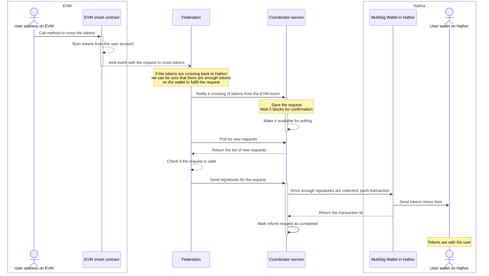

- Feature Name: evm_compatible_bridge
- Author: André Carneiro <andre.carneiro@hathor.network>

# Summary

A bridge of tokens between Hathor and an EVM compatible blockchain.
The project will be divided in 3 parts:

- The EVM smart contract.
- The Hathor multisig wallet and coordinator service.
- The federation service that will connect events from the smart contract to the multisig wallet.

Each part will work to enable moving tokens between chains.

# Motivation

Being able to move tokens between Hathor and other chains will enable using other technologies with Hathor native assets.
We will also be able to take advantage of Hathor technology with assets from other chains, e.g. moving stable coins faster and without fees.

# Guide-level explanation

The main feature of a bridge is moving tokens between chains, first we will describe how a token is "moved" between chains.

## Moving tokens between chains

Weather a chain uses account or UTXO, an owned token is an entry on the chain ledger, this means we cannot actually send the token to the other chain.
To move a token _ATk_ from chain A to chain B we will "lock" the token on chain A and mint the same amount of a token _bATk_ token on chain B.
This way, every _bATk_ in existence has a _ATk_ locked on the original chain so that we can equate the value of 1 _bATk_ to 1 _ATk_.

The value of _bATk_ can only be guaranteed if we have an operation to move the tokens back to their original chain, effectively melting or destroying a certain amount of _bATk_ and "unlocking" the same amount of _ATk_.

### State and token equivalency

A token has a native chain which holds the worth of the token and we create a equivalent token on the secondary chain.
To know which token is equivalent to which token on the other chain we need a state to read from, this state should be updated when we create a equivalent token the first time.

The safest approach would be to save everything on-chain and since Hathor does not currently have a way to keep a structured state on-chain we need to use the EVM compatible chain as a storage.

#### Hathor native tokens

A Hathor custom token has a name and symbol, but is identified by its uid, a 32 byte string (in solidity it would be a `byte32`).
On the EVM side, a [ERC-1155](https://ethereum.org/pt/developers/docs/standards/tokens/erc-1155/) contract will handle the creation of multiple tokens in the same contract, each identified by an id (`uint256`).
So we can map a Hathor token to a token id with `mapping(uint256 => byte32)`.

The only special case would be the Hathor native token (i.e. HTR) that has an id of `00` instead of 32 bytes, this should be handled separately,
for instance by creating a token with id `0` when deploying the contract, so that the id `0` always represents HTR.

#### EVM native token

A token created on the EVM chain does not have a universal identifier, it depends on which ERC the contract of the token is compliant,
[ERC-20](https://ethereum.org/pt/developers/docs/standards/tokens/erc-20/) and [ERC-777](https://ethereum.org/pt/developers/docs/standards/tokens/erc-777/) tokens are identified by the contract address and [ERC-721](https://ethereum.org/pt/developers/docs/standards/tokens/erc-721/) and [ERC-1155](https://ethereum.org/pt/developers/docs/standards/tokens/erc-1155/) use contract address plus token id (usually `uint256`).
We will require support for ERC-777 and ERC-20 tokens, which means we can use the contract address as the token id.
The token contract address can be mapped to the Hathor token uid created as its equivalent.

With this we can get the equivalent Hathor token from the id of a EVM native token.

## Interactions

### For tokens native to Hathor

#### Hathor Native: Hathor -> EVM

When a user wants to send a token native to Hathor over to the EVM chain, they will send the tokens to a Hathor multisig wallet with a special format, which will include a data output with the destination address.

In the event of a failure, the request will be marked as rejected, the user then will have to contact the administrator to request a refund of tokens.
The sequence diagram of this interation would be as follow:

#### Hathor Native: EVM -> Hathor

When a user wants to cross tokens native to Hathor back to Hathor, they will call a method on the EVM smart contract, which will burn the tokens and the federation will send them to the user address.

If the request fails, the user will have to contact the administrator to request a refund of tokens.
Since the tokens are native to Hathor, the best course would be to have an admin method to manually burn the tokens on the EVM and use the already existing refund strategy to send the tokens back to the user on Hathor.

### For tokens native to the EVM chain

#### EVM Native: EVM -> Hathor

When a user wants to cross tokens native to the EVM chain to Hathor, they will call a method on the EVM smart contract, which will lock the tokens and the federation will mint the equivalent tokens on Hathor and send them to the user address.

If the request fails, the user will have to contact the administrator to request a refund of tokens.
The admin will then use an admin method on the EVM contract to unlock the tokens and send them back to the user address.
Any refunds should check with the coordinator service first since he can check that the original request was fulfilled, rejected or on-going.

If the user wants the bridge to support a new token native to the EVM chain, they will have to call a method requesting the addition of the token. The federation will then create the token on Hathor and save the uid of the token on the EVM chain, so the bridge can be aware of the new token.

If the request fails, the token will be forever with an "on-going" request for support on the evm contract, this will prevent any other request for support for the same token and prevent the user from crossing the token.
If an admin wishes to support the token, we can think of 2 options:

- Manually create the token and send the authorities to the MultiSig wallet, then call the admin method on the EVM contract to save the token uid
- Create a new request for support with the same data as the original request, the coordinator service will then attempt to create the token again and if successful, save the token uid on the EVM contract, making it supported.

#### EVM Native: Hathor -> EVM

The flow of this operation is exactly the same as the Hathor native token flow to cross to the EVM chain, the only difference is that the token on the EVM chain is not managed by the smart contract, but by its own contract.

Also, the operation when sending the tokens to the user will not be to mint tokens to the user account but to call the token contract to send the tokens to the user account.

## Federation service

This service will be the main actor in the bridge, it will listen for events on the EVM bridge and on Hathor to create the transactions and calls necessary to cross tokens from one side of the bridge to another.

For increased security we will have a certain number of copies of the service running (i.e. M) each with their own private key,
And any operation on both sides of the bridge will require a minimum number of participants to agree to the transaction (i.e. N).

On the EVM side this can be achieved with a federation style voting system, under which some operations can be proposed by any participant of the federation but will require a minimum number of voters on this proposal so it can actually be executed.

On Hathor this is more strict, since the best way to ensure the minimum number of participants agree is to use a MultiSig wallet, which requires N out of M participants to sign a transaction before it is even recorded on the ledger.
The admins of this wallet cannot simply remove a participant from the MultiSig since it would change the actual wallet so any changes on the participants or the number of minimum signatures would require a redeploy of all instances of the service.

The EVM provides events (or logs) which can be used to communicate a new proposal and request for signatures, but for the MultiSig wallet on Hathor the communication needs to be handled in a different way.
To achieve this we introduce a coordinator service, which will listen for transactions in the MultiSig wallet and coordinate which utxos will be spent for each transaction.
This coordinator service will also provide some APIs so admins can issue commands to the federation and so admins can check the state of the bridge.

## Hathor MultiSig

Hathor MultiSig standard relies on a pay-to-script-hash (P2SH) model, this means that for any data to be written on-chain (e.g. transactions, token create/mint/melt operations) the signatures for this "write" must already be collected.

To handle operations on the MultiSig wallet each participant will run a copy of a headless wallet initialized with its seed and MultiSig configuration.

For the coordinator service to be notified that a transaction was sent to the "federation" MultiSig wallet we will use the websocket extension of the headless which enables real time notification of a received transaction.
The coordinator is not a participant of the federation so his headless wallet will be initialized with the MultiSig configuration but without a seed, this does not mean it is a readonly wallet since we will use it to send transactions with the collected signatures.

The federation will have to inspect any transaction proposed by the coordinator service and check if it is valid, to achieve this we need an API on the headless to that can return the transaction information with metadata (balance to our wallet, decoded data outputs, etc.).

# Alternative solutions

## Granularity

Tokens defined in the ERC-777 have a granularity of 1e18, this means that the smallest amount of tokens that can be transferred is 1e18.
This is not compatible with the granularity of Hathor tokens, which means we cannot cross 0.0001 tokens to Hathor where the granularity is 1e2.

This limitation means that the bridge can only support sending multiple of 0.01 of any token since it is the higher granularity.

The tokens native to Hathor that cross to the EVM chain can be transactioned in smaller amounts (e.g. 0.0000001 or smaller), but to cross the token back to Hathor we need to send at least 0.01 tokens.

Some other token standards have variable granularity, but if we adhere to the solution that we will only accept multiples of the higher granularity we can support any token standard (when it comes to granularity).

# Future possibilities

Although Hathor's MultiSig has all the secutiry features required to make the bridge functional we still need to rely on external components,
i.e. a communication channel for actors and a storage for state management (e.g. token equivalency and transaction proposals).
This could be changed to use a nano-contract, where it can handle events, listing tx proposals and federation with a changing number of participants with 0 downtime.
Using nano-contracts would also enable very low cost deployment and infrastructure of bridges to new EVM compatible chains and allow for security updates to take effect on all bridges.

# Required features

- We require APIs on the headless wallet to create, mint and melt tokens.
- We require an API on the headless to return the transaction information with metadata (balance to our wallet, decoded data outputs, etc.).
- We require a way to start a MultiSig wallet in the lib without a seed or private key.
  - It should not be a read-only instance since it can send transactions (from gathered signatures)
