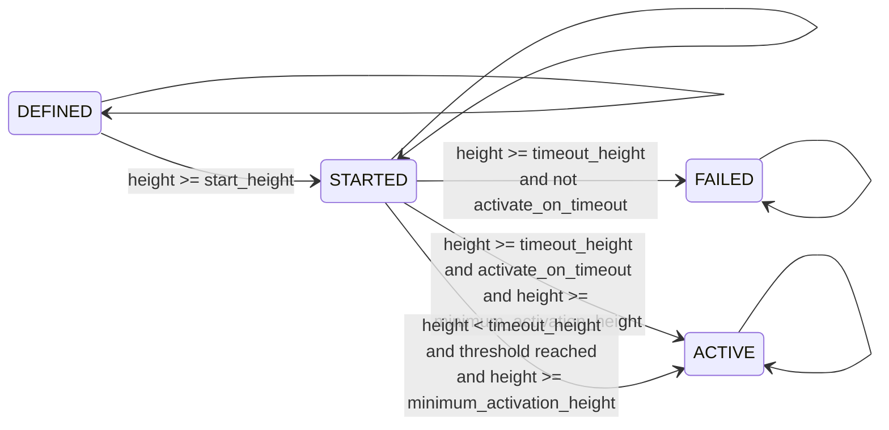

- Feature Name: Feature Activation
- Start Date: 2023-04-05
- Initial Documents: [New feature after a given block height](https://docs.google.com/document/d/1iBy1AzXYzIq-jlZavCRal0cr1DvLRT50WDpW2wk4xZw/edit), [Flag to signal feature support by miners](https://docs.google.com/document/d/1Ws0BMbLd8B-9AUVdeHphZXVNpbUWvEBnXTFOLWb9HJY/edit)
- Author: Gabriel Levcovitz <<gabriel@hathor.network>>

# Table of Contents

<!-- toc -->

- [Summary](#summary)
- [Motivation](#motivation)
- [Guide-level explanation](#guide-level-explanation)
  * [Overview](#overview)
  * [Feature and Criteria definition](#feature-and-criteria-definition)
  * [Feature States](#feature-states)
  * [Explorer User Interface](#explorer-user-interface)
  * [REST API](#rest-api)
- [Reference-level explanation](#reference-level-explanation)
  * [Bit signaling implementation](#bit-signaling-implementation)
  * [Evaluation interval](#evaluation-interval-1)
  * [Criteria configuration](#criteria-configuration)
  * [State transitions](#state-transitions)
  * [Feature Service](#feature-service)
  * [GET endpoint](#get-endpoint)
- [Rationale and alternatives](#rationale-and-alternatives)
- [Prior art](#prior-art)
- [Future possibilities](#future-possibilities)
- [Task breakdown](#task-breakdown)
- [References](#references)

<!-- tocstop -->

# Summary
[summary]: #summary

This document describes a way to implement feature activation on Hathor network. Feature activation is the process of conditionally activating a certain feature in a decentralized network, depending on factors such as block height and miners support. This is heavily inspired by Bitcoin's BIP 8, Version bits with lock-in by height [1].

# Motivation
[motivation]: #motivation

Changing or implementing new features in a decentralized environment such as a blockchain poses challenges, as no central entity is capable of guaranteeing that every peer connected to the network is able to correctly interpret some new feature. When peers (that is, their client software) disagree on how to handle features, for example, consensus updates, a hard fork is created on the blockchain, splitting the network into two or more separate networks.

Nonetheless, updating the network is a natural part of software engineering and is both desired and necessary. This includes security updates that change consensus rules or new innovative features such as Nano Contracts. For that, there should be a way to reliably release new features in a controlled manner, allowing time for peers to update themselves and support new features agreed by the community.

We must have a way to add new features or changes in the protocol that don't become live as soon as the code is upgraded by users running full nodes. These features should begin in an "on hold" period, where they'll stay until some necessary, pre-defined criteria are met. By the end of this period, the feature may or may not be activated.

This is especially important for miners that are responsible for network security, therefore we must create a way for them to signal that they are ready for a specific protocol upgrade.

# Guide-level explanation
[Guide-level explanation]: #guide-level-explanation

## Overview
[Overview]: #overview

The feature activation implementation on Hathor is heavily inspired by BIP 9 [2] and BIP 8 [1]. BIP 9 was actually used to activate Taproot [3], Bitcoin's latest update, and BIP 8 is an improvement on top of it. There are some differences though, adapting the concepts to our network. I've made some simplifications and generalizations, learning from what worked for Bitcoin and tailoring it to our use case.

One notable difference is that on Bitcoin, BIP 8/9 is only used for activating soft forks, that is, backwards-compatible changes (at least until the release of this document). In contrast, Hathor's feature activation is planned to support hard forks as well, which are necessary to implement updates such as Nano Contracts.

### Terms and Concepts
[Terms and Concepts]: #terms-and-concepts

Below are the definitions for some terms or concepts that are used in the remainder of this document.

#### Feature and activation process

A feature during the activation process, or simply a feature, is some update in the network that would cause a soft or hard fork and is deployed through the process described in this document. At the end of the process, it may or may not be activated.

#### State

The state a feature is in, representing if it is activated or not. A more detailed description is provided in the [Feature States] section.

#### Evaluation interval
[Evaluation interval]: #evaluation-interval

A time interval in which a feature is evaluated, that is, its criteria are evaluated and its state is determined for that whole period. There may be multiple evaluation intervals during the activation process.

#### Time vs block height
[Time vs block height]: #time-vs-block-height

Block height is used as a "time" marker to determine when a feature should be activated. We could use time itself, but this could create some problems as time is platform dependent and may be manipulated. This is one of the motivations of BIP 8 in favor of BIP 9, so we'll learn from that and use block height.

Block height can easily be converted to time, through the known average time between blocks of 30 seconds in the Hathor network. By dividing a desired time period by 30 seconds, we obtain the approximate number of blocks in that period. Using that, we can set activation dates based on block height.

This is of course an approximation, since the time between blocks comes from a stochastic process, but it's good enough for the purpose of this implementation and worth the tradeoff.

#### Start height

The block height when the activation process begins for a certain feature.

#### Activation criteria

Activation criteria, evaluation criteria, or simply criteria, are the conditions necessary to determine if a feature should be activated or not. There are basically two criteria used at this point: block height and miner support through bit signaling. Other criteria could be added in the future.

#### Timeout and timeout height

Timeout height is a block height that represents the end of an activation process for a feature. Timeout is when that height is reached. When timeout is reached, the feature may or may not be activated.

#### Bit signaling
[Bit signaling]: #bit-signaling

Bit signaling is an activation criteria that may or may not be used in conjunction with block height. This allows miners to send a bit flag in a block, representing that they're ready to support a certain feature. Each bit represents a specific feature. After a certain threshold (percentage) of blocks are found to enable the bit flag for a certain feature during some evaluation interval, that feature is considered active.

This should not be confused with voting. When a feature is defined in the feature activation process, it is assumed that it has been agreed by the community and ideally it should be activated by the end of the process. What bit signaling does, is preventing that some feature is activated before a super majority of miners are ready to support it. It is not voting whether to accept or reject some feature. This was a problem in Bitcoin's SegWit update, where some miners used their influence (through hash rate) to delay the update, for either economical, political, or other obscure reasons. [4][5]

With that being said, it is possible that a feature may or may not be activated at the end of an activation process. To preserve flexibility, that behavior will be configurable on a per-feature basis through the `activate_on_timeout` attribute, explained below. That attribute is analogous to the infamous Bitcoin LOT attribute (lock in on timeout) [6], proposed in BIP 8.

#### Burying feature activations
[Burying feature activations]: #burying-feature-activations

Burying a feature activation means changing code so "history is erased", and it's not clear that a feature was activated using the activation process.

It is allowed to change code that is conditional on feature activation, but **NOT** to remove a feature from the definition, as described in the [Feature and Criteria definition] section.

## Feature and Criteria definition
[Feature and Criteria definition]: #feature-and-criteria-definition

The definition of new features available for feature activation should be as simple as defining the feature name and the criteria required to evaluate its activation state. Once defined, ideally, it should not be changed. The `Feature` enum will contain all features, past and future, activated or not:

```python
class Feature(Enum):
    NANO_CONTRACTS = Criteria(name='NANO_CONTRACTS', ...)
    SOME_NEW_OP_CODE = Criteria(name='SOME_NEW_OP_CODE', ...)
    SOME_OTHER_FEATURE = Criteria(name='SOME_OTHER_FEATURE', ...)
```

The `Criteria` data class is used to define attributes such as the feature name and activation requirements. Each name should be unique across all features, past and future. Its definition is provided in the [Criteria configuration] section.

Different features with different criteria should be configurable separately for each network, mainnet and testnet. Feature definitions should **NEVER** be removed, even after activation, as explained in the [Burying feature activations] section. This is meant to preserve history.

## Feature States
[Feature States]: #feature-states

For each block, there's a state associated with each feature. Possible states are similar to BIP 8, but `LOCKED_IN` and `MUST_SIGNAL` are left out and kept as future possibilities. These are the possible states:

- `DEFINED`: Represents that a feature is defined. It's the first state for each feature. The genesis block is by definition in this state for all features.
- `STARTED`: Represents that the activation process for some feature is started. Blocks at or above the start height are in this state.
- `ACTIVE`: Represents that a certain feature is activated. Blocks are in this state if the evaluation criteria were met in the previous evaluation interval.
- `FAILED`: Represents that a certain feature is not and will never be activated. Blocks are in this state if they're above the timeout height and `activate_on_timeout` is `false` (more on that below).

Note: features in the `FAILED` state will indeed never be activated, but that doesn't mean a new activation process for the same feature couldn't be retried with a different definition.

After `ACTIVE` or `FAILED` state, the bit used for defining this each feature becomes available again for new features, as explained in the [bit] section.

### State retrieval
[State retrieval]: #state-retrieval

Feature activation will be implemented as a method in `BaseTransaction` that users (that is, developers implementing features in `hathor-core`) can use to conditionally execute different code based on the activation criteria for a certain feature.

Developers that define feature activation criteria may or may not be the same developers using conditional branching on that feature. For that, all criteria and their evaluation should be transparent for users.

The API entrypoint for using the feature activation process is simply checking if a certain feature is active for some specific vertex (block or transaction). Anytime during the processing of a vertex, an `is_feature_active()` method can be called to evaluate the state for a certain feature, and the code is branched from there. For example:

```python
def some_vertex_processing_method(self, vertex: BaseTransaction):
    if vertex.is_feature_active(Feature.MY_NEW_FEATURE):
        # execute code related to the new feature
    else:
        # execute existing code with no changes
```

Therefore, this will be implemented as a method in `BaseTransaction`:

```python
def is_feature_active(self, feature: Feature) -> bool:
    return self.feature_service.is_feature_active(self, feature)
```

The `feature_service` property will be an instance of the `FeatureService` class. This class will be implemented to encapsulate code related to feature activation and prevent bloating of `BaseTransaction` code. More on that in the [Feature Service] section below.

Notice that for users of the API, only the feature name (enum option) is necessary. The user shouldn't care how or why this feature is activated, only whether it is or not.

The way the `is_feature_active()` method is used is very important. If the feature is **NOT** active, the user **should execute only current, existing code**. That is, the network should behave exactly as it currently behaves if the feature is not active. When the feature finally meets the criteria (transparently to the user of this code), the method will return `True` and new code implementing the new feature should be executed.

## Explorer User Interface
[Explorer User Interface]: #explorer-user-interface

There should be a new screen in the explorer showing all features that used the activation process, past and future. It should simply be a table in the following format, filled with some examples, and assuming the blockchain is currently at height 3,400,000:

| Name               | State     | Acceptance | Threshold | Start height | Minimum activation height | Timeout height | Activate on timeout | Since version |
|--------------------|-----------|------------|-----------|--------------|---------------------------|----------------|---------------------|---------------|
| `MY_NEW_FEATURE_1` | `FAILED`  | 80%        | 90%       | 3,000,000    | 3,200,000                 | 3,300,000      | `false`             | v0.52.2       |
| `MY_NEW_FEATURE_2` | `ACTIVE`  | 99%        | 90%       | 3,000,000    | 3,200,000                 | 3,300,000      | `false`             | v0.52.2       |
| `MY_NEW_FEATURE_3` | `ACTIVE`  | 80%        | 90%       | 3,000,000    | 3,200,000                 | 3,300,000      | `true`              | v0.52.2       |
| `MY_NEW_FEATURE_4` | `ACTIVE`  | 0%         | 0%        | 3,000,000    | 3,200,000                 | 3,300,000      | `false`             | v0.52.2       |
| `MY_NEW_FEATURE_5` | `STARTED` | 50%        | 90%       | 3,000,000    | 0                         | 3,500,000      | `false`             | v0.52.2       |
| `MY_NEW_FEATURE_6` | `DEFINED` | -          | 90%       | 3,500,000    | 3,700,000                 | 3,900,000      | `false`             | v0.52.2       |

The meaning of each of those attributes is explained in the [Criteria configuration] section, except State and Acceptance, which are calculated.

## REST API
[REST API]: #rest-api

A `GET` endpoint should be provided, mainly to serve the UI described above. It should return a JSON object like the following:

```json
{
  "features": [
    {
      "name": "MY_NEW_FEATURE_1",
      "state": "FAILED",
      "acceptance": 0.8,
      "threshold": 0.9,
      "start_height": 3000000,
      "minimum_activation_height": 3200000,
      "timeout_height": 3300000,
      "activate_on_timeout": false,
      "version": "v0.52.2"
    }
  ]
}
```

# Reference-level explanation
[Reference-level explanation]: #reference-level-explanation

In this section, technical details are expanded for what was described above.

## Bit signaling implementation
[Bit signaling implementation]: #bit-signaling-implementation

Given Hathor's Anatomy of a Transaction RFC [7], it is straightforward to suggest that the bits used for feature flags are in the first (leftmost) byte of the `version` field. From the document:

> The version field takes up 2 bytes. The leftmost byte is reserved for future use and ignored for now. This means that a version with value [0xAA, 0x01] should be interpreted just as `version=1`.

I propose that only the 4 rightmost bits of the leftmost byte are used for feature flag bit signaling. That would still keep 4 bits reserved for future use and ignored, while allowing for up to 4 simultaneous features in different activation processes. If necessary, in the future those 4 leftmost bits could be used to change the interpretation of the 4 rightmost bits. Some examples:

- `[0xA, 0x0, 0x01]`: represents [ignored, no feature support, `version=1`]
- `[0xC, 0x1, 0x02]`: represents [ignored, feature support for `bit=0`, `version=2`]
- `[0x0, 0x5, 0x03]`: represents [ignored, feature support for `bit=0` and `bit=2`, `version=3`]

That is, `bit=0` means the least significant bit, or the rightmost bit, and `bit=3` means the most significant bit, or leftmost bit.

Therefore, the formula to obtain the flag value (`0` or `1`) from the block's `version` field and the feature's `bit` field, is:

```python
bit_flag_value = (version >> bit + 8) & 1
```

Note: if a miner sends a bit signal for a bit that is not defined as a feature bit, it is going to be ignored, meaning that the block will be considered valid and that bit's value will not be read.

## Evaluation interval

The evaluation interval, as explained in the [Evaluation interval] section, is defined here to be two weeks (14 days). Considering the 30 seconds average time between blocks of the Hathor network, that interval is equivalent to 40320 blocks. A constant must be defined in `HathorSettings`:

```python
EVALUATION_INTERVAL = 40320
```

## Criteria configuration
[Criteria configuration]: #criteria-configuration

The `Criteria` data class represents the configuration for a certain feature activation criteria:

```python
class Criteria(BaseModel):
    name: str
    bit: int
    start_height: int
    timeout_height: int
    threshold: int
    minimum_activation_height: int
    activate_on_timeout: bool
    version: str
```

### Attribute descriptions

#### `name`

A string representing the name of the feature. Must be unique across all features, past and future.

#### `bit`
[bit]: #bit

Represents which bit in the `version` field of the block is going to be used to signal the feature support by miners. Must be chosen from the set {0,1,2,3}, as defined in the [Bit signaling implementation] section.

Must be selected such that no two concurrent features use the same bit. Also, a bit should only be reused if the `start_height` of a new feature is greater than the `timeout_height` of the previous feature that used this bit.

#### `start_height`

Specifies the height of the first block at which this feature's activation process starts. Must be some block height in the future.

Must be an exact multiple of `EVALUATION_INTERVAL` (that is, at an evaluation interval boundary).

#### `timeout_height`

Specifies the height of the first block at which this feature's activation process is over. Once this height has been reached, if the feature is not activated and `activate_on_timeout` is `False`, the activation is considered failed on all descendants of the block.

Should be some height greater than `start_height`. Should be an exact multiple of `EVALUATION_INTERVAL` (that is, at an evaluation interval boundary).

#### `threshold`

Specifies the minimum number of blocks per evaluation interval required to activate the feature. Usually calculated from a percentage of `EVALUATION_INTERVAL`.

Here it is defined as 36288 blocks (90% of `EVALUATION_INTERVAL`) for the mainnet and 30240 blocks (75% of `EVALUATION_INTERVAL`) for the testnet, as default values. It may be different for each feature, though.

#### `minimum_activation_height`

Specifies the height of the first block at which the feature is allowed to become active. If it's smaller than `start_height` (usually 0), then there's no restriction on when this feature can become active.

Must be less than or equal to `timeout_height`. Must be an exact multiple of `EVALUATION_INTERVAL` (that is, at an evaluation interval boundary).

#### `activate_on_timeout`

Specifies if the feature should be activated even if the activation criteria are not met when the `timeout_height` is reached, effectively forcing activation. Should be used with caution, only when we are confident about community consensus, and especially confident that miners will comply.

#### `version`

The client version of `hathor-core` at which this feature was defined.

### Examples

Some criteria configuration examples can be found in the table in the [Explorer User Interface] section. There,

- `MY_NEW_FEATURE_1` failed because it didn't reach the threshold before the timeout and `activate_on_timeout` was `False`.
- `MY_NEW_FEATURE_2` was activated on height 3,200,00 (the `minimum_activation_height`), because it reached the threshold before timeout.
- `MY_NEW_FEATURE_3`, similarly to `MY_NEW_FEATURE_1`, didn't reach the threshold before the timeout, but in this case it was activated on height 3,300,000 (the `timeout_height`) because `activate_on_timeout` was `True`.
- `MY_NEW_FEATURE_4` was configured with `threshold = 0`, meaning that it was only dependent on block height, and not on miner support. It was activated at height 3,200,000 (the `minimum_activation_height`).
- `MY_NEW_FEATURE_5` activation process is ongoing. Its minimum activation height is `0`, meaning that it can be activated as soon as the threshold is reached, if it is before timeout.
- `MY_NEW_FEATURE_6` activation process is defined but has not started yet. It will start at height 3,500,000.

Note: in those examples, just for illustration purposes, height values are not multiples of `EVALUATION_INTERVAL`. They must be, as defined in the attributes above.

## State transitions
[State transitions]: #state-transitions

Here's a diagram illustrating how states are updated for each feature and block:



## Feature Service
[Feature Service]: #feature-service

As explained in the [State retrieval] section, a `BaseTransaction` will contain a `feature_service` property of the `FeatureService` class. That class is responsible for handling all logic related to feature activation. There are three methods exposed by the feature activation service:

```python
class FeatureService:
    def is_feature_active(self, vertex: BaseTransaction, feature: Feature) -> bool:
        # return whether a feature is active at a certain vertex.
        raise NotImplementedError()

    def get_state(self, vertex: BaseTransaction, feature: Feature) -> FeatureState:
        # return the state of a feature at a certain vertex.
        raise NotImplementedError()

    def get_bit_count(self, block: Block, feature: Feature) -> int:
        # return the amount of this feature's bit-enabled blocks in the previous evaluation period.
        raise NotImplementedError()
```

A reference implementation is provided for `is_feature_active()` and `get_state()`, complying with the rules described in this document:

```python
def is_feature_active(vertex: BaseTransaction, feature: Feature) -> bool:
    state = get_state(vertex, feature)

    return state == FeatureState.ACTIVE

def get_state(vertex: BaseTransaction, feature: Feature) -> FeatureState:
    block = _get_block(vertex)
    height = block.calculate_height()

    # per definition, the genesis block is in the DEFINED state for all features
    if block.is_genesis:
        return FeatureState.DEFINED

    # All blocks within the same evaluation interval have the same state.
    # The state is only defined for the block in each interval boundary.
    if height % EVALUATION_INTERVAL != 0:
        parent = block.get_block_parent()

        return get_state(parent, feature)

    ancestor = _get_ancestor_at_height(block, height - EVALUATION_INTERVAL)
    previous_state = get_state(ancestor, feature)
    criteria = feature.value

    # this match statement is a direct implementation of the diagram above
    match previous_state:
        case FeatureState.DEFINED:
            if height >= criteria.start_height:
                return FeatureState.STARTED

            return FeatureState.DEFINED

        case FeatureState.STARTED:
            if height >= criteria.timeout_height and not criteria.activate_on_timeout:
                return FeatureState.FAILED

            if height >= criteria.timeout_height and criteria.activate_on_timeout and height >= criteria.minimum_activation_height:
                return FeatureState.ACTIVE

            count = get_bit_count(block, feature)

            if height < criteria.timeout_height and count >= criteria.threshold and height >= criteria.minimum_activation_height:
                return FeatureState.ACTIVE

            return FeatureState.STARTED

        case FeatureState.ACTIVE:
            return FeatureState.ACTIVE

        case FeatureState.FAILED:
            return FeatureState.FAILED
```

The `get_bit_count()` function is left unimplemented, together with other necessary internal functions that were used above and are defined below:

```python
def get_bit_count(block: Block, feature: Feature) -> int:
    # return the count of enabled bits in the previous evaluation interval for this feature.
    # walk up the blockchain using block.get_block_parent() until reaching the interval boundary,
    # and then check if the feature bit is enabled for each block.
    # The count must not include the bit of the block itself, only of its ancestors
    # in the previous evaluation interval.
    raise NotImplementedError()

def _get_block(vertex: BaseTransaction) -> Block:
    # return this vertex if it's a block, or its closest parent block if it is a transaction.
    raise NotImplementedError()

def _get_ancestor_at_height(block: Block, height: int) -> Block:
    # return the block with the given height by walking up the
    # blockchain using block.get_block_parent().
    # There may be more optimized ways to do this using the height index.
    # This is left as an unresolved implementation detail.
    raise NotImplementedError()
```

### Caching mechanism

Following the implementation above would make the `get_state()` function call itself recursively until reaching genesis. To prevent this and make the code run efficiently, a state caching mechanism is required.

The state of a block/feature combination is completely determined by the state of the first block in an evaluation period, that is, the previous block with a height that is a multiple of `EVALUATION_INTERVAL`. By caching every one of those interval boundary blocks for each feature, the problem is resolved.

Given the defined `EVALUATION_INTERVAL` value of `40320`, and the current blockchain height of approximately 3,400,000 blocks, the cache will store less than 100 boundary block states for each feature, and that number will be small for years.

Therefore, it should be enough to store this cache in memory. It would need to be reconstructed every time the full node is restarted. If during implementation tests this reconstruction is deemed to be too slow, RocksDB may be used to permanently store it.

### Dealing with reorgs

When a reorg happens, re-computation of states may be necessary. The cache must be voided for every cached block that participates in a reorg.

Different blockchains, including the best chain, may have different states for each feature. Therefore, each blockchain may operate on a different set of rules that define how blocks are handled (customized by each feature, whether it is activated or not on that blockchain).

Since a feature state may change from one block to the next, states can't be cached for blocks during a reorg, and cached blocks that are affected must have their cache voided. By doing this, when the feature state is queried on a reorged block, the first state cache it will hit is at closest the cache of the common block between the blockchains.

In other words, the feature state from the common block downwards is always calculated dynamically, and never cached. The feature state from the common block upwards may be cached.

### Mempool

Transactions in the mempool should behave naturally by getting the state of its respective closest parent block.

### Example

Considering the algorithm and concepts described above, let's examine an example. For simplicity, let's assume `EVALUATION_INTERVAL = 100` and that the current blockchain height is `250`.

Then, we know there's been two complete evaluation intervals: `0-99` and `100-199`. There's also an ongoing interval: `200-250`.

Suppose a new block arrives, with `height = 251`. We call the `get_state()` function for this block and a certain feature, and this is the step-by-step:

1.  The block is not the genesis block. It's also not an evaluation interval boundary block (where the height is a multiple of `100`). Therefore, we return its parent's state.
2. This will be in recursion until we hit the block with `height = 200`. At that point, we can calculate the state for that block (we'll call it `block_200`, and use that notation from now on).
3. We know that `block_200` is a boundary block and therefore its state may be cached. We check for it, but it's not cached yet. We proceed to calculate it.
4. To calculate `block_200`'s state, we need to know the state of its parent, `block_199`. We know that the state of `block_199` will be the same as `block_100`'s, so we get `block_100`'s state by calling ourselves again. This recursion may hit the cache since `block_100` is also a boundary block. This is analogous to going back to step 1, and will happen for `block_100` and then for `block_0`, the genesis, breaking recursion.
5. Now that we have the `previous_state`, we may calculate the new state. This is a direct implementation based on the diagram in the [State transitions] section.
6. The new state is returned and if this was a boundary block, its cache must be set.

Note: the first time this function is called, it's going back all the way to the genesis to calculate block state. After that, all boundary block states will be cached.

## GET endpoint

To implement the `GET` endpoint described in the [REST API] section, one needs only the feature and criteria definitions, the `EVALUATION_INTERVAL` constant, and the `FeatureService`.

Both `threshold` and `acceptance` percentages are calculated by dividing the respective count values by `EVALUATION_INTERVAL`. The `threshold` value comes from the `Criteria`, and the `acceptance` value comes from the `get_bit_count()` method of `FeatureService`.

The `state` comes from the `get_state()` function. The best block may be used for the `FeatureService` calls. All other attributes are obtained directly from the `Criteria`.

# Rationale and alternatives
[Rationale and alternatives]: #rationale-and-alternatives

Considering the similarities between Hathor and Bitcoin, and the requirements described in the initial project documents, it was straightforward to take heavy inspiration from BIP 8. This process has been implemented and used in Bitcoin for the release of the Taproot protocol upgrade, as explained in the [Overview].

Here are some other alternatives:

- Ethereum's The Merge: the mechanism used to upgrade the Ethereum network from PoW to PoS was severely more complicated and involved multiple phases of research and development, testing, launching of a parallel chain, and finally merging chains [8]. It's a specific approach for a specific problem, and not a general solution for performing small/medium upgrades on the protocol. Nonetheless, an oversimplification can describe The Merge as feature activation after a certain block height, which is covered by this design.
- Flag days and BIP 9: BIP 8 proposed improvements over BIP 9, as explained in the BIP itself and in the [Time vs block height] and [Bit signaling] sections, and for that BIP 9 was not considered (although BIP 8 is very similar to it). [9]
- Sporks: Probabilistic Bitcoin soft forks. Bitcoin Core contributor Jeremy Rubin proposed that concept, that in theory prevents issues related to miner control over the network by using hash power to delay or prevent protocol upgrades [4][5]. This idea has not been established and battle-tested yet, and is also more complex, so it was discarded.
- Self-amendment: the Tezos blockchain has a mechanism called self-amendment that allows for forkless upgrades. This mechanism is part of the core design of the network [10], and therefore implementing a similar solution in Hathor would require a major redesign of the protocol.

# Prior art
[prior-art]: #prior-art

This design is heavily inspired by BIP 8, as explained in the [Overview] and [Rationale and alternatives] sections.

# Future possibilities
[future-possibilities]: #future-possibilities

Here are some future possibilities that exist in BIP 8 but were intentionally left out of this design for simplicity. I don't view them as necessary in our context, but we may decide to implement them in the future.

### Locked in period

A period represented by a state (`LOCKED_IN`) between `STARTED` and `ACTIVE` states. Should last at least one evaluation interval after the first interval with `STARTED`. Represents that the feature is guaranteed to be activated (the activation criteria have been met), but creates a time period that allows peers to update their full nodes before actual activation.

Was left out because configuring a long enough `minimum_activation_height` serves the same purpose.

### Mandatory signaling

Another period/state, `MUST_SIGNAL`, related to the state above. Lies between `STARTED` and `LOCKED_IN` states. Lasts one evaluation period before the timeout, if the feature has not reached the `LOCKED_IN` state and `activate_on_timeout` is `True`.

Since `activate_on_timeout = True` means that the feature will be forcefully activated, this period enforces that blocks that do not signal this feature's bit will be rejected.

Was left out because forcing a feature through the `activate_on_timeout` attribute should be rare, and used only in cases where we are confident that miners will comply. With or without this state, a hard fork is created when the feature is activated and miners do not comply.

# Task breakdown

Here's a table of main tasks:

| Task                                                         | Dev days |
|--------------------------------------------------------------|----------|
| Create basic data structures                                 | 1        |
| Implement bit signal handling on the block's `version` field | 2        |
| Implement `BaseTransaction` changes                          | 0.5      |
| Implement `FeatureService`                                   | 3        |
| Implement caching mechanism                                  | 1        |
| Implement dealing with reorgs                                | 3        |
| Implement GET endpoint                                       | 0.5      |
| Implement Explorer User Interface                            | 1        |
| **Total**                                                    | **12**   |

And here's a more detailed list of sub-tasks:

- [ ] Create basic data structures
  - [ ] Create `EVALUATION_INTERVAL` constant
  - [ ] Create `Feature` enum
  - [ ] Create `FeatureState` enum
  - [ ] Create `Criteria` base model
    - [ ] Implement all property validations
- [ ] Implement bit signal handling on the block's `version` field
- [ ] Implement `BaseTransaction` changes
  - [ ] `is_feature_active()` method
  - [ ] `feature_service` property
- [ ] Implement `FeatureService`
- [ ] Implement caching mechanism
- [ ] Implement dealing with reorgs
- [ ] Implement GET endpoint
- [ ] Implement Explorer User Interface

All tasks include writing unit tests for the respective feature.

# References
[references]: #references

- [1] https://github.com/bitcoin/bips/blob/master/bip-0008.mediawiki
- [2] https://github.com/bitcoin/bips/blob/master/bip-0009.mediawiki
- [3] https://github.com/bitcoin/bitcoin/pull/21377
- [4] https://bitcoinmagazine.com/technical/bip-8-bip-9-or-modern-soft-fork-activation-how-bitcoin-could-upgrade-next
- [5] https://www.youtube.com/watch?v=J1CP7qbnpqA
- [6] https://bitcoinmagazine.com/technical/lottrue-or-lotfalse-this-is-the-last-hurdle-before-taproot-activation
- [7] https://github.com/HathorNetwork/rfcs/blob/master/text/0015-anatomy-of-tx.md
- [8] https://ethereum.org/en/roadmap/merge/
- [9] https://bitcoinmagazine.com/technical/how-to-upgrade-bitcoin
- [10] https://medium.com/tezos/amending-tezos-b77949d97e1e
