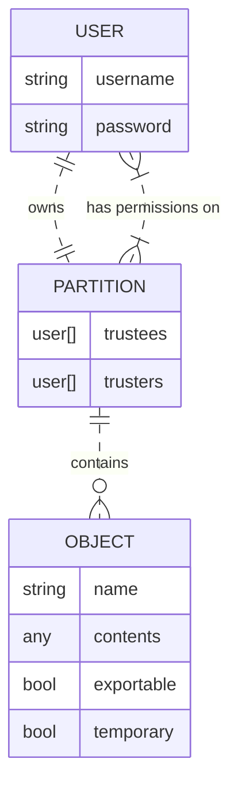
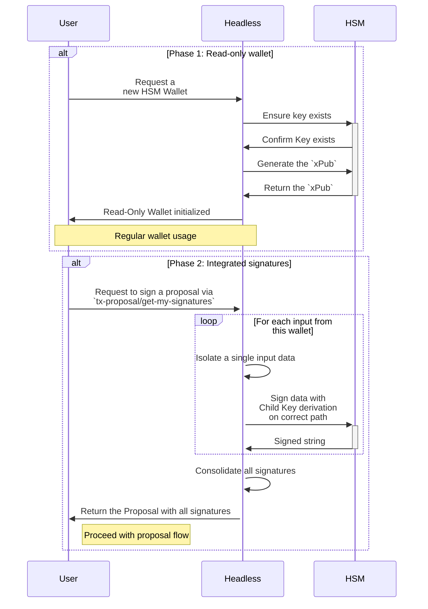

- Feature Name: lib_hsm_integration
- Start Date: 2023-07-31
- RFC PR:
- Hathor Issue:
- Author: Tulio Vieira tulio@hathor.network

# Summary
[summary]: #summary

This proposal aims to allow the creation and usage of a Hathor Wallet integrated with a certified and industry-proven Hardware Security System ( HSM ), specifically the ones from [Dinamo Networks](https://www.dinamonetworks.com/en/hardware-security-module-hsm/), for increased security of all of a use case's operations.

# Motivation
[motivation]: #motivation

Hardware Security Modules are enterprise cryptographic key management devices designed for big corporations. Integrating our wallet with a Hardware Security Module (HSM) is highly relevant and beneficial for us due to the following reasons:

1) **Enhanced Security**: these devices are specialized to provide a high level of security for cryptographic operations.
1) **Protection against attacks**: HSM devices help mitigate various cyberattacks by securely storing private keys and performing critical cryptographic operations within a secure environment
1) **Compliance and regulatory requirements**: in many industries and jurisdictions, compliance with security standards and regulations is crucial. Integrating a certified and recognized HSM device with our wallet can help use cases meet those requirements. Their usage can also demonstrate a commitment to data protection and security best practices.
1) **Offline key generation**: keys generated within an HSM never come into contact with potentially insecure environments, which adds an extra layer of protection against external threats
1) **Audit Trail and Accountability**: HSMs often provide robust audit trail capabilities. This feature helps maintain accountability and traceability, crucial in enterprise and compliance-driven industries
1) **Trust and Confidence**: Integrating an HSM with Hathor instills trust and confidence among use cases. When corporations know that their assets are secured by industry-standard HSMs, they are more likely to trust our platform and use it for their financial and business needs.

Overall, the integration of our wallet with an HSM helps elevate the security posture of your project, reduces the risk of unauthorized access and manipulation, and increases trust among stakeholders.

As the blockchain industry continues to mature, security will remain a paramount concern, making the adoption of HSMs increasingly relevant for safeguarding digital assets and transactions.
# Guide-level explanation
[guide-level-explanation]: #guide-level-explanation

The main premise of the integration with an HSM is that most cryptographic operations should be executed within the secure environment of the hardware device, adding an insulation layer from external threats.

The most important of them, the creation of the _Extended Private Key_ (`xPriv`) is generated offline within the device and never retrieved. All interactions that depend on this `xPriv`, such as signing transactions, are done exclusively through APIs and only the final results are returned.

For the Wallet Lib this means that the following operations are executed within the HSM environment:
- Generation of a `BIP-32 xPriv`
- Generation of an `xPub` for this `xPriv`
- Derivation of all child private keys for this `xPriv`
- Signing transaction inputs

### The HSM Environment
The full documentation of the HSM and its API can be found on the [Dinamo HSM docs GitBook](https://docs.dinamonetworks.com/). In short, the architecture of this device from our client standpoint consists of:
- A web server that provides the API endpoints
- Each connection to this server consists a **session**, and is authenticated using a username and password
- Each username has access to a **partition** containing **objects** of secure data within the HSM
  - Any user has full permissions within its own partition
  - A user can grant other users granular access to its own partition
- Objects consist of:
  - A key **name** consisting of 32 alphanumeric characters or "`_`"
  - The secure content
  - An **exportable** tag, indicating if this value can be retrieved to outside the HSM environment
  - A **temporary** tag, indicating if this object will only exist on volatile memory and will be destroyed as soon as the session ends.

In a simplified visualization of the main entities that interest this design:

### Wallet workflow overview
This workflow involves three parties:
- The end user
- The Headless application
- The HSM itself, interfaced by the HSM Dinamo library.

The workflow is divided into two phases. On Phase 1:
- The user requests to start a new wallet on the Headless application passing a `wallet-id` and `hsm-key` parameters
- The headless checks with the HSM if this `key` contains an `xPriv` content.
- The headless obtains the `xPub` from the HSM for this wallet `key`
  - A friendly error will be thrown if the results are invalid, indicating that the `xPriv` contents of the `key` are also invalid
- A read-only wallet is created on the Wallet Lib, with the `xPub` obtained from the HSM
- The Headless holds a reference between this wallet and an HSM `key` identifier ( a `hardwareWalletMap` ).

On phase 2, requests to sign a Proposal will have the cryptographic operations delegated to the HSM and consolidated by the Wallet Lib



Eventual logic errors like not finding a valid `xPriv` key are treated and returned to the end user in an informative way.

# Reference-level explanation
[reference-level-explanation]: #reference-level-explanation

This project has two main phases that need implementing:
1. Starting a `read only wallet` that fetches all relevant data from the HSM but can not sign a transaction.
2. Implementing an endpoint for signature integration with the HSM.

## Read Only implementation - Phase 1
[headless-implementation]: #headless-implementation
The headless application will be responsible for calling the HSM directly through [the `hsm-dinamo` library](https://www.npmjs.com/package/@dinamonetworks/hsm-dinamo) from Dinamo Networks.

### Connection to the HSM
The HSM connection authentication credentials will be stored on the config file along with all other settings for the wallet. This will also allow for configuration through docker parameters. ( See the `config.js.docker` file for more information. )
```js
// On the config.js file
hsmHost: "192.168.0.1"
hsmUsername: "my_username"
hsmPassword: "my_password"
```

1. The `hsm-dinamo` implementation establishes that the connection instance is a _singleton_: that way, only one HSM connection can be open at any given time. To ensure this does not cause racing conditions, a _lock mechanism_ will be implemented using [the existing `Lock` class](https://github.com/HathorNetwork/hathor-wallet-headless/blob/4fc71df7a0f9bba0714a81585fcbed77e84cf45d/src/lock.js#L12-L14) on the headless wallet.

2. Each endpoint request opens a connection, executes all needed commands and immediately closes it again. It is desirable to keep HSM sessions as short as possible, so that other requests may be executed sooner.

3. A connection may be open at the time the end user decides to reload the configuration settings. For now, this will not be allowed as it would increase the complexity of dealing with closing the current connections. Other connection setting approaches are discussed in the "Future Possibilities" section below.

### Wallet initialization
A dedicated `[POST] /hsm/start` endpoint will be available, receiving the expected `wallet-id` and `hsm-key` body parameters. The `hsm-key` indicates which key on the HSM contains the BIP32 information for this wallet. The headless considers this to be a _hardware wallet_ and realizes the first request to the HSM to validate the existence of the key name.

> **Possibility 1: The key is available**<br>
> The case flow continues
>
> **Possibility 2: The key is not available**<br>
> An error is thrown indicating the HSM has not been properly configured to have a BIP32 `xPriv` on this specific key.

The key being available, the next call requests the wallet's `xPub`. The parsing of `xPub` information received from the HSM can be based on the desktop hardware wallet [`handlePublicKeyData` function](https://github.com/HathorNetwork/hathor-wallet/blob/ef57015015375a477cffd72baf62f4e14baf541a/src/screens/StartHardwareWallet.js#L106-L138).

If the generated `xPub` is not valid, an error is thrown to the user indicating that the designated HSM key does not contain a valid `BIP32 xPriv` and is unsuitable for using as a wallet.

Once the wallet is started successfully, all other operations are executed in a similar fashion to the current headless implementation of a read-only wallet.

## Signature integration - Phase 2
The signature of HSM inputs will be made using the new HSM routes module. The `hsm/get-my-signatures` route will be created to receive the `TxHex` of a transaction, identify its inputs and send the data to be signed to the *HSM Client*. This signing procedure can be based on the desktop hardware wallet [`ledger/sendTx()` function](https://github.com/HathorNetwork/hathor-wallet/blob/ef57015015375a477cffd72baf62f4e14baf541a/src/utils/ledger.js#L126-L166), and the handling of `TxHex` parsing/rebuilding can be based on the existing `tx-proposal` controllers.

Only this route will be used for handling signatures with the HSM. The other signature endpoints, such as `wallet/simple_send_tx` would require more complex refactorings and will be discussed on the _Future Possibilites_ section.

## Creating a BIP32 on the HSM
This operation should be done via script, as it is the most critical operation on the HSM within this scope.

As such, a new `scripts/createHSMKey.js` file will be created, offering a way to quickly generate a new BIP32 wallet on a developer machine. This created key name should be inserted on the initialization endpoint parameters along with a `walletId` for it, creating a map between both on the application. Other wallet generation possibilities are discussed on the _Alternatives_ section of this document.

## Error handling
Errors while communicating with the HSM are to be treated in such a way that it's clear to the end user that the scope of the problem is related to the HSM communication.

## Wallet Lib integration
No change on the lib code will be necessary.

The interaction with the Wallet Lib will be similar to the current *Hardware Wallet* implementation on the Wallet Desktop.

The wallet storage will be initialized with the `xPub` ( reference: [`initHWStorage`](https://github.com/HathorNetwork/hathor-wallet/blob/ef57015015375a477cffd72baf62f4e14baf541a/src/storage.js#L127-L140) function ) obtained from the HSM: a read-only wallet. On the 2nd phase, signatures are made with the [`ledger/sendTx()` function](https://github.com/HathorNetwork/hathor-wallet/blob/ef57015015375a477cffd72baf62f4e14baf541a/src/utils/ledger.js#L126-L166), as described on the Headless section above.

# Rationale and alternatives
[rationale-and-alternatives]: #rationale-and-alternatives

## Multiple HSM devices
The proposed structure enforces that only one HSM device can be accessed by a headless application environment, since the authentication credentials are stored on config variables.

Another approach to this would be to transfer these credentials to the `/hsm/start` requests, allowing each `walletId` to store its own credentials besides the HSM key itself.

The downside of this solution is that the security of these credentials would be in responsibility of the end user, instead of wrapped within the security of the Headless Wallet configurations.

# Prior art
[prior-art]: #prior-art

A similar solution to this integration was implemented on the Desktop Wallet for interacting with the Ledger Hardware Wallet. This design uses many of the concepts and code implementations to achieve a similar objective.

The main difference between the Ledger and the HSM is that here there is no need for human intervention on the steps.

# Unresolved questions
[unresolved-questions]: #unresolved-questions

The only question left is if our application is able to correctly sign a transaction with the HSM in its current state, or if changes will have to be made to the Hathor Lib or the Dinamo-Hsm lib to allow this integration. The 2nd phase will be dependent on this answer, and it is being discussed on [internal issue 205](https://github.com/HathorNetwork/internal-issues/issues/205).

# Future possibilities
[future-possibilities]: #future-possibilities

## Full integration on all headless endpoints
As explained in the [headless implementation section](#headless-implementation), only the dedicated `get-my-signatures` endpoint was created to interact with the HSM.

Adapting all endpoints to use the HSM would require more profound refactorings, more specifically the [utils/transaction#prepareTransaction()](https://github.com/HathorNetwork/hathor-wallet-lib/blob/d3dbe159ac121eb67986ed8561cdacead8fc9fe8/src/utils/transaction.ts#L485-L502) method.

A new function could be added to the wallet storage, allowing the `prepareTransaction` to identify the wallet is linked to an HSM device. From this point, the function itself could retrieve the connection credentials from the config file and call the HSM lib directly, executing the signature.

Extra attention would be needed to ensure that thrown exceptions from the HSM lib would be correctly handled by the Wallet Lib, and that the headless end user would receive a friendly error message.

## Avoiding the use of the `xPub`
There is the possibility of some partner needing a wallet with a higher level of security, avoiding even the export of the `xPub` data.

This feature could be built upon the [393](https://github.com/HathorNetwork/hathor-wallet-headless/issues/393) issue, adding a new route for the HSM address calculation to the strict address list suggested by the proposal.

#### Approach 1: Requesting addresses directly
The functions `deriveAddressP2PKH` ([link](https://github.com/HathorNetwork/hathor-wallet-lib/blob/91118d5335c2b63afb559e5deddc7a81f73cbc13/src/utils/address.ts#L38-L48)) and `deriveAddressP2SH` ([link](https://github.com/HathorNetwork/hathor-wallet-lib/blob/91118d5335c2b63afb559e5deddc7a81f73cbc13/src/utils/address.ts#L69-L79)) should be modified to access the `storage` and retrieve the HSM authentication credentials, and instead of calculating locally the address data, retrieve it from the HSM through use of the [getKeyInfo](https://manual.dinamonetworks.io/nodejs/pages/examples/blockchain_get_key_info.html) lib method.

This approach requires the HSM firmware to already be configured to accept Hathor version bytes. To do so, it's necessary to request a Dinamo engineer to manually generate and deploy a HSM firmware with those settings.

From [the lib's `models/network.ts`](https://github.com/HathorNetwork/hathor-wallet-lib/blob/b26e784f73504d57bc762524b9e361c82b575271/src/models/network.ts#L10-L32), we can see those have the form of:
```js

// Version bytes for address generation
const versionBytes = {
  'mainnet': {
    'p2pkh': 0x28,
    'p2sh': 0x64,
    'xpriv': 0x03523b05,
    'xpub': 0x0488b21e,
  },
  'testnet': {
    'p2pkh': 0x49,
    'p2sh': 0x87,
    'xpriv': 0x0434c8c4,
    'xpub': 0x0488b21e,
  },
  'privatenet': {
    'p2pkh': 0x49,
    'p2sh': 0x87,
    'xpriv': 0x0434c8c4,
    'xpub': 0x0488b21e,
  },
}
```

#### Approach 2: Requesting `pubkey` and calculating locally
The HSM [getPubKey](https://manual.dinamonetworks.io/nodejs/pages/examples/blockchain_get_pub_key.html) would be called instead of the `getKeyInfo` would be called on the `deriveAddress*` functions mentioned above.

With this information, new functions would need to be created in place of `deriveAddressFromXPubP2PKH` and `deriveAddressFromDataP2SH` to receive the `pubkey` directly, instead of deriving them from the `xPub`.

The benefit of this approach is not needing the HSM firmware to be configured, since the address would be calculated locally and `pubkeys` are not affected by network version bytes.


# Task Breakdown
| Task                                                                       | Effort |
|----------------------------------------------------------------------------|:------:|
| Create the `/hsm/start` endpoint                                           |  0.5   |
| Implement call to _HSM Client_ `getXPub` on wallet start                   |  0.3   |
| Unit test success and errors with `/hsm/start` call                        |  0.2   |
| Implement call to _HSM Client_ `signData` on `/get-my-signatures` endpoint |  1.0   |
| Unit test success and errors with the `signData` call                      |  0.5   |
| -------------------------------------------------------------------------- |  ----  |
| Total                                                                      |  2.5   |
