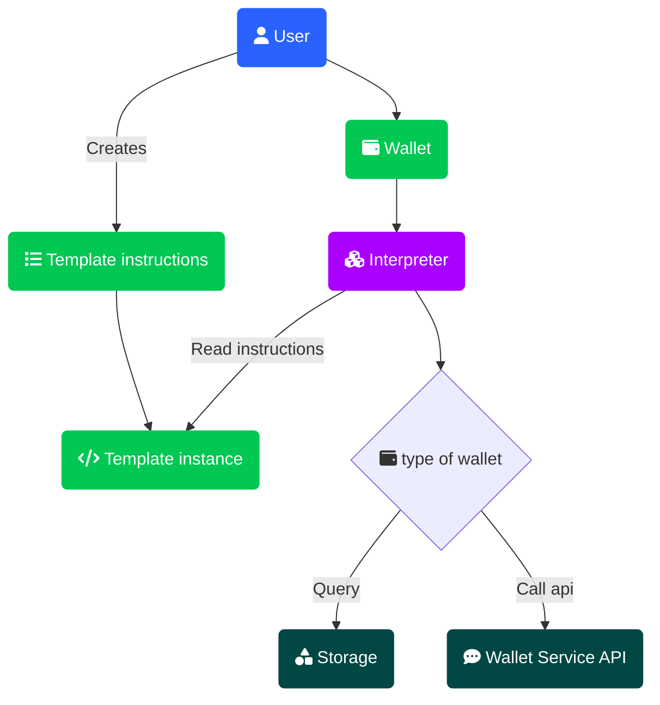

# Summary
[summary]: #summary

Create a transaction template api on the wallet-lib that can be used to build transactions by following user defined instructions and implement an endpoint on wallet-headless to allow user build a transaction by offering a transaction template as a JSON object.

# Motivation
[motivation]: #motivation

Some clients require special additions to how the transactions are created, for instance when sending authority to a certain addresses after the transaction, allowing the authority address to be from outside the wallet, adding a special output in the transaction, etc.

Each of these use cases would require us to write new methods or extend existing ones in the wallet-lib, which translates to a reasonable cost of development and risk to introduce bugs.

A compelling solution for this problem is to create an abstraction layer of transaction creation by using transaction description. This way we detach the transaction building logic from the specific implementation details, allowing for greater flexibility and extensibility. This approach minimizes the risks associated with frequent code changes while giving users more control over transaction structure, though it may introduce new responsibilities for users in ensuring correct template design.

# Guide-level explanation
[guide-level-explanation]: #guide-level-explanation

We can describe a transaction by using a system of *instructions template* set that represents a collection of basic transaction components like *input*, *output* and common operations over inputs or outputs by the means of *actions*.

A user must be able to control instructions to design a transaction by using a *client* which should be able to build a *transaction template* and executes its interpretation to generate a final *transaction*.

For this, we can segregate the mentioned system in three areas:

- User land
  - public set of interfaces, types and classes that will be used to create templates.
- Interpreter
  - public set of classes used by wallets to build transactions from a template.
- Lib land
  - protected internal methods and utilities used to create templates and transaction.

On *user land* we provides:

- Instruction template interfaces
- Instruction classes
- Transaction template builder
- Transaction template client

On *interpreter* side we provides:

- Wallet facade interpreter
- Wallet service interpreter

On *lib land* we provides:

- All the existing methods for transaction preparation, creation and send transaction, including helpers and utils to create transaction components
- New methods to assist the interpreters, if needed



## User land

### Instruction template interfaces

**Basic:**

- [InputTemplateInstruction](#inputtemplateinstruction): controls an input insertion into the array
- [OutputTemplateInstruction](#outputtemplateinstruction): controls an output insertion into the array
- [ActionTemplateInstruction](#actiontemplateinstruction): can determine over which component to act

These basic template instructions are for *internal* use and define **required fields** to declare a *template instruction literal* object by the user.

The following interfaces are describing each instruction type by its fields and possible values. A user can define a literal object of these types to design a final transaction.

**Input:**

- [UtxoInputTemplateInstruction](#utxoinputtemplateinstruction): can control any param to query a UTXO input
- RawInputTemplateInstruction: can determine a known UTXO at the risk to be already spent

**Output:**

- [TokenOutputTemplateInstruction](#utxoinputtemplateinstruction): can control a token output generation
- DataOutputTemplateInstruction: can control data output generation
- RawOutputTemplateInstruction: can determine an output

**Action:**

- [ShuffleActionTemplateInstruction](#shuffleactiontemplateinstruction): can determine a shuffle over a target array, either an input or output
- FillChangeActionTemplateInstruction: can determine a change output generation

#### `TemplateInstruction`

```ts
interface TemplateInstruction {
  readonly type: AllInstructionTypes|string;
  // ... methods will be addresses later in the design
}
```

- `type`: select a type from all possible types among inputs, outputs and actions

#### `InputTemplateInstruction`

```ts
interface InputTemplateInstruction extends TemplateInstruction {
  /**
   * A positive integer
   * It allows -1 to denote the last position in the array
   */
  position: number;
}
```

- `position`: which index to insert the input, default to `-1`
  - [NOTE-1]: can be `-1` to insert at the end
  - [NOTE-2]: the request will fail if position doesn't exists

#### `OutputTemplateInstruction`

```ts
interface OutputTemplateInstruction extends TemplateInstruction {
  /**
   * A positive integer
   * It allows -1 to denote the last position in the array
   */
  position: number;
}
```

- `position`: which index to insert the input, default to `-1`
  - [NOTE-1]: can be `-1` to insert at the end
  - [NOTE-2]: the request will fail if position doesn't exists

#### `ActionTemplateInstruction`

```ts
interface ActionTemplateInstruction extends TemplateInstruction {
  target: 'inputs'|'outputs'|'all';
}
```

- `target`: choose a target to execute an action over

#### `UtxoInputTemplateInstruction`

type: `input/utxo`

```ts
interface UtxoInputTemplateInstruction extends InputTemplateInstruction {
  fill: number;
  token?: string;
  authority?: `mint` | `melt`;
  address?: string;
  autoChange?: boolean;
}
```

- `fill`: amount of tokens to select
  - [NOTE-1]: It may require multiple selection of UTXO to match the amount
  - [NOTE-2]: It doesn't imply the generation of a change output
  - [NOTE-3]: The amount selected may surpass the `fill`, so a change output may be required.
- `token`: which token to select, defaults to native token, in practice `00` (HTR). User must set the token UID here.
- `authority`: `mint` or `melt`
  - [NOTE-4]: It may miss any UTXO and result in an empty array
- `address`: find only UTXOs of this address to fill the amount
  - [NOTE-5]: It may miss any UTXOs and result in an empty array
- `autoChange`: whether to automatically add any surplus (amount selected minus `fill`) in a change output, defaults to `true`
  - [NOTE-6]: If `true` and a change is generated, then it will add the output change at the final position of outputs array

>[!NOTE]
> Decision 1: Original design implied that if not enough tokens are found to fill the `fill` value we should just return the ones that are available, or an empty list.
> This can be done but we may also want a "fail early" option when rendering the template so that we don't spend any additional time building an invalid transaction.
> Should we have this "fail early" as an option or should we always fail if we do not have enough utxos to fill the request?

#### `RawInputTemplateInstruction`

type: `input/raw`

```ts
interface RawInputTemplateInstruction extends InputTemplateInstruction {
  txId: string;
  index: number;
}
```

- `txId`: transaction ID in which the input belongs to
  - [NOTE-1]: It may miss the transaction
- `index`: output index in which the input is located
  - [NOTE-2]: It may miss the index

>[!NOTE]
> Decision 2: A miss here means an input will not be added to the list of inputs. It can drive the final transaction to be invalid, but the template itself will be generated nevertheless.
> Another course of action is related to `Decision 1`, where we can fail the template rendering altogether.

#### `TokenOutputTemplateInstruction`

type: `output/token`

```ts
interface TokenOutputTemplateInstruction extends OutputTemplateInstruction {
  amount: number;
  token?: string;
  address?: string;
  authority?: `mint` | `melt`;
  timelock?: number;
  checkAddress?: boolean;
}
```

- `amount`: amount of tokens
- `token`: which token to select, defaults to native token, in practice `00` (HTR). User must set the token UID here.
- `address`: create an output script for the address, if not present will get one from the wallet
  - [NOTE-1]: It will get a not used address from the wallet
- `authority`: `mint` or `melt`, if present will create the desired authority output
  - [NOTE-2]: If the required input is not present, then it will generate an invalid transaction
- `timelock`: UNIX timestamp, the generated output may not be spent before this date and time.
- `checkAddress`: whether to check that the address is from the wallet, defaults to `false`
  - [NOTE-3]: If `true` and address is not from the wallet, then the interpreter should fail short

>[!NOTE]
> Decision 3: Should we keep the default behavior on `address` or make it more strict? Like, if there isn't any `address` value, then fail short.
>
> To counter the behavior of a stricter `address` we can add a flag to let the user choose the desired behavior, either get a new address or get an address by index.
>
> Or we can make `address` a poli typed property which can accept `number` for indexes, the string `new` or a general `string` to denote an address.

#### `DataOutputTemplateInstruction`

type: `output/data`

```ts
interface DataOutputTemplateInstruction extends OutputTemplateInstruction {
  data: string;
}
```

- `data`: UTF-8 encoded string of data

#### `RawOutputTemplateInstruction`

type: `output/raw`

```ts
interface RawOutputTemplateInstruction extends OutputTemplateInstruction {
  amount: number;
  script: string;
  token?: string;
  authority?: `mint` | `melt`;
}
```

- `amount`: amount of tokens
- `script`: base64 encoded script
- `token`: which token to select, defaults to native token, in practice `00` (HTR). User must set the token UID here.
- `authority`: `mint` or `melt`, if present will create the desired authority output
  - [NOTE-1]: If the required input is not present, then it will generate an invalid transaction

#### `ShuffleActionTemplateInstruction`

type: `action/shuffle`

```ts
interface RawOutputTemplateInstruction extends ActionTemplateInstruction {
}
```

It will apply an array shuffle action over the selected target.

#### `FillChangeActionTemplateInstruction`

type: `action/change`

```ts
interface FillChangeActionTemplateInstruction extends ActionTemplateInstruction {
  token?: string;
  address?: string;
  timelock?: number;
}
```

The `target` doesn't have any effect. It will will check the transaction balance and calculate any change output, if any it will generate a list of change outputs and add it to the final position in outputs array.

If `token` is present we will only generate change for this specific token, if not we will generate change outputs for all tokens.

>[!NOTE]
>Decision 4: We can add `position` property to allow user determine the position of the change output if it is generated.

#### `ConfigActionTemplateInstruction`

type: `action/config`

```ts
interface ConfigActionTemplateInstruction extends ActionTemplateInstruction {
  version: number,
  signalBits: number,
}
```

This action can be used to configure some transaction data that does not affect the inputs or outputs.

### Instruction classes

Each template instruction interface must have its own class implementation. A class instance is useful to both help user to form an instruction and help the interpreter to form the transaction.

- [UtxoInputTemplateInstruction](#utxoinputtemplateinstruction)
- [RawInputTemplateInstruction](#rawinputtemplateinstruction)
- [TokenOutputTemplateInstruction](#tokenoutputtemplateinstruction)
- [DataOutputTemplateInstruction](#dataoutputtemplateinstruction)
- [RawOutputTemplateInstruction](#rawoutputtemplateinstruction)
- [ShuffleActionTemplateInstruction](#shuffleactiontemplateinstruction)
- [FillChangeActionTemplateInstruction](#fillchangeactiontemplateinstruction)
- [ConfigActionTemplateInstruction](#configactiontemplateinstruction)

Each class will implement the following interface, directly or indirectly.

```ts
interface TemplateInstruction {
  readonly type: AllInstructionTypes|string;
  // static
  identify(instruction: Object): bool;
  // methods
  fromObject(instruction: Object): TemplateInstruction;
  toObject(): Object;
}
```

- `identify` is a static method that returns true if the object can be an instance of the instruction, it will validate the instruction structure and properties.
- `fromObject` parses an object to an instruction instance.
- `toObject` will serialize the instruction into an object that can be parsed in `fromObject`.

### Transaction template client

A client gives a user the ability to execute a transaction template object to make a transaction, and gives the user the responsibility to select the wallet, either Wallet Facade of Wallet Service.

```ts
class TransactionTemplate {
  constructor (): TransactionTemplate {...}
  static from(instructions: TemplateInstruction[]): TransactionTemplate {...}
  static fromObject(instructions: Object[]): TransactionTemplate {...}
  push(instruction: TemplateInstruction): TransactionTemplate {...};
  build(interpreter: TxTemplateInstructionInterpreter): Transaction {...}
}
```

- `from`: gives user the ability to instantiate a `TransactionTemplate` from an array of instruction instances
- `fromObject`: gives the ability to instantitate from a list of objects, each object will be identified and parsed from the appropriate instruction class
- `push`: Add a new instruction at the end of the instruction array.
- `build`: triggers the interpretation of the set of instructions using the appropriate interpreter implementation, either the one for Wallet Facade or the one for Wallet Service, and must result in a `Transaction`
  - [NOTE-1]: It will generate the transaction and return it.

### Transaction template builder

A builder class must assists the user to build a `TransactionTemplate` instance.

The `TransactionTemplate` class can be initiated from an object (the JSON template specified in this design) or it can be initialized empty and we add each input/output/action instruction with methods of the class.

```ts
class TransactionTemplateBuilder {
  addInstruction(
    instruction: TemplateInstruction
  ): TransactionTemplateBuilder {}
  addUtxoInput(
    position: number,
    fill: number,
    token?: string,
    authority?: `mint` | `melt`,
    address?: string,
    autoChange?: boolean,
  ): TransactionTemplateBuilder {}
  addRawInput(
    position: number,
    txId: string,
    index: number,
  ): TransactionTemplateBuilder {}
  addTokenOutput(
    position: number,
    amount: number,
    token?: string,
    authority?: `mint` | `melt`,
    address?: string,
    checkAddress?: boolean,
  ): TransactionTemplateBuilder {}
  addDataOutput(
    position: number,
    data: string,
  ): TransactionTemplateBuilder {}
  addRawOutput(
    position: number,
    amount: number,
    script: string,
    token?: string,
    authority?: `mint` | `melt`,
  ): TransactionTemplateBuilder {}
  addShuffleAction(
    target: 'inputs'|'outputs'|'all',
  ): TransactionTemplateBuilder {}
  addFillChangeAction(
    target: 'inputs'|'outputs'|'all',
  ): TransactionTemplateBuilder {}
  build(): TransactionTemplate {}
  export(): TemplateInstruction[] {}
}
```

- `addInstruction`: add a general instruction as an object literal
- `addUtxoInput`: add the specific UTXO input instruction
- `addRawInput`: add the specific Raw input instruction
- `addTokenOutput`: add the specific Token output instruction
- `addDataOutput`: add the specific Data output instruction
- `addRawOutput`: add the specific Raw output instruction
- `addShuffleAction`: add the specific Shuffle action instruction
- `addFillChangeAction`: add the specific FillChange action instruction
- `build`: build and returns a `TransactionTemplate` instance
- `export`: returns an array of instructions added to the builder in order of addition

### Usage example

The following template will mint 0.01 TST, generate another mint authority to the wallet and it will have a 'foobar' data output as the first output.
The mint deposit inputs are manually added to the transaction and all outputs are shuffled except for the data output at position 0.

```json
[
  { "type": "input/utxo", "position": -1, "fill": 2, "token": "00", "autoChange": false },
  { "type": "input/utxo", "position": -1, "fill": 1, "token": "TST", "authority": "mint", "autoChange": false },
  { "type": "output/token", "position": -1, "token": "TST", "amount": 1 },
  { "type": "output/token", "position": -1, "token": "TST", "authority": "mint", "amount": 1 },
  { "type": "action/change" },
  { "type": "action/shuffle", "target": "outputs" },
  { "type": "output/data", "position": 0, "data": "foobar" },
]
```

This same transaction template instructions set could be built as:

```ts
// Token UID for token TST
let TST = '000cafe...cafe123';

const ttInstructions = new TransactionTemplateBuilder()
  .addUtxoInput(-1, 2)
  .addUtxoInput(-1, 2, TST, "mint")
  .addTokenOutput(-1, 1, TST)
  .addTokenOutput(-1, 1, TST, "mint")
  .addShuffleAction("outputs")
  .addDataOutput("foobar")
  .export();
```

We can get a transaction template instance from the instructions set by the `build` or by calling the transaction template `from` with the transaction template instructions:

```ts
const tt = TransactionTemplate.from(ttInstructions);
```

Then we can get the designed transaction by calling the `build`:

```ts
const transaction = tt.build(myWalletFacade);
```

## Interpreters

A class which responsibility is to read the sequence of instructions to create a transaction using a determined type of wallet.

```ts
interface TxTemplateInstructionInterpreter {
  execute(tt: TransactionTemplate): Transaction;
}
```

- execute: Will create a `TxTemplateInterpreterContext` instance and execute each instruction with the context then return the resulting `Transaction` instance.

We have two instances of interpreters:

- WalletFacadeTemplateInterpreter
- ServiceTemplateInterpreter

```ts
interface TxTemplateInterpreterContext {
  version: number,
  signalBits: number,
  inputs: Input[],
  outputs: Output[],
  tokens: string[],
  balance: Record<string, IBalance>,
  wallet: IHathorWallet,
  isWalletService: boolean,
}
```

## Lib land

Beyond the wallet API we can use any utils or helper available to support the interpreter in its mission.

For now we don't need to create anything. However, it worths to mention the `IHathorWallet` doesn't conveys all methods available on both wallets. Just to reference one, we can take the `getUtxos` which is implemented in both wallets but is not present at `IHathorWallet`. Not to mention the lack of type inference at wallet facade which makes the development experience poorer.

>[!NOTE]
>Decision Call: Should we use this implementation as an opportunity to improve the lib in the topics mentioned?

# Reference-level explanation

## UTXO Input Template Instruction Implementation

Query the requested utxos from the wallet and add them as inputs to the transaction.

### Token selection

After query for UTXOs then we add them to the inputs array at the defined position.

If any change is required and `autoChange` is `true` or missing we add them to the outputs.

#### Sample

The following instruction will find unlocked UTXOs that completes at least 0.10 TST tokens from address `Wtest` and add them to the inputs, also add change output to outputs if necessary.

```json
{
  "type": "input/utxo",
  "token": "TST",
  "fill": 10,
  "address": "Wtest",
}
```

### Authority selection

After query for UTXOs then we add them to the inputs array at the defined position.

The addition must happen as a merge of arrays.

#### Sample

The following instruction will find 1 TST Mint authority UTXO and add them to the inputs.

```json
{
  "type": "input/utxo",
  "token": "TST",
  "fill": 1,
  "authority": "mint",
}
```

## Shuffle Action

Shuffle the target array, either inputs, outputs or tokens.

## Fill Change Action

1. Will use the context to check the balance and for each target token run the following steps.
1. Create an output change if the balance is lower than 0 with the absolute (positive) value of the amount.
1. Position the output change at the end of outputs
