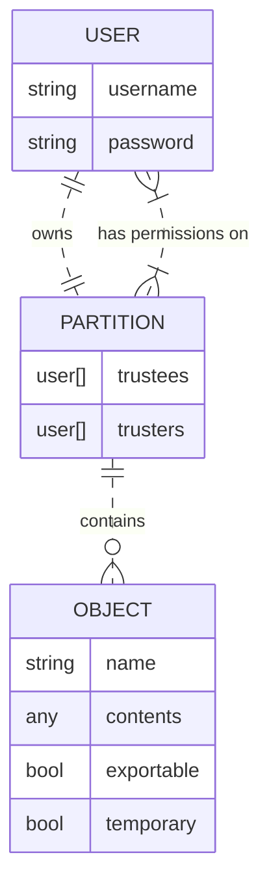
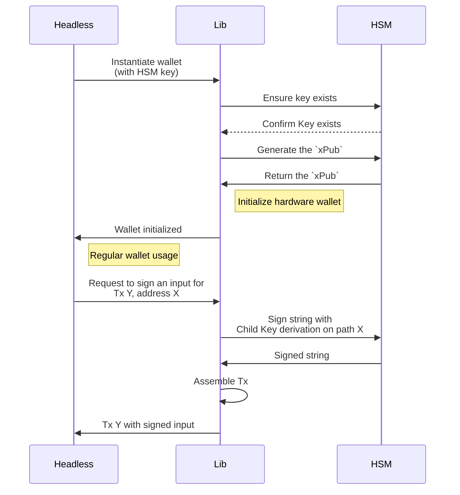

- Feature Name: lib_hsm_integration
- Start Date: (fill me in with today's date, 2023-07-31)
- RFC PR:
- Hathor Issue:
- Author: Tulio Vieira tulio@hathor.network

# Summary
[summary]: #summary

This proposal aims to allow the creation and usage of a Hathor Wallet integrated with a certified and industry-proven Hardware Security System ( HSM ), especifically the ones from [Dinamo Networks](https://www.dinamonetworks.com/en/hardware-security-module-hsm/), for increased security of all of an use case's operations.

# Motivation
[motivation]: #motivation

Hardware Security Modules are enterprise cryptographic key management designed for big corporations. Integrating our wallet with a Hardware Security Module (HSM) is highly relevant and beneficial for us due to the following reasons:

1) **Enhanced Security**: these devices are specialized to provide a high level of security for cryptographic operations.
1) **Protection against attacks**: HSM devices help mitigate various cyberattacks by securely storing private keys and performing critical cryptographic operations within a secure environment
1) **Compliance and regulatory requirements**: in many industries and jurisdictions, compliance with security standards and regulations is crucial. Integrating a certified and recognized HSM device with our wallet can help meet these requirements. Their usage can also demonstrate a commitment to data protection and security best practices.
1) **Offline key generation**: keys generated within an HSM never come into contact with potentially insecure environments, which adds an extra layer of protection against external threats
1) **Audit Trail and Accountability**: HSMs often provide robust audit trail capabilities. This feature helps maintain accounability and traceability, crucial in enterprise and compliance-driven industries
1) **Trust and Confidence**: Integrating an HSM with Hathor instills trust and confidence among use cases. When corporations know that their assets are secured by industry-standard HSMs, they are more likely to trust our platform and use it for their financial and business needs.

Overall, the integration of our wallet with an HSM helps elevate the security posture of your project, reduces the risk of unauthorized access and manipulation, and increases trust among stakeholders.

As the blockchain industry continues to mature, security will remain a paramount concern, making the adoption of HSMs increasingly relevant for safeguarding digital assets and transactions.
# Guide-level explanation
[guide-level-explanation]: #guide-level-explanation

The main premise of the integration with an HSM is that most cryptographic operations should be executed within the secure environment of the hardware device, adding an insulation layer from external threats.

The most important of them, the creation of the _Extended Private Key_ (`xPriv`) is generated offline within the device and never retrieved. All interactions that depend on this `xPriv`, such as signing transactions, are done exclusively through APIs and only the final results are returned.

For the Wallet Lib this means that the following operations are executed within the HSM environment:
- Generation of a `BIP-32 xPriv`
- Generation of an `xPub` for this `xPriv`
- Derivation of all child private keys for this `xPriv`
- Signing transaction inputs

### The HSM Environment
The full documentation of the HSM and its API can be found on [their docs GitBook](https://docs.dinamonetworks.com/). In short, the architecture of this device from our client standpoint consists of:
- A web server that provides the API endpoints
- Each connection **session** is authenticated using an username and password
- Each username has access to a **partition** containing **objects** of secure data within the HSM
  - Any user has full permissions within its own partition
  - A user can grant other users granular access to its own partition
- Objects consist of:
  - A key **name** consisting of 32 alphanumeric characters or "`_`"
  - A secured content
  - An **exportable** tag, indicating if this value can be retrieved to outside the HSM environment
  - A **temporary** tag, indicating if this object will only exist on volatile memory and will be destroyed as soon as the session ends.

In a simplified visualization of the main entities that interest this design:

### Wallet workflow overview
- A new wallet is instantiated on the Wallet Lib, and inside its configuration there is a reference to an HSM key identifier.
- The lib identifies if this key contains an `xPriv` content on the HSM environment.
  - By default, an error will be thrown by the lib if the key is not found
  - An optional `create` flag can also be used in wallet creation operations.
- The `xPub` is obtained from the HSM for this wallet
- All internal processes for generating the wallet are executed by the lib in a similar fashion to what already happens with the Ledger wallet
- Any request to sign a transaction will have the cryptographic operations delegated to the HSM and consolidated by the Wallet Lib



Failure to communicate with the HSM at any moment do not interrupt the execution of the Wallet Lib itself or its client applications. Retry mechanisms also are available, with configurable parameters, to increase the lib's fault tolerance to these external dependencies.

# Reference-level explanation
[reference-level-explanation]: #reference-level-explanation

This project has three main phases that need implementing:
1. The communication with the HSM itself. We will call this the *HSM Client*.
2. The communication between the Wallet Lib and the *HSM Client*
3. Adapting the Headless wallet to use the Hardware feature of the Wallet Lib

## The HSM Client
The main library offered by Dinamo to interact with the HSM device [is available in C code](https://manual.dinamonetworks.io/c/index.html).

A proof-of concept application was partially developed in C as a bridge between the Wallet Lib javascript environment and the C environment. A dedicated design will be written about this interface, but in short:
- The C code expects to be called from the operating system. In NodeJS terms this menas using [`child_process.spawn()`](https://nodejs.org/docs/latest-v18.x/api/child_process.html#child_processspawncommand-args-options)
- Parameters such as the derivation path and input data to be signed should be passed through `stdin`, not the `argv` command parameters. This avoids leaking sensitive data to the public command line history of the OS
- Responses are sent through `stdout` and read using the child process `stdout.on('data')` event listener

This means that headless applications that are supposed to interact with the HSM should copy the compiled executables of the *HSM Client* to their environment.

## Headless implementation
The headless application will be responsible for calling the *HSM Client* directly.

The connection authentication credentials will be stored securely on the environment variables, allowing the leverage of other security practices to avoid credential leaks.
```sh
# Env variables
HSM_DEVICE_HOST="192.168.0.1"
HSM_DEVICE_USERNAME="my_username"
HSM_DEVICE_PASSWORD="my_password"
```

A configuration attribute will be added to the `config.js` file, similar to the existing `seeds` attribute, mapping the headless `walletId`s to HSM object key names.
```js
// config.js
const hsmWallets = {
	'headless-wallet-id': 'HSM_KEY_NAME'
}
```

When requesting to `[POST] /start` a wallet with the `walletId` within this mapped list, the headless considers this to be a hardware wallet and realizes the first request to the HSM to validate the existence of the key name.

> **Possibility 1: The key is available**
> The case flow continues
>
> **Possibility 2: The key is not available**
> An error is thrown indicating the HSM has not been properly configured to have the `xPriv` on this specific key.
>
> **Possibility 3: The key is not a BIP32 xPriv**
> An error is thrown indicating that the key exists on the HSM but it's invalid for this use.

The key being available, the next call requests the wallet's `xPub`. The parsing of `xPub` information received from the HSM can be based on the desktop hardware wallet [`handlePublicKeyData` function](https://github.com/HathorNetwork/hathor-wallet/blob/ef57015015375a477cffd72baf62f4e14baf541a/src/screens/StartHardwareWallet.js#L106-L138).

| ⚠ Incomplete PoC - xPub |
| :--- |
| The HSM API to retrieve the `xPub`  from a generated `BIP32` wallet is still under development. An initial estimate from the Dinamo team is for this to be available on September. A degree of development uncertainty can be found when this API is available. |

Once the wallet is started successfully, any request to fetch signatures or to sign transactions should send the data to be signed to the *HSM Client*. This can be based on the desktop hardware wallet [`ledger/sendTx()` function](https://github.com/HathorNetwork/hathor-wallet/blob/ef57015015375a477cffd72baf62f4e14baf541a/src/utils/ledger.js#L126-L166).

| ⚠ Incomplete PoC - sign tx |
| :--- |
| This step was also not tested on the PoC and can add uncertainty to the development phase |

Since the *HSM Client* connections are closed immediately after the command execution, there is no need to manage any other process while interacting with the HSM.

## Wallet Lib adaptation
No change on the lib code will be necessary.

The interaction with the Wallet Lib will be similar to the current *Hardware Wallet* implementation on the Wallet Desktop.

The wallet storage will be initialized with the `xPub` ( reference: [`initHWStorage`](https://github.com/HathorNetwork/hathor-wallet/blob/ef57015015375a477cffd72baf62f4e14baf541a/src/storage.js#L127-L140) function ) obtained from the HSM and signatures made with the [`ledger/sendTx()` function](https://github.com/HathorNetwork/hathor-wallet/blob/ef57015015375a477cffd72baf62f4e14baf541a/src/utils/ledger.js#L126-L166), as described on the Headless section above.
## Error handling
Errors while communicating with the HSM are treated and, where applicable, retried before returning an error the the end user.

The mapped errors for this context are:

| Type                     | Action taken |
| :--- | --- |
| Executable command error | The user is informed that the Headless was not properly configured to interact with an HSM  |
| Network error            | When receiving a "Network Error" from the executable, a number of retries is attempted before returning the error to the end user. |
| Invalid BIP32 key        | This error is raised on Wallet Start. The end user is informed that the HSM device is not properly configured for interacting with the Headless |

For example, in cases where the `fetch key on HSM` command returns with a common network error, the command should be retried for a configured amount of times. This new configuration will be specified on the `config.js` file.

---
| 🚧 Work In Progress |
|--- |


This is the technical portion of the RFC. Explain the design in sufficient
detail that:

- Its interaction with other features is clear.
- It is reasonably clear how the feature would be implemented.
- Corner cases are dissected by example.

The section should return to the examples given in the previous section, and
explain more fully how the detailed proposal makes those examples work.

# Drawbacks
[drawbacks]: #drawbacks

Why should we *not* do this?

# Rationale and alternatives
[rationale-and-alternatives]: #rationale-and-alternatives

> Mention the possibility of not having `xPub` and fetching every address directly from the HSM

> This structure enforces that a headless application can only communicate with exactly one HSM device for all listed wallets.


- Why is this design the best in the space of possible designs?
- What other designs have been considered and what is the rationale for not
  choosing them?
- What is the impact of not doing this?

# Prior art
[prior-art]: #prior-art

Discuss prior art, both the good and the bad, in relation to this proposal.
A few examples of what this can include are:

- For protocol, network, algorithms and other changes that directly affect the
  code: Does this feature exist in other blockchains and what experience have
  their community had?
- For community proposals: Is this done by some other community and what were
  their experiences with it?
- For other teams: What lessons can we learn from what other communities have
  done here?
- Papers: Are there any published papers or great posts that discuss this? If
  you have some relevant papers to refer to, this can serve as a more detailed
  theoretical background.

This section is intended to encourage you as an author to think about the
lessons from other blockchains, provide readers of your RFC with a fuller
picture. If there is no prior art, that is fine - your ideas are interesting to
us whether they are brand new or if it is an adaptation from other blockchains.

Note that while precedent set by other blockchains is some motivation, it does
not on its own motivate an RFC. Please also take into consideration that Hathor
sometimes intentionally diverges from common blockchain features.

# Unresolved questions
[unresolved-questions]: #unresolved-questions

- What parts of the design do you expect to resolve through the RFC process
  before this gets merged?
- What parts of the design do you expect to resolve through the implementation
  of this feature before stabilization?
- What related issues do you consider out of scope for this RFC that could be
  addressed in the future independently of the solution that comes out of this
  RFC?

# Future possibilities
[future-possibilities]: #future-possibilities

Think about what the natural extension and evolution of your proposal would be
and how it would affect the network and project as a whole in a holistic way.
Try to use this section as a tool to more fully consider all possible
interactions with the project and network in your proposal. Also consider how
this all fits into the roadmap for the project and of the relevant sub-team.

This is also a good place to "dump ideas", if they are out of scope for the
RFC you are writing but otherwise related.

If you have tried and cannot think of any future possibilities,
you may simply state that you cannot think of anything.

Note that having something written down in the future-possibilities section
is not a reason to accept the current or a future RFC; such notes should be
in the section on motivation or rationale in this or subsequent RFCs.
The section merely provides additional information.
