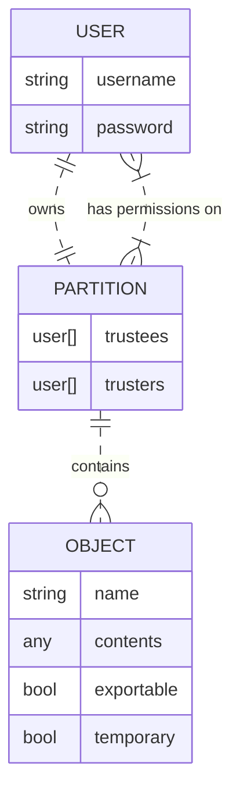
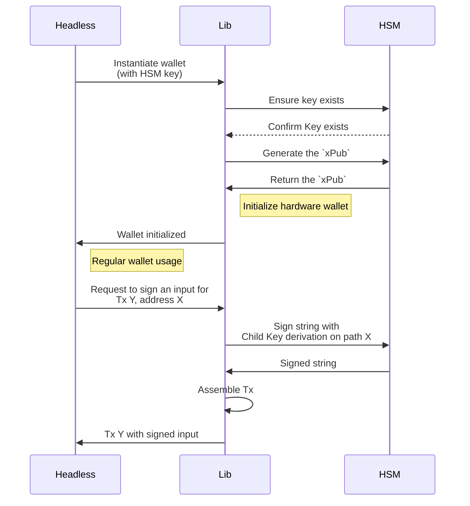

- Feature Name: lib_hsm_integration
- Start Date: 2023-07-31
- RFC PR:
- Hathor Issue:
- Author: Tulio Vieira tulio@hathor.network

# Summary
[summary]: #summary

This proposal aims to allow the creation and usage of a Hathor Wallet integrated with a certified and industry-proven Hardware Security System ( HSM ), specifically the ones from [Dinamo Networks](https://www.dinamonetworks.com/en/hardware-security-module-hsm/), for increased security of all of a use case's operations.

# Motivation
[motivation]: #motivation

Hardware Security Modules are enterprise cryptographic key management devices designed for big corporations. Integrating our wallet with a Hardware Security Module (HSM) is highly relevant and beneficial for us due to the following reasons:

1) **Enhanced Security**: these devices are specialized to provide a high level of security for cryptographic operations.
1) **Protection against attacks**: HSM devices help mitigate various cyberattacks by securely storing private keys and performing critical cryptographic operations within a secure environment
1) **Compliance and regulatory requirements**: in many industries and jurisdictions, compliance with security standards and regulations is crucial. Integrating a certified and recognized HSM device with our wallet can help use cases meet those requirements. Their usage can also demonstrate a commitment to data protection and security best practices.
1) **Offline key generation**: keys generated within an HSM never come into contact with potentially insecure environments, which adds an extra layer of protection against external threats
1) **Audit Trail and Accountability**: HSMs often provide robust audit trail capabilities. This feature helps maintain accountability and traceability, crucial in enterprise and compliance-driven industries
1) **Trust and Confidence**: Integrating an HSM with Hathor instills trust and confidence among use cases. When corporations know that their assets are secured by industry-standard HSMs, they are more likely to trust our platform and use it for their financial and business needs.

Overall, the integration of our wallet with an HSM helps elevate the security posture of your project, reduces the risk of unauthorized access and manipulation, and increases trust among stakeholders.

As the blockchain industry continues to mature, security will remain a paramount concern, making the adoption of HSMs increasingly relevant for safeguarding digital assets and transactions.
# Guide-level explanation
[guide-level-explanation]: #guide-level-explanation

The main premise of the integration with an HSM is that most cryptographic operations should be executed within the secure environment of the hardware device, adding an insulation layer from external threats.

The most important of them, the creation of the _Extended Private Key_ (`xPriv`) is generated offline within the device and never retrieved. All interactions that depend on this `xPriv`, such as signing transactions, are done exclusively through APIs and only the final results are returned.

For the Wallet Lib this means that the following operations are executed within the HSM environment:
- Generation of a `BIP-32 xPriv`
- Generation of an `xPub` for this `xPriv`
- Derivation of all child private keys for this `xPriv`
- Signing transaction inputs

### The HSM Environment
The full documentation of the HSM and its API can be found on the [Dinamo HSM docs GitBook](https://docs.dinamonetworks.com/). In short, the architecture of this device from our client standpoint consists of:
- A web server that provides the API endpoints
- Each connection to this server consists a **session**, and is authenticated using a username and password
- Each username has access to a **partition** containing **objects** of secure data within the HSM
  - Any user has full permissions within its own partition
  - A user can grant other users granular access to its own partition
- Objects consist of:
  - A key **name** consisting of 32 alphanumeric characters or "`_`"
  - The secure content
  - An **exportable** tag, indicating if this value can be retrieved to outside the HSM environment
  - A **temporary** tag, indicating if this object will only exist on volatile memory and will be destroyed as soon as the session ends.

In a simplified visualization of the main entities that interest this design:

### Wallet workflow overview
- A new wallet is instantiated on the Wallet Lib, and inside its configuration there is a reference to an HSM key identifier.
- The lib identifies if this key contains an `xPriv` content on the HSM environment.
  - By default, an error will be thrown by the lib if the key is not found
- The `xPub` is obtained from the HSM for this wallet
  - An error will be thrown if the results are invalid, indicating that the `xPriv` contents of the key are also invalid
- All internal processes for generating the wallet are executed by the lib in a similar fashion to what already happens with the _Ledger Hardware Wallet_ on the Desktop Wallet app
- Any request to sign a transaction will have the cryptographic operations delegated to the HSM and consolidated by the Wallet Lib



Eventual network failures when trying to communicate with the HSM are retried and only interrupt the flow if the amount of retries reach a configurable threshold. Logic errors like not finding a `xPriv` key are treated and returned to the end user in an informative way.

# Reference-level explanation
[reference-level-explanation]: #reference-level-explanation

This project has three main phases that need implementing:
1. The communication with the HSM itself. We will call this the *HSM Client* throughout this document.
2. Adapting the Headless wallet to interact with this client and use the HSM for cryptographic operations

## The HSM Client
The main library offered by Dinamo to interact with the HSM device [is available in C language](https://manual.dinamonetworks.io/c/index.html).

A proof-of concept application was partially developed in C as a bridge between the Wallet Lib javascript environment and the C environment. A dedicated design will be written about this interface, but in short:
- The C code expects to be called from the operating system. In Node.js terms this means using [`child_process.spawn()`](https://nodejs.org/docs/latest-v18.x/api/child_process.html#child_processspawncommand-args-options)
- Parameters such as the derivation path and input data to be signed should be passed through `stdin`, not the `argv` command parameters. This avoids leaking sensitive data to the public command line history of the OS
- Responses are sent through `stdout` and read using the child process `stdout.on('data')` event listener

This means that headless applications that are supposed to interact with the HSM should copy the compiled executables of the *HSM Client* to their environment before or during operation.

## Headless implementation
[headless-implementation]: #headless-implementation
The headless application will be responsible for calling the *HSM Client* directly.

The connection authentication credentials will be stored securely on the environment variables, allowing the leverage of other security best practices to avoid credential leaks.
```sh
# On env variables
HSM_DEVICE_HOST="192.168.0.1"
HSM_DEVICE_USERNAME="my_username"
HSM_DEVICE_PASSWORD="my_password"
```

A configuration attribute will be added to the `config.js` file, similar to the existing `seeds` attribute, mapping the headless `walletId`s to HSM object key names.
```js
// On config.js
const hsmWallets = {
	'headless-wallet-id': 'HSM_KEY_NAME'
}
```

When requesting to `[POST] /start` a wallet with the `walletId` within this mapped list, the headless considers this to be a hardware wallet and realizes the first request to the HSM to validate the existence of the key name.

> **Possibility 1: The key is available**<br>
> The case flow continues
>
> **Possibility 2: The key is not available**<br>
> An error is thrown indicating the HSM has not been properly configured to have the `xPriv` on this specific key.

The key being available, the next call requests the wallet's `xPub`. The parsing of `xPub` information received from the HSM can be based on the desktop hardware wallet [`handlePublicKeyData` function](https://github.com/HathorNetwork/hathor-wallet/blob/ef57015015375a477cffd72baf62f4e14baf541a/src/screens/StartHardwareWallet.js#L106-L138).

If the generated `xPub` is not valid, an error is thrown to the user indicating that the designated HSM key does not contain a valid `BIP32 xPriv` and is unsuitable for using as a wallet.

| ⚠ Incomplete PoC - xPub |
| :--- |
| The HSM API to retrieve the `xPub`  from a generated `BIP32` wallet is still under development. An initial estimate from the Dinamo team is for this to be available on September. A degree of development uncertainty can be found when this API is available. |

Once the wallet is started successfully, the signature of HSM inputs can be made through a `Tx Proposal`, using the Atomic Swap API. The `wallet/atomic-swap/get-my-signatures` route will be modified to identify that the wallet is related to an HSM and will send the data to be signed to the *HSM Client*. This can be based on the desktop hardware wallet [`ledger/sendTx()` function](https://github.com/HathorNetwork/hathor-wallet/blob/ef57015015375a477cffd72baf62f4e14baf541a/src/utils/ledger.js#L126-L166).

_Note:_ For this initial version, only this route will be adapted for using the hardware wallet, since it's the only one that has an implementation close enough to the Desktop Ledger. The other endpoints, such as `wallet/simple_send_tx` will require more complex refactorings and will be discussed on the _Future Possibilites_ section.

| ⚠ Incomplete PoC - sign tx |
| :--- |
| This step was also not tested on the PoC and can add uncertainty to the development phase |

Since the *HSM Client* connections are closed immediately after the command execution, there is no need to manage any other process while interacting with the HSM.

### Creating a BIP32 on the HSM
This operation should be done via script, as it is the most critical operation on the HSM within this scope.

As such, a new `scripts/createHSMKey.js` file will be created, offering a way to quickly generate a new BIP32 wallet on a developer machine. This created key name should be inserted on the `config.js` file along with a `walletId` for it. Other wallet generation possibilities are discussed on the _Alternatives_ section of this document.

### Error handling
Errors while communicating with the HSM are treated and, where applicable, retried before returning an error the end user.

The mapped errors for this context are:

| Type                     | Action taken                                                                                                                                        |
|:------------------------ |-----------------------------------------------------------------------------------------------------------------------------------------------------|
| Executable command error | The user is informed that the Headless was not properly configured to interact with an HSM, either because the executables are missing or defective |
| Network error            | When receiving a "Network Error" from the executable, a number of retries is attempted before returning the error to the end user.                  |
| Missing BIP32 key        | This error is raised when trying to access a key that was not configured or removed from the HSM                                                 |
| Invalid BIP32 key        | This error is raised on Wallet Start. The end user is informed that the HSM device is not properly configured for interacting with the Headless     |

For example, in cases where the `fetch key on HSM` command returns with a common network error, the command should be retried for a configured amount of times. This new configuration number will be specified on the `config.js` file.

## Wallet Lib integration
No change on the lib code will be necessary.

The interaction with the Wallet Lib will be similar to the current *Hardware Wallet* implementation on the Wallet Desktop.

The wallet storage will be initialized with the `xPub` ( reference: [`initHWStorage`](https://github.com/HathorNetwork/hathor-wallet/blob/ef57015015375a477cffd72baf62f4e14baf541a/src/storage.js#L127-L140) function ) obtained from the HSM and signatures made with the [`ledger/sendTx()` function](https://github.com/HathorNetwork/hathor-wallet/blob/ef57015015375a477cffd72baf62f4e14baf541a/src/utils/ledger.js#L126-L166), as described on the Headless section above.

# Rationale and alternatives
[rationale-and-alternatives]: #rationale-and-alternatives

## Multiple HSM devices
The proposed structure enforces that only one HSM device can be accessed by a headless application environment, since the authentication credentials are stored on environment variables.

Another approach to this would be to transfer these credentials to the `config.js` file, allowing each `walletId` to store its own credentials besides the HSM key itself.

The downside of this solution is that credentials would be stored in plain text on disk, or require additional complexity to encrypt/decrypt it at runtime.

## HSM Client communication through TCP
A more standardized way of communicating with the _HSM Client_ would be through common HTTP and websocket channels.

This would mean the client would need to become a standalone daemon application instead of a single request process, requiring a dockerized environment for itself.

That would increase its maintainability at the cost of the added complexity both for code construction and process maintenance.

Because of that, this solution was discarded as the first version of this client.

## Dynamic hardware wallets
An alternative to explicitly declaring each hardware wallet on the `config.js` file would be to allow the HSM key name to be declared on the `[POST] /start` request.

To make that option more functional, there would also need to be an option to create the passed key on the HSM, instead of returning an error in case it's not already there.

The main downside of this approach is the HSM Key name conflict:
- By not having a static mapping between HSM keys and `walletId`s, the responsibility to ensure they are correctly related falls to the end user of the Headless application.
- If poorly managed, this could lead to headless end users interacting with a working wallet that does not contain the expected `xPriv`
- There is also no proposed implementation of deleting `xPriv` keys on the HSM through the Headless wallet. This may increase the possibility of reusing a key name that was already used before, especially common ones like `test` or `wallet_1`.

The proposed static solution mitigates this risk by requiring manual developer intervention both to create keys on the HSM and to register them on the config file.

## Avoiding the use of the `xPub`
As of August/2023, there is no API available for retrieving the `xPub` of a given BIP32 key on the HSM. Since the expected release of this API is just a couple of weeks, a decision was made to wait until it's available to implement the actual HSM integration.

However, should we decide not to use it, another path to implement this integration would be to modify the Wallet Lib, allowing the starting of a wallet without a way to derive public keys internally.

#### Approach 1: Requesting addresses directly
The functions `deriveAddressP2PKH` ([link](https://github.com/HathorNetwork/hathor-wallet-lib/blob/91118d5335c2b63afb559e5deddc7a81f73cbc13/src/utils/address.ts#L38-L48)) and `deriveAddressP2SH` ([link](https://github.com/HathorNetwork/hathor-wallet-lib/blob/91118d5335c2b63afb559e5deddc7a81f73cbc13/src/utils/address.ts#L69-L79)) should be modified to access the `storage` and retrieve the HSM authentication credentials, and instead of calculating locally the address data, retrieve it through use of the _HSM Client_.

This approach requires the HSM firmware to already be configured to accept Hathor version bytes. To do so, it's necessary to request a Dinamo engineer to manually generate and deploy a HSM firmware with those settings.

From [the lib's `models/network.ts`](https://github.com/HathorNetwork/hathor-wallet-lib/blob/b26e784f73504d57bc762524b9e361c82b575271/src/models/network.ts#L10-L32), we can see those have the form of:
```js

// Version bytes for address generation
const versionBytes = {
  'mainnet': {
    'p2pkh': 0x28,
    'p2sh': 0x64,
    'xpriv': 0x03523b05,
    'xpub': 0x0488b21e,
  },
  'testnet': {
    'p2pkh': 0x49,
    'p2sh': 0x87,
    'xpriv': 0x0434c8c4,
    'xpub': 0x0488b21e,
  },
  'privatenet': {
    'p2pkh': 0x49,
    'p2sh': 0x87,
    'xpriv': 0x0434c8c4,
    'xpub': 0x0488b21e,
  },
}
```

#### Approach 2: Requesting `pubkey` and calculating locally
The _HSM Client_ would also be called on the `deriveAddress*` functions mentioned above, but instead of requesting the `getAddress` API, the `getPubKey` would be used.

With this information, new functions would need to be created in place of `deriveAddressFromXPubP2PKH` and `deriveAddressFromDataP2SH` to receive the `pubkey` directly, instead of deriving them from the `xPub`.

The benefits of this approach are:
- Not needing the HSM firmware to be configured, since the address would be calculated locally and `pubkeys` are not affected by version bytes. ( ⏳Pending confirmation through PoC )
- Not needing the `xPub` API that is currently under development

# Prior art
[prior-art]: #prior-art

A similar solution to this integration was implemented on the Desktop Wallet for interacting with the Ledger Hardware Wallet. This design uses many of the concepts and code implementations to achieve a similar objective.

The main difference between the Ledger and the HSM is that here there is no need for human intervention on the steps. Also, there is no javascript SDK available for the HSM, requiring the headless implementation to also consider the _HSM Client_ in its scope.

# Unresolved questions
[unresolved-questions]: #unresolved-questions

As indicated above, the following questions remain to be answered by the proof of concepts:
- Is our code correctly decoding HSM data to initialize a wallet locally?
- Is our code correctly encoding and decoding input data to sign a transaction successfully?

This RFC also aims to confirm the proposed solution as superior choice in cost-benefit to the alternatives studied here, within the current project constraints.

# Future possibilities
[future-possibilities]: #future-possibilities

## Full integration on all headless endpoints
As explained in the [headless implementation section](#headless-implementation), only the atomic swap `get-my-signatures` endpoint was adapted to interact with the HSM.

Adapting all endpoints to use the HSM would require more profound refactorings. For example, the `wallet/simple-send-tx` endpoint uses a complete abstraction from the Wallet Lib to make all the transaction information and sign within a single lib call.

A discussion would be necessary to identify the best way to implement this: either through a refactor of the lib code itself, receiving the HSM information via optional parameters, or rethinking the implementation of these methods on the headless to avoid the simplifications offered by the lib.

## Optimizations on the *HSM Client*
As mentioned on the [alternatives](#rationale-and-alternatives) section, many improvements could be implemented on the _HSM Client_, including:
- Developing a full daemon application to run it
- HTTP/Websocket communication between the headless and this client

Future implementations of this solution could also see the HSM wallet usage on the Desktop wallet, for a friendlier GUI to the end user.

## Direct access to C libraries
Some npm libs such as [`node-gyp`](https://www.npmjs.com/package/node-gyp) indicate the potential to directly access the HSM C libraries without having to compile executables for the Headless environment separately.

There are, however uncertainties about their usage and added complexity of using them on an existing application. So they need extra investigation before being considered an option.

# Task Breakdown
| Task                                                                       | Effort | Pending PoC |
|----------------------------------------------------------------------------|:------:|:-----------:|
| Validate `/start` requests with `hsmWallets` config                        |  0.2   |             |
| Implement call to _HSM Client_ `getXPub` on wallet start                   |  0.3   |      ⚠      |
| Unit test success and errors with `getXPub` call                           |  0.2   |             |
| Mock `getXPub` result and start a wallet with it                           |  0.3   |             |
| Implement call to _HSM Client_ `signData` on `/get-my-signatures` endpoint |  0.8   |      ⚠      |
| Unit test success and errors with the `signData` call                      |  0.4   |             |
| -------------------------------------------------------------------------- |  ----  | ----------- |
| Total                                                                      |  2.2   |             |
