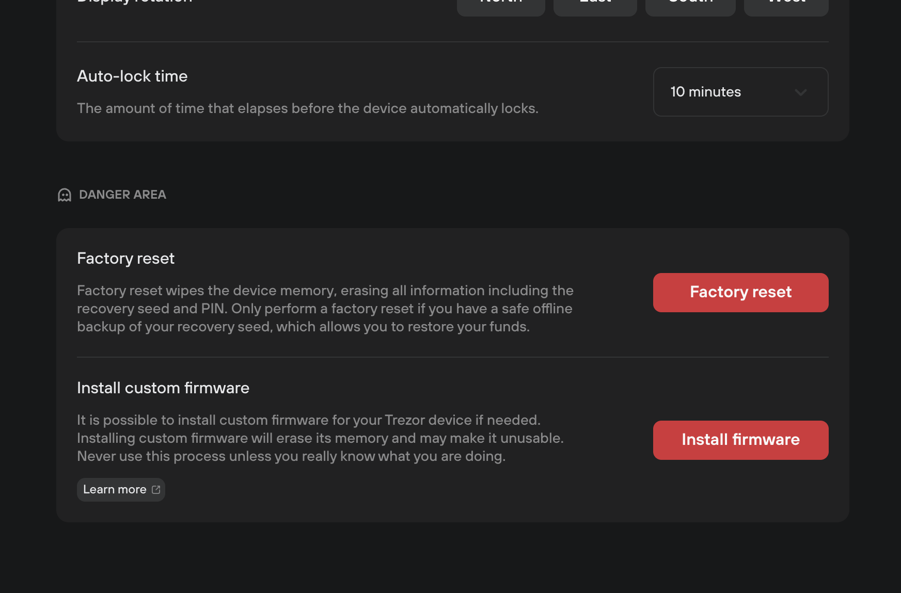
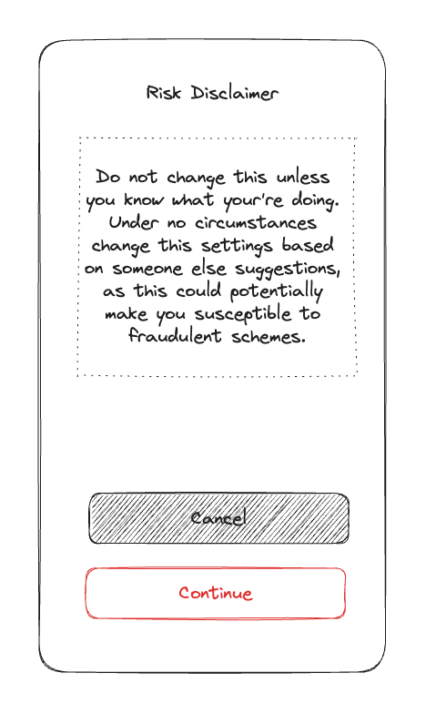
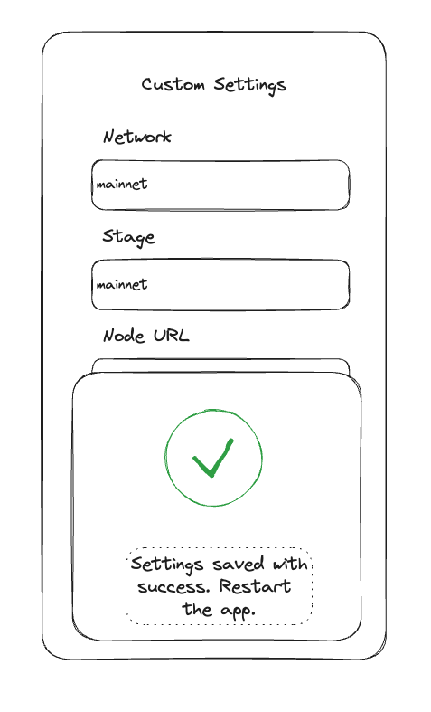

- Feature Name: Dev Settings
- Start Date: 2023-08-14
- RFC PR: (leave this empty)
- Hathor Issue: (leave this empty)
- Author: @alexruzenhack

#### Table of content
[table-of-content]: #table-of-content

- [Summary](#summary)
- [Motivation](#motivation)
- [Guide-level explanation](#guide-level-explanation)
- [Reference-level explanation](#reference-level-explanation)
- [Drawbacks](#drawbacks)
- [Rationale and alternatives](#rationale-and-alternatives)
- [Prior-art](#prior-art)
- [Unresolved questions](#unresolved-questions)
- [Future possibilities](#future-possibilities)
- [Task break-down](#task-break-down)

# Summary
[summary]: #summary

Extend the settings page to allow developers customize network settings and at the same time inform regular users about the danger it implies in order to keep them away from these settings.

# Motivation
[motivation]: #motivation

The ability to customize network settings already exists in our other wallets and it is used by developers to connect the wallet to testnets and privnets, which enables them to identify and resolve issues before deploying to production. Therefore, this is crutial for the development workflow.

# Guide-level explanation
[guide-level-explanation]: #guide-level-explanation

- [Usability heuristics](#usability-heuristics)
	- [Consistency and standards](#consistency-and-standards)
	- [Contextual Documentation](#contextual-documentation)
	- [Error prevention](#error-prevention)
- [Network Settings](#network-settings)
	- [Risk disclaimer](#risk-disclaimer)
	- [Pre settings](#pre-settings)
	- [Custom settings](#custom-settings)
	- [Flow with custom settings](#flow-custom-settings)
		- [1. Settings page](#1-settings-page)
		- [2. Risk disclaimer page](#2-risk-disclaimer-page)
		- [3. Pre settings page](#3-pre-settings-page)
		- [4. Custom settings page](#4-custom-settings-page)
		- [5. Success feedback](#5-success-feedback)
- [UI for a custom network settings](#ui-custom-network-settings)
	
The proposed solution is to have a "Danger Area" section in the settings page with a "Network Settings" action on it.

This is a simple solution that fits in the [consistency and standards heuristic](https://www.nngroup.com/articles/consistency-and-standards/) to make the wallet operation easier for developers and pro users. On the other hand, we need to balance this solution with [heuristics](https://www.nngroup.com/articles/how-to-conduct-a-heuristic-evaluation/) of [error prevention](https://www.nngroup.com/articles/slips/) and [contextual documentation](https://www.nngroup.com/articles/help-and-documentation/) about the risks involved in changing network settings.

## Usability heuristics
[usability-heuristics]: #usability-heuristics

### Consistency and standards
[consistency-and-standards]: #consistency-and-standards

The Trezor wallet uses a "Danger Aread" section to make a visual segregation between regular and dangerous settings actions. It also uses buttons in the red color to reinforce the dangerousness meaning in the action.



SafePal also groups settings by theme, however it doesn't have section titles, which hurts the [memory recognition and recall heuristic](https://www.nngroup.com/articles/recognition-and-recall/).


### Contextual Documentation
[contextual-documentation]: #contextual-documentation

Using the Trezor as a role model again we can see that every setting topic contains a description informing the "why" of the setting, and may contain a risk disclaimer.

![[trezor-option-description.png]]

### Error prevention
[error-prevention]: #error-prevention

Beyond the descriptions, some settings options need an extra layer of protection because of its severity, and that justifies an alert message or a confirmation.

![[trezor-option-warning.png]]

## Network Settings
[network-settings]: #network-settings

When the "Network Settings" action is clicked in the "Settings" page we can open a flow process of two steps, but add a disclaimer page if the settings was not already changed.
1. Risk disclaimer - Presents a page containing a text with the risks associated in changing the network settings.
2. Pre settings - Presents a preconfigured network option like the "testnet" which the user can click over the option and the wallet applies the configuration, returning the user to "Settings" page; and a button "Edit settings".
3. Custom settings - Presents a form containing the network settings which the user can edit as it please.

### Risk disclaimer
[risk-disclaimer]: #risk-disclaimer

This page should have a disclaimer text and two buttons: "Continue" and "Cancel"; with focus in the "Cancel" for error prevention.

Disclaimer text:
> Do not change this unless you know what your're doing. Under no circumstances change this settings based on someone else suggestions, as this could potentially make you susceptible to fraudulent schemes.

### Pre settings
[pre-settings]: #pre-settings

The SafePal wallet presents a list of network settings in the flow of "Add Network". We can use a similar solution and to make the configuration easier we can present at least the "testnet" pre-settings option and a button to "Customize" the current network settings.

If the user clicks in the "Testnet" pre-settings option, the wallet applies the settings and presents the feedback.

We can also offer the "mainnet" network pre-settings as a quick way for reset the network settings.


SafePal network pre-settings.

### Custom settings
[custom-settings]: #custom-settings

SafePal has the following form to add a custom network, and it comes with an alert that the wallet doesn't verify the custom network and it is a risk for the user. We should use the same solution here to add contextual documentation of the risk involved. In this form we also have a button "Save", it give us the opportunity to collect a confirmation from the user when the button is activated.

The alert text should be:
> Any change to the network settings can not be validated by Hathor. Only change if you know what you are doing.


SafePal add custom network form.

### Flow with custom settings
[flow-custom-settings]: #flow-custom-settings

#### 1. Settings page
[1-settings-page]: #1-settings-page

The starting point for the dangerous flows, in this case for the "Network Settings" flow.


#### 2. Risk disclaimer page
[2-risk-disclaimer-page]: #2-risk-disclaimer-page

The "Network Settings" action navigates the user to the "Risk Disclaimer" page when the current network settings remains with default value. This page should not appear again while the network settings is altered.



#### 3. Pre settings page
[3-pre-settings-page]: #3-pre-settings-page

The "Continue" action navigates the user to the "Pre Settings" page where the user is presented to at least the "Testnet" pre-settings, but also to the "Customize" action.

If the user select the "Testnet" pre-settings the wallet should apply it and return a feedback. See the section 5 for the "Success feedback" description.


#### 4. Custom settings page
[4-custom-settings-page]: #4-custom-settings-page

At this page the user can change the network settings and then trigger the "Save" action. The "Save" action make the wallet applies te configuration and return a feedback. See the next section "Success feedback" for more details.


#### 5. Success feedback
[5-success-feedback]: #5-success-feedback

[sucess-feedback]: #sucess-feedback

A feedback is given after trigger the "Save" action. The success feedback dismiss action redirects the user to the "Settings" page.



## UI for a custom network settings
[ui-custom-network-settings]: #ui-custom-network-settings

We should use an alert color as the primary color of the app as a simple visual signaling that the network settings is not the default one.


# Reference-level explanation
[reference-level-explanation]: #reference-level-explanation

- [State](#state)
	- [Pre-defined network settings](#pre-defined-network-settings)
		- [testnet](#testnet)
		- [mainnet](#mainnet)
	- [Default network settings](#default-network-settings)
	- [Custom network settings](#custom-network-settings)
	- [Alert UI](#alert-ui)
	- [Wallet saga refactoring](#wallet-saga-refactoring)
	- [Public explorer component refactoring](#public-explorer-component-refactoring)

## State
[state]: #state

### Pre-defined network settings
[pre-defined-network-settings]: #pre-defined-network-settings

As the purpose here is to serve hard options that can't be changed, added or deleted, we can use constants.
#### testnet
[testnet]: #testnet

Declare the constant `PRE_SETTINGS_TESTNET`:

```ts
const PRE_SETTINGS_TESTNET = {
	stage = STAGE_TESTNET,
	network = NETWORK_TESTNET,
	walletServiceUrl = WALLET_SERVICE_TESTNET_BASE_URL,
	walletServiceWsUrl = WALLET_SERVICE_TESTNET_BASE_WS_URL,
	nodeUrl = NODE_SERVER_TESTNET_URL,
	explorerUrl = EXPLORER_SERVER_TESTNET_URL,
};
```

Also register the following constants:
```ts
const STAGE_TESTNET = 'testnet';
const NETWORK_TESTNET = 'testnet';
const WALLET_SERVICE_TESTNET_BASE_URL = 'https://dev.wallet-service.testnet.hathor.network/';
const WALLET_SERVICE_TESTNET_BASE_WS_URL = 'wss://ws.dev.wallet-service.testnet.hathor.network/';
const NODE_SERVER_TESTNET_URL = 'https://node1.testnet.hathor.network/v1a/';
const EXPLORER_SERVER_TESTNET_URL = 'https://explorer.testnet.hathor.network/';
```

#### mainnet
[mainnet]: #mainnet

Declare the constant `PRE_SETTINGS_MAINNET`:

```ts
const PRE_SETTINGS_MAINNET = {
	stage = STAGE,
	network = NETWORK,
	walletServiceUrl = WALLET_SERVICE_MAINNET_BASE_URL,
	walletServiceWsUrl = WALLET_SERVICE_MAINNET_BASE_WS_URL,
	nodeUrl = NODE_SERVER_MAINNET_URL,
	explorerUrl = EXPLORER_MAINNET_URL,
};
```

Also register the following constants:
```ts
const NODE_SERVER_MAINNET_URL = 'https://mobile.wallet.hathor.network/v1a/';
const EXPLORER_MAINNET_URL = 'https://explorer.hathor.network/';
```

### Default network settings
[default-network-settings]: #default-network-settings

We should create the `networkSettings` in the `initialState` on `reducer.js` and assign the `PRE_SETTINGS_MAINNET` to it:

```ts
const initialState = {
	...
	networkSettings = PRE_SETTINGS_MAINNET,
};
```

### Custom network settings
[custom-network-settings]: #custom-network-settings

We need a mechanism to persist and update the `networkSettings` in app storage, thefore we should have it's own saga `networkSettings.js`.

```ts
export function* saga() {
  yield all([
    takeEvery(types.NETWORK_SETTINGS_UPDATE_REQUESTED, updateNetworkSettings),
    takeEvery(types.NETWORK_SETTINGS_UPDATE_SUCCESS, persistNetworkSettings),
    takeEvery(types.RESET_WALLET, cleanNetworkSettings),
  ]);
}
```

* `updateNetworkSettings` - should process the update request and emit either `NETWORK_SETTINGS_UPDATE_SUCCESS` or `NETWORK_SETTINGS_UPDATE_FAILURE`.
* `persistNetworkSettings` - should persist in the app storage the network settings, this way the wallet can retrieve its values in the initialization phase.
* `cleanNetworkSettings` - should delete the network settings from the storage, this way letting the wallet use the default value.

All the action types that need to be created:
* `NETWORK_SETTINGS_UPDATE_REQUESTED` - used in the saga.
* `NETWORK_SETTINGS_UPDATE_SUCCESS` - used in the saga, the reducer and the view to provide a feedback to the user.
* `NETWORK_SETTINGS_UPDATE_FAILURE` - used in the view to provide a feedback to the user.

### Alert UI
[alert-ui]: #alert-ui

The project already have a `PRIMARY_COLOR` constant that is used accros the project. We should make this retrieval of the primary color dynamic, to deliver the right color, either default or alert accordingly to the network settings state.

I propose a new property `primaryColor` in the `initialState`:
```ts
const initialState = {
	...,
	primaryColor = PRIMARY_COLOR,
},
```

We should create the constant `ALERT_COLOR` and assign it to the `primaryColor` property whenever the action `NETWORK_SETTINGS_UPDATE_SUCCESS` happens and the network settings is not the default.

We need to create:
* The `ALERT_COLOR` constant with the value `#ffd43b`, and
* The reducer `onNetworkSettingsUpdateSuccess` to process the payload and assign the `primaryColor` if needed.

We also need to refactor the code for every usage of `PRIMARY_COLOR` across the project, which happens in all these files:

```txt
./QA.md
./android/app/build/generated/sourcemaps/react/release/index.android.bundle.map
./android/app/build/generated/assets/react/release/index.android.bundle
./src/constants.js
./src/config.js
./src/screens/MainScreen.js
./src/screens/UnregisterToken.js
./src/screens/BackupWords.js
./src/screens/InitWallet.js
./src/screens/Settings.js
./src/screens/ResetWallet.js
./src/styles/init.js
./src/components/SimpleButton.js
./src/components/CopyClipboard.js
./src/components/WalletConnect/ModalButton.js
./src/components/TokenSelect.js
./src/utils.js
./src/App.js
```

### Wallet saga refactoring
[wallet-saga-refactoring]: #wallet-saga-refactoring

In the saga action `startWallet` the initialization logic uses network constants to set-up the wallet. Here we need to replace these constants with the persisted `networkSettings` value.

We need to retrieve the `networkSettings` value from the `STORE`:
```ts
const networkSettings = STORE.getItem(dangerAreaKey.networkSettings);
```

We need create the `dangerAreaKey` constant and a key value for `networkSettings`:
```ts
export const dangerAreaKey = {
  networkSettings: 'dangerArea:networkSettings',
```

As the `startWallet` happens only once, in the wallet initialization, it implies that the user need to kill the app and open it again to see the new network settings applied.

### Public explorer component refactoring
[public-explorer-component-refactoring]: #public-explorer-component-refactoring

This component should retrive the `explorerUrl` from the `networkSettings` property in the app state.

This:
```ts
const explorerLink = `https://explorer.hathor.network/transaction/${txId}`;
```

Should become this:
```ts
const explorerUrl = useSelector((state) => state.networkSettings.explorerUrl);
const explorerLink = `${explorerUrl}transaction/${txId}`;
```

# Drawbacks
[drawbacks]: #drawbacks

By making it available for all users we are adding the risk of possible scams to occur. Despite all the mitigations like the "Risk disclaimer" page and the warning notice in the "Custom settings" page, we can't avoid it of happen. If the scams becoming a problem we may need to restrict the access to the "Danger Area" in the "Settigs" page possibly using the Unleash feature activation.

# Rationale and alternatives
[rationale-and-alternatives]: #rationale-and-alternatives

We could conceal the dev settings and make it appear only with a special procedure like tap 3 times in the Hathor title in the about page. However, this approaches creates unecessary difficulties when we want more engagemente from the dev comunity.

# Prior art
[prior-art]: #prior-art

We have the settings page in the desktop wallet which enables changing the server, and one can also change the settings in the headless wallet.


Settings page in the wallet desktop.

# Unresolved questions
[unresolved-questions]: #unresolved-questions

No questions.

# Future possibilities
[future-possibilities]: #future-possibilities

We can extend the "Danger Area" with more settings, for example, we can let developers enable and disable the wallet service. Also, we can let developers add network pre-settings beyond "testnet" and "mainnet".

# Task break-down
[test-break-down]: #test-break-down

| Task                                                                        | Dev/days |
| --------------------------------------------------------------------------- | -------- |
| Add the pre-defined network settings                                        | 0.1      |
| Add default network settings                                                | 0.1      |
| Implement the networkSettings saga                                          | 0.5      |
| Implement the Alert UI                                                      | 0.2      |
| Refactor the wallet saga                                                    | 1        |
| Refactor the public explorer component                                      | 0.1      |
| Refactor the Settings page to contain the "Safe Area" and the "Danger Area" | 0.5      |
| Implement the "Risk disclaimer" page                                        | 0.2      |
| Implement the "Pre settings" page                                           | 0.5      |
| Implement the "Custom settings" page                                        | 0.5      |

