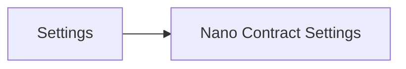
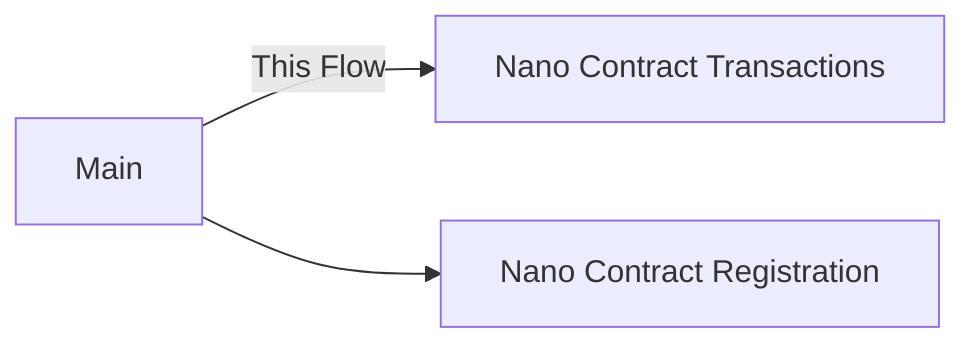
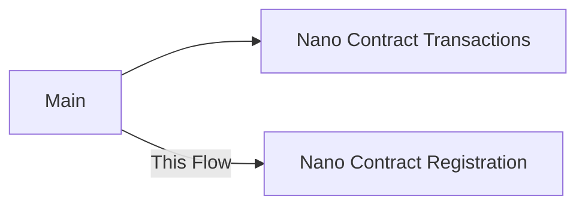
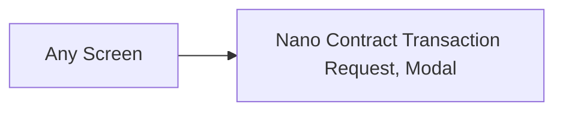

- Feature Name: nano-contract-integration
- Start Date:
- RFC PR:
- Hathor Issue:
- Author: Alex Ruzenhack alex@hathor.network

# Summary
[summary]: #summary

This design aims to provides for users the ability to read Nano Contract transactions, its state, and the related blueprint details. In addition, this design also provides for users the ability to sign Nano Contract transactions using a dapp with Wallet Connect integration.

# Motivation
[motivation]: #motivation

The user gains the ability to consult and interact with Nano Contract in a portable way, using the wallet-mobile, but also gains the ability to extend its usage by connecting to dapps using Wallet Connect.

# Guide-level explanation
[guide-level-explanation]: #guide-level-explanation

## Unleash
[unleash]: #unleash

First, we should enable the user's device in the `nano-contract.rollout` feature flag on Unleash. For this feature flag we use the default variant with 3 strategies:
1. UserIds: this first strategy is dedicated for internal testers
2. UserIds: this second strategy is dedicated for external testers
3. Gradual rollout: this third strategy is dedicated to the public

Each strategy [must](https://www.rfc-editor.org/rfc/rfc2119) support the following values:
- `platform`: `ios`, `android`
- `network`: `mainnet`, `testnet`, `privatenet`
- `stage`: `mainnet`, `testnet`

Second, we should enable the user's device in the `wallet-connect-mobile.rollout` feature flag on Unleash.

## Opt-in

### Screen: Settings
[screen-settings]: #screen-settings

The "Settings" screen is divided into two sections: "General Settings" and "Dev Settings." Within "General Settings", the *Nano Contract* option is included.

This option is visible only when the device is registered with Unleash. For registration and feature flag activation, see [Unleash](#unleash).

Selecting the *Nano Contract* option initiates navigation to the *Nano Contract Settings* screen. This action allows users to modify their nano-contract preferences.

##### Design Bill
- *Nano Contract* option:
	- **Placement**: Insert this option in the "General Settings" section, positioned before "Reset wallet" item.
	
	- **Functionality**: The option responds to touch input. A tap triggers a transition to the *Nano Contract Settings* screen.
	
	- **Visibility Conditions**: Display this option based on the device's registration status with Unleash.

### Screen: Nano Contract Settings
[screen-nano-contract-settings]: #screen-nano-contract-settings

The *Nano Contract Settings* screen features a "Nano Contract" toggle button. Users can tap this button to activate the nano-contract feature.

Upon activation, the wallet initiates a restart process, during which Nano Contract transactions for the current wallet are loaded. Users are visually informed of this process through a progress indicator and are returned to the *Nano Contract Settings* screen upon completion.

>[!NOTE]
In addition to enabling the *Nano Contract* feature, basic usage data such as feature activation frequency and duration of use may be collected for monitoring purposes. For more details on data collection and push notification support, see [Basic Data Gathering and Push Notification Support](#basic-data-gathering-push-notification-support).

##### Design Bill
- **Placement**:
	- Position the toggle button on top of *Nano Contract Settings* screen.

- **Functionality**:
	- The toggle button enables or disables the nano-contract feature.
	- When toggled on or off, initiate a wallet restart and load Nano Contract transactions.
	- Provide a visual progress indicator during the loading process.

- **Visibility Conditions**:
	- The toggle button is always visible on the *Nano Contract Settings* screen.
	- However, its functionality is active only when the user’s wallet is eligible for nano contracts.
	- In case of success, display a success message.

- **Error Management**:
	- In case of failure, display an error feedback.

## Reading Nano Contract Transactions

### Screen: Main
[screen-main]: #screen-main

After a user ops-in the *Nano Contract* feature and the wallet loading completes, the Main screen displays the **Token List** component. Additionally, a user can choose to view the **Nano Contract List** component through a clearly marked option.

>[!NOTE]
>The title for the *Token List* is "Tokens". For the *Nano Contract List*, to efficiently use screen space, the title can be either "Nano Contracts" or "Nanos".

Each list component offers a registration option:
- "Register Token"
- "Register Nano Contract"

Selecting "Register Nano Contract" option navigates the user to the **Nano Contract Registration** screen.

##### Design Bill
- **Placement**:
	- Position the option to display the *Nano Contract List* in a prominent area of the Main screen for easy accessibility.
	- Place the action buttons "Register Token" and "Register Nano Contract" at the same context of their respective lists for clear visibility and access.
  
- **Functionality**:
	- The *Nano Contract List* display option should reveal all registered nano contracts in the wallet when selected.
	- The "Register Token" button navigates the user to the Token Registration screen.
	- The "Register Nano Contract" button navigates the user to the **Nano Contract Registration** screen for adding a new Nano Contract.
  
- **Visibility Conditions**:
	- The *Nano Contract List* display option should only be visible and active for users who have opted into the nano-contract feature.
	- The "Register Nano Contract" button should be visible only when the *Nano Contract List* is being displayed.
  
- **Error Management**:
  - Ensure that error messages are clear and provide guidance on how to resolve the issue or contact support.

### Component: Nano Contract List
[component-nano-contract-list]: #component-nano-contract-list

This component displays a list of registered *Nano Contracts* on the *Main* screen, allowing users to select and interact with each contract. Each list item is designed to be actionable and includes two key pieces of information: the *Nano Contract ID* and the *Blueprint Name*.

Tapping on a list item navigates the user to the **Nano Contract Transactions** screen.

##### Design Bill
- **Placement**:
	- The *Nano Contract List* should be prominently displayed within the upper section of the *Main* screen for easy access.

- **Functionality**:
	- Implement an infinite scrolling view to display a potentially large number of nano contracts.
	- Make each list item actionable, leading to the **Nano Contract Transactions** screen upon selection.
	- Each item list item must contain *Nano Contract ID* and *Blueprint Name* information.

- **Visibility Conditions**:
	- The list should only display *Nano Contracts* that the user has registered.
	- The *Nano Contract ID* can be shortened to fit in the screen
  
>[!NOTE]
>To accommodate the *Nano Contract ID* on mobile screens, it is presented in a shortened format, displaying the first 7 and last 7 characters, e.g., `000001e...3c9641d`. The full ID can be viewed on tap or hover.

### Screen: Nano Contract Transactions
[screen-nano-contract-transactions]: #screen-nano-contract-transactions

This screen is dedicated to displaying a list of *Nano Contract Transaction* items associated with a selected *Nano Contract*. After a user selects a *Nano Contract* from the *Nano Contract List* component, they are directed to this screen, where all transactions involving the chosen contract are listed.

The header section of this screen provides essential state information about the selected *Nano Contract*, including the full *Nano Contract ID*, *Blueprint Name*, and a breakdown of each *Token Balance*. This header is designed to be both expandable and collapsible: in its expanded form, it reveals all state details, while in its collapsed form, it displays only the *Nano Contract ID* for a more streamlined view.

The list is encapsulated by the *Nano Contract Transaction List* component.

##### Design Bill
- **Placement**:
	- Position the header with state information at the top of the screen.
	- Place the *Nano Contract Transaction List* component below the header.

- **Functionality**:
	- The header should display the full *Nano Contract ID*, *Blueprint Name*, and *Token Balances*.

- **Visibility Conditions**:
	- Include a toggle in the header for expanding and collapsing to show/hide detailed state information.

### Component: Nano Contract Transaction List
[component-nano-contract-transaction-list]: #component-nano-contract-transaction-list

This component displays a list of *Nano Contract Transaction* items. Each item represents a transaction as either an input (sent), an output (received), or a method execution (called). The list is designed to provide essential transaction information in a clear and concise manner.

Tapping on an item opens the *Nano Contract Transaction Details* component, providing further information on the selected transaction item.

##### Design Bill
- **Placement**:
	- The *Nano Contract Transaction List* should be displayed within the body section of the *Nano Contract Transactions* screen.

- **Functionality**:
	- Each item in the list is actionable, leading to detailed transaction information upon selection.
	- Implement an infinite scrolling view to display a potentially large number of transactions.
	- Each transaction item must contain *Description*, *Token Amount*, *Token Symbol*, *Blueprint Method Name* and *Date and Time* information for the item list view.

- **Visibility Conditions**:
	- Differentiate item types *sent*, *received*, and *called* using distinct visual indicators.
	- A *called* item type must not contain *Token Amount* and *Token Symbol* information. 

>[!NOTE]
>Example of item description per type:
>- "You *received* `<Token Symbol>` from `<Blueprint Method Name>`"
>- "You *sent* `<Token Symbol>` to `<Blueprint Method Name>`"
>- "You *called* `<Blueprint Method Name>`"

### Component: Nano Contract Transaction Details

This component provides detailed information for each transaction item type: *sent*, *received*, and *called*.

For *sent* and *received* transaction items, the header displays *Token Amount* and *Token Symbol*, with an optional label *Amount* underneath them.

The body section includes:
- *Token ID*
- *Description*
- *Blueprint Method Name*
- *Date and Time*
- *Transaction ID*
- *Public Explorer*

Taping on *Public Explorer* manigates the user to the transaction page in the explorer website.

##### Design Bill
- **Placement**:
	- Position the header at the top of the component with clear visual separation from the body.
	- The body should follow immediately after the header, occupying the main portion of the component.

- **Functionality**:
	- The *Public Explorer* action must be visually distinct and recognizable as an actionable item.
	- It should be easy for the user to dismiss the details component and focus back in the list view.

- **Visibility Conditions**:
	- Display header information of *Token Amount* and *Token Symbol* only for *sent* and *received* transaction items.
	- For *called* transaction items, only the body section should be visible.
	- Differentiate item *Public Explorer* using distinct visual indicators.
  
## Registering Nano Contract

### Screen: Nano Contract Registration

Users arrive at this screen from the *Main* screen to register a new Nano Contract. The screen features a form with an input field for *Nano Contract ID* and a *Register* button.

Upon entering a valid *Nano Contract ID* and tapping *Register*, users receive immediate feedback based on the action's outcome: loading, success, or failure.

Upon successful registration, users are redirected to the *Main* screen  the with *Nano Contract List* active.

##### Design Bill
- **Placement**:
	- Place the form input on the top of the screen.
	- Place the action button on the bottom of the screen.

- **Functionality**:
	- Upon tapping *Register*, initiate the registration process with appropriate loading feedback.

- **Visibility Conditions**:
	- The *Register* button remains inactive until a valid Nano Contract ID is entered into the input field.
	- In case of processing success, display a success feedback and navigate back to the *Main* screen with the *Nano Contract List* active.

- **Error Management**:
	- In case of validation error, display an error message near the input field *Nano Contract ID*.
	- In case of processing failure, display an error feedback.

## Wallet Connect Interaction

The Wallet Connect has a different *modus operandi*, it requires the user to interact with the dapp by modals.

We may want to make the Wallet Connect requests from dapps assynchronous with push notification, for this read the alternative [Push notification for wallet connect requests](#push-notification-wallet-connect-requests).

### Modal: Nano Contract Transaction Request

This modal presents detailed information for a *Nano Contract Transaction Request* from dapp, allowing the user to approve or reject the transaction. It activates when a dapp makes a `htr_createNcTx` request to the wallet's RPC.

The modal presents detailed information containing *Blueprint ID*, *Blueprint Method*, *Caller*, *Nano Contract ID* (if applicable), *Action List*, and *Argument List*. An *Action List* can be either types *deposit* or *withdrawal*. Both the lists can be empty.

##### Design Bill
- **Placement**:
	- The modal must render centrally on top of the current screen, ensuring clear visibility and focus.
	
- **Functionality**:
	- Include detailed transaction information for user review:
		- *Blueprint ID*, *Blueprint Method*, *Caller*, *Nano Contract ID* (if applicable), *Action List*, and *Argument List*.
	- Include detailed information for each *Action List* item:
		- *Type*, *Token* and *Data*.
	- Include detailed information for *Data*:
		- *Amount*, *Address*
	- Include detailed information for each *Argument List* item:
		- *Type* and *Value*
	- Provide clear options for user approval or rejection of the transaction.
	- Upon tapping *Approve*, initiate the processing with appropriate loading feedback.

- **Visibility Conditions**:
	- Ensure the modal is visible whenever a *Nano Contract Transaction Request* is made.
	- Make sure to always display *Action List* and *Argument List* when they are empty.
	- In case of processing success, display a success feedback.
	- Must not display the *Nano Contract ID* when the *Blueprint Method* value is `initialize`.
	- Differentiate item *Action List* item types *deposit* and *withdrawal* using distict visual indicators.

- **Error Management**:
	- In case of processing error, display an error feedback.

>[!NOTE]
>The *Caller* represents the wallet address calling the Blueprint method.

>[!TIP]
>Use the following value examples:
>- *Blueprint ID*
>	- eg: `494d0ac59a6918b771b122395206fef3f349f84f20dc430188a319d4ead24a3b`
>- *Blueprint Method*
>	- eg: `initiale`, `swap`, `bet`
>- *Caller*
>	- eg: `WRqBSi5jc74P8tRo7CmgiGByA1eTzfMh7B`
>- *Nano Contract ID*
>	- eg: `000001e43dda7348c53c6252d98799c9e2a0b4ea3b5f10b1182578d643c9641d`
>- *Action List* item:
>	- *Type*
>		- eg: `deposit`, `withdrawal`
>	- *Token*
>		- eg: `000001a176aa72b84f3486b3fcea327b023a70d1b6461c1b6a9073785b5775d8`
>	- *Data*
>		- *Amount*
>			- eg: `1.23`
>		- *Address*
>			- eg: `WZhKusv57pvzotZrf4s7yt7P7PXEqyFTHk`
>- *Argument List* item:
>	- *Type*
>		- eg: `byte`, `int`, `string`, `boolean`
>	- *Value*
>		- eg: `000002d068a46c1c0a6ae84ca3b3c1984d517c8a3783c2ceb024cd5355595851` for byte

# Reference-level explanation
[reference-level-explanation]: #reference-level-explanation

TBD.

# Rationale and alternatives
[rationale-and-alternatives]: #rationale-and-alternatives

## Basic data gathering and push notification suport
[basic-data-gathering-push-notification-support]: #basic-data-gathering-push-notification-support

By enabling the Nano Contract we can also register the wallet in the wallet-service, if it is available. Registering this option in the wallet-service database will give us visibility over the wallets that are currently using the feature. In addition, it will be useful to support push notification on nano-contract transactions.

## Push notification for wallet connect requests
[push-notification-wallet-connect-requests]: #push-notification-wallet-connect-requests

A request from Wallet Connect dapp triggers a modal to show up over any screen no matter what. Sometimes this behavior is not possible, for instance when wallet is locked, other times this behavior is not convenient because it interrupts the user, or the wallet is not execution at all. The push notification detaches the Wallet Connect request from the immediate interaction and frees the user to choose when to interact with the dapp, in addition it allows the user to know when a dapp has an update even when the app is quit.

# Prior art
[prior-art]: #prior-art

- [Web Wallet: RPC Protocol](https://github.com/HathorNetwork/rfcs/blob/88431566bca2658ee851a47a0d116251c9845b94/projects/web-wallet/rpc-protocol.md) | [PR #54](https://github.com/HathorNetwork/rfcs/pull/54)
- [Wallet Connect Security Issue #2230](https://github.com/orgs/WalletConnect/discussions/2230)
- [Wallet Connect on Wallet Mobile implementation, PR #245](https://github.com/HathorNetwork/hathor-wallet-mobile/pull/245)
- [Wallet Connect fix over Hermes compatibility, PR #355](https://github.com/HathorNetwork/hathor-wallet-mobile/pull/355)
