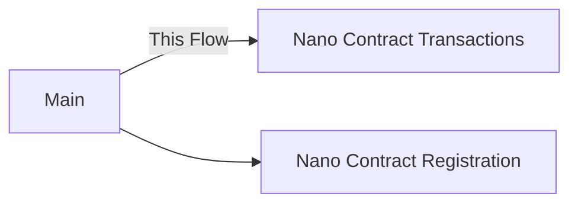
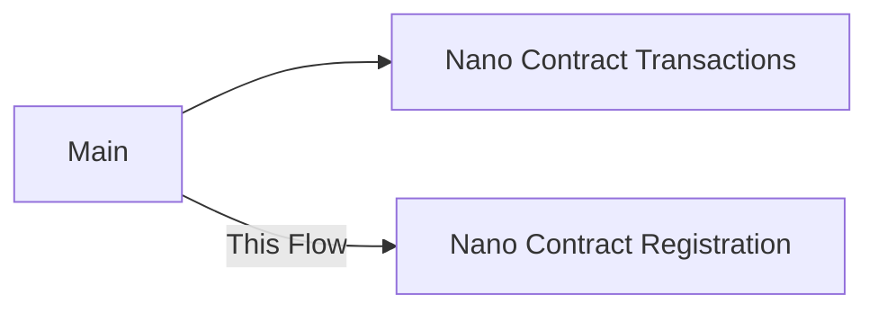
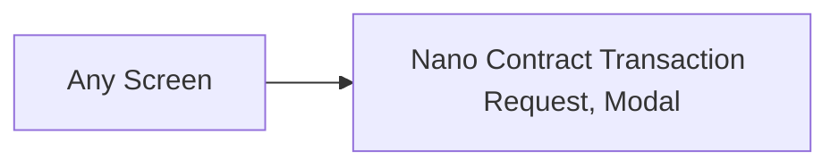

- Feature Name: nano-contract-integration
- Start Date: 2023-12-13
- RFC PR: https://github.com/HathorNetwork/rfcs/pull/72
- Hathor Issue:
- Author: Alex Ruzenhack alex@hathor.network

# Summary
[summary]: #summary

This design aims to provides for users the ability to read Nano Contract transactions, its state, and the related blueprint details. In addition, this design also provides for users the ability to sign Nano Contract transactions using a dapp with Wallet Connect integration.

# Motivation
[motivation]: #motivation

The user gains the ability to consult and interact with Nano Contract in a portable way, using the wallet-mobile, but also gains the ability to extend its usage by connecting to dapps using Wallet Connect.

# Guide-level explanation
[guide-level-explanation]: #guide-level-explanation

## UI Design Guidance

In this document, you will find sections titled **Design Bill** that outline requirements for UI screens and components. These sections provide guidelines while allowing designers room for creativity. A key principle to guide your work is **Clear Sign.** This principle emphasizes that information presented to users should be crafted with clear and knowledgeable intent. For more details, please refer to the article ["Clear-Sign Your Worries Away."](https://www.ledger.com/blog/clear-sign-your-worries-away)

## Unleash
[unleash]: #unleash

First, we should enable the user's device in the `nano-contract.rollout` feature flag on Unleash. For this feature flag we use the default variant with 3 strategies:
1. UserIds: this first strategy is dedicated for internal testers
2. UserIds: this second strategy is dedicated for external testers
3. Gradual rollout: this third strategy is dedicated to the public

Each strategy [must](https://www.rfc-editor.org/rfc/rfc2119) support the following values:
- `platform`: `ios`, `android`
- `network`: `mainnet`, `testnet`, `privatenet`
- `stage`: `mainnet`, `testnet`

Second, we should enable the user's device in the `wallet-connect-mobile.rollout` feature flag on Unleash.

## Reading Nano Contract Transactions



### Screen: Main
[screen-main]: #screen-main

After a user be allowed to use the *Nano Contract* feature and the wallet loading completes, the Main screen displays the **Token List** component. Additionally, a user can choose to view the **Nano Contract List** component through a clearly marked option.

Each list component offers a registration option:
- "Register Token"
- "Register Nano Contract"

Selecting "Register Nano Contract" option navigates the user to the **[Nano Contract Registration](#screen-nano-contract-registration)** screen.

##### Design Bill
- **Placement**:
	- Position the option to display the *Nano Contract List* in a prominent area of the Main screen for easy accessibility.
	- Place the action buttons "Register Token" and "Register Nano Contract" at the same context of their respective lists for clear visibility and access.
  
- **Functionality**:
	- The *Nano Contract List* display option should reveal all registered nano contracts in the wallet when selected.
	- The "Register Token" button navigates the user to the Token Registration screen.
	- The "Register Nano Contract" button navigates the user to the **[Nano Contract Registration](#screen-nano-contract-registration)** screen for adding a new Nano Contract.
  
- **Visibility Conditions**:
	- The *Nano Contract List* display option should only be visible and active for users allowed to use the nano-contract feature.
	- The "Register Nano Contract" button should be visible only when the *Nano Contract List* is being displayed.

- **Error Management**:
	- An internal error can happen during the wallet loading process. In this
      situation a user has no other option than try again later.
    - [:pushpin: Suggestion] After 3 failing attempts the error feedback can ask the user to send the
      error to the team.

### Component: Token List
[component-token-list]: #component-token-list

This component displays a list of registered *Tokens* on the *Dashboard* screen, allowing users to select and interact with each token. By clicking on a token item the user is navigated to the *Token Transactions* component.

>[!NOTE]
>The actual implementation name for the "Token List" component is `TokenSelect`, which is found in the *Dashboard Screen*. It is more convenient to call "Token List" in this design because the component presents a list of tokens, which can be selected, but the selection is just a possible action, and doesn't convey the shape of component when rendered.

### Component: Token Transactions
[component-token-transactions]: #component-token-transactions

This component displays a list of transactions made on the selected token. By clicking on a transaction item, a modal of "Token Transaction Details" component open.

>[!NOTE]
>The actual implementation name for the "Token Transactions" component is `TxHistoryView`, which is found in the *Main Screen*. It is more convenient to call "Token Transactions" in this design because the component presents a list of transactions for the selected token.

##### Design Bill
- **Visibility Conditions**:
	- [Suggestion] Differentiate transaction items by type
      - Block
      - Merged Mined Block
      - Transaction
      - Create Token Transaction
      - Nano Contract Transaction

### Component: Token Transaction Details
[component-token-transactions]: #component-token-transactions

This component displays the transaction's details. It provides information for each transaction type: *regular*, *NFT*, and *Nano Contract*.

For transactions of type *regular* and *NFT* we keep the information already presented.

For *Nano Contract* transaction type, the header displays *Token Balance* and *Token Symbol*, with a label *Amount* underneath them.

The body section includes:
- *Token*: full token name
- *Description*: a text describing the operation, like "Sent HTR" or "Received HTR"
- *Date and Time*
- *ID*: transaction ID
- *Public Explorer*: action item that navigates the user to the explorer
- *Blueprint Method Name*
- *Nano Contract ID*
- *Nano Contract Caller*: the address used to sign the transaction
- *Nano Contract*: action item that navigates the user to the [Nano Contract Transactions](#screen-nano-contract-transactions) screen.

Tapping on *Public Explorer* navigates the user to the transaction page in the explorer website.

Tapping on *Nano Contract* navigates the user to the [Nano Contract Transactions](#screen-nano-contract-transactions) screen.

>[!NOTE]
>The actual implementation name for the "Token Transaction Details" component is `TxDetailsModal`, which is found in the *Main Screen*. It is more convenient to call "Token Transaction Details" in this design to keep naming consistency.

##### Design Bill
- **Placement**:
	- Position the header at the top of the component with clear visual separation from the body.
	- The body should follow immediately after the header, occupying the main portion of the component.

- **Functionality**:
	- The *Public Explorer* action must be visually distinct and recognizable as an actionable item.
	- The *Nano Contract* action must be visually distinct and recognizable as an actionable item.
	- It should be easy for the user to dismiss the details component and focus back in the list view.

- **Visibility Conditions**:
	- Display header information of *Token Amount* and *Token Symbol* for all transaction types.
    - Display body information of *Blueprint Method Name*, *Nano Contract ID* and *Nano Contract* only for *Nano Contract* transaction type.
	- Differentiate item *Public Explorer* using distinct visual indicators.
	- Differentiate item *Nano Contract* using distinct visual indicators.

### Component: Nano Contract List
[component-nano-contract-list]: #component-nano-contract-list

This component displays a list of registered *Nano Contracts* on the *Main* screen, allowing users to select and interact with each contract. Each list item is designed to be actionable and includes two key pieces of information: the *Nano Contract ID* and the *Blueprint Name*.

Tapping on a list item navigates a user to **Nano Contract Transactions** screen.

##### Design Bill
- **Placement**:
	- The *Nano Contract List* should be prominently displayed within the upper section of the *Main* screen for easy access.

- **Functionality**:
	- Implement an infinite scrolling view to displaa potentially large number of nano contracts.
	- Make each list item actionable, leading to the **[Nano Contract Transactions](#screen-nano-contract-transactions)** screen upon selection.
	- Each list item must contain *Nano Contract ID* and *Blueprint Name* information.

- **Visibility Conditions**:
	- The list should only display *Nano Contracts* registered.
	- The *Nano Contract ID* can be shortened to fit in the screen
  
>[!NOTE]
>To accommodate the *Nano Contract ID* on mobile screens, it is presented in a shortened format, displaying the first 7 and last 7 characters, e.g., `000001e...3c9641d`. The full ID can be viewed on tap or hover.

### Screen: Nano Contract Transactions
[screen-nano-contract-transactions]: #screen-nano-contract-transactions

This screen is dedicated to displaying a list of transactions associated with the selected *Nano Contract*. After a user selects a *Nano Contract* from the *[Nano Contract List](#component-nano-contract-list)* component, it is directed to this screen. From this screen a user can also inspect Nano Contract's **state** and **unregister** it.

The header section of this screen provides basic information about the selected *Nano Contract* such as *Nano Contract ID*, *Blueprint Name* and *Registered Address*. In addition, the header also shows an action to **unregister** the Nano Contract and an action to see Nano Contract' **state** on explorer website.

The body is encompassed by the *[Nano Contract Transaction List](#component-nano-contract-transaction-list)* component.

Tapping on the **state action** navigates a user to Nano Contract's page on explorer website.

Tapping on the **unregister action** navigates a user back to *[Nano Contract List](#component-nano-contract-list)* component.

##### Design Bill
- **Placement**:
	- Position the header with basic information at the top of the screen.
    - Position the **state action** in the header.
    - Position the **unregister action** in the header.
	- Place the *[Nano Contract Transaction List](#component-nano-contract-transaction-list)* component below the header.

- **Functionality**:
    - The **state action** must navigate a user to the Nano Contract's page on explorer website.
    - The **unregister action** must navigate a user back to the [Nano Contract List](#component-nano-contract-list) component.

- **Visibility Conditions**:
	- [Suggestion] Use an expandable/collapsable section in the header to present unregister and state actions.
	- The header must display the full *Nano Contract ID*, *Blueprint Name* and *Registered Address*, and they must be always visible.

### Component: Nano Contract Transaction List
[component-nano-contract-transaction-list]: #component-nano-contract-transaction-list

This component displays a list of *Nano Contract Transaction* items. Each item represents a Nano Contract call. Basic informations of the call are presented for each item.

Tapping on an item navigates a user to **[Nano Contract Transaction](#screen-nano-contract-transaction)** screen.

##### Design Bill
- **Placement**:
	- The *Nano Contract Transaction List* should be displayed within the body section of the *[Nano Contract Transactions](#screen-nano-contract-transactions)* screen.

- **Functionality**:
	- Each item in the list is actionable and must navigates a user to [Nano Contract Transaction](#screen-nano-contract-transaction) screen.
	- Implement an infinite scrolling view to display a potentially large number of transactions.
	- Each transaction item must contain basic information such as *Transaction ID*, *Blueprint Method Name*, *Date and Time*, and a *Caller Flag*.
	- A *Caller Flag* can be either a: *Mine Address Caller Flag*, *Registered Address Caller Flag* or *Nano Contract's Oracle Caller Flag*.

- **Visibility Conditions**:
	- Differentiate an item with value `initialize` for *Blueprint Method Name*.
	- Add visual sign for a *Caller Flag*.

### Screen: Nano Contract Transaction
[screen-nano-contract-transaction]: #screen-nano-contract-transaction

This screen is dedicated to displaying a list of token balance. After a user selects a transaction item from the *[Nano Contract Transaction List](#component-nano-contract-transaction-list)* component, it is redirected to this screen. From this screen a user can also inspect the **transaction details**.

The header section of this screen provides basic information about the select transaction such as *Transaction ID*, *Blueprint Method Name*, *Date and Time* and *Caller Address*. In addition, the header also shows an action to see **transaction details** in the explorer website.

The body is encompassed by the *[Nano Contract Transaction Balance List](#component-nano-contract-transaction-balance-list)* component.

Tapping on the **transaction details action** navigates a user to Nano Contract Transaction's page on explorer website.

##### Design Bill
- **Placement**:
	- Position the header with basic information at the top of the screen.
    - Position the **transaction details action** in the header.
	- Place the *[Nano Contract Transaction Balance List](#component-nano-contract-transaction-balance-list)* component below the header.

- **Functionality**:
    - The **transaction details action** must navigate a user to the Nano Contract Transaction's page on explorer website.

- **Visibility Conditions**:
	- [Suggestion] Use an expandable/collapsable section in the header to present the **transaction details actions**.
	- The header must display the full *Transaction ID*, *Blueprint Method Name*, *Date and Time* and *Caller Address*, and they must be always visible.

### Component: Nano Contract Transaction Balance List
[component-nano-contract-transaction-balance-list]: #component-nano-contract-transaction-balance-list

This component displays a list of token balance items. Each item represents a token balance, either a positive token balance (sent) or a negative token balance (received). Therefore there are two types of items: *sent* and *received*. Basic information of the call are presented for each item.

##### Design Bill
- **Placement**:
	- The *Nano Contract Transaction Balance List* should be displayed within the body section of the *[Nano Contract Transaction](#screen-nano-contract-transaction)* screen.

- **Functionality**:
	- Each item in the list is read only, not actionable.
	- Implement an infinite scrolling view to display all the token balances.
	- Each token balance item must contain basic information such as *Token Symbol*, *Token Amount* and *Balance Type Flag*.
	- A *Balance Type Flag* can be either: *sent* or *received*; representing the balance type.

- **Visibility Conditions**:
	- Add visual sign for a *Balance Type Flag*.

## Registering Nano Contract



### Screen: Nano Contract Registration
[screen-nano-contract-registration]: #screen-nano-contract-registration

A Nano Contract must be registered refering to an specific user's wallet address. One user may register the same Nano Contract using different wallet addresses. By registering a Nano Contract, all of its transactions are donwloaded, including the ones not belonging to user's wallet. By registering a Nano Contract we can mount a map of its transactions and do the proper processing as painting the transactions belonging to user's wallet and registration's address, among other things like calculate the balance per token per transaction.

Users arrive at this screen from the *Main* screen to register a new Nano Contract associated with a wallet's address. The screen features a form with an input field for *Nano Contract ID* and another input field for *Wallet's Address* and a *Register* button.

Tapping over *Wallet's Address* field the [*Wallet's Address List*](#modal-wallets-address-list) modal opens, containing a list of wallet's address with index and hash information, sorted by index in ascending order.

Upon entering a valid *Nano Contract ID*, selecting an available *Wallet's Address* and tapping *Register*, users receive immediate feedback based on the action's outcome: loading, success, or failure.

Upon successful registration, users are redirected to the *Main* screen  the with *Nano Contract List* active.

##### Design Bill
- **Placement**:
	- Place the form inputs on the top of the screen.
	- Place the action button on the bottom of the screen.

- **Functionality**:
	- Upon tapping *Register*, initiate the registration process with appropriate loading feedback.

- **Visibility Conditions**:
	- The *Register* button remains inactive until a valid Nano Contract ID is entered and a Wallet's Address is selected.
	- In case of processing success, display a success feedback and navigate back to the *Main* screen with the *Nano Contract List* active.

- **Error Management**:
	- In case of validation error, display an error message near the input field *Nano Contract ID*.
	- In case of processing failure, display an error feedback.

### Modal: Wallet's Address List
[modal-wallets-address-list]: #modal-wallets-address-list

This modal presents a basic list of available wallet's addresses, containing the following information: index and address. The list is made of all used transactions plus the next unused one, and the items are sorted by index in ascending order.

The modal is activated by tapping over *Wallet's Address* field on [*Nano Contract Registration*](#screen-nano-contract-registration) form.

By typing on an item a user is selecting the address to register with the Nano Contract and updating the form's field.

##### Design Bill
- **Placement**:
	- The modal must render centrally on top of the current screen, ensuring clear visibility and focus.
	
- **Functionality**:
	- Select the address for *Wallet's Address* field
	- Inform the address's index alongside the address

- **Visibility Conditions**:
	- Ensure the modal is visible whenever the user taps on *Wallet's Address* field on [*Nano Contract Registration*](#screen-nano-contract-registration) form.
	- Show a visual sign for the selected address if a user opens the modal again after a previous selection

## Wallet Connect Interaction

The Wallet Connect has a different *modus operandi*, it requires the user to interact with the dapp by modals.

We may want to make the Wallet Connect requests from dapps asynchronous with push notification, for this read the alternative [Push notification for wallet connect requests](#push-notification-wallet-connect-requests).



### Modal: Nano Contract Transaction Request
[modal-nano-contract-transaction-request]: #modal-nano-contract-transaction-request

This modal presents detailed information for a *Nano Contract Transaction Request* from dapp, allowing the user to approve or reject the transaction. It activates when a dapp makes a `htr_createNcTx` request to the wallet's RPC.

The modal presents detailed information containing *Blueprint ID*, *Blueprint Method*, *Caller*, *Nano Contract ID* (if applicable), *Action List*, and *Argument List*. An *Action List* can be either types *deposit* or *withdrawal*. Both the lists can be empty.

>[!WARNING]
>We may need warning the user about the risk to sign any request from a dapp and orient the user to reject the transaction if it is not expected or incomprehensible.

>[!WARNING]
>Another security measure we may need for the modal is a confirmation for action before show up the "Approve" and "Reject" buttons, for instance a tap on a text "Tap to take action". This way we avoid an action by mistake. We may also want to apply other strategies to improve security such as: set the "Reject" button as primary button; change the order of the buttons.

##### Design Bill
- **Placement**:
	- The modal must render centrally on top of the current screen, ensuring clear visibility and focus.
	
- **Functionality**:
	- [Suggestion] Include a message warning the user about the operation risks, like "You may at risk signing dapp transaction requests, reject if it is unexpected or you can't understand the transaction details."
    - [Suggestion] Include a "Read more" link that link to a document explaining the operation risks with more details.
	- Include detailed transaction information for user review:
		- *Blueprint ID*, *Blueprint Method*, *Caller*, *Nano Contract ID* (if applicable), *Action List*, and *Argument List*.
	- Include detailed information for each *Action List* item:
		- *Type*, *Token* and *Data*.
        - Include detailed information for *Data*:
            - *Amount*, *Address*
	- Include detailed information for each *Argument List* item:
		- *Type* and *Value*
	- Provide clear options for user approval or rejection of the transaction.
	- [Suggestion] Upon tapping the text "Tap for action", enable the action buttons to show up.
	- Upon tapping *Approve*, initiate the processing with appropriate loading feedback.

- **Visibility Conditions**:
	- [Suggestion] The warning message is always visible.
	- Ensure the modal is visible whenever a *Nano Contract Transaction Request* is made.
	- Show action buttons "Approve" and "Reject" only after a tap on "Tap for action"
	- Make sure to always display *Action List* and *Argument List* when they are empty.
	- In case of processing success, display a success feedback.
	- Must not display the *Nano Contract ID* when the *Blueprint Method* value is `initialize`.
	- Differentiate item *Action List* item types *deposit* and *withdrawal* using distict visual indicators.

- **Error Management**:
	- In case of processing error, display an error feedback.

>[!NOTE]
>The *Caller* represents the wallet address calling the Blueprint method.

>[!NOTE]
>An *Action* is an abstraction for UTXO. It can either be a `deposit` or a `withdrawal`, and further it will be mapped to one or more inputs or outputs in the transaction, respectively.

>[!TIP]
>Use the following value examples:
>- *Blueprint ID*
>	- eg: `494d0ac59a6918b771b122395206fef3f349f84f20dc430188a319d4ead24a3b`
>- *Blueprint Method*
>	- eg: `initialize`, `swap`, `bet`
>- *Caller*
>	- eg: `WRqBSi5jc74P8tRo7CmgiGByA1eTzfMh7B`
>- *Nano Contract ID*
>	- eg: `000001e43dda7348c53c6252d98799c9e2a0b4ea3b5f10b1182578d643c9641d`
>- *Action List* item:
>	- *Type*
>		- eg: `deposit`, `withdrawal`
>	- *Token*
>		- eg: `000001a176aa72b84f3486b3fcea327b023a70d1b6461c1b6a9073785b5775d8`
>	- *Data*
>		- *Amount*
>			- eg: `1.23`
>		- *Address*
>			- eg: `WZhKusv57pvzotZrf4s7yt7P7PXEqyFTHk`
>- *Argument List* item:
>	- *Type*
>		- eg: `byte`, `int`, `string`, `boolean`
>	- *Value*
>		- eg: `000002d068a46c1c0a6ae84ca3b3c1984d517c8a3783c2ceb024cd5355595851` for byte

# Reference-level explanation
[reference-level-explanation]: #reference-level-explanation

## Load Nano Contract History

##### When execute
- It should happen everytime a new *Nano Contract Transaction* is processed on `sagas/wallet.js@handleTx`
- It should happen when the *Nano Contract Transaction List* component is mounted, for the selected *Nano Contract*, for the first time and there isn't a history registered.

##### Where to execute
- On `sagas/nanoContract.js@fetchNanoContractHistory`:
	- It should use `ncApi.getNanoContracHistory` from wallet-lib.

##### Where to store
- On redux state `nanoContractsHistory`:
	- It must be a map of `<TxHash, NcTxHistory>`.
	- The `NcTxHistory` must contain a set of balance per token.
	- The `NcTxHistory` must contain relevant information such as:
	 	- *Transaction ID*
		- *Nano Contract ID*
		- *Blueprint ID*
		- *Blueprint Method*
		- *Caller*
		- *Argument List*
		- *Timestamp*

##### How to download all Nano Contract History
Either:
- Call for `nano@getNanoContractHistory` on Nano API from wallet-lib; or
- Implement a `wallet@getNanoContractHistory` method in the wallet-lib.

## Register Nano Contract

##### When execute
- It should happen when a *Nano Contract* is registered using the *Nano Contract Registration* flow.

##### Where to execute
- On `sagas/nanoContract.js@registerNanoContract`.

##### Where to store
- On redux state `registeredNanoContracts`.
- On AsyncStore using a key `nanoContract:registered` for persistence, once the lib doesn't have an interface on the `store`.

## Wallet Connect

### RPC Protocol

#### `htr_createNcTx`
[htr_createnctx]: #htr_createnctx

The `htr_createNcTx` method creates a new *Nano Contract* transaction based on parameters. It will select the utxos automatically, mine and send the transaction.

##### Parameters

- `blueprintId`: unique identification of the *Blueprint*
- `method`: *Blueprint*'s method name
- `caller`: wallet address representing method's *Caller*
- `ncId`: unique identification of *Nano Contract*, it is not required when method is equal `initialize`
- `ncActions`: a list of *Actions* the *Nano Contract* must process
	- `type`: type of action, either `deposit` or `withdrawal`
	- `token`: unique identification of the *Token*
    - `amount`: token's amount
    - `address`: wallet's address, it is required only for `withdrawal` and ignored for `deposit`
- `ncArgs`: a positional list of method's *Arguments*
	- `value`: type's literal value

##### Example Request

```json
{
  "id": 3,
  "jsonrpc": "2.0",
  "method": "htr_createNcTx",
  "params": {
	"bluprintId": "494d0ac59a6918b771b122395206fef3f349f84f20dc430188a319d4ead24a3b",
	"method": "swap",
	"caller": "WRqBSi5jc74P8tRo7CmgiGByA1eTzfMh7B",
	"ncId": "000001e43dda7348c53c6252d98799c9e2a0b4ea3b5f10b1182578d643c9641d",
	"ncActions": [
		{
			"type": "deposit",
			"token": "000001a176aa72b84f3486b3fcea327b023a70d1b6461c1b6a9073785b5775d8",
            "amount": "100",
		},
		{
			"type": "withdrawal",
			"token": "000001a176aa72b84f3486b3fcea327b023a70d1b6461c1b6a9073785b5775d8",
			"data": {
				"amount": "200",
				"address": "WRqBSi5jc74P8tRo7CmgiGByA1eTzfMh7B",
			},
		},
	],
	"ncArgs": [],
}
```

### Nano Contract Transaction Request

##### When execute
- Every time the a connected dapp send the request `htr_createNcTx`.

##### Where to execute
- It must be handled on `sagas/walletConnect.js@onSessionRequest` and dispatched to `onCreateNcTxRequest`.
- It must be processed on `sagas/walletConnect.js@onCreateNcTxRequest`.

##### How to execute `onCreateNcTxRequest`
1. Validate the transaction request
2. Ask user for `Approval` or `Rejection`
3. If rejected, return to dapp an error message
4. If approved, ask user's Pin Code
5. Create and send transaction
6. Return to dapp a success message 

##### What render
- On user's `Approval` or `Rejection` a modal must shows up over any screen to presents all the request details specified on [`htr_createNcTx`](#htr_createnctx) driven by design of [Modal: Nano Contract Transaction Request](modal-nano-contract-transaction-request).
- The modal component must be registered on `src/components/WalletConnect`.

# Draw backs

## Nano Contract Balance

We shouldn't load Nano Contract Balance because Nano Contracts can be much different from each other and the meaning of balance depends on the Nano Contract purpose. For instance, what means a balance on a *Bet* Nano Contract? Nothing, because each bet is tyied up to a single address; and what say about Swap? Also nothing, because it doens't hold user's assets.

# Rationale and alternatives
[rationale-and-alternatives]: #rationale-and-alternatives

## [Alternative] Component: Nano Contract Transaction List
[alternative-component-nano-contract-transaction-list]: #alternative-component-nano-contract-transaction-list

This alternative displays a list of transaction items in which each item represents the transaction as whole, not only part of it segregated by type. By clicking on the item the user is presented with all the transaction details, including each token balance involved.

## Feature onboarding
[feature-onboarding]: #feature-onboarding

Presents an onboarding with 3 or 4 views explaining the Nano Contract feature, its functionalities and how to use. The onboard can appears after the toggle button activation and in the end ask the user to proceed with wallet reloading.


## Basic data gathering and push notification suport
[basic-data-gathering-push-notification-support]: #basic-data-gathering-push-notification-support

By enabling the Nano Contract we can also register the wallet in the wallet-service, if it is available. Registering this option in the wallet-service database will give us visibility over the wallets that are currently using the feature. In addition, it will be useful to support push notification on nano-contract transactions.

## Push notification for wallet connect requests
[push-notification-wallet-connect-requests]: #push-notification-wallet-connect-requests

A request from Wallet Connect dapp triggers a modal to show up over any screen no matter what. Sometimes this behavior is not possible, for instance when wallet is locked, other times this behavior is not convenient because it interrupts the user, or the wallet is not execution at all. The push notification detaches the Wallet Connect request from the immediate interaction and frees the user to choose when to interact with the dapp, in addition it allows the user to know when a dapp has an update even when the app is quit.

## Specialized blueprint interface

We can provide blueprint calls for known blueprints in the wallet. This way we can provide a better interface for users and avoid reliance on third-party providers through wallet-connect.

We already mapped the necessity to build a general interface to interact with Blueprints and Nano Contracts, however, this general interface will require more knowledge from the user.

# Prior art
[prior-art]: #prior-art

- [Clear-Sign: presenting knowledge base information](https://www.ledger.com/blog/clear-sign-your-worries-away)
- [PoC to integrate Nano Contracts, PR #389](https://github.com/HathorNetwork/hathor-wallet-mobile/pull/389)
- [Web Wallet: RPC Protocol](https://github.com/HathorNetwork/rfcs/blob/88431566bca2658ee851a47a0d116251c9845b94/projects/web-wallet/rpc-protocol.md) | [PR #54](https://github.com/HathorNetwork/rfcs/pull/54)
- [Web Wallet: Integrating WalletConnect on our wallets](https://github.com/HathorNetwork/rfcs/blob/22655b8ab6795e99305c604343633776ac433c25/projects/web-wallet/wallet-connect/0001-design.md#api-format-parameters-and-response)
- [Wallet Connect Security Issue #2230](https://github.com/orgs/WalletConnect/discussions/2230)
- [Wallet Connect on Wallet Mobile implementation, PR #245](https://github.com/HathorNetwork/hathor-wallet-mobile/pull/245)
- [Wallet Connect fix over Hermes compatibility, PR #355](https://github.com/HathorNetwork/hathor-wallet-mobile/pull/355)
