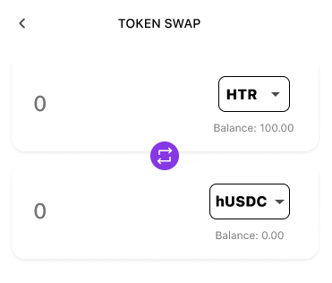
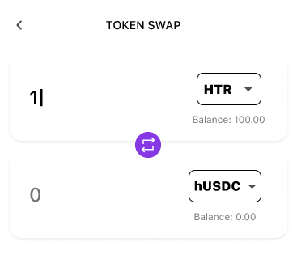
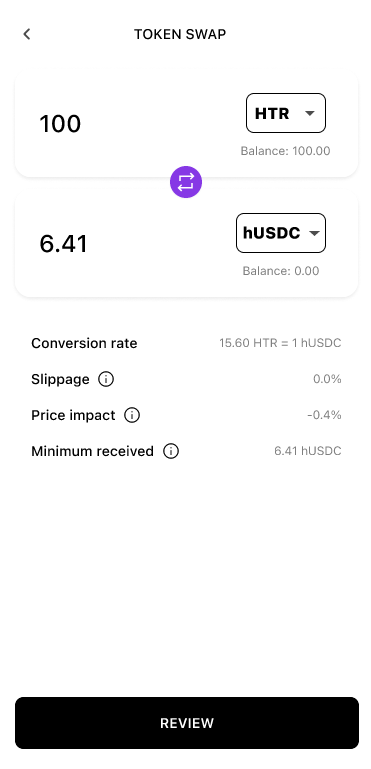
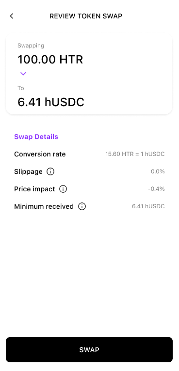
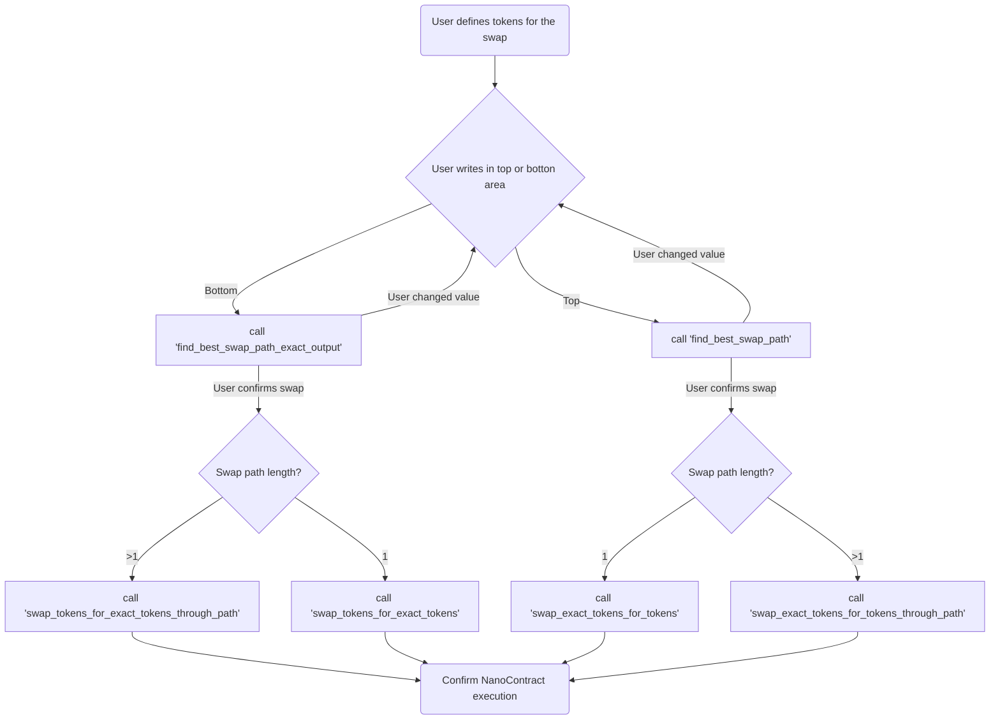

# Summary
[summary]: #summary

Token swap with Dozer protocol on the mobile wallet.

# Motivation
[motivation]: #motivation

Trading tokens is probably the main activity users do on DeFi nowadays. And Dozer Finance is the main venue to perform that on Hathor Network.

We want to encourage users to discover new tokens and swap them, so adding this to the mobile wallet, the main wallet used, is a big push in this direction.

# Guide-level explanation
[guide-level-explanation]: #guide-level-explanation

## Mobile Screens

Once the user start the swap he will see an empty swap screen.



The user will then choose the tokens for the swap and write a value on one of the input areas.



Once the user writes on either the top or bottom area the Dozer protocol will provide the other information to complete the screen



The user then has to verify the information on the swap.



Once the user confirms we can swap the tokens using the Dozer protocol.

## Unleash feature toggles

The feature toggle `mobile-token-swap.rollout` will be created, we can use the `stage` key of the context to differentiate the rollout between the testnet and mainnet.
If the flag is off we will hide the swap tab icon on the bottom of the screen so the user cannot reach the token swap pages.

## Dozer token swap protocol

The Dozer protocol for token swap is implemented as a nano contract on Hathor. 
The methods being called for a token swap depend on the user input and the exchange expected path returned by the contract.

The following chart should illustrate the decision making process to call each method.


The `find_best_swap*` methods return a tuple with the information:
- `path`: Comma-separated string of swaps to be made (along which pools the swap will traverse) in the format `{tokenA}/{tokenB}/{fee1},{tokenB}/{tokenC}/{fee2}`
- `amounts`: List of expected amounts at each step
- `amount_out`/`amount_in`: Final expected output amount or expected deposit
- `price_impact`: Overall price impact

The swap information can be used so the user can review the swap and proceed to call the actual swap method.
There are 2 swap methods depending on the number of itens on the calculated `path` if there is only 1 swap or multiple swaps.
The `_through_path` variant should be called when the `path` length is greater than 1.

### Slippage

The actual exchange rate of a token swap is defined during the swap, but on Hathor you have to provide the deposit and withdrawal before running the method.
To make this possible we have to account for slippage when building the transaction, to achieve this it depends if the known amount is the input token or output token.

We will define the accepted slippage to always be 0.5% of the expected value shown to the user.

In the case where the user defined the input tokens, If the actual value of tokens to be withdrawn is lower than 99.5% of the value shown to the user the swap will fail.

In the case where the user defined the output tokens, If the actual value of tokens to be deposited is higher than 100.5% of the value shown to the user the swap will fail.

##### 1. Input token value is known

The user writes the amount of tokens he will deposit and the protocol will calculate the amount he can withdraw.
The wallet will withdraw the expected amount returned from the `find_best_swap_path` _minus_ the slippage.

If during the swap execution the value allowed to be withdrawn is lower than the expected amount _minus_ the slippage the execution will fail.
In any other case the wallet immediately withdraw the expected amount _minus_ slippage and the outstanding amount is left as balance on the contract.

The outstanding balance can be withdrawn later.

##### 2. Output token value is known

The user writes the amount of tokens he will withdraw and the protocol will calculate the amount that should be deposited.
The wallet will deposit the expected amount returned from the `find_best_swap_path` _plus_ the slippage.

If during the swap execution the value of the input tokens is higher than the expected amount _plus_ the slippage the execution will fail.
In any other case the wallet will have deposited the expected amount _plus_ slippage and the outstanding amount is left as balance on the contract.

The outstanding balance can be withdrawn later.

## Allowed Tokens

While the Dozer contract may allow many tokens for swaps we will only have a pre-approved set of tokens shown on the wallet.
The list of allowed tokens will be served via CDN to the wallet, the document will contain the list of tokens allowed in each network, each token will also have a link to the icon (for the UI) that will also be available via CDN.

Since we only need to serve a static file and some icons we can use the static website functionality of S3 buckets.

The files and tokens should be tracked on git so changes can be reversed or recovered from, this can be done with terraform.
Terraform can create the bucket, configure static website access and upload the files to the created bucket.

Any changes on the files can automatically be uploaded as soon as they are merged, this also makes it possible to propose changes without write access to the bucket itself.

Failure to resolve the list of tokens will block the swap screen from fully loading.

The JSON should follow the schema:

```json
{
  "$id": ".../tokens.schema.json",
  "$schema": "https://json-schema.org/draft/2020-12/schema",
  "title": "SwapTokens",
  "type": "object",
  "required": ["networks"],
  "properties": {
    "networks": {
      "type": "object",
      "description": "Per-network token swap configuration.",
      "patternProperties": {
        ".*": { "$ref": "#/$defs/Network" },
      },
    },
  },
  "$defs": {
    "Network": {
      "type": "object",
      "required": ["tokens"],
      "properties": {
        "swap_contract": {
          "type": "string",
          "description": "Dozer protocol swap contract id in this network.",
          "pattern": "^[a-fA-F0-9]{64}$",
        },
        "tokens": {
          "type": "array",
          "description": "Array of allowed tokens for the swap.",
          "items": { "$ref": "#/$defs/Token" },
        }
      }
    },
  	"Token": {
  	  "type": "object",
  	  "required": ["name", "symbol", "uid"],
  	  "properties": {
  	    "name": {
  	      "type": "string",
  	      "description": "User readable token name",
  	      "minLength": 1,
  	      "maxLength": 30
  	    },
  	    "symbol": {
  	      "type": "string",
  	      "description": "Short token symbol",
  	      "minLength": 1,
  	      "maxLength": 5
  	    },
  	    "uid": {
  	      "type": "string",
  	      "description": "Unique identifier of a token",
  	      "pattern": "^[a-fA-F0-9]{64}$"
  	    },
  	    "icon": {
  	      "type": "string",
  	      "description": "Token icon url",
  	      "format": "url",
  	    },
  	  }
  	},
  }
}
```

# Reference-level explanation
[reference-level-explanation]: #reference-level-explanation

## External services

### Allowed Tokens CDN

To create the S3 buckets with a static website config we will need:
- `aws_s3_bucket`
  - To create the actual bucket
- `aws_s3_bucket_acl`
  - To make the bucket public-read
- `aws_s3_bucket_website_configuration`
  - To configure the bucket to serve static content
- `aws_s3_object`
  - To upload the files

### Dozer token swap protocol methods

##### View methods

These methods do not require a transaction to be sent, but the code is executed on the fullnode each time these are calculated.

`find_best_swap_path(self, amount_in: Amount, token_in: TokenUid, token_out: TokenUid, max_hops: int) -> SwapPathInfo`
- `amount_in`: The amount of input tokens
- `token_in`: The input token uid
- `token_out`: The output token uid
- `max_hops`: Maximum number of hops (1-3, but algorithm handles any number)

`find_best_swap_path_exact_output(self, amount_out: Amount, token_in: TokenUid, token_out: TokenUid, max_hops: int) -> SwapPathExactOutputInfo`
- `amount_out`: The desired output amount
- `token_in`: The input token
- `token_out`: The output token
- `max_hops`: Maximum number of hops (1-3, but algorithm handles any number)

##### Public methods

These methods require a transaction to be sent, the swap methods also require a deposit and withdraw action to swap the expected values of the tokens.
 
`swap_exact_tokens_for_tokens(self, ctx: Context, fee: Amount) -> SwapResult`
- `ctx`: The transaction context
- `fee`: Fee for the pool (default: use default_fee)
- The method also expects a deposit and withdraw actions with the swapped tokens.

`swap_exact_tokens_for_tokens_through_path(self, ctx: Context, path_str: str) -> SwapResult`
- `ctx`: The transaction context
- `path_str`: Comma-separated string of pool keys to traverse
- The method also expects a deposit and withdraw actions with the swapped tokens.

`swap_tokens_for_exact_tokens(self, ctx: Context, fee: Amount) -> SwapResult`
- `ctx`: The transaction context
- `fee`: Fee for the pool (default: use default_fee)
- The method also expects a deposit and withdraw actions with the swapped tokens.

`swap_tokens_for_exact_tokens_through_path(self, ctx: Context, path_str: str) -> SwapResult`
- `ctx`: The transaction context
- `path_str`: Comma-separated string of pool keys to traverse
- The method also expects a deposit and withdraw actions with the swapped tokens.

##### Type definitions

```py
class SwapPathInfo(NamedTuple):
    """Information about the best swap path between tokens."""

    path: str
    amounts: list[Amount]
    amount_out: Amount
    price_impact: Amount


class SwapPathExactOutputInfo(NamedTuple):
    """Information about the best swap path for exact output swaps."""

    path: str
    amounts: list[Amount]
    amount_in: Amount
    price_impact: Amount

class SwapResult(NamedTuple):
    """Result for an executed swap with the details of the execution.

    Notice that the results are presented for tokens in and tokens out.
    So one must check which one is Token A and which one is Token B."""

    amount_in: Amount
    slippage_in: Amount
    token_in: TokenUid
    amount_out: Amount
    token_out: TokenUid
```

# Unresolved questions
[unresolved-questions]: #unresolved-questions

## Outstanding balance on each swap

To account for slippage the Dozer protocol allows to the unknown part of the balance to be left as balance on the contract for the caller address, this value is only known at runtime on the nano contract.
This design does not offer a solution to withdraw the tokens.

# Future possibilities
[future-possibilities]: #future-possibilities

## Variance from the best swap quote shown to the user

The quote shown to the user by the `find_best_swap` methods are only valid for the current state of the contract.
If another user makes a swap using at least one of the same pools the value may change.
So as time goes on and other swaps are made by other users and services the value may get increasingly different from the quote.

So the probability of the swap failing increases as times goes on from the moment the users is shown a quote.
We currently do not have a "best approach" solution for this issue so this design will act as if the quote is always valid.

In the future we can have a strategy to remake the quote or make the user aware of its expiration.

## Slippage definition

This design implements a fixed 0.5% slippage on the expected value for the swap.
So the slippage will increase with the number of tokens being swapped, e.g. an acceptable slippage for 100.00 HTR is 0.50 HTR but an acceptable slippage for 100,000.00 HTR is 500.00 HTR.
The user should be able to configure the acceptable percentage of slippage accepted or even an acceptable value, e.g. 1 HTR fixed no matter the expected HTR output of the swap.

# Task Breakdown
[task-breakdown]: #task-breakdown

- Create allowed token swap CDN (2 dd)
- CI/CD for allowed tokens repo (1.5 dd)
- Import icons for allowed tokens (0.25 dd)
- Implement token swap screens (3 dd)
- Implement Dozer contract calls (2 dd)
- Error treatment for failed swap (1 dd)
- Create feature flag on unleash (0.25 dd)
