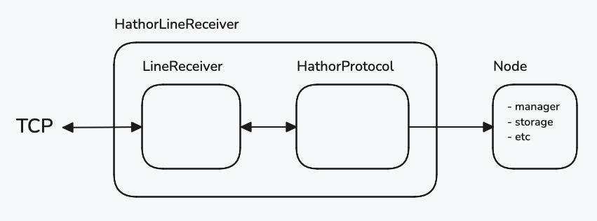
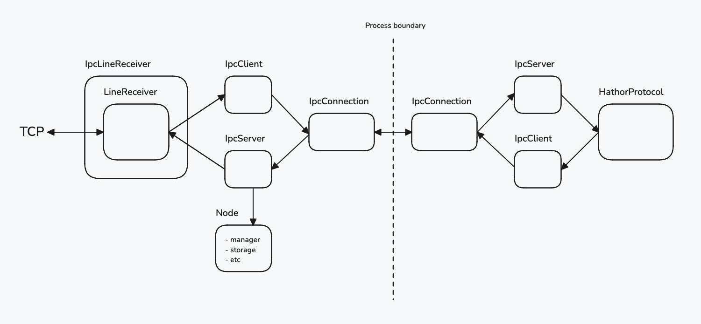

- Feature Name: P2P Multiprocess
- Start Date: 2024-09-25
- Initial Document: [P2P Multiprocess](https://docs.google.com/document/d/1afh9ObSgePevcZ8-WNZJU4-LwFVEKqR9F5yTDeppFjU/edit)
- Author: Gabriel Levcovitz <<gabriel@hathor.network>>

# Summary
[summary]: #summary

Some parts of the full node are independent and could run in separate processes, so we can improve the performance and security. We should start separating the P2P network. This would already give us some speed and the full node wouldn't stop responding to HTTP requests when a heavy P2P sync method is called.

# Motivation
[motivation]: #motivation

All full node components (P2P network, HTTP API, consensus, etc) currently run in a single thread, in a single process. They could be split into multiple processes, so we can scale and support more requests and transactions per second.

Also, since the mechanism is blocking, the full node can't reply HTTP requests when we have heavy sync calls in the P2P protocol.

# Guide-level explanation
[Guide-level explanation]: #guide-level-explanation

The problem to be solved by this project can be described as uncoupling the P2P subsystem from the full node. In order to do this, we'll have to refactor all coupling points out of the system. This means we must separate every IO, every callback, and every connection, direct or indirect, between the P2P classes and the rest of the codebase.

Once this is done, we should take this independent P2P subsystem and run it in different processes, one for each connection with the network. Of course, we can't use multithreading in Python because of the GIL (in Python 3.13 you can disable it, but it's still experimental). Even if we could, running on separate processes instead of threads has the added benefit that one process does not interfere with the other, as they have separate memory spaces at the OS level.

During sync P2P agents have to query data from the full node, such as accessing the storage. Then, when processing is done, the agent sends the downloaded vertex to the full node through the `VertexHandler.on_new_vertex` method. This means we must design a way for the subprocess to communicate with the main process, bidirectionally.

To design the solution, we have to first consider the current architecture:



In this diagram, arrows represent call flow and nested blocks represent inheritance. Currently, the `HathorLineReceiver` class has a double inheritance from `LineReceiver` and `HathorProtocol`. The former is a class provided by Twisted, inheriting from `twisted.Protocol`. The latter is our sync class that actually implements and kickstarts the whole sync logic (it instantiates and handles multiple other classes). Then, `HathorLineReceiver` subclasses them both to connect their behaviors in a single protocol. Being a Twisted protocol, it also means that it is associated with a twisted factory. When a new TCP connection is made, this factory is responsible for creating a new protocol instance, which kicks off the sync process. This bit is not represented in the diagram, but this fact will be important later. Lastly, the sync process communicates with the node though multiple pointers, represented here by the single `Node` block, containing the `HathorManager`, the `ConnectionsManager`, the `TransactionStorage`, and any other class that the sync needs from the rest of the full node. Those are called from the `HathorProtocol`.

We have to determine where to draw the process boundary line, meaning which classes are going to execute in the subprocesses, and what remains in the main process. The requirement is that each P2P agent runs in its own process, so we know for sure that the `HathorProtocol` must run in the subprocess. We also know that `Node` will remain in the main process, as it demultiplexes the agents to run new vertices through the verification process, the consensus, and to save them in the storage in the main process.

What about the `LineReceiver`? Ideally, it would be in the subprocess too. This would mean that every TCP message would be received and handled directly in the subprocess, and then the `HathorProtocol` would use some form of IPC to communicate with the `Node` for querying the storage and sending new vertices. However, this is not possible. Being in a separate process means using a completely separate Python interpreter, which means using separate Twisted reactors. By definition, a Twisted protocol must run in the same reactor as its Twisted factory. Then, the `LineReceiver` must also remain in the main process, and its communication with the `HathorProtocol` will also have to be through IPC.

Here's the proposed new architecture:



It simply moves the `HathorProtocol` out of the inheritance tree, and changes its communication with the `LineReceiver` to use IPC. It does the same for its communication with the `Node`.

The new `IpcLineReceiver` is a protocol, by still inheriting `LineReceiver`. Through composition, an `IpcServer` has access to it, and it has access to an `IpcClient`. Both of them are connected to an `IpcConnection`, which is simply a wrapper to Python's `multiprocessing.Connection` (which in turn wraps a UNIX socket). The `IpcConnection` is able to connect to another `IpcConnection` in a subprocess, which symmetrically connects to another client/server pair, connected to the `HathorProtocol`. The main process' `IpcServer` also has access to the rest of the `Node`.

When a new TCP connection is created, the Twisted factory (not shown here) will instantiate a new `IpcLineReceiver` protocol. It will do so by setting up and starting a subprocess and arranging all those connections. Then, when a TCP message is received, Twisted will call `IpcLineReceiver.lineReceived`, which will call `HathorProtocol.recv_message` through the `IpcClient`. Analogously, when `HathorProtocol` needs some information from the storage, it will call `Node` through its `IpcClient`. Each client is responded by the corresponding `IpcServer` on the other process. They all share a single UNIX socket through the `IpcConnection` abstraction. Lastly, the `HathorProtocol` can also call `VertexHandler.on_new_vertex` through the same path. The underlying protocol used in the IPC is a simple binary protocol pretty analogous to the sync process itself: it sends a command and data pair via a single binary string.

# Reference-level explanation
[Reference-level explanation]: #reference-level-explanation

## Proof-of-Concept

In order to validate the idea described in the Guide-level section, I created a [POC](https://github.com/HathorNetwork/hathor-core/pull/1138) that simulates both diagrams. You can run the current architecture simulation by running `python hathor/current_p2p.py` in that branch, and `python hathor/p2p_mp_poc.py` to run the new architecture.

For both simulations, you can use netcat to send TCP messages to the system, like `nc localhost 8080 -c` for an interactive session. Try opening two separate netcat sessions, and sending a message simultaneously in each one. I put a 5-second delay on `HathorProtocol` processing to simulate a CPU-heavy method. The current architecture will take ~10 seconds to respond both requests, and the new architecture takes half that time.

Code snippets from that POC will be in the descriptions below, but some code is omitted. For the full code, see the POC link above.

### Current architecture simulation

In the [`hathor/current_p2p.py`](https://github.com/HathorNetwork/hathor-core/blob/fe7e9a69db37a8032516c0715dbfbf7a46744431/hathor/current_p2p.py) file, a simple script simulates the current P2P subsystem.

- A `HathorManager` class represents the `Node` from the diagrams above, and has two methods: `read_storage` and `save_storage`. They simulate methods for interacting with the `TransactionStorage`.
- Then, the `HathorProtocol` class represents its real homonym, providing a `do_something` method that represents the sync process. Notice that it has access to the manager and calls its methods to perform the sync. It also has an abstract `send_line` method.
- The `MyLineReceiver` protocol represents the `HathorLineReceiver`, inheriting from both `LineReceiver` and `HathorProtocol`. Its `lineReceived` method calls `HathorProtocol.do_something`, and it overrides `HathorProtocol.send_line`, implementing it.
- Lastly, `MyFactory` represents both `HathorServerFactory` and `HathorClientFactory`, simply instantiating `MyLineReceiver`.

### Proposed architecture simulation

The [`hathor/p2p_mp_poc.py`](https://github.com/HathorNetwork/hathor-core/blob/fe7e9a69db37a8032516c0715dbfbf7a46744431/hathor/p2p_mp_poc.py) file contains the new proposed architecture simulation script.

- It has the same `HathorManager` class as above.
- The `HathorProtocol` class is mostly the same, except it calls manager methods and `send_line` through an `IpcClient`, instead of directly.
- The `MyLineReceiver` protocol is replaced by `IpcLineReceiver`, which doesn't have access to the `HathorProtocol` anymore, and instead calls `do_something` through an `IpcClient`, too.
- The `MyFactory` class is replaced by `IpcFactory`, and when it creates a protocol instance it calls the new `ipc.connect` function (described below) to arrange the subprocess connection.
- Lastly, it contains 2 `IpcClient`s and 2 `IpcServer`s, one pair for the main process and one for the subprocess. Those are responsible for defining the interface between the processes: which commands can be called in each of them.

### `_IpcConnection`

The private `_IpcConnection` class wraps `multiprocessing.Connection` objects returned by the `multiprocessing.Pipe`. A pair of those represent a single connection between the main process and a subprocess, with each instance in its respective process. It is bidirectional, meaning that each end is able to send and receive messages to the other end. In other words, each end sends and receives both requests and responses.

Its only responsibility is to run a `twisted.LoopingCall` that polls the `Connection` for new messages. When a message is received, an ID mechanism is used to determine whether the message is a new request or a response to one of its own requests.

It provides a `call` method to send requests, which returns a `Deferred` that will be completed when the respective response is received:

```python
def call(self, cmd: bytes, request: bytes | None) -> Deferred[bytes]:
    data = cmd if request is None else cmd + MESSAGE_SEPARATOR + request
    message = self._send_message(data)
    deferred: Deferred[bytes] = Deferred()
    self._pending_calls[message.id] = deferred
    return deferred
```

And the polling mechanism:

```python
def _unsafe_poll(self) -> None:
    if not self._conn.poll():
        return

    message_bytes = self._conn.recv_bytes()
    message = _Message.deserialize(message_bytes)

    if pending_call := self._pending_calls.pop(message.id, None):
        # The received message is a response for one of our own requests
        pending_call.callback(message.data)
        return

    # The received message is a new request
    coro = self._server.handle_request(message.data)
    deferred = Deferred.fromCoroutine(coro)
    deferred.addCallback(lambda response: self._send_message(response, request_id=message.id))
```

Notice that it calls a `self._server.handle_request` to handle requests. That server is an `IpcServer` that will be described below.

To keep track of which response is associated with which request, each pair is assigned a unique message ID that is created by incrementing an `int` from a `multiprocessing.Value`, a Python object that supports atomic read/writes in multiple processes.

### `IpcClient` and `IpcServer`

Users of the `_IpcConnection` class do not interact with it directly. Instead, they do so through client/server abstractions:

```python
class IpcClient(ABC):
    def call(self, cmd: bytes, request: bytes | None = None) -> Deferred[bytes]:
        return self._ipc_conn.call(cmd, request)

class IpcServer(ABC):
    @abstractmethod
    def get_cmd_map(self) -> dict[bytes, IpcCommand]:
        raise NotImplementedError
```

The user (in this case, the sync process) must implement classes inheriting from the `IpcClient` and `IpcServer`. The client will provide the user with a way to call commands on the other process. And through the server, the user must provide a way to handle those commands. In practice, the user must implement 4 classes: 2 clients and 2 servers, one pair for the main process and another for the subprocess.

### The `connect()` function

Lastly, a function is provided to arrange all connections, starting the subprocess, etc.

```python
def connect(
    *,
    main_reactor: ReactorProtocol,
    main_client: IpcClient,
    main_server: IpcServer,
    subprocess_client_builder: Callable[[], ClientT],
    subprocess_server_builder: Callable[[ClientT], IpcServer],
    subprocess_name: str,
) -> None:
    conn1: Connection
    conn2: Connection
    conn1, conn2 = Pipe()
    message_id = multiprocessing.Value('L', 0)

    main_ipc_conn = _IpcConnection(
        reactor=main_reactor, name='main', conn=conn1, message_id=message_id, server=main_server
    )
    main_client.set_ipc_conn(main_ipc_conn)
    main_ipc_conn.start_listening()

    subprocess = Process(
        name=subprocess_name,
        target=_run_subprocess,
        kwargs=dict(
            name=subprocess_name,
            conn=conn2,
            client_builder=subprocess_client_builder,
            server_builder=subprocess_server_builder,
            message_id=message_id,
        ),
    )
    subprocess.start()


def _run_subprocess(
    *,
    name: str,
    conn: Connection,
    client_builder: Callable[[], IpcClient],
    server_builder: Callable[[IpcClient], IpcServer],
    message_id: Synchronized,
) -> None:
    subprocess_reactor = initialize_global_reactor()
    client = client_builder()
    server = server_builder(client)
    subprocess_ipc_conn = _IpcConnection(
        reactor=subprocess_reactor, name=name, conn=conn, server=server, message_id=message_id
    )
    client.set_ipc_conn(subprocess_ipc_conn)
    subprocess_ipc_conn.start_listening()
    subprocess_reactor.run()
```

Notice that a new Twisted reactor is initialized in the subprocess.

### Not covered by the POC

The following points where mostly ignored in the POC and must be addressed in the implementation:

1. Make sure logging is consistent through all processes
    - All of them should log to the same output.
    - All of them should use the same configuration.
2. Deal with exceptions, specially when a remote call fails
    - Close connections when appropriate.
    - Send errors to the other process when appropriate.
3. Deal with process termination in both ways
    - What happens when the subprocess dies? Kill the connection.
    - What happens when the main process dies? We shouldn't leave zombie subprocesses.
4. Use a multiprocessing Pool?
    - In the POC, one process is created for each P2P connection. We could use a pool to prevent creating a lot of process, and run many connections in each process, one for each CPU in the host machine. This has the advantage of minimizing the number of subprocesses, but then connections are not completely isolated: they would still be isolated from the rest of the node, but not from other connections. This should be investigated.
5. Further abstractions?
    - In the POC, the IPC protocol relies on sending binary command and data pairs. We could create an easier abstraction to make calls more similar to calling methods by providing a method name, args, and kwargs. This is not necessary, but could be nice.
    - Eventually we could extract an RPC abstraction from the IPC classes, making it work for remote connections that are not necessarily processes. This means this code could be reused by the Sync process itself, that is, for abstracting the communication between two full nodes. Sync-v2 already uses a similar deferred calls mechanism, but it is implemented ad-hoc in the protocol. By using the same abstraction, we not only simplify code but also make Sync-v2 a request/response protocol, making its logic more linear. This could be a Sync-v2.5 and is probably out of the scope of this project.

## Sync-v2 refactors

In order to make the solution above work with Sync-v2, some refactors will have to be made. Mainly, we must isolate all places it interacts with the full node (by calling storage methods, manager methods, etc). Some of this work was already done as part of the Multiprocess Verification project, so some of its unmerged PRs can be repurposed.

Also, the `IpcClient` interface only provides a way to call methods in the other process through an `async` method. This means we may also have to convert some methods in the Sync-v2 to async, if possible. If not possible (that is, if the refactor would be too extensive), we could try to implement a `IpcClient.call_blocking` method, but this also has to be investigated.

# Task breakdown

Here's a table of main tasks:

| Task                                                         | Dev days |
|--------------------------------------------------------------|----------|
| Finish IPC implementation (logging, exceptions, termination) | 2        |
| Sync-v2 refactors                                            | 2        |
| Implement Sync-v2 IPC clients and servers                    | 1        |
| Implement CLI command to enable multiprocess P2P             | 0.2      |
| Run benchmarks and tests                                     | 1.8      |
| **Total**                                                    | **7**    |

All tasks include writing unit tests for the respective feature.
