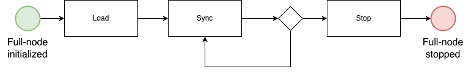
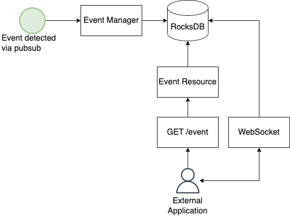

_This design has been migrated from [this issue description](https://github.com/HathorNetwork/hathor-core/issues/405)._

## Problem

Currently, applications that want to interact with the full-node must write its own sync algorithm and handle all use cases (Like reorganization). This algorithm can become very complex and consume several days of development.

There are two alternatives when applications want to interact with the full node:

- Initialize a bidirectional communication via websocket.
- Call the REST APIs.

However, the main concerns with these approaches are:

- When a reorganization happens, the applications must know how to query all the affected txs and update them on their databases.
- There is no guarantee on the order the events happened.
- When the websocket is disconnected, events might be lost and a resync must be executed.

## Solution

To tackle the problems presented above, we must implement a built-in event management system, where all events will be sent in the order they occurred. This system has the following requirements:

1. Detect events that are important to applications. (Look for `Event Types` below).
1. Persist each event and give it an unique incremental ID.
1. Give users an REST API and Websocket connection to query for events

To set up this system, the user must provide, during the full-node initialization, the `--enable-event-queue` flag.

Due to the necessary flags and the events that can be emitted, we will provide a document on how to understand this new mechanism.

This project, however, does **NOT** intend to eliminate the necessity of a sync algorithm, but to make it much more simpler.

## Out of Scope

These features will not be part of the first phase of this project:

- Sync pause/resume
  - An API to manipulate the sync algorithm.
- Event filter
  - Give users the choice to receive only a subset of events, according to some criteria.
- The `--flush-events` flag. By default, all events are retained. In the future, the user could provide a `--flush-events` flag to enable the flushing of events after each event is sent to the client.

## Event generation during the full-node cycle

Considering this full-node cycle:



Where:
- `Load` is the period right after the full-node is started, where the local database is read.
- `Sync` is the period where `Load` is finished and the full-node continuously receive/send txs to other peers until full node is stopped.

By default, the events generated during load will not be emitted. If the user wants to enable them, one must provide the `--emit-load-events` flag.

## Flow



## API

To retrieve the events, an API will be provided:

`GET /event?last_ack_event_id=:last_ack_event_id&size=:size`

The maximum value for `size` will be 1000, to prevent DoS attacks, and the default value will be 100. Those should be configured via settings.

If `last_ack_event_id` is not provided, the first event on the database will be returned.

The result will be an array of events. Each entry will have the data format described on the `Data Format` section below. Also, a `latest_event_id` field will be returned, so the client will know how many events ahead are already available.

## WebSocket

In addition to the REST API, a similar WebSocket API will be available. The client will start the communication also providing the `last_ack_event_id` and an `window_size`. The server will keep the connection open and start sending streaming events to the client.

Each message will be a single event. The server will keep sending events while there are events available and there's `window_size` available. The client can send an ACK message at any time to either update the `ack_event_id` and/or the `window_size`, effectively having full control of the flow of events. Each entry will have the data format described on the `Data Format` section below. Also, a `latest_event_id` field will be returned, so the client will know how many events ahead are already available.

## Storage

To avoid adding new dependencies, the RocksDB, which is already implemented for `tx_storage`, will be used to persist the events. RocksDB is a key-value store. The key will be the event id, and the value will be the whole event. This way, querying a range of keys must be cheap (seek of O(log(n)) and each next is O(1)).

To serialize the data, we will transform the whole event into a JSON object and store as bytes on the RocksDB. A simple `json.decode` will be sufficient to retrieve the encoded data.

## Retention Policy

By default, all events will be stored, given this feature is enable via the `--enable-event-queue` flag. In future phases of the project, a `--flush-events` flag will be implemented to control the retention policy.

## Data Format

All events will have the following structure:

```
{
    peer_id: str, // Full node UID, because different full nodes can have different sequences of events
    id: NonNegativeInt, // Event order
    timestamp: float, // Timestamp in which the event was emitted. This will follow the unix_timestamp format
    type: HathorEvents, // One of the event types of the HathorEvents enum
    group_id: Optional[NonNegativeInt], // Used to link events. For example, many TX_METADATA_CHANGED will have the same group_id when they belong to the same reorg process
    data: EventData, // Variable class for each event type. Check Event Types section below
}
```

## Data types:

### TxInput

```
{
    tx_id: str,
    index: int,
    token_data: int
}
```

### TxOutput

```
{
    value: int,
    script: str,
    token_data: int
}
```

### TxData

```
{
    hash: str,
    nonce: int,
    timestamp: int,
    version: int,
    weight: float,
    inputs: List[TxInput],
    outputs: List[TxOutput],
    parents: List[str],
    tokens: List[str],
    token_name: Optional[str],
    token_symbol: Optional[str],
    metadata: TxMedatada
}
```

### SpentOutputs

```
{
    spent_output: List[SpentOutput]
}
```

### SpentOutput

```
{
    index: int,
    tx_ids: List[str]
}
```

### TxMetadata

```
{
    hash: str,
    spent_outputs: List[SpentOutputs],
    conflict_with: List[str]
    voided_by: List[str]
    received_by: List[int]
    children: List[str]
    twins: List[str]
    accumulated_weight: float
    score: float
    first_block: Optional[str]
    height: int
    validation: str
}
```

### ReorgData

```
{
    reorg_size: int,
    previous_best_block: str, // hash of the block
    new_best_block: str // hash of the block
    common_block: str // hash of the block
}
```

### EmptyData

```
  {}
```

### EventData

One of `TxData`, `ReorgData`, or `EmptyData`, depending on the event type.

### HathorEvents

One of the Event Types described in the section below.

## Event Types

Events described here are a subset of all events in the `HathorEvents` enum. The event manager only subscribes and handles the ones listed below.

- `LOAD_STARTED`
- `LOAD_FINISHED`
- `NEW_VERTEX_ACCEPTED`
- `NEW_VERTEX_VOIDED`
- `REORG_STARTED`
- `REORG_FINISHED`
- `VERTEX_METADATA_CHANGED`

### LOAD_STARTED

It will be triggered when the full-node is initializing and is reading locally from the dabatase, at the same time of `MANAGER_ON_START` Hathor event. It should have an empty body.

### LOAD_FINISHED

It will be triggered when the full-node is ready to establish new connections, sync, and exchange transactions, at the same that when the manager state changes to `READY` [here](https://github.com/HathorNetwork/hathor-core/blob/85206cb631b609a5680e276e4db8cffbb418eb88/hathor/manager.py#L652). Other events will be triggered ONLY after this one, if the `--emit-load-events` flag is not enabled. `EmptyData` is sent.

### NEW_VERTEX_ACCEPTED

It will be triggered when the transaction is synced, and the consensus algorithm immediately identifies it as an accepted TX that can be placed in the mempool. `TxData` is going to be sent. We will reuse the `NETWORK_NEW_TX_ACCEPTED` Hathor Event that is already triggered.

### NEW_VERTEX_VOIDED

It will be triggered when the transaction is received and synced, but the consensus immediately identifies it as a voided TX (as long as a reorg is not in progress). `TxData` datatype is going to be sent.

### REORG_STARTED

Indicates that the best chain has changed. It will trigger the necessary ```TX_METADATA_CHANGED``` and ```VERTEX_METADATA_CHANGED``` events to void/execute them. `ReorgData` datatype is going to be sent.

### REORG_FINISHED

It will be triggered if a `REORG_STARTED` had been triggered previously, indicating that the reorg (i.e. a new best chain was found) was completed and all the necessary metadata update was included between ```REORG_STARTED``` and this event.

### VERTEX_METADATA_CHANGED

Initially, we will trigger this event for two use cases:

- When a best block is found. All transactions will change its ```first_block``` metadata, which will be propagated through this event.
- When a reorg happens. This can trigger multiple transactions and blocks being changed to voided/executed. This will be detected on `mark_as_voided` functions inside `consensus.py` file (As long as consensus context finds that a reorg is happening).

Data type `TxData` is going to be sent. Only the new transaction information is going to be sent, and it's the client responsibility to react accordingly.

## Scenarios

### Single chain

Two transactions are accepted into the mempool, and a block on the best chain is found to confirm those transactions.

1. `NEW_VERTEX_ACCEPTED` (Tx 1)
1. `NEW_VERTEX_ACCEPTED` (Tx 2)
1. `NEW_VERTEX_ACCEPTED` (Block 1)
1. `VERTEX_METADATA_CHANGED` (Changing the `first_block` of `Tx 1` to `Block 1`)
1. `VERTEX_METADATA_CHANGED` (Changing the `first_block` of `Tx 2` to `Block 1`)

### Best chain with side chains

Two transactions are accepted into the mempool. A block on the best chain is found to confirm those transactions, but a new block on a side chain arrives and becomes the best chain. The transactions are confirmed by this new block.

1. `NEW_VERTEX_ACCEPTED` (Tx 1)
1. `NEW_VERTEX_ACCEPTED` (Tx 2)
1. `NEW_VERTEX_ACCEPTED` (Block 1)
1. `VERTEX_METADATA_CHANGED` (Changing the `first_block` of `Tx 2` to `Block 1`)
1. `VERTEX_METADATA_CHANGED` (Changing the `first_block` of `Tx 1` to `Block 1`)
1. `REORG_STARTED`
1. `NEW_VERTEX_ACCEPTED` (Block 2)
1. `VERTEX_METADATA_CHANGED` (Changing the `voided_by` of `Block 1`)
1. `VERTEX_METADATA_CHANGED` (Changing the `first_block` of `Tx 1` to `Block 2`)
1. `VERTEX_METADATA_CHANGED` (Changing the `first_block` of `Tx 2` to `Block 2`)
1. `REORG_FINISHED`

## Integration Tests

We will provide test cases with sequences of events for each scenario. This will help application to integrate with this new mechanism.


## Task Breakdown and Effort

- [x] Proof of Concept (2 dev-days)
- [x] Low-level design (2 dev-days)
- [x] Change manager to handle the new flag (2 dev-days)
- [x] Make the REORG event be emitted during consensus (2 dev-days)
- [x] Emit event when tx/block is voided (2 dev-days)
- [x] Emit event for metadata changes (2 dev-days)
- [x] Create RocksDB event column family (2 dev-days)
- [x] Implement an event management layer, where events will be detected and persisted on RocksDB (3 dev-days)
- [x] Implement event persistence layer on RocksDB (3 dev-days)
- [x] Implement WebSocket API (2 dev-days)
- [x] Implement `GET /event` REST API  (1 dev-day)
- [x] Implement `--skip-load-events` flag  (2 dev-days)
- [ ] Doc with user instructions  (1.5 dev-days)
- [ ] Build testing cases for integrations  (2 dev-days)

**Total: 28.5 dev-days**
