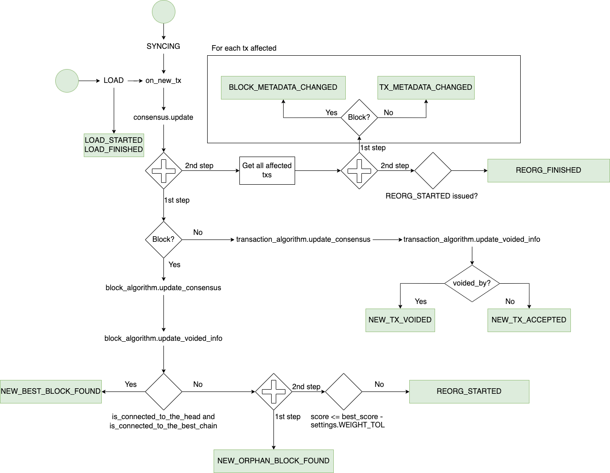

_This design has been migrated from [this issue description](https://github.com/HathorNetwork/hathor-core/issues/437)._

## Goal of this document

This low-level design intends to go deeper on the technical aspects of the project. If you want more abstract information, please consult the [high-level design](./0001-high-level-design.md).

## Full-node execution

Considering this full-node cycle:


At first, when the full node is initialized, it moves to the `LOAD` state, where data is loaded from the database, without consulting the network. Once all local data is read, the full-node continuously syncs with peers, changing to the `SYNC` state.

In order to know which events will be generated, we will store the states (`LOAD` and `SYNC`) as metadata. So, when the full node starts, we will check the metadata. If it is empty or `LOAD`, we do not know where it stopped and will regenerate all events during load. If it is `SYNC`, we will not generate any events until `LOAD_FINISHED` is emitted.

The state metadata will be stored in a specific RocksDB column family, used only for event-related metadata.

In the table below we describe all possible starting scenarios for the full node, and the respective desired outcome:

| Starting scenario                 | Vertices in the database | Events in the database | State metadata | Desired outcome                                                                                                                           |
|-----------------------------------|--------------------------|------------------------|----------------|-------------------------------------------------------------------------------------------------------------------------------------------|
| `Fresh start`                     | None                     | None                   | Empty          | Generate all events, from `event_id = 0`. All events come during the `SYNC` phase.                                                        |
| `Snapshot start`                  | Some                     | None                   | Empty          | Generate all events, from `event_id = 0`. Events come during both the `LOAD` and `SYNC` phases.                                           |
| `Restart from aborted LOAD phase` | Some                     | Some                   | `LOAD`         | All events in the database are discarded. Generate all events, from `event_id = 0`. Events come during both the `LOAD` and `SYNC` phases. |
| `Restart from aborted SYNC phase` | Some                     | Some                   | `SYNC`         | Generate events from `event_id = last_event_id + 1`. All events come during the `SYNC` phase.                                             |

There's no case in which there are some events in the database, but no vertices.

For the `Fresh start` scenario, if we consider there's a `LOAD` phase with 0 events, then the desired outcome becomes the same for the first three scenarios. This makes it possible to simplify the table into only two scenarios, only depending on `State metadata`, as described in the beginning of this section:

| Starting scenario                                                      | State metadata  | Desired outcome                                                                                                                           |
|------------------------------------------------------------------------|-----------------|-------------------------------------------------------------------------------------------------------------------------------------------|
| `Fresh start` or `Snapshot start` or `Restart from aborted LOAD phase` | Empty or `LOAD` | All events in the database are discarded. Generate all events, from `event_id = 0`. Events come during both the `LOAD` and `SYNC` phases. |
| `Restart from aborted SYNC phase`                                      | `SYNC`          | Generate events from `event_id = last_event_id + 1`. All events come during the `SYNC` phase.                                             |

Now, we can describe a step-by-step representing these rules:

1. The full node begins the initialization process
2. The `EventManager` starts
   1. It retrieves the previous node state from the database and stores it
   2. If its stored previous state is empty or `LOAD`, it discards all events currently in the database
3. The full node emits the `MANAGER_ON_START` PubSub event
   1. The `EventManager` sets `LOAD` as the current node state in the database
4. The full node loads all vertices from the database
5. If the `EventManager`'s stored previous state is empty or `LOAD`, a new vertex event is generated for all vertices in the database, in topological order
6. The full node finishes loading and emits the `LOAD_FINISHED` PubSub event
   1. The `EventManager` sets `SYNC` as the current node state in the database
7. The full node starts syncing new vertices from the network

### Genesis

Events for the genesis block and two transactions are always emitted when events are generated from `event_id = 0`.

### Snapshots

When generating snapshots, events should not be included, as they will be discarded and regenerated anyway.

## Flags

The following flags will be provided:

| Flag                 | Description                                     |
|----------------------|-------------------------------------------------|
| `--enable-event-queue` | Enable the message broker mechanism             |

## Event

### Definition

An event is a data structure that captures a specific, atomic moment inside the node that might be useful for applications.

### Data Structures

For a description of all data structures, consult the [high-level design](./0001-high-level-design.md).

## Event capture

This is a diagram of the consensus algorithm, highlighting where each event will be triggered. ATTENTION: This is not a FULL diagram of the algorithm, but only with parts that are relevant to this design.



## Storage

### Engine

RocksDB will be used to store the captured events. Along with the fact that we will not add a new dependency, it is a great engine to navigate through a key range. A seek takes O(log(n)), and each subsequent key is retrieved in O(1).

### Serialization

A new column-family will be created to store the events, so it stays decoupled from `tx` information.

Each event will be a `dict` on Python. To save the event, the whole `dict`object will be translated to a string using `json.dumps`. Then, it will be inserted on the database. The key will be the `event id`, which takes 8 bytes. All information will be stored using big-endian format.

### Deserialization

Each retrieved event from the database will be deserialized using `event.decode('utf-8')` and then `json.loads` will be used to transform it in a `dict` again.

### Memory Storage

For txs, memory storage is available, especially for test purposes. We will also give this option for events. The storage will be simply a `Dict`, where the key will be the `event_id` represented in `bytes`, and the value will be the whole object. Then, we will provide methods to save and retrieve events, implementing the same interface used by Events RocksDB storage.

To decide which kind of storage to use, we will follow the same mechanism currently implemented (Evaluating the usage of `--memory-storage` flag).

## REST API

This endpoint will be provided:

`GET /event?last_ack_event_id=:last_ack_event_id&size=:size`

Parameters:

- `last_ack_event_id` - The last `event_id` received in the previous request. If not provided, first entry will be retrieved.
- `size` - Number of events that the client wants to receive in the same response. Default is 100. Limit is 1000.

Response:

The response will contain events and the `latest_event_id`, as in the following example:

```json
{
  "events": [
    {
      "id": 1,
      "peer_id": "ecb8edcce0a34cb791923188cb3f18fd",
      "timestamp": 1658868080,
      "type": "network:new_tx_accepted",
      "group_id": 1,
      "data": {}
    }
  ],
  "latest_event_id": 123
}
```

Error:

- If `last_ack_event_id` is an event that does not exist (Example: Last `event_id` on database is 1000, but client pass 2000 as `last_received`, the API will return `404 - Not Found`.
- If client pass a `size` <= 1 or > 1000, the API will return `400 - Bad Request`, informing that size is out of range.

## WebSocket communication

Messages will have a sequential `event_id` starting from 0, it is the client's responsibility to store the last event received. In case a connection dies, the new connection will not know where it stopped, so the client has pass that information to the server. Below are all possible message types.

### Start Stream Request

Tell WebSocket to start streaming events from a certain `event_id`.

#### Direction

`Client -> Server`

#### Message Body

| Field               | Type                       | Description                                                                                                                                                  |
|---------------------|----------------------------|--------------------------------------------------------------------------------------------------------------------------------------------------------------|
| `type`              | `Literal['START_STREAM']`  | The message type.                                                                                                                                            |
| `last_ack_event_id` | `Optional[NonNegativeInt]` | The last `event_id` the client has received, so the stream starts from the event after that one. `None` if the client wants to receive from the first event. |
| `window_size`       | `NonNegativeInt`           | The number of events the client is able to process before acknowledging that it received some event.                                                         |

### Stop Stream Request

Tell WebSocket to stop streaming events.

#### Direction

`Client -> Server`

#### Message Body

| Field  | Type                     | Description       |
|--------|--------------------------|-------------------|
| `type` | `Literal['STOP_STREAM']` | The message type. |

### ACK Request

Tell WebSocket that the client acknowledges that it receive a certain `event_id`. Also used to control the flow of events via the `window_size` field.

#### Direction

`Client -> Server`

#### Message Body

| Field          | Type             | Description                                                                                       |
|----------------|------------------|---------------------------------------------------------------------------------------------------|
| `type`         | `Literal['ACK']` | The message type.                                                                                 |
| `ack_event_id` | `NonNegativeInt` | The last `event_id` the client has received, so the available window is calculated from that one. |
| `window_size`  | `NonNegativeInt` | The number of events the client is able to process before acknowledging another event.            |

### Event Response

Event data the Server sends to the Client.

#### Direction

`Server -> Client`

#### Message Body

| Field             | Type               | Description                                                                                                           |
|-------------------|--------------------|-----------------------------------------------------------------------------------------------------------------------|
| `type`            | `Literal['EVENT']` | The message type.                                                                                                     |
| `event`           | `BaseEvent`        | The event data as described above.                                                                                    |
| `latest_event_id` | `NonNegativeInt`   | The ID of the last event the server has processed. Useful for the Client to know how far it is from real time events. |

### Invalid Request Response

Error message the Server sends to the Client when the Client has performed an invalid request.

#### Direction

`Server -> Client`

#### Message Body

| Field             | Type                 | Description                                                                                                     |
|-------------------|----------------------|-----------------------------------------------------------------------------------------------------------------|
| `type`            | `InvalidRequestType` | The message type. Options described below.                                                                      |
| `invalid_request` | `Optional[str]`      | The request that was invalid, or `None` if there was no request (read the `EVENT_WS_NOT_RUNNING` option below). |
| `error_message`   | `Optional[str]`      | A human-readable description of why the request was invalid.                                                    |

Here are the possible values of the `InvalidRequestType` enum type:

- `EVENT_WS_NOT_RUNNING`: Sent when the Client connection opens to the WebSocket Server, but the server has not yet been started. The `invalid_request` field on the response is empty.
- `STREAM_IS_ACTIVE`: Sent when the Client tries to start a stream that is already started.
- `STREAM_IS_INACTIVE`: Sent when the Client tries to either send an ACK or stop message to a stream that is already stopped.
- `VALIDATION_ERROR`: Sent when the Client tries to send a request with a malformed body.
- `ACK_TOO_SMALL`: Sent when the Client tries to send a ACK `event_id` that is smaller than the last ACK `event_id` it has sent.
- `ACK_TOO_LARGE`: Sent when the Client tries to send a ACK `event_id` that is larger than the last event the Server has sent.

## Testing Scenarios

For testing purposes, we will provide a separate Python application that will simulate a sequence of events. The user will be able to start this application via command line, passing one of the three initially available scenarios: `SINGLE_CHAIN`, `BEST_CHAIN_WITH_SIDE_CHAINS`, or `MULTIPLE_FORKS`.

Example: `./events_simulator.py --scenario SINGLE_CHAIN`

A websocket server will be started and will wait connections from clients (following the same structure of the original websocket). Once requested (passing the `start_streaming_events` message), the events will be sent to the client. This way, the user do not need to run a full node to test the application.

A detailed document to instruct users on how to run the tests will be built as part of this task.

## Final Task Breakdown

No changes from the task breakdown of the [high-level design](./0001-high-level-design.md).
