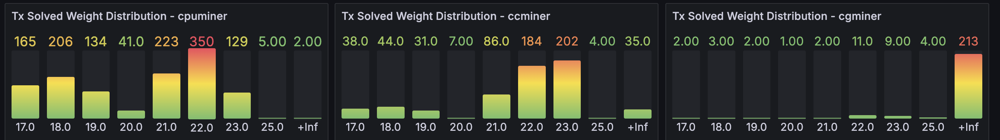

- Feature Name: Improve transaction job distribution
- Start Date: 2024-10-10
- Author: Pedro Ferreira <<pedro@hathor.network>>

# Table of Contents

# Summary
[summary]: #summary

The transaction mining service currently sends a single mining job to all miners, so we can't scale it with more miners because they would be mining the same tx. This limitation was added to the code to improve reliability after we had many timeouts, especially with big transactions.

The project's idea is to improve job distribution so that we can scale the number of transactions we can mine in parallel while maintaining our current reliability.


# Motivation
[motivation]: #motivation

There's a use case that wants to send multiple txs in parallel and we currently send the same tx job to all miners, so our transaction mining service (not the public tx-mining-service but the code itself) is not ready for it. We must have a way for them to run their own transaction mining service configured in a way that they can mine more than one transaction simultaneously.

**Note:** this limitation is only for the transaction mining service, the protocol supports everything the use case needs and even more.

# Guide-level explanation
[Guide-level explanation]: #guide-level-explanation

The project will be divided in 3 independent phases that will help use cases run their own transaction mining service in a way that they can scale the number of transactions they can mine in parallel.

## Distribute tx job to miners depending on redundancy configuration.

A new custom configuration will be added to the tx mining, where use cases will be able to set the number of redundancy for each miner type. For example, a custom configuration as below:

```python
miner_redundancy = {
    'cpuminer': 3,
    'ccminer': 1
}
```

This configuration will tell the tx mining service to distribute each tx job to 3 cpuminers, 1 ccminer and all cgminers (in case there's no custom configuration for a miner type, the default is to send to all of them). In this case, if there are 9 cpuminers connected to this tx mining service, it will be able to mine 3 transaction jobs in parallel and we will continue with the reliability that we can have nowadays.

**Note:** if the number of connected miners is not multiple of the redundancy amount, there will always be miners mining a block job and waiting for another miner to be available before getting a tx job. For example, if the redundancy amount is 2 for cpuminers and there are 3 of them connected, if 2 tx jobs arrive, the first one will be distributed to the first two cpuminers, while the second job will be on hold waiting for one of the cpuminers to become available, even if we have one cpuminer available because we must have at least the redundancy quantity of miners available to distribute them.

## Distribute tx job among miners type depending on the weight.

A study regarding miner capability was done by @luislhl in the past (https://github.com/HathorNetwork/ops-tools/issues/257) and the results show that it's basically useless trying to mine a transaction job with weight bigger than 24 with a cpuminer, even though they perform much better than the others for smaller weights, e.g. 17, 18, 19. The study done was not considering the ccminer but we now have a Grafana chart that has a distribution of transactions mined by each miner aggregated by its weight (https://grafana.internal.hathor.network/d/BKxhHhbnk/tx-mining-service?orgId=1&var-datasource=prometheus&var-namespace=tx-mining-service-mainnet-production).

<p align="center">
  
</p>

The chart above shows the data for the last 14 days of transaction mining. Unfortuanately, we have detailed information only with weight up to 25 (we would need to change the code that fetches the information to have the information about weight bigger than 25 in a non aggregated way). With this data, we can estimate a good distribution of a tx job among miners depending on the weight. For example, we see that the cpuminer performs really well up to weight 24, and ccminer performs well starting at weight 21.

The idea is to add a possibility to configure the range of weights that each miner type will receive a tx job. For example, similar to the custom configuration of `miner_redundancy` above, we can have:

```python
miners_weight_distribution = {
    'cpuminer': [0, 25],
    'ccminer': [21, 27],
    'cgminer': [25, float('inf')],
}
```

The idea to have intersection in the intervals is that we can have redundancy and speed up mining in ranges that more than one miner type works well. Apart from that, if a specific miner type is not configured in this dictionary, the default behavior is to receive all tx jobs, independently of weight.

If the tx job weight is in the range of only cpuminers and there are not cpuminers currently connected, the job will be distributed to all other miners. If there are cpuminers connected but mining other tx jobs, it will wait until they are available, the fallback will work only if there are none connected.

This configuration will allow miners to use their computing power to mine only jobs that they should be able to mine, improving the parallelism and amount of tx jobs per second that it can mine.

## Add custom configuration in the headless to use a different tx mining service depending on the tx weight

Use cases that need to send many transactions should run their own transaction mining service, our public one is affected by all network users, so they shouldn't depend on it. The hardest part of running a transaction mining service is to have a compatible asic running a cgminer, so it can mine big transactions, while running cpuminers and ccminers in the cloud is much easier.

Additionally, analyzing the weight distribution among all transactions in the network (data collected on Oct 10th, 2024), we have data below:

```python
{
    14: 2, # [14, 15)
    16: 57548, # [16, 17)
    17: 506387, # [17, 18)
    18: 134922, # [18, 19)
    19: 128125, # [19, 20)
    20: 121686, # [20, 21)
    21: 115393, # [21, 22)
    22: 25425, # [22, 23)
    23: 6778, # [23, 24)
    24: 8045, # [24, 25)
    25: 4667, # [25, 26)
    26: 3867, # [26, 27)
    27: 4122, # [27, 28)
    28: 5948, # [28, 29)
    29: 3282, # [29, 30)
    30: 8720, # [30, 31)
    31: 7307, # [31, 32)
    32: 4489, # [32, 33)
    33: 1, # [33, 34)
    35: 1, # [35, 36)
}
```

If we assume that use cases can easily run cpuminers and ccminers, and they can mine up to weight 27 with both miner types, then they would be capable of mining 97% of the transactions of the network.

The idea of this phase is to have a custom configuration in the headless that allows use cases to use their own tx mining service if the tx weight is smaller than a value X, and redirect the mining to our own public mining service otherwise. We would be mining just a few transactions of them, and they would be able to spin up a tx mining service much faster with cpuminers and ccminers only.

## Recommendation

The recommendation is that we don't use any of these custom configurations in our public transaction mining service and continue focusing on the reliability of the service. After implementing the phases above we can write a tutorial to use cases on how to run their own tx mining service and the recommended configurations with miner type redundancy and weight distribution.

# Reference-level explanation
[Reference-level explanation]: #reference-level-explanation

# Proof-of-concept
[Proof-of-concept]: #proof-of-concept

https://github.com/HathorNetwork/tx-mining-service/pull/113