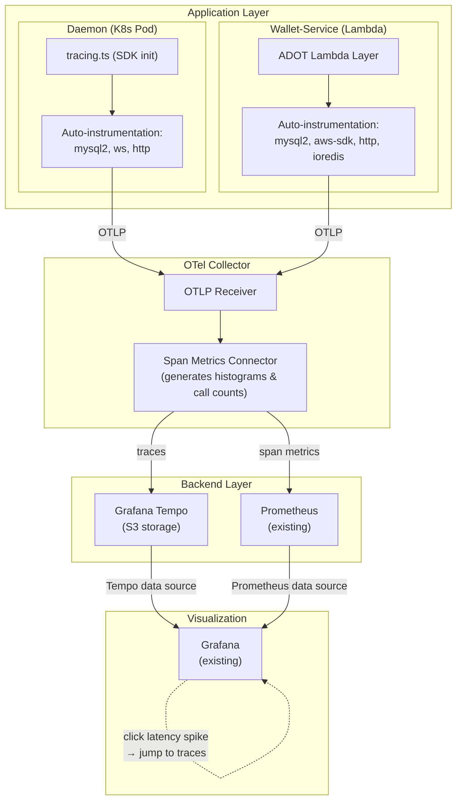

- Feature Name: opentelemetry_observability
- Start Date: 2026-03-05
- RFC PR:
- Hathor Issue:
- Author: Andre Cardoso <andre@hathor.network>

# Summary
[summary]: #summary

Add distributed tracing, metrics, and structured logging to the wallet-service monorepo using OpenTelemetry (OTel), the CNCF-graduated vendor-neutral observability standard. This gives us end-to-end visibility into request latencies, database query durations, and cross-component call chains across the daemon (K8s) and wallet-service (Lambda) packages — without locking us into any specific backend.

# Motivation
[motivation]: #motivation

We are currently blind to performance characteristics of the wallet-service. When something is slow, we have no way to know *which* function or query is the bottleneck. Our observability today is limited to:

- **Winston text logs** — no structured latency data, no correlation across components.
- **One Prometheus metric** (`best_block_height`) — tells us nothing about request performance.
- **CloudWatch alarms** — coarse Lambda-level metrics (duration, errors), no breakdown by handler logic or DB query.
- **No distributed tracing** — a request that flows from API Gateway → Lambda → MySQL → Redis → SQS is invisible as a whole.

This means:

1. **Incident diagnosis is slow.** When users report "the wallet is slow," we grep logs and guess. We cannot answer "which DB query took 3 seconds?" or "is Redis the bottleneck?"
2. **Performance regressions go unnoticed.** Without latency histograms, we cannot track p50/p95/p99 over time.
3. **Capacity planning is guesswork.** We do not know the actual load profile of our DB pool or Lambda concurrency.

The expected outcome is a system where any developer can pull up a trace for a specific API call and see the full breakdown: middleware time, handler logic, each DB query, Redis calls, SQS publishes — with durations attached to each span.

# Guide-level explanation
[guide-level-explanation]: #guide-level-explanation

## What changes for developers

### Automatic instrumentation (zero code changes)

Most observability comes for free. By loading OTel auto-instrumentation at startup, every outgoing MySQL query, HTTP request, Redis call, and AWS SDK call is automatically traced. Developers do not need to modify existing handler code.

**Daemon** — add a `tracing.ts` file that initializes the OTel SDK and import it before all other imports in the entrypoint. See Reference-level explanation for the full code.

**Wallet-service Lambdas** — add the ADOT (AWS Distro for OpenTelemetry) Lambda layer. It wraps every handler automatically via environment variables — no code changes to individual functions.

### Adding custom spans (when needed)

For business-critical paths, developers can add custom spans to get more granular visibility:

```typescript
import { trace } from '@opentelemetry/api';

const tracer = trace.getTracer('wallet-service');

async function handleVoidedTx(tx: Transaction) {
  return tracer.startActiveSpan('handleVoidedTx', async (span) => {
    span.setAttribute('tx.id', tx.tx_id);
    span.setAttribute('tx.inputs_count', tx.inputs.length);
    try {
      // ... existing logic
    } finally {
      span.end();
    }
  });
}
```

### Viewing traces

Developers query traces in the chosen backend (see Reference-level explanation). A typical workflow:

1. User reports a slow API call.
2. Developer searches traces by `http.route = /wallet/addresses` and sorts by duration.
3. The trace shows: Lambda cold start (400ms) → middleware (5ms) → MySQL query (2.3s) → response (1ms).
4. Root cause: a missing index on the query that took 2.3s.

## What changes operationally

- A collector sidecar (or ADOT Lambda layer) runs alongside each component.
- **Traces** are stored in **Grafana Tempo** (backed by S3) and queried from our existing Grafana instance.
- **Span-derived metrics** (latency histograms, call counts per endpoint) are generated by the OTel Collector's Span Metrics Connector and scraped by our existing **Prometheus** — no new metrics infrastructure needed.
- Dashboards in Grafana show p50/p95/p99 latencies per endpoint, per DB query, per external call. Clicking a latency spike jumps directly to the traces that caused it (Tempo ↔ Prometheus correlation).
- Alerts fire on latency SLO breaches (e.g., p99 > 5s for any API endpoint) using existing Grafana alerting.

# Reference-level explanation
[reference-level-explanation]: #reference-level-explanation

## Architecture overview



Since we already run Grafana and Prometheus, the only new infrastructure component is **Grafana Tempo**. Tempo stores traces in S3 (cost-effective, no dedicated database) and integrates natively with Grafana as a data source. The OTel Collector's **Span Metrics Connector** automatically generates latency histograms and call count metrics from traces, which are scraped by our existing Prometheus. This gives us:

- **Metrics** (Prometheus → Grafana): aggregate p50/p95/p99 latencies, error rates, throughput — generated automatically from traces.
- **Traces** (Tempo → Grafana): per-request drill-down with full span breakdown.
- **Correlation**: click a latency spike in a Prometheus graph → Grafana jumps to the exact traces from that time window.

## Package dependencies

All packages are from the `@opentelemetry` namespace (JS SDK 2.0, stable tracing API):

**Core (both packages):**
- `@opentelemetry/api` — vendor-neutral tracing API (singleton, one version per process)
- `@opentelemetry/sdk-node` — SDK initialization, span processors, resource detection

**Auto-instrumentation:**
- `@opentelemetry/auto-instrumentations-node` — meta-package that includes instrumentations for mysql2, http, ioredis, aws-sdk, and more

**Exporters:**
- `@opentelemetry/exporter-trace-otlp-http` — sends spans to the OTel Collector (which forwards to Tempo)
- `@opentelemetry/exporter-trace-otlp-grpc` — gRPC alternative (lower overhead, higher throughput)

**Lambda-specific:**
- AWS ADOT Lambda layer (managed by AWS, no npm dependency needed)
- `disableAwsContextPropagation: true` must be set unless using X-Ray as the backend

## Daemon instrumentation

The daemon is a long-running K8s pod. OTel SDK initializes once at startup.

**Initialization (`packages/daemon/src/tracing.ts`):**

```typescript
import { NodeSDK } from '@opentelemetry/sdk-node';
import { getNodeAutoInstrumentations } from '@opentelemetry/auto-instrumentations-node';
import { OTLPTraceExporter } from '@opentelemetry/exporter-trace-otlp-http';
import { BatchSpanProcessor } from '@opentelemetry/sdk-trace-node';
import { Resource } from '@opentelemetry/resources';

const sdk = new NodeSDK({
  resource: new Resource({
    'service.name': process.env.OTEL_SERVICE_NAME || 'wallet-service-daemon',
    'service.version': process.env.SERVICE_VERSION || 'unknown',
    'deployment.environment': process.env.STAGE || 'local',
  }),
  spanProcessor: new BatchSpanProcessor(
    new OTLPTraceExporter({
      url: process.env.OTEL_EXPORTER_OTLP_ENDPOINT,
    }),
    {
      maxQueueSize: 2048,
      maxExportBatchSize: 512,
      scheduledDelayMillis: 5000,
    },
  ),
  instrumentations: [
    getNodeAutoInstrumentations({
      '@opentelemetry/instrumentation-fs': { enabled: false },
      '@opentelemetry/instrumentation-dns': { enabled: false },
    }),
  ],
});

sdk.start();

process.on('SIGTERM', () => sdk.shutdown());
```

Key decisions:
- `BatchSpanProcessor` (not `SimpleSpanProcessor`) for production — buffers spans and exports in batches to minimize overhead.
- Disable `fs` and `dns` instrumentations — they generate noise without value for our use case.
- Graceful shutdown on SIGTERM to flush pending spans.

**Custom spans for critical paths:**

Add manual spans to the event handlers in `services/` (e.g., `handleVoidedTx`, `handleVertexAccepted`) and to the SyncMachine transitions. These are the paths where we most need latency visibility.

## Wallet-service Lambda instrumentation

**Option A — ADOT Lambda Layer (recommended):**

Add the ADOT layer ARN to the Serverless Framework configuration:

```yaml
# serverless.yml
provider:
  layers:
    - arn:aws:lambda:${region}:901920570463:layer:aws-otel-nodejs-amd64-ver-1-18-1:1
  environment:
    AWS_LAMBDA_EXEC_WRAPPER: /opt/otel-handler
    OPENTELEMETRY_COLLECTOR_CONFIG_FILE: /var/task/collector.yaml
```

This wraps every Lambda handler automatically. No code changes to individual functions.

**Option B — Manual SDK init (if ADOT layer overhead is unacceptable):**

Initialize the OTel SDK on cold start and add a Middy middleware to set span attributes (`lambda.function`, `http.route`) per invocation.

**Cold start overhead:** ADOT layer adds 200-800ms to cold starts. Warm invocations add <10ms.

## Collector deployment

**For the daemon (K8s):** Deploy the OTel Collector as a sidecar container in the same pod, or as a DaemonSet. The collector receives spans via OTLP, generates span-derived metrics via the Span Metrics Connector, and forwards traces to Tempo.

```yaml
# otel-collector-config.yaml
receivers:
  otlp:
    protocols:
      http:
        endpoint: 0.0.0.0:4318

connectors:
  spanmetrics:
    histogram:
      explicit:
        buckets: [5ms, 10ms, 25ms, 50ms, 100ms, 250ms, 500ms, 1s, 2.5s, 5s, 10s]
    dimensions:
      - name: http.route
      - name: db.statement

exporters:
  otlphttp/tempo:
    endpoint: http://tempo:4318
  prometheus:
    endpoint: 0.0.0.0:8889  # Prometheus scrapes this

service:
  pipelines:
    traces:
      receivers: [otlp]
      exporters: [otlphttp/tempo, spanmetrics]
    metrics:
      receivers: [spanmetrics]
      exporters: [prometheus]
```

**For Lambdas:** The ADOT layer includes an embedded collector. Configuration is via a `collector.yaml` file bundled with the deployment, configured to export to the same Tempo endpoint.

## Metrics

Most metrics come for free from the Span Metrics Connector — it automatically generates per-route latency histograms and call counts from trace data, exported to our existing Prometheus. No application code needed.

**Auto-generated from spans (via Span Metrics Connector → Prometheus):**
- `traces_spanmetrics_latency` — histogram of span durations, broken down by `service.name`, `span.name`, `http.route`, `status_code`
- `traces_spanmetrics_calls_total` — counter of span calls

**Custom application metrics (phase 2, via OTel Metrics SDK → Prometheus):**
- `daemon.event.processing.duration` — histogram for event processing time
- `daemon.sync.lag` — gauge showing how far behind the daemon is from the fullnode tip

These custom metrics are exported via the same OTel Collector and scraped by Prometheus alongside the span-derived metrics.

## Log correlation

Inject trace IDs into existing Winston logs so that log lines can be linked to their parent trace in Grafana. OTel provides this via `@opentelemetry/instrumentation-winston`, which automatically adds `trace_id` and `span_id` fields to every log entry. No changes to existing `logger.info(...)` calls — the instrumentation patches Winston at startup.

In Grafana, this enables "Logs for this trace" — click a trace in Tempo and see the corresponding log lines from Loki or CloudWatch.

## Local development

Developers can view traces locally without deploying infrastructure by using the **console exporter** (prints spans to stdout) or running a local **Jaeger all-in-one** container:

```bash
docker run -d --name jaeger -p 16686:16686 -p 4318:4318 jaegertracing/all-in-one:latest
```

Set `OTEL_EXPORTER_OTLP_ENDPOINT=http://localhost:4318` and traces appear at `http://localhost:16686`. This makes it easy to debug span hierarchy and timing during development.

## Grafana dashboards

### Dashboard 1: API Overview

High-level health of the wallet-service Lambda endpoints.

**Panels:**
- Request rate (req/s) by endpoint — timeseries
- Latency heatmap (all endpoints) — shows distribution over time, hot spots = slow requests
- p50 / p95 / p99 latency by endpoint — timeseries
- Error rate (%) by endpoint — timeseries
- Top 10 slowest endpoints — table, sorted by p99

**Data source:** Prometheus (span-derived metrics from Span Metrics Connector)

### Dashboard 2: Database Performance

Visibility into MySQL query performance across both daemon and Lambdas.

**Panels:**
- Query duration heatmap — all queries, spot outliers instantly
- p50 / p95 / p99 query duration by `db.statement` — timeseries
- Slowest queries — table with statement, avg duration, call count
- Query rate (queries/s) — timeseries
- Active connections — gauge (from mysql2 pool metrics)

**Data source:** Prometheus (span-derived metrics filtered by `span.name` matching `mysql.*`)

### Dashboard 3: Daemon Sync

Daemon-specific health and performance.

**Panels:**
- Event processing duration (p50/p95/p99) — timeseries
- Event processing rate (events/s) — timeseries
- Sync lag (blocks behind fullnode tip) — gauge
- Void handling duration — timeseries
- Reorg handling duration — timeseries
- WebSocket connection status — state timeline

**Data source:** Prometheus (mix of span-derived and custom daemon metrics)

### Dashboard 4: External Dependencies

Redis, SQS, and other outbound calls.

**Panels:**
- Redis command duration (p50/p95/p99) — timeseries
- Redis hit/miss ratio — timeseries (if available from custom spans)
- SQS publish duration — timeseries
- SQS message count — timeseries
- Lambda-to-Lambda invoke duration — timeseries
- External dependency error rate — timeseries

**Data source:** Prometheus (span-derived metrics filtered by `span.name` matching `redis.*`, `sqs.*`, etc.)

### Alerts

All alerts use Grafana Alerting, evaluated against Prometheus metrics.

| Alert | Condition | Severity |
|---|---|---|
| API latency SLO breach | p99 > 5s for any endpoint over 5 min | Critical |
| High error rate | Error rate > 5% for any endpoint over 5 min | Critical |
| Slow DB queries | p95 query duration > 2s over 5 min | Warning |
| Daemon sync lag | Sync lag > 100 blocks for 10 min | Critical |
| Daemon event processing stuck | p99 processing duration > 60s over 5 min | Warning |
| Redis latency spike | p95 > 500ms over 5 min | Warning |
| Lambda cold start regression | Avg cold start > 2s over 15 min | Info |

All alerts link to the relevant dashboard panel for immediate drill-down. Critical alerts route to PagerDuty/Slack; warnings and info route to Slack only.

## Sampling strategy

For production, use a **tail-based sampling** strategy at the collector level:

- Always keep traces with errors or high latency (>2s).
- Sample 10% of successful, fast traces.
- Always keep traces from critical paths (void handling, reorgs).

This keeps storage costs manageable while ensuring we never miss problematic traces.

## Infrastructure changes

Changes required in `ops-tools`:

**1. Deploy Grafana Tempo** — new Flux HelmRelease (same pattern as `kube-prometheus`):
- `kubernetes/infrastructure/tempo/helm-repo.yml` — Grafana Helm repo
- `kubernetes/infrastructure/tempo/helm-release.yml` — Tempo chart, S3 backend config
- `kubernetes/infrastructure/tempo/namespace.yml`

**2. Add Tempo data source to Grafana** — extend the `kube-prometheus` HelmRelease values in `kubernetes/infrastructure/kube-prometheus/helm-release.yml` to include a Tempo data source with `tracesToMetrics` linking to the existing Prometheus.

**3. Add OTel Collector sidecar to daemon** — modify the StatefulSet in `kubernetes/apps/hathor-wallet-service/base/deployment.yml`:
- Add a second container (`otel/opentelemetry-collector-k8s`) with OTLP receiver on ports 4317/4318
- Must match existing security context (non-root uid 10001, read-only rootfs)
- Lightweight resources (~64Mi request, ~128Mi limit)
- Add a ConfigMap for the collector config (receivers, Span Metrics Connector, exporters to Tempo + Prometheus)

**4. Update network policies** — `kubernetes/apps/hathor-wallet-service/base/network-policies.yml`:
- Allow egress from the daemon pod to Tempo (port 4317)
- Allow egress to Prometheus (port 8889 for span metrics scrape)

**5. Add OTel env vars** — add `OTEL_EXPORTER_OTLP_ENDPOINT=http://localhost:4318` to the daemon environment files (per-overlay in Kustomize).

## Rollout plan

1. **Infrastructure:** Deploy Grafana Tempo (backed by S3) and configure it as a data source in our existing Grafana. Deploy OTel Collector with Span Metrics Connector and Prometheus exporter.
2. **Daemon tracing:** Add `tracing.ts`, deploy with OTLP exporter pointing to the collector. Validate spans appear in Tempo via Grafana.
3. **Lambda tracing:** Add ADOT layer to staging Lambdas. Validate traces for API calls. Measure cold start impact.
4. **Grafana dashboards:** Build dashboards using span-derived metrics from Prometheus: p50/p95/p99 latencies per endpoint, DB query duration distributions, error rates. Configure trace-to-metrics links.
5. **Custom spans:** Add manual spans to critical paths: `handleVoidedTx`, `handleVertexAccepted`, balance validation, reorg handling.
6. **Production rollout:** Enable in production with tail-based sampling. Set up alerting on SLO breaches. Monitor overhead.

Each phase can be rolled back independently by removing the layer/import.

# Drawbacks
[drawbacks]: #drawbacks

- **Cold start overhead for Lambdas.** ADOT adds 200-800ms to cold starts. For infrequently-called functions this could be noticeable. Mitigated by provisioned concurrency for critical endpoints.
- **Dependency footprint.** `@opentelemetry/auto-instrumentations-node` pulls in many sub-packages. Increases bundle size by ~5-10MB for the daemon (acceptable for K8s), more concerning for Lambda deployment packages.
- **Operational complexity.** Running a collector, Tempo, and ADOT adds components to monitor. If the collector is down, traces are lost (though the application continues to function). Tempo itself is lightweight (single binary, S3 storage) but still requires deployment and monitoring.
- **Learning curve.** Team needs to learn OTel concepts (spans, traces, context propagation, sampling). The API is stable but the ecosystem moves fast.
- **Storage costs.** Traces generate significant data volume. Without sampling, costs can grow quickly. Tail-based sampling mitigates this but adds collector complexity.

# Rationale and alternatives
[rationale-and-alternatives]: #rationale-and-alternatives

**Why OpenTelemetry?**

- **CNCF graduated** (same level as Kubernetes, Prometheus) — not going away.
- **Vendor-neutral** — we can switch backends (X-Ray → Tempo → Jaeger) without changing application code.
- **Auto-instrumentation** — mysql2, ioredis, aws-sdk, http are all covered out of the box. This means 80% of the value (DB query durations, HTTP call latencies) requires zero code changes.
- **Industry standard** — OTel has become the de facto standard for observability. AWS, GCP, Azure, Datadog, Grafana, and others all support it natively.

**Alternatives considered:**

1. **AWS X-Ray SDK directly** — Simpler setup for Lambda, but locks us into AWS. No standard API; switching to another backend would require rewriting instrumentation. X-Ray can still be used as a *backend* with OTel as the *instrumentation layer*.

2. **Datadog / New Relic / Honeycomb (commercial APM)** — Excellent developer experience but expensive at scale ($15-25/host/month + trace ingestion fees). Vendor lock-in. OTel can export to these if we decide to use them later.

3. **Manual logging with structured JSON** — Cheapest option, but no distributed tracing, no automatic span correlation, no flame graphs. We would need to manually add timing to every function we care about and build our own dashboards. Does not scale.

4. **Prometheus + custom metrics only** — Good for aggregate metrics but no per-request traces. Cannot answer "why was *this specific request* slow?" Only answers "what is the average latency?" Complementary to OTel, not a replacement.

**Impact of not doing this:**

We continue operating blind. Incident response remains slow (hours of log-grepping). Performance regressions ship undetected. Capacity planning remains guesswork.

# Prior art
[prior-art]: #prior-art

- **AWS ADOT Lambda layers** are officially supported and recommended over the X-Ray SDK for new projects.
- **Grafana Tempo** was designed as an OTel-native trace backend with S3 storage. Widely adopted in the Kubernetes ecosystem.
- **Node.js OTel in production** is used by Stripe, GitHub, and Shopify. The JS SDK 2.0 (March 2025) stabilized the tracing API.
- **OTel Collector as sidecar** is the standard Kubernetes pattern for decoupling applications from trace backends.

# Unresolved questions
[unresolved-questions]: #unresolved-questions

- **ADOT layer cold start impact in our specific Lambdas.** The 200-800ms range is from AWS documentation. We need to benchmark with our actual deployment packages to get exact numbers.

- **Sampling rates for production.** 10% baseline sampling is a starting point. The right rate depends on our trace volume and storage budget, which we will learn after the staging rollout.

- **Trace context propagation between daemon and Lambdas.** The daemon calls Lambdas via AWS SDK (SQS, direct invoke). OTel auto-instruments aws-sdk, but we need to verify that trace context propagates correctly through SQS messages so that daemon traces connect to Lambda traces.

- **Should we replace Winston with OTel Logs?** OTel Logs in the JS SDK are still experimental. For now, keep Winston and correlate logs with traces via trace IDs injected into log lines. Revisit when OTel Logs stabilize.

# Future possibilities
[future-possibilities]: #future-possibilities

- **SLO-based alerting.** Define SLOs (e.g., "99% of /wallet/balance requests < 500ms") and alert on burn rate rather than raw thresholds.
- **Business metrics from spans.** Extract custom metrics from trace data (transactions/s, reorg depth, void throughput) without duplicating collection in application code.
- **Shared tracing package.** Create `@wallet-service/tracing` in the monorepo with pre-configured OTel setup and common span attributes for consistent instrumentation.
- **Extend to event-downloader.** The new `event-downloader` package could also benefit from tracing.
