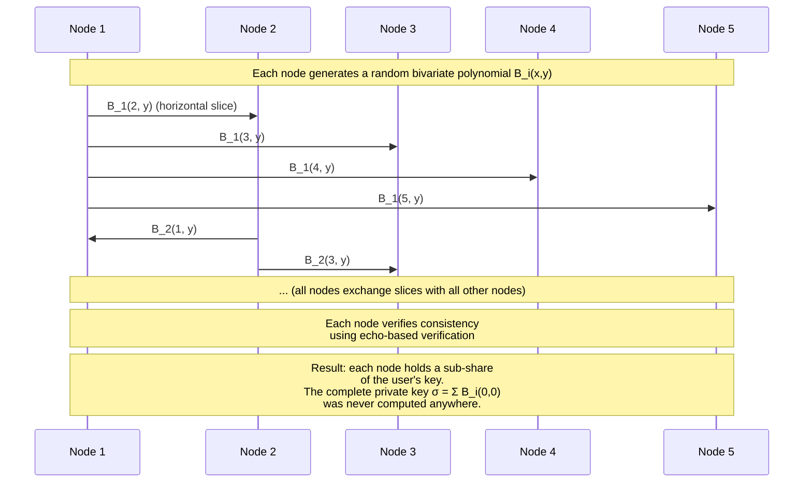
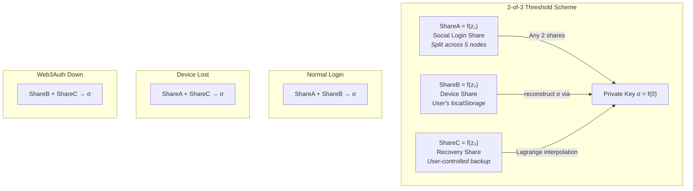
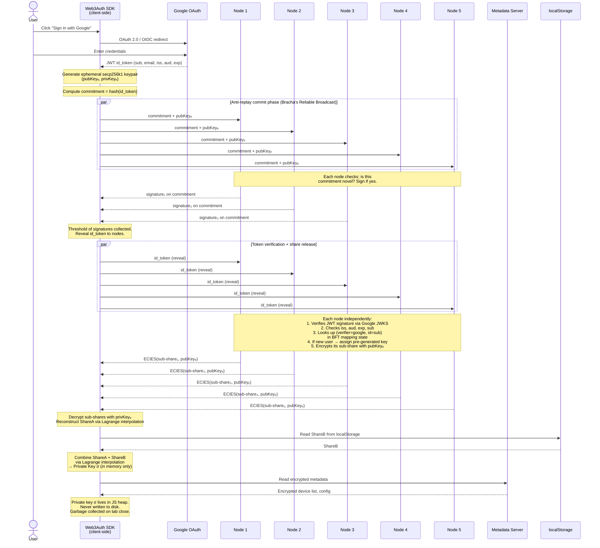
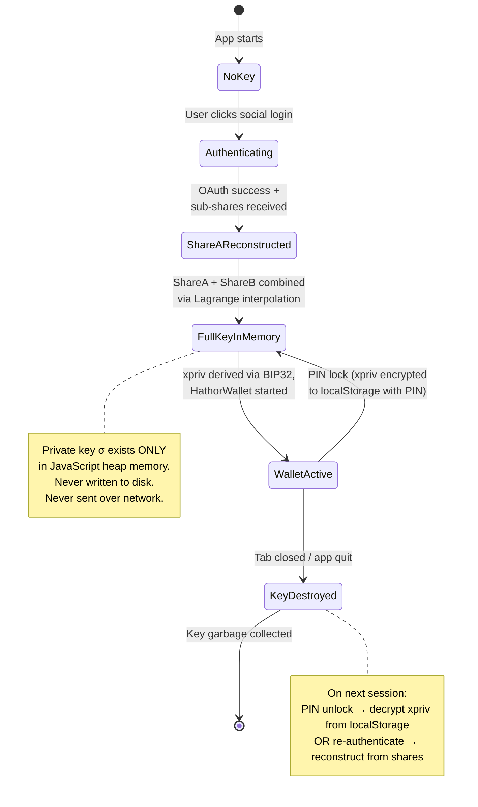
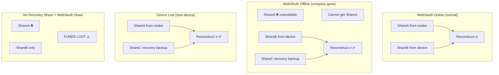
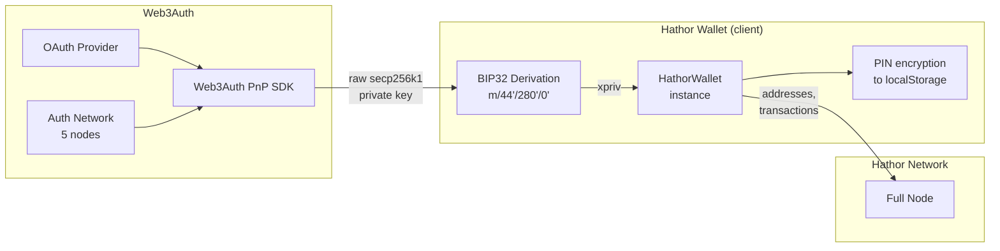

- Feature Name: web3auth_social_login
- Start Date: 2026-03-15
- RFC PR:
- Hathor Issue:
- Author: André Cardoso <andre@hathor.network>

# Summary
[summary]: #summary

Integrate Web3Auth into the Hathor desktop wallet to allow users to create and access wallets via social login (Google, Apple, email, etc.) instead of managing 24-word seed phrases. Web3Auth splits the user's private key into multiple shares using a threshold scheme, so no single party (including Web3Auth) ever holds the full key. The user authenticates with a familiar social provider, and the wallet reconstructs the key client-side from the social login share and a device share — providing a non-custodial UX that feels custodial.

# Motivation
[motivation]: #motivation

Seed phrases are the single biggest barrier to mainstream adoption of self-custodial wallets. Users lose them, screenshot them, or never write them down. This creates two problems: (1) new users are intimidated by the onboarding flow and abandon it, and (2) existing users lose access to funds when devices are lost or replaced.

Web3Auth solves this by replacing seed phrase management with social login. The expected outcomes are:

- **Lower onboarding friction**: Users sign in with Google/Apple instead of writing down 24 words.
- **Reduced fund loss**: Key recovery is tied to the user's social identity, not a piece of paper.
- **Non-custodial guarantee preserved**: Hathor and Web3Auth never have access to the full private key.
- **Existing wallet compatibility**: Users can still import/export seed phrases for power-user workflows and interoperability with other Hathor wallets.

# Guide-level explanation
[guide-level-explanation]: #guide-level-explanation

## User experience

When a user opens the Hathor wallet for the first time, they will see a new option alongside "Software Wallet" and "Hardware Wallet":

- **Social Login** — Create or access a wallet using Google, Apple, email, or other social providers.

### Creating a wallet with social login

1. User selects "Social Login" on the wallet type screen.
2. A Web3Auth modal opens (or an embedded UI, depending on SDK choice). The user picks a provider (e.g., Google).
3. The user authenticates with the provider in a popup/redirect flow.
4. Web3Auth reconstructs the private key client-side from two shares (social share + device share).
5. The wallet derives the Hathor xpriv from the reconstructed key and starts normally.
6. The user is prompted to set a PIN (same as the current software wallet flow) for local session locking.
7. The wallet is ready — no seed phrase needed.

### Returning to the wallet

On subsequent visits, the user unlocks with their PIN (if the device share is present). If the user clears browser data or uses a new device, they re-authenticate via social login to retrieve the social share, and Web3Auth prompts them to set up a new device share.

### Recovery

If the user loses their device:
1. They authenticate via social login on a new device (retrieves social share from Web3Auth Auth Network).
2. They use their recovery share (set up during onboarding — e.g., a backup file, security question, or secondary device).
3. The key is reconstructed and the wallet is restored.

### Exporting to a standard wallet

Advanced users can export their private key or derive seed words from it, allowing migration to any standard Hathor wallet. This is an opt-in power-user feature.

### Impact on existing flows

- The existing "Software Wallet" and "Hardware Wallet" paths remain unchanged.
- Social login is a new, parallel onboarding path that produces the same wallet object (`HathorWallet`) internally.
- All downstream features (token management, nano contracts, atomic swaps) work identically regardless of how the wallet was created.

## Concepts

- **Social Share (ShareA)**: A key share managed by the Web3Auth Auth Network. It is itself split across 5 nodes — no single node holds the complete social share. Released only when the user successfully authenticates via OAuth.
- **Device Share (ShareB)**: A key share stored locally on the user's device (browser localStorage or Electron secure storage).
- **Recovery Share (ShareC)**: A backup key share the user controls — stored as a file, derived from a security question, or held on a secondary device.
- **Threshold**: 2-of-3 shares are needed to reconstruct the private key. Any combination of two shares works.

# Reference-level explanation
[reference-level-explanation]: #reference-level-explanation

## How Web3Auth works — infrastructure deep dive

### The Auth Network: servers and nodes

Web3Auth's Auth Network (formerly the Torus Network) is the infrastructure that manages the social login share. It currently consists of **5 nodes on Sapphire Mainnet**:

| Node | Endpoint |
|------|----------|
| Node 1 | `https://node-1.node.web3auth.io` |
| Node 2 | `https://node-2.node.web3auth.io` |
| Node 3 | `https://node-3.node.web3auth.io` |
| Node 4 | `https://node-4.node.web3auth.io` |
| Node 5 | `https://node-5.node.web3auth.io` |

Each node exposes several JSON-RPC service paths:
- `/sss/jrpc` — Shamir Secret Sharing operations (key retrieval)
- `/rss` — Resharing/Recovery operations
- `/tss` — Threshold Signature Scheme (DKLS19, for ECDSA/secp256k1)
- `/tss-frost` — FROST TSS (for Ed25519)

**All 5 nodes are operated by Web3Auth (Torus Labs).** The nodes are geographically distributed (US-East, US-West, Singapore, South America, Europe) but are not operated by independent parties. This is a critical trust assumption discussed in the Drawbacks section.

The node list is anchored on-chain via a smart contract on Ethereum mainnet (`0xf20336e16B5182637f09821c27BDe29b0AFcfe80`), which acts as a registry. Node membership is governed by epochs, but in practice changes are controlled by the Web3Auth team.

Beyond the 5 Auth Network nodes, the Web3Auth SDK also connects to:

| Service | Endpoint | Purpose |
|---------|----------|---------|
| Metadata server | `https://api.web3auth.io/metadata-service` | Key-value store for encrypted metadata (share commitments, device list, threshold config) |
| Session server | `https://session.web3auth.io` | WebSocket-based session management |
| Signer service | `https://api.web3auth.io/signer-service` | Transaction signing coordination |
| Node discovery | `https://api.web3auth.io/fnd-service` | Fetches current node list and endpoints |
| Auth service | `https://api.web3auth.io/authjs-service` | OAuth flow backend |

The node software is written in Go (open-source at `github.com/torusresearch/torus-node`) and uses **Tendermint BFT** consensus for inter-node agreement and **libp2p** for peer-to-peer DKG (Distributed Key Generation) messaging.

### How keys are generated — Distributed Key Generation (DKG)

When a user signs up for the first time, no single machine ever generates or sees the complete private key. Instead, the 5 nodes collectively perform a **Distributed Key Generation (DKG)** protocol based on Asynchronous Verifiable Secret Sharing (AVSS, Cachin et al. 2002):



The result: the user's private key `σ` is defined as the sum of the constant terms of each node's polynomial, but no single node (or any single machine) ever computes this sum. Each node only knows its own contribution.

Keys are pre-generated in batches so that assignment to new users is fast (no DKG needed at login time).

### How the key is split — Shamir Secret Sharing math

The user's key is protected by a **(2,3) Shamir Secret Sharing** scheme over the finite field `Zq` (where `q` is the order of the secp256k1 curve group):

**Polynomial construction:**
A degree-1 polynomial is defined: `f(z) = a₁·z + σ` over `Zq`, where `σ = f(0)` is the private key scalar.

**Three shares are computed at distinct evaluation points:**
- `ShareA = f(z₁)` — the social login share (distributed across the 5 nodes)
- `ShareB = f(z₂)` — stored on the user's device
- `ShareC = f(z₃)` — recovery/backup share controlled by the user

**Reconstruction via Lagrange interpolation:**
Given any 2 shares, e.g., `f(zᵢ)` and `f(zⱼ)`, reconstruct:

```
σ = f(0) = f(zᵢ) · Lⱼ(0) + f(zⱼ) · Lᵢ(0)
```

where `Lᵢ`, `Lⱼ` are Lagrange basis polynomials evaluated at 0.



### Where each share is physically stored

#### ShareA — Social Login Share (Web3Auth Auth Network)

ShareA is **not stored as a single value on any server**. It is itself distributed across the 5 Auth Network nodes using a 5-of-9 internal threshold. Each node holds a sub-share. When the user authenticates, each node releases its sub-share (encrypted) to the client, which reconstructs ShareA locally.

```
ShareA is NOT stored whole anywhere.
Node 1 holds: sub-share₁ of ShareA
Node 2 holds: sub-share₂ of ShareA
Node 3 holds: sub-share₃ of ShareA
Node 4 holds: sub-share₄ of ShareA
Node 5 holds: sub-share₅ of ShareA
```

Sub-shares are encrypted at rest in each node's database. During retrieval, they are encrypted with the client's ephemeral public key (ECIES/secp256k1) before transmission over the network.

#### ShareB — Device Share

Stored in the user's browser `localStorage` or `IndexedDB` (web) or the OS secure keychain (mobile). In Electron, this could be secured with the `safeStorage` API. The share is a raw scalar value stored as an encrypted blob.

#### ShareC — Recovery Share

Controlled entirely by the user. Web3Auth does not hold this share. Storage options include:
- A downloadable backup file
- Derived deterministically from a security question/password
- Stored on a separate device
- A paper backup

#### Metadata (not a share)

The metadata server (`api.web3auth.io/metadata-service`) stores non-sensitive information:
- Polynomial commitments (`g^a₀`, `g^a₁` — public values, cannot derive shares)
- Share commitments (`g^ShareA`, `g^ShareB`, `g^ShareC` — public values)
- Device list and device metadata
- Threshold configuration (2-of-3)
- Encrypted nonces linking keys across accounts

Metadata is signed by the user's key on write and verified on read. Contents are encrypted with the user's key — Web3Auth can see that data exists for a user but cannot read the encrypted contents without the user's key.

### The full private key is NEVER sent over the network

The full private key `σ` is never transmitted, never stored on any server, and never exists outside the user's device memory. The only things that travel over the network are:
- OAuth tokens (from the social provider to the client and nodes)
- Encrypted sub-shares of ShareA (from each node to the client, encrypted with ephemeral ECIES keys)
- Metadata reads/writes (encrypted, non-sensitive)

### Authentication flow — step by step

Here is exactly what happens when a user clicks "Sign in with Google":



#### Anti-replay protection

The commit-reveal scheme (inspired by Bracha's Reliable Broadcast) prevents replay attacks:
1. A token can only be committed once — if a node has already seen a commitment for a given token hash, it rejects the duplicate.
2. OAuth tokens have short TTL (typically 1 hour for Google id_tokens).
3. The ephemeral keypair ensures intercepted encrypted sub-shares are useless without `privKeyₑ` (which never leaves the client).

#### Key assignment

The BFT mapping layer maintains a consensus-protected state machine mapping `(verifier, verifier_id)` tuples (e.g., `("google", "user@gmail.com")`) to key indexes. When a new user authenticates, nodes reach BFT consensus to assign a pre-generated key from the key buffer. Once assigned, the mapping is permanent.

### Key lifecycle in memory



### Trust model — who must you trust, and with what

| Entity | What you trust them with | What they CANNOT do |
|--------|--------------------------|---------------------|
| **Web3Auth / Torus Labs** (operates all 5 nodes) | Honest execution of the node software; availability of ShareA sub-shares; not modifying node code to exfiltrate sub-shares | Reconstruct the full private key (they only hold ShareA sub-shares, not ShareB or ShareC) |
| **OAuth provider** (Google, Apple, etc.) | Correctly authenticating users; not issuing fraudulent tokens for your identity | Access any key material (they only provide identity attestation) |
| **User's device** | Not being compromised by malware | — (if compromised, ShareB can be extracted from localStorage) |
| **User's browser / Electron runtime** | Faithfully executing the Web3Auth SDK JavaScript | — (malicious browser extensions could read memory) |
| **Web3Auth metadata server** | Honestly storing/returning metadata; not tampering with threshold configurations | Read encrypted metadata contents (encrypted with user's key) |
| **Web3Auth CDN / npm** | Serving unmodified SDK code (supply chain trust) | — (a compromised SDK could exfiltrate the reconstructed key) |
| **Ethereum mainnet** | Accurately reflecting the node registry smart contract | — |

**Critical risk: all nodes operated by one entity.** Since Web3Auth operates all 5 nodes, a sufficiently privileged insider could theoretically modify the node software to log sub-shares as they are released. This would give them ShareA. However, they would still need ShareB (device) or ShareC (recovery) to reconstruct the full key. The risk is mitigated by:
- SOC 2 Type II certification
- Deployed node code is auditable (open-source Go codebase)
- The commit-reveal protocol limits the window for exfiltration

**Could a rogue Web3Auth employee steal funds?** Only if they both (a) exfiltrate ShareA from the node infrastructure AND (b) obtain ShareB from the user's device or ShareC from the user's backup. Getting ShareA alone is insufficient.

### What happens if Web3Auth disappears



- If the user has **ShareB + ShareC**: funds are safe, Web3Auth is bypassed entirely.
- If the user only has **ShareB** and Web3Auth goes down: **funds are lost**. This is why recovery share setup during onboarding is critical.
- The node software is open-source (Go), so in theory replacement nodes could be stood up — but they would need the key share data from the original nodes' databases.

### Security audits and certifications

- **SOC 2 Type II** certification
- **GDPR, CCPA, CPRA** compliance
- Penetration testing reports (available at `trust.web3auth.io`)
- Legal opinion confirming non-custodial status
- DKG Technical Specification published for audit at `github.com/torusresearch/audit`

## Hathor-specific integration

### Architecture overview

Hathor uses secp256k1 keys with BIP44 derivation path `m/44'/280'/0'/0/i`. Web3Auth natively supports secp256k1, so the reconstructed key can be used directly as entropy for Hathor key derivation.

### SDK choice: Core Kit vs PnP

We recommend **PnP (Plug and Play) Web SDK** for the initial integration:

- Faster time-to-market with pre-built auth UI.
- Handles OAuth flows, share management, and device registration out of the box.
- Sufficient for the initial feature; Core Kit can be adopted later for full UI customization.

### Integration flow



### Key derivation from Web3Auth private key

Web3Auth's `CommonPrivateKeyProvider` exposes the raw secp256k1 private key. Since Hathor's `HathorWallet` accepts an `xpriv` parameter, the integration would:

1. Retrieve the raw private key from Web3Auth: `await web3auth.provider.request({ method: "private_key" })`.
2. Use the private key as the master key for BIP32 derivation, producing an xpriv for path `m/44'/280'/0'`.
3. Pass the xpriv to `HathorWallet` via the existing `xpriv` config option (same path used when unlocking from encrypted `mainKey`).
4. The wallet then derives addresses and signs transactions as usual.

Alternatively, the Web3Auth key can be used as entropy to derive a BIP39 mnemonic deterministically. This has the advantage of producing standard 24 words that can be exported, but requires careful implementation to ensure deterministic derivation.

### Changes to existing code

#### New files

- `src/utils/web3auth.js` — Web3Auth SDK initialization, login, logout, key retrieval, and share management helpers.

#### Modified files

- `src/screens/WalletType.js` — Add "Social Login" option alongside "Software Wallet" and "Hardware Wallet".
- `src/screens/` — New screen `SocialLoginWallet.js` for the Web3Auth flow (initialize SDK, trigger login, handle callbacks).
- `src/sagas/wallet.js` — In `startWallet()`, handle the new `web3auth: true` payload variant. The wallet receives an xpriv directly (no seed words or password needed). The PIN is still required for local encryption of the xpriv in localStorage.
- `src/storage.js` — Add a new flag `IS_WEB3AUTH_KEY` to `storageKeys` to distinguish Web3Auth-created wallets from seed-based wallets. This controls whether to show "Export Seed Phrase" (unavailable for Web3Auth wallets unless explicitly derived) vs "Export Private Key" in settings.
- `src/App.js` — Route for the new social login screen.
- `src/components/Settings.js` — Show Web3Auth-specific options (linked social account, recovery share status, key export).

#### Interaction with existing features

| Feature | Impact |
|---|---|
| PIN lock/unlock | Works identically. xpriv is encrypted with PIN in localStorage. |
| Network change | Works identically. The xpriv is network-agnostic; network is set via Connection config. |
| Token management | No impact. Tokens are managed post-wallet-creation. |
| Nano contracts | No impact. |
| Atomic swaps | No impact. |
| Hardware wallet | No interaction. These are separate onboarding paths. |
| Wallet reset | Must also clear Web3Auth device share from localStorage. |
| WalletService facade | Compatible. xpriv can be used with both HathorWallet and HathorWalletServiceWallet. |

### Corner cases

**User clears browser data**: The device share is lost. The user must re-authenticate via social login (gets social share) and use the recovery share. After recovery, a new device share is created.

**Social provider account compromised**: The attacker gets the social share but not the device share. They cannot reconstruct the key without a second share. The user should revoke the compromised social account and re-share using device + recovery shares.

**Web3Auth Auth Network goes down**: The user can still access funds using device share + recovery share (2-of-3 threshold), bypassing Web3Auth entirely.

**User wants to migrate to seed-based wallet**: Export the private key from Web3Auth. Use it to derive a BIP39 mnemonic or import the raw xpriv into a standard Hathor wallet.

**Electron vs browser context**: The Web3Auth PnP SDK supports both browser and Electron environments. In Electron, the OAuth popup is handled via `BrowserWindow`. The device share should be stored in Electron's secure storage (`safeStorage` API) rather than plain localStorage for enhanced security.

# Drawbacks
[drawbacks]: #drawbacks

- **Centralized node operation**: All 5 Auth Network nodes are operated by Web3Auth (Torus Labs). This is a single-entity dependency despite the multi-node architecture. A coordinated compromise of node infrastructure could expose ShareA for all users. This is the most significant trust concern.
- **SSS security model**: In the SSS (non-MPC) tier, the full private key is reconstructed in browser memory during every signing operation. This is vulnerable to memory-based attacks (browser extensions, malware, memory dumps). MPC-TSS avoids this but requires Enterprise pricing.
- **Cost**: Free tier supports 1,000 monthly active wallets. Growth tier ($69/month) supports 3,000. Scale tier ($399/month) supports 10,000. MPC-TSS requires custom Enterprise pricing.
- **Third-party dependency**: Web3Auth is a critical dependency. If their Auth Network permanently goes offline, users without a recovery share lose access to funds.
- **Increased complexity**: A third onboarding path increases maintenance burden and testing surface.
- **User confusion**: Users may not understand the security model. "Sign in with Google" feels custodial, which may lead to false assumptions about recovery (e.g., "Google can recover my funds").
- **Supply chain risk**: The Web3Auth JavaScript SDK runs in the user's browser. A compromised SDK (via CDN or npm) could exfiltrate the reconstructed private key.
- **Key export UX**: Exporting a Web3Auth-derived key to a seed phrase requires extra derivation steps and careful UX to avoid confusion.

# Rationale and alternatives
[rationale-and-alternatives]: #rationale-and-alternatives

## Why Web3Auth

- **Non-custodial by design**: Unlike AWS KMS-based solutions (e.g., Magic), Web3Auth never holds the full key. This aligns with Hathor's self-custody ethos.
- **secp256k1 native support**: No key curve translation needed for Hathor's BIP44/secp256k1 architecture.
- **Censorship resistant**: Users with device + recovery shares can bypass Web3Auth entirely.
- **Battle-tested**: 20M+ monthly active users. Powers MetaMask Embedded Wallets (Consensys acquired Torus Labs, creators of Web3Auth).
- **Electron compatible**: Supports desktop environments, not just browser-only.
- **Open-source node software**: The Go node code is publicly auditable.

## Alternatives considered

### Magic (magic.link)
- Uses AWS KMS for key management — keys are technically in AWS's HSMs.
- Less truly non-custodial than Web3Auth's threshold approach.
- Simpler integration but weaker security guarantees.
- **Rejected because**: Custodial risk conflicts with Hathor's non-custodial stance.

### Privy
- Embedded wallet with social login.
- Strong EVM focus; limited non-EVM support.
- **Rejected because**: Poor fit for non-EVM chains like Hathor.

### Dynamic
- Acquired by Fireblocks (2025). Strong multi-chain support.
- MPC planned but not shipped at time of writing.
- **Rejected because**: Less mature MPC story, primarily EVM-focused.

### Custom MPC implementation
- Build threshold signing in-house using libraries like `tss-lib`.
- Full control, no third-party dependency.
- **Rejected because**: Extremely high engineering effort, ongoing maintenance of cryptographic infrastructure, and security audit costs.

## Impact of not doing this

The wallet continues to require seed phrase management, limiting adoption to crypto-native users comfortable with self-custody mechanics. Mainstream users will prefer custodial alternatives.

# Prior art
[prior-art]: #prior-art

- **MetaMask Embedded Wallets**: MetaMask (via Consensys acquiring Torus Labs) uses Web3Auth's MPC architecture for their embedded wallet product. This is the most prominent production deployment of Web3Auth's technology.
- **Phantom Wallet**: Solana's leading wallet explored social recovery mechanisms, though they ultimately kept seed phrases as the primary flow.
- **Argent (Ethereum)**: Pioneered social recovery for smart contract wallets (guardians-based, not threshold keys). Different approach but similar UX goals.
- **Binance Web3 Wallet**: Uses MPC with three key shares (Binance cloud, device, recovery password). Similar architecture to Web3Auth but proprietary. Demonstrates market demand for seedless wallets.
- **Smart contract wallets (ERC-4337)**: Account abstraction enables social recovery at the contract level. Not applicable to Hathor's UTXO model, but validates the UX direction.

The common lesson from these implementations: users strongly prefer social login over seed phrases, but the security model must be clearly communicated to avoid false expectations about recoverability.

# Unresolved questions
[unresolved-questions]: #unresolved-questions

- **SSS vs MPC-TSS**: Should we start with the free/Growth SSS tier and upgrade to MPC later, or go directly to Enterprise MPC? SSS reconstructs the key in memory; MPC never does. The security difference is significant, but MPC has higher cost and integration complexity.
- **Key-to-seed derivation**: Should we derive a BIP39 mnemonic from the Web3Auth key to enable seed export? If so, what deterministic derivation method? This affects interoperability with other Hathor wallets.
- **Electron secure storage**: How to best secure the device share in Electron? `safeStorage` API encrypts at the OS level, but the integration with Web3Auth's share storage needs investigation.
- **Recovery share UX**: What recovery mechanism should we offer? Options include: downloadable backup file, security questions, secondary device, or email-based recovery. Each has different security/usability tradeoffs.
- **WalletService compatibility**: The WalletService facade requires `acctPathKey` and `authKey`. How to derive these from a Web3Auth key? The current flow generates them from seed words during `initStorage()`.
- **Multi-device sync**: When a user logs in on a second device, how should the device share be provisioned? Web3Auth handles this, but we need to define the UX for Hathor's desktop wallet context.
- **Session management**: How long should a Web3Auth session last before requiring re-authentication? This affects the balance between security and convenience.
- **Recovery share enforcement**: Should onboarding require setting up a recovery share, or allow users to skip it? Skipping means Web3Auth downtime = fund loss.

# Future possibilities
[future-possibilities]: #future-possibilities

- **MPC-TSS upgrade**: Move from SSS to MPC-TSS so the private key is never reconstructed in memory. This is the gold standard for threshold wallet security and would differentiate Hathor's wallet from competitors.
- **Passkey support**: Web3Auth supports passkeys (WebAuthn/FIDO2) as an authentication method. This could replace social login entirely, providing phishing-resistant, device-bound authentication.
- **Mobile wallet integration**: The same Web3Auth integration can be extended to a Hathor mobile wallet (React Native SDK available), enabling cross-device wallet access via the same social identity.
- **Pre-generated wallets**: Web3Auth's Scale tier supports pre-generating wallets before users sign up. This could enable airdrop campaigns or onboarding flows where users receive tokens before creating an account.
- **Fiat on-ramp integration**: Web3Auth's Scale tier includes fiat on-ramp partnerships. Combined with social login, this could provide a complete "zero-to-crypto" onboarding flow.
- **Account abstraction**: If Hathor introduces account abstraction in the future, Web3Auth's social login could be combined with smart contract wallets for enhanced recovery and multi-sig capabilities.
- **Institutional/team wallets**: Web3Auth's threshold architecture could be extended to team wallets where multiple parties each hold a share, requiring multi-party approval for transactions.
- **Independent node operation**: If Web3Auth opens up node operation to third parties, the centralization concern is mitigated. We should monitor this and advocate for it.
