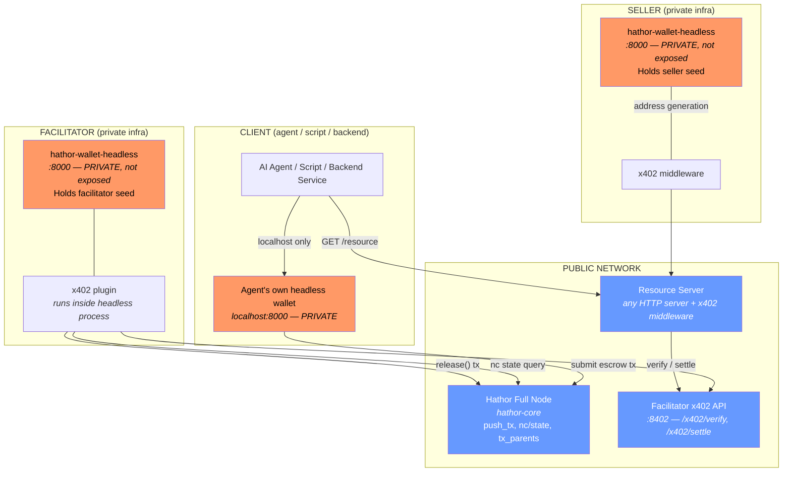
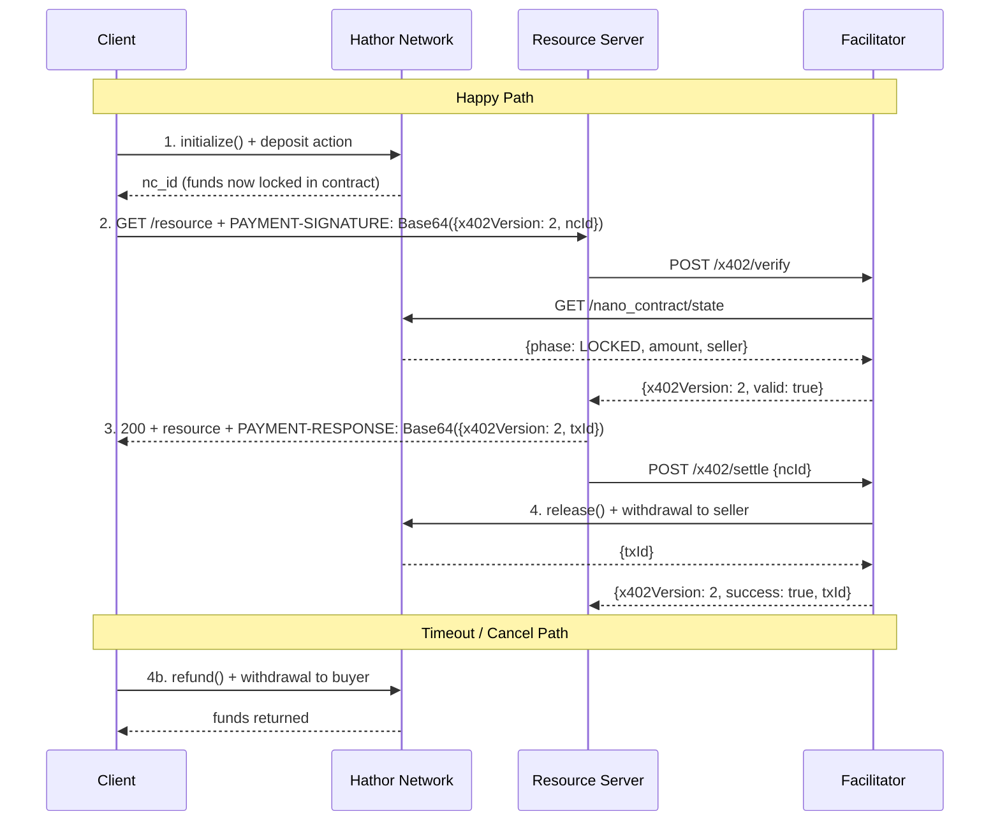
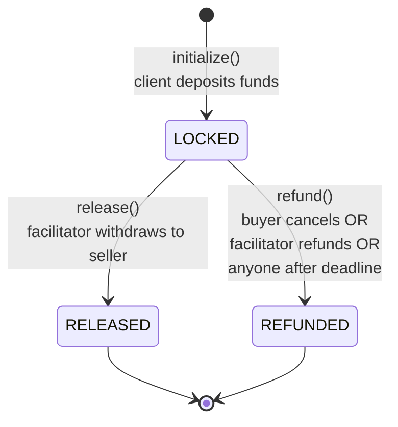
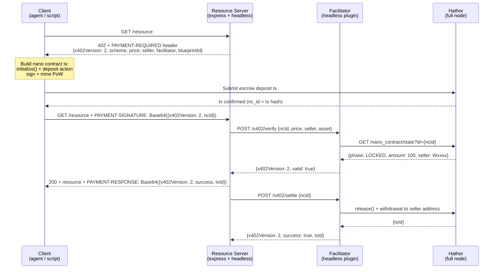
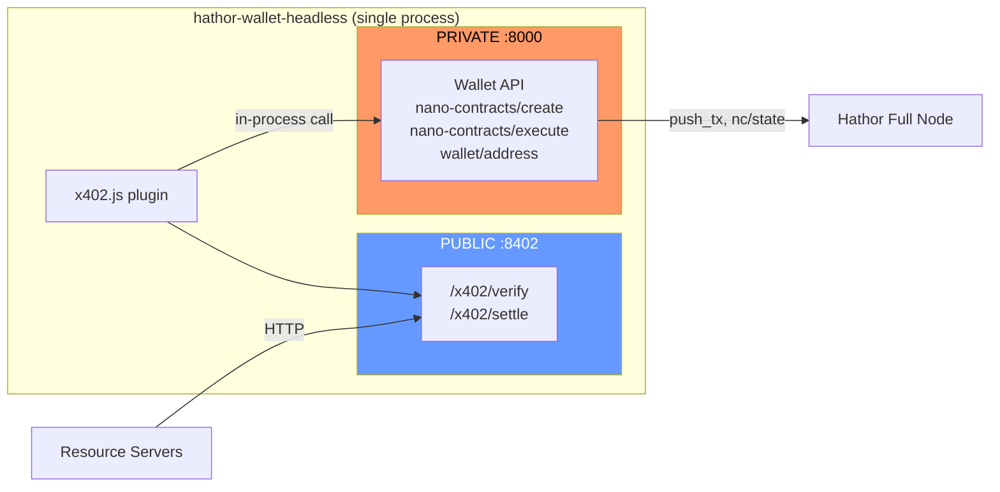
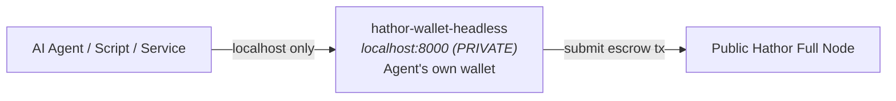

- Feature Name: x402_support
- Start Date: 2026-04-02
- RFC PR: (leave this empty)
- Hathor Issue: (leave this empty)
- Author: Andre Cardoso <andre@hathor.network>

# x402 Protocol Support for Hathor Network

---

## 1. Overview

This document describes the design for adding [x402](https://www.x402.org/) payment protocol support to the [Hathor Network](https://hathor.network/), enabling pay-per-request HTTP APIs settled natively on Hathor's DAG-based L1 blockchain using **nano contract escrow**.

x402 is an open protocol (by the x402 Foundation, co-founded by Coinbase and Cloudflare) that repurposes the HTTP 402 "Payment Required" status code to enable instant, programmatic payments over HTTP. It currently supports Base, Polygon, and Solana. This design adds Hathor as a supported network.

A proof-of-concept implementation is available at [hathornetwork/x402-poc](https://github.com/hathornetwork/x402-poc).

### 1.1 Design Philosophy

**Everything maps to existing Hathor infrastructure.** No generic components — every x402 role is fulfilled by a specific Hathor service:

| x402 Role | Hathor Implementation |
|---|---|
| **Payment mechanism** | Nano contract escrow blueprint (on-chain) |
| **Facilitator** | hathor-wallet-headless + x402 plugin |
| **Client (payer)** | hathor-wallet-headless (private instance) / `@hathor/wallet-lib` |
| **Resource server** | Any HTTP server + Express middleware (uses hathor-wallet-headless) |
| **Payment verification** | Nano contract state query via full node API |
| **Settlement** | Nano contract `release()` method call via headless wallet |
| **Explorer** | hathor-explorer with x402 payment tagging |

### 1.2 Why Nano Contracts (Not Pre-Signed Transactions)

The naive approach for UTXO chains is pre-signed transactions. But this has a fundamental flaw: **the client can double-spend the UTXOs before the facilitator settles**. On EVM chains this is solved by EIP-3009 nonces; on Solana by recent blockhash expiry. Hathor has neither.

Nano contracts solve this completely:

| | Pre-Signed TX | Nano Contract Escrow |
|---|---|---|
| Double-spend risk | **High** — client can spend UTXOs anytime | **Zero** — funds locked on-chain |
| Verification | Off-chain signature check | **On-chain state query** — trustless |
| Refund on timeout | Impossible without timelock hacks | **Built-in** — contract refunds automatically |
| Trust model | Must trust facilitator won't hold tx | **Trustless** — contract enforces rules |
| Multi-party | Hard | **Native** — contract tracks all parties |

### 1.3 What x402 Actually Is

x402 is **machines paying machines**. The client is always code — an AI agent, a script, a backend service. Never a human clicking buttons.

Real use cases today:
- **AI agents paying for API calls** — Agent needs weather data, pays $0.001 per request in stablecoin, no API keys or billing accounts needed
- **MCP tool calls** — Claude Code / AI assistants pay for tool invocations (see `examples/mcp-server/` in the POC repo)
- **Pay-per-crawl** — AI crawlers pay website owners to scrape content
- **API monetization without accounts** — One middleware line, get paid per request

What x402 is NOT:
- Not for humans browsing websites
- Not a payment gateway like Stripe
- Not a wallet-to-wallet transfer protocol
- Mobile/desktop wallets are not x402 clients

### 1.4 Goals

1. Deploy an `X402Escrow` nano contract blueprint on Hathor mainnet
2. Build a facilitator as a hathor-wallet-headless plugin
3. Provide a client SDK for agents and programmatic clients (`@hathor/x402-client`)
4. Provide server middleware backed by hathor-wallet-headless (`@hathor/x402-server`)
5. Follow the x402 specification for interoperability

---

## 2. Architecture

### 2.1 Network Boundaries

Every component is either **public-facing** (reachable from the internet) or **private** (internal only). This matters:



**Legend:** Blue = public-facing | Orange = private, never exposed

### 2.2 Component Mapping

#### The Client (Payer)

**What it is:** The programmatic entity that wants to access a paid resource. Always code — an AI agent, a script, a backend service. Never a human with a wallet app.

**Hathor implementation — the client runs its own private headless wallet:**

- **AI agents / automated clients:** runs **their own private headless instance** on localhost
  - The headless wallet is the agent's local backend — never exposed to the internet
  - Agent calls `POST localhost:8000/wallet/nano-contracts/create` to build the escrow tx
  - The headless instance connects to a public full node to broadcast
  - The `@hathor/x402-client` SDK wraps this: parse 402 → call headless → retry with ncId

- **Programmatic (embedded):** `@hathor/wallet-lib` directly in a Node.js app
  - `NanoContractTransactionBuilder` to build escrow deposit tx
  - Connects to a public full node to broadcast
  - For lightweight clients that don't want to run a full headless instance

#### The Resource Server (Seller)

**What it is:** The HTTP server that sells access to a resource.

**Hathor implementation — the server runs its own private headless wallet:**

- Any HTTP server (Express, Fastify, Hono, Python, Go, etc.)
- Uses **x402 server middleware** (`@hathor/x402-server`) that:
  - Returns 402 with payment requirements
  - On payment retry, calls the **public facilitator API** to verify the escrow
  - After serving the resource, calls the facilitator to settle
- The seller runs a **private hathor-wallet-headless instance** (localhost only, not exposed) for:
  - Generating fresh receiving addresses: `GET localhost:8000/wallet/address`
  - That's it — the headless wallet is just an address generator for the seller
- Alternatively, the seller can hardcode a static receiving address and skip headless entirely

#### The Facilitator

**What it is:** The service that verifies payments and triggers settlement.

**Hathor implementation — a headless wallet plugin with a public-facing HTTP API:**

The facilitator operator runs hathor-wallet-headless with the x402 plugin enabled. This creates two network interfaces:

| Interface | Port | Visibility | Purpose |
|---|---|---|---|
| **headless wallet API** | 8000 | **PRIVATE** (localhost / internal only) | Wallet operations, signing, nano contract execution |
| **x402 plugin API** | 8402 | **PUBLIC** (internet-facing) | `/x402/verify` and `/x402/settle` for resource servers |

The x402 plugin runs **inside** the headless process and calls the headless wallet API internally (in-process, not over HTTP). It exposes only two endpoints to the outside world.

**What the plugin does:**
- **`POST /x402/verify`**: Queries the **public full node** for nano contract state (`GET /nano_contract/state`), validates the escrow matches requirements. No wallet needed for this — it's a read-only check.
- **`POST /x402/settle`**: Calls `release()` on the escrow contract. This requires the facilitator's wallet to sign the transaction. The plugin calls the headless wallet API **internally** to execute the nano contract method.
- **Refund monitor**: Background job that watches for expired escrows and triggers `refund()` via the internal wallet API.

**Why a headless plugin?** The headless wallet already has:
- Full nano contract create/execute API
- Wallet management and signing
- Plugin system with event bus (ws, sqs, rabbitmq)
- Transaction locking to prevent double-execution
- Docker deployment

The facilitator is NOT a separate service — it's a plugin that adds a public API layer on top of a private headless wallet.

#### The Full Node

**What it is:** Hathor full node (hathor-core). **Public-facing.**

Used by everyone:
- **Clients** submit escrow deposit txs (`POST /push_tx`) and query tx parents
- **Facilitator** queries nano contract state (`GET /nano_contract/state`) and submits release/refund txs
- **Explorer** connects for real-time data (WebSocket)

Operators can use Hathor's public nodes (`node.hathor.network`) or run their own.

#### The Explorer

**What it is:** UI for viewing x402 payment activity. **Public-facing.**

**Hathor implementation:** hathor-explorer, with additions:
- Detect X402Escrow contract transactions by blueprint ID
- Show escrow state (LOCKED -> RELEASED / REFUNDED)
- Dashboard for x402 payment volume

---

## 3. X402Escrow Nano Contract Blueprint

This is the heart of the system. A Python nano contract deployed on Hathor.

### 3.1 Blueprint Design

```python
from hathor import Blueprint, Context, public, view, export
from hathor.types import Address, TokenUid, Timestamp, Amount

PHASE_LOCKED = 'LOCKED'
PHASE_RELEASED = 'RELEASED'
PHASE_REFUNDED = 'REFUNDED'


@export
class X402Escrow(Blueprint):
    """
    Escrow contract for x402 payments on Hathor.

    Flow:
    1. Client calls initialize() with a deposit -> funds locked in contract
    2. Resource server serves the resource
    3. Facilitator calls release() -> funds sent to seller
    OR
    3. Timeout expires -> anyone calls refund() -> funds returned to buyer
    """

    # Parties
    buyer: Address
    seller: Address
    facilitator: Address

    # Payment details
    token_uid: TokenUid
    amount: Amount

    # Escrow state
    phase: str
    deadline: Timestamp

    # Resource metadata (for verification)
    resource_url: str
    request_hash: str

    @public(allow_deposit=True)
    def initialize(
        self,
        ctx: Context,
        seller: Address,
        facilitator: Address,
        token_uid: TokenUid,
        deadline: Timestamp,
        resource_url: str,
        request_hash: str,
    ) -> None:
        """
        Client deposits funds to create an escrow.

        Called by: the buyer (client/payer)
        Actions: deposit of payment token
        """
        action = ctx.get_single_action(token_uid)
        if not isinstance(action, NCDepositAction):
            raise NCFail("Must include a deposit action")

        self.buyer = ctx.get_caller_address()
        self.seller = seller
        self.facilitator = facilitator
        self.token_uid = token_uid
        self.amount = action.amount
        self.phase = PHASE_LOCKED
        self.deadline = deadline
        self.resource_url = resource_url
        self.request_hash = request_hash

    @public(allow_withdrawal=True)
    def release(self, ctx: Context) -> None:
        """
        Release escrowed funds to the seller.

        Called by: the facilitator (after verifying resource was served)
        Actions: withdrawal of payment token to seller address
        """
        caller = ctx.get_caller_address()
        if caller != self.facilitator:
            raise NCFail("Only the facilitator can release funds")

        if self.phase != PHASE_LOCKED:
            raise NCFail(f"Escrow is not locked (phase={self.phase})")

        action = ctx.get_single_action(self.token_uid)
        if not isinstance(action, NCWithdrawalAction):
            raise NCFail("Must include a withdrawal action")
        if action.amount != self.amount:
            raise NCFail(f"Withdrawal amount must equal escrow amount ({self.amount})")

        self.phase = PHASE_RELEASED

    @public(allow_withdrawal=True)
    def refund(self, ctx: Context) -> None:
        """
        Refund escrowed funds to the buyer.

        Called by: anyone after deadline, or buyer/facilitator anytime.
        Actions: withdrawal of payment token to buyer address
        """
        caller = ctx.get_caller_address()
        now = ctx.timestamp

        if self.phase != PHASE_LOCKED:
            raise NCFail(f"Escrow is not locked (phase={self.phase})")

        # Buyer can always cancel. Facilitator can refund if service failed.
        # Anyone can refund after deadline (dead man's switch).
        if caller != self.buyer and caller != self.facilitator:
            if now < self.deadline:
                raise NCFail("Only buyer or facilitator can refund before deadline")

        action = ctx.get_single_action(self.token_uid)
        if not isinstance(action, NCWithdrawalAction):
            raise NCFail("Must include a withdrawal action")
        if action.amount != self.amount:
            raise NCFail(f"Withdrawal amount must equal escrow amount ({self.amount})")

        self.phase = PHASE_REFUNDED

    @view
    def get_state(self) -> dict:
        """Read-only: return the full escrow state."""
        return {
            'buyer': self.buyer,
            'seller': self.seller,
            'facilitator': self.facilitator,
            'token_uid': self.token_uid,
            'amount': self.amount,
            'phase': self.phase,
            'deadline': self.deadline,
            'resource_url': self.resource_url,
            'request_hash': self.request_hash,
        }

    @view
    def is_locked(self) -> bool:
        """Read-only: check if escrow is still locked."""
        return self.phase == PHASE_LOCKED
```

### 3.2 Blueprint Lifecycle



### 3.3 Escrow State Machine



### 3.4 Why This Blueprint Design

**One escrow per payment.** Each x402 request creates a new nano contract instance. This is clean because:
- No shared state between payments
- Each escrow has its own nc_id (contract ID) which serves as the payment receipt
- Contract state is queryable by anyone (trustless verification)
- Buyer can cancel anytime before release

**Three roles with clear permissions:**
- **Buyer:** Can deposit (initialize) and refund (cancel)
- **Facilitator:** Can release (to seller) and refund (if service failed)
- **Anyone:** Can refund after deadline (dead man's switch)

**Deadline-based expiry:** The `deadline` field (a Timestamp) ensures funds aren't locked forever. If the facilitator disappears, anyone can refund the buyer after the deadline.

---

## 4. Protocol Flow (Hathor-Specific)

### 4.1 Full Flow



### 4.2 Key Difference from EVM x402

On EVM, the payment happens in one shot: client signs an EIP-3009 authorization, server forwards it to the facilitator who submits it on-chain. The client never touches the chain directly.

On Hathor, the payment is **two on-chain transactions:**
1. **Client -> escrow deposit** (client submits tx to create the escrow contract)
2. **Facilitator -> escrow release** (facilitator submits tx to release funds to seller)

This adds one extra step but provides **trustless, on-chain guarantees** that EVM's signed-message approach cannot match. The funds are provably locked — no trust required.

### 4.3 Timing

```mermaid
gantt
    title x402 Payment Timeline
    dateFormat X
    axisFormat %s

    section On-chain
    Client deposits (tx confirm)       :active, deposit, 0, 12
    Funds released (tx confirm)        :active, release, 13, 25

    section Off-chain
    Escrow verified (state query)      :crit, verify, 12, 13
    Resource served (HTTP response)    :crit, serve, 13, 13
```



**Approximate timing:** ~8-16s for deposit confirmation, ~100ms for state query, ~ms for HTTP, ~8-16s for release confirmation. **Total: ~20-35s from deposit to settlement.**

For repeat clients, the flow can be optimized: pre-funded escrows, payment channels (future).

---

## 5. Protocol Message Formats

### 5.1 PAYMENT-REQUIRED Header (Server -> Client on 402)

A server can accept **multiple tokens** by including multiple entries in the `accepts` array. The client picks whichever it can pay with:

```json
{
  "x402Version": 2,
  "accepts": [
    {
      "scheme": "hathor-escrow",
      "network": "hathor:mainnet",
      "asset": "00",
      "price": "100",
      "resource": "https://api.example.com/data",
      "description": "Pay 1.00 HTR to access weather data",
      "mimeType": "application/json",
      "payTo": "WXf4xPLBn7HUC7F1U2vY4J5zwpsDS12bT6",
      "maxTimeoutSeconds": 300,
      "extra": {
        "facilitatorUrl": "https://facilitator.hathor.network",
        "facilitatorAddress": "WYyy...",
        "blueprintId": "0000abc123...",
        "deadlineSeconds": 300
      }
    },
    {
      "scheme": "hathor-escrow",
      "network": "hathor:mainnet",
      "asset": "0000abc123def...",
      "price": "1000",
      "description": "Or pay 10.00 hUSDC",
      "payTo": "WXf4xPLBn7HUC7F1U2vY4J5zwpsDS12bT6",
      "maxTimeoutSeconds": 300,
      "extra": {
        "facilitatorUrl": "https://facilitator.hathor.network",
        "facilitatorAddress": "WYyy...",
        "blueprintId": "0000abc123...",
        "deadlineSeconds": 300
      }
    }
  ]
}
```

| Field | Type | Description |
|---|---|---|
| `scheme` | string | `"hathor-escrow"` — Hathor's native x402 scheme |
| `network` | string | `"hathor:mainnet"` or `"hathor:testnet"` |
| `x402Version` | number | Protocol version — `2` for current |
| `asset` | string | Hathor token UID — `"00"` for HTR, or custom token hash |
| `price` | string | Price in smallest unit (1 HTR = 100) |
| `payTo` | string | Seller's Hathor address (base58) |
| `extra.facilitatorUrl` | string | URL of the facilitator service |
| `extra.facilitatorAddress` | string | Facilitator's Hathor address (for escrow) |
| `extra.blueprintId` | string | X402Escrow blueprint ID on-chain |
| `extra.deadlineSeconds` | number | How long the escrow is valid |

> **Note on `asset` field:** The x402 spec uses `asset` (not `tokenUid`). For Hathor, the asset value is the token UID — `"00"` for HTR or the hex hash of a custom token. The escrow blueprint is token-agnostic and works with any Hathor token.

### 5.2 PAYMENT-SIGNATURE Header (Client -> Server on retry)

The `PAYMENT-SIGNATURE` header value is the **Base64 encoding** of the JSON payment payload:

```
PAYMENT-SIGNATURE: Base64(JSON(paymentPayload))
```

Decoded JSON:

```json
{
  "x402Version": 2,
  "scheme": "hathor-escrow",
  "network": "hathor:mainnet",
  "payload": {
    "ncId": "000abc123def456...",
    "depositTxId": "000abc123def456...",
    "buyerAddress": "WPo2vS7f6DBeKzarTSTq7Q8MfHVcr3E2BQ"
  }
}
```

| Field | Type | Description |
|---|---|---|
| `x402Version` | number | Protocol version — `2` |
| `payload.ncId` | string | Nano contract ID (= deposit tx hash) |
| `payload.depositTxId` | string | Transaction ID of the escrow deposit |
| `payload.buyerAddress` | string | Buyer's address (for refund tracking) |

Note: On Hathor, `ncId` equals `depositTxId` because the contract is created by the deposit transaction.

> **Backwards compatibility:** Servers SHOULD also accept `x-payment` as a fallback header name (used by some x402 V1 clients). The server reads `payment-signature` first, then falls back to `x-payment`.

### 5.3 Facilitator Verify Request / Response

```
POST /x402/verify
```

```json
{
  "paymentPayload": {
    "scheme": "hathor-escrow",
    "network": "hathor:mainnet",
    "payload": {
      "ncId": "000abc123def456...",
      "depositTxId": "000abc123def456...",
      "buyerAddress": "WPo2vS7f6DBeKzarTSTq7Q8MfHVcr3E2BQ"
    }
  },
  "paymentRequirements": {
    "scheme": "hathor-escrow",
    "network": "hathor:mainnet",
    "maxAmountRequired": "100",
    "payTo": "WXf4xPLBn7HUC7F1U2vY4J5zwpsDS12bT6",
    "asset": "00"
  }
}
```

**Verify logic (facilitator queries nano contract state):**

```
1. GET /nano_contract/state?id={ncId}
     &fields[]=phase&fields[]=amount&fields[]=seller
     &fields[]=token_uid&fields[]=facilitator&fields[]=deadline

2. Validate:
   - Contract exists and uses X402Escrow blueprint
   - phase == "LOCKED"
   - amount >= maxAmountRequired
   - seller == payTo
   - token_uid == asset
   - facilitator == self (facilitatorAddress)
   - deadline > now

3. Return: { "x402Version": 2, "valid": true } or { "x402Version": 2, "valid": false, "invalidReason": "..." }
```

### 5.4 Facilitator Settle Request / Response

```
POST /x402/settle
```

```json
{
  "paymentPayload": {
    "scheme": "hathor-escrow",
    "network": "hathor:mainnet",
    "payload": {
      "ncId": "000abc123def456..."
    }
  }
}
```

**Settle logic (facilitator calls release on the nano contract):**

```
1. POST /wallet/nano-contracts/execute
   {
     "nc_id": "{ncId}",
     "method": "release",
     "address": "{facilitatorAddress}",
     "data": {
       "actions": [
         {
           "type": "withdrawal",
           "token": "{tokenUid}",
           "amount": {amount},
           "address": "{sellerAddress}"
         }
       ]
     }
   }

2. Return: { "x402Version": 2, "success": true, "txId": "...", "network": "hathor:mainnet" }
```

### 5.5 PAYMENT-RESPONSE Header (Server -> Client on 200)

The `PAYMENT-RESPONSE` header value is the **Base64 encoding** of the JSON settlement result:

```
PAYMENT-RESPONSE: Base64(JSON(settlementResult))
```

Decoded JSON:

```json
{
  "x402Version": 2,
  "success": true,
  "scheme": "hathor-escrow",
  "network": "hathor:mainnet",
  "ncId": "000abc123def456...",
  "settleTxId": "000def789..."
}
```

---

## 6. Facilitator: hathor-wallet-headless Plugin

### 6.1 Plugin Architecture

The facilitator runs as a **hathor-wallet-headless plugin**, using the existing plugin system:



**Plugin config (in config.js):**

```javascript
{
  enabled_plugins: ['x402'],
  plugin_config: {
    x402: {
      port: 8402,
      blueprintId: '0000abc...',
      walletId: 'facilitator-wallet',
      network: 'mainnet',
      maxEscrowAmount: 10000,
      refundCheckIntervalMs: 60000,
    }
  }
}
```

### 6.2 Plugin Responsibilities

1. **HTTP Server** (port 8402): Exposes `/x402/verify`, `/x402/settle`, and `/health`
2. **Verify**: Queries nano contract state from full node, validates escrow
3. **Settle**: Calls `release()` on the escrow via headless wallet API. Includes **idempotency cache** — repeated settle calls for the same escrow `ncId` return the cached result instead of re-executing. Note: idempotency caching applies only to escrows (one contract per payment); payment channels are NOT cached since the same channel serves multiple payments.
4. **Health Check** (`GET /health`): Reports wallet connectivity status and auto-recovers disconnected wallets by restarting them with their seed. Runs periodic checks (every 30s) to detect and recover from wallet-headless connection drops.
5. **Refund Monitor**: Background job that watches for expired escrows and triggers `refund()`
6. **Event Listener**: Subscribes to `wallet:new-tx` events to track incoming escrow deposits

### 6.3 Plugin Implementation Outline

```javascript
// src/plugins/x402.js

async function init(eventBus) {
  const config = getPluginConfig('x402');
  const express = require('express');
  const app = express();

  // Verify endpoint
  app.post('/x402/verify', async (req, res) => {
    const { paymentPayload, paymentRequirements } = req.body;
    const { ncId } = paymentPayload.payload;

    // Query nano contract state from full node
    const state = await queryNanoContractState(ncId, [
      'phase', 'amount', 'seller', 'token_uid', 'facilitator', 'deadline'
    ]);

    // Validate all fields match requirements
    const validation = validateEscrow(state, paymentRequirements, config);
    res.json(validation);
  });

  // Settle endpoint
  app.post('/x402/settle', async (req, res) => {
    const { ncId } = req.body.paymentPayload.payload;

    // Get escrow state to know amount and seller
    const state = await queryNanoContractState(ncId, [
      'amount', 'seller', 'token_uid', 'phase'
    ]);

    if (state.phase !== 'LOCKED') {
      return res.json({ success: false, error: 'Escrow not locked' });
    }

    // Execute release via headless wallet
    const result = await executeNanoContract(config.walletId, {
      nc_id: ncId,
      method: 'release',
      address: config.facilitatorAddress,
      data: {
        actions: [{
          type: 'withdrawal',
          token: state.token_uid,
          amount: state.amount,
          address: state.seller,
        }]
      }
    });

    const response = { x402Version: 2, success: true, txId: result.hash, network: config.network };
    // Cache successful settlements for idempotency (keyed by ncId)
    settlementCache.set(ncId, response);
    res.json(response);
  });

  // Refund monitor (background)
  setInterval(async () => {
    const expiredEscrows = await findExpiredEscrows();
    for (const escrow of expiredEscrows) {
      await executeRefund(escrow);
    }
  }, config.refundCheckIntervalMs);

  app.listen(config.port);
}

module.exports = { init };
```

### 6.4 Facilitator Wallet

The facilitator needs its own wallet to sign `release()` and `refund()` transactions. This is configured in hathor-wallet-headless:

```javascript
// config.js
{
  seeds: {
    facilitator: process.env.FACILITATOR_SEED,
  },
  // Start facilitator wallet on boot
  initialWallets: [{
    'wallet-id': 'facilitator-wallet',
    seedKey: 'facilitator',
  }],
  enabled_plugins: ['x402'],
  plugin_config: {
    x402: {
      walletId: 'facilitator-wallet',
      // ...
    }
  }
}
```

---

## 7. Client Integration

The x402 client is always **code** — an AI agent, a script, a backend service. It runs its own private headless wallet on localhost and talks to a public Hathor full node.



### 7.1 How It Works

The agent runs a **private hathor-wallet-headless instance** on localhost. This is the agent's personal wallet backend — never exposed to the internet. It holds the agent's seed and connects to a public full node to broadcast transactions.

```javascript
// The agent's headless wallet runs on localhost — never exposed
const HEADLESS_URL = 'http://localhost:8000';
const WALLET_ID = 'my-agent-wallet';

async function payForResource(paymentRequired) {
  const { price, asset, payTo, extra } = paymentRequired;
  const { facilitatorAddress, blueprintId, deadlineSeconds } = extra;

  const deadline = Math.floor(Date.now() / 1000) + deadlineSeconds;

  // Create escrow via the agent's own private headless instance
  const result = await axios.post(`${HEADLESS_URL}/wallet/nano-contracts/create`, {
    blueprint_id: blueprintId,
    address: clientAddress,
    data: {
      args: [payTo, facilitatorAddress, asset, deadline, resourceUrl, requestHash],
      actions: [{ type: 'deposit', token: asset, amount: parseInt(price) }],
    },
  }, {
    headers: { 'x-wallet-id': WALLET_ID },
  });

  return {
    ncId: result.data.hash,
    depositTxId: result.data.hash,
  };
}
```

### 7.2 Fetch / Axios Wrapper (Automatic 402 Handling)

This is the primary developer-facing API — wraps `fetch` to automatically handle 402 responses:

```javascript
import { wrapFetchWithHathorPayment } from '@hathor/x402-client';

// headlessUrl points to the agent's OWN private headless instance
const fetch402 = wrapFetchWithHathorPayment(fetch, {
  headlessUrl: 'http://localhost:8000',  // PRIVATE — never exposed
  walletId: 'my-agent-wallet',
});

// Automatically handles 402 -> deposit -> retry
const response = await fetch402('https://api.example.com/paid-endpoint');
const data = await response.json();
```

---

## 8. Server Middleware

### 8.1 Express Middleware

```javascript
import { hathorPaymentMiddleware } from '@hathor/x402-server';

const app = express();

app.use(hathorPaymentMiddleware({
  facilitatorUrl: 'https://facilitator.hathor.network',
  facilitatorAddress: 'WYyy...',
  blueprintId: '0000abc123...',
  network: 'hathor:mainnet',
  routes: {
    'GET /weather': {
      price: '100',          // 1.00 HTR
      asset: '00',       // HTR (or any custom token UID)
      description: 'Real-time weather data',
    },
    'GET /premium/*': {
      price: '500',          // 5.00 HTR
      asset: '00',       // HTR (or any custom token UID)
      description: 'Premium content',
    },
  },
}));
```

### 8.2 Middleware Logic

```mermaid
flowchart TD
    A[Incoming HTTP Request] --> B{Matches a paid route?}
    B -->|No| C[next&#40;&#41; — pass through]
    B -->|Yes| D{Has PAYMENT-SIGNATURE header?}

    D -->|No| E[Return 402 +<br/>PAYMENT-REQUIRED header]
    D -->|Yes| F[Base64-decode header, extract ncId]

    F --> G[POST facilitatorUrl/x402/verify]
    G --> H{Valid?}

    H -->|No| I[Return 402 + error details]
    H -->|Yes| J[next&#40;&#41; — serve resource]

    J --> K[Return 200 + resource +<br/>PAYMENT-RESPONSE: Base64 header]
    K --> L[POST facilitatorUrl/x402/settle<br/>async, non-blocking]

    style E fill:#f66,color:#fff
    style I fill:#f66,color:#fff
    style K fill:#6f6,color:#000
    style L fill:#69f,color:#fff
```



---

## 9. Hathor Network Identifier

Following CAIP-2:

```
hathor:mainnet
hathor:testnet
```

---

## 10. Implementation Plan

### 10.1 Deliverables

| # | Deliverable | Where | Tech |
|---|---|---|---|
| 1 | **X402Escrow blueprint** | On-chain deploy (or hathor-core PR) | Python 3.11 |
| 2 | **Facilitator plugin** | hathor-wallet-headless/src/plugins/x402.js | JavaScript/Node.js |
| 3 | **Client SDK** | `@hathor/x402-client` (new npm package) | TypeScript |
| 4 | **Server middleware** | `@hathor/x402-server` (new npm package) | TypeScript |
| 5 | **Example app** | this repo (x402/) | TypeScript |

### 10.2 Implementation Order

**Phase 1: Core (MVP)**
1. Write and test the X402Escrow blueprint
2. Deploy blueprint to testnet
3. Build facilitator plugin for headless wallet
4. Build client SDK with headless wallet backend
5. Build server middleware
6. Build example app (paid API + agent client)
7. End-to-end test on testnet

**Phase 2: Production + Ecosystem**
8. Deploy blueprint to mainnet
9. hathor-explorer: x402 escrow transaction tagging
10. Register hathor:mainnet with x402 Foundation
11. Contribute `hathor-escrow` scheme to coinbase/x402 monorepo
12. A2A agent payment integration

---

## 11. Technical Considerations

### 11.1 Confirmation Wait

The client deposits into the escrow, then the server needs to verify it. The deposit tx must be confirmed (included in the DAG) before the state is queryable. This means:

- Client submits deposit tx
- Client waits for confirmation (~8-16s)
- Client retries request with ncId
- Server verifies via facilitator (instant -- just a state query)

**Optimization:** The facilitator could watch the mempool/websocket for the deposit tx and verify immediately on propagation, before full confirmation. This reduces wait to ~1-2s but with slightly lower security guarantees.

### 11.2 Transaction Fees

- Creating an escrow (initialize + deposit): PoW only, no monetary fee for HTR
- Releasing funds (facilitator calls release): PoW only for HTR, fees for custom tokens
- The facilitator pays the PoW cost for release -- this is negligible (~ms of CPU)
- For fee-based custom tokens: the `max_fee` and `contract_pays_fees` fields handle this

### 11.3 Blueprint Deployment

The X402Escrow blueprint can be deployed:
- **On-chain:** Via `POST /wallet/nano-contracts/create-on-chain-blueprint` (headless API)
- **Built-in:** Added to hathor-core as a standard blueprint (requires core PR)

Recommendation: Deploy on-chain first (faster iteration), propose as built-in later.

### 11.4 Escrow Cleanup

Each payment creates a new nano contract instance. Over time, this accumulates state. Completed escrows (RELEASED or REFUNDED) are immutable and could be pruned. This is a future optimization at the protocol level.

### 11.5 Amount Precision

HTR uses 2 decimal places (1 HTR = 100 smallest units). All amounts in the protocol use the smallest unit as strings to avoid floating-point issues.

### 11.6 Multi-Token Support

The escrow blueprint is **token-agnostic** — it works with any Hathor token (HTR or custom). The `asset` field in the payment requirements maps to the `token_uid` in the escrow contract. A server can accept multiple tokens by listing multiple entries in the `accepts` array, each with a different `asset` and `amount`. This means stablecoin payments work out of the box once a stablecoin exists on Hathor — no protocol changes needed.

---

## 12. Security Considerations

### 12.1 Client Safety

- Funds are locked in a smart contract the client can inspect before depositing
- Client can **always** refund before the facilitator releases (cancel button)
- After deadline, **anyone** can trigger refund (dead man's switch)
- The escrow amount is exactly what the client deposited -- no hidden fees

### 12.2 Server Safety

- Server only serves the resource after verifying the escrow is LOCKED with correct amount
- Settlement is triggered after serving -- if it fails, the server can retry
- The facilitator is the only entity that can release funds to the server

### 12.3 Facilitator Safety

- Facilitator cannot steal funds -- it can only release to the seller address specified by the buyer
- Facilitator needs a wallet with HTR for PoW mining (not for payment)
- Rate limiting prevents abuse

### 12.4 Escrow Safety

- Double-spend is impossible -- funds are locked in the contract
- Replay is impossible -- each escrow is a unique contract instance
- The blueprint is open source and auditable
- Contract state is public and verifiable by anyone

### 12.5 Timeout Safety

- Deadline prevents funds from being locked forever
- If facilitator goes offline, buyer gets refund after deadline
- If server goes offline, buyer can cancel immediately
- If buyer goes offline after deposit, facilitator can still release to server (or funds refund after deadline)

---

## 13. Comparison with EVM x402

| Aspect | EVM (Base/Polygon) | Hathor (this design) |
|---|---|---|
| **Scheme** | `exact` (EIP-3009) | `hathor-escrow` (nano contract) |
| **Payment mechanism** | Signed message (off-chain) | On-chain escrow contract |
| **On-chain txs** | 1 (facilitator submits) | 2 (client deposits, facilitator releases) |
| **Double-spend risk** | Low (nonce) | **Zero** (funds locked) |
| **Refund** | Not possible | **Built-in** (buyer cancel / timeout) |
| **Verification** | Off-chain signature check | **On-chain state query** (trustless) |
| **Latency** | ~2s (one tx) | ~20-35s (two txs + confirmation) |
| **Transaction cost** | Gas fees (~$0.001 on Base) | PoW only (**free** for HTR) |
| **Trust model** | Trust facilitator timing | **Trustless** (contract enforces) |
| **Network ID** | `eip155:8453` | `hathor:mainnet` |

---

## 14. Open Questions

1. **Blueprint ID stability:** Should the X402Escrow blueprint be deployed once and referenced forever, or should it be versioned with upgrades?

2. **Confirmation optimization:** Should the facilitator accept unconfirmed deposits (mempool) for faster UX, with a risk threshold?

3. **Facilitator economics:** Should facilitators charge a fee? If so, add a `facilitatorFee` field to the escrow and a fee output on release.

4. ~~**Batch escrows:**~~ **Resolved.** Payment channels (`hathor-channel` scheme) are now implemented — see RFC 0004. Clients can pre-fund a channel and make multiple requests against it without creating a new escrow per call.

5. **CAIP-2 registration:** Formally register `hathor:mainnet` / `hathor:testnet` with ChainAgnostic?
