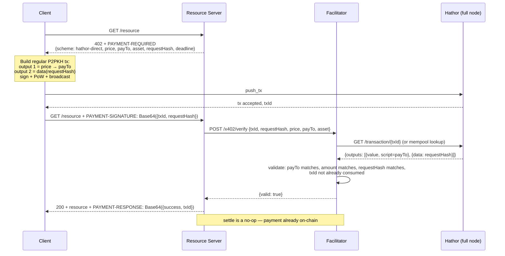

- Feature Name: x402_hathor_direct_scheme_research
- Start Date: 2026-04-17
- RFC PR: (leave this empty)
- Hathor Issue: (leave this empty)
- Author: André Cardoso <andre@hathor.network>
- Status: **Research / Investigation** — not yet an RFC. Produced to explore Yan's requirement that x402 on Hathor should "use whenever possible traditional transactions so we can make use of confidential transactions when available" (see issue "x402 integration on Hathor").

# x402 on Hathor Without Nano Contracts — Investigation

---

## 1. Why This Document Exists

RFCs 0001–0004 specify x402 on Hathor using the `hathor-escrow` scheme, which is a nano contract. The requester for the x402 initiative (Yan) flagged two concerns about that choice:

1. **Confidential transactions are planned for regular UTXO transactions, not nano contracts.** Routing all x402 payments through a nano contract foregoes confidentiality for every x402 payment, indefinitely.
2. **"We need to debate whether we will use nano contracts for most x402 transactions."** The trade-off between escrow-grade safety and confidentiality-readiness should be an open question in the design, not a closed one.

This document is the investigation behind that debate. It:

- Lays out the protocol-level constraints the investigation turned up.
- Evaluates three candidate schemes that use only regular (non-nano-contract) Hathor transactions.
- Recommends one that is worth writing as a full RFC.
- Identifies the open questions that need owner decisions before the follow-on RFC is written.

The output is intentionally *not* a full design. It is a brief meant to get alignment on direction.

---

## 2. Baseline: What EVM x402 Actually Does

To reason about porting, we need to be precise about the mental model x402 was built against.

EVM's `exact` scheme uses EIP-3009 `transferWithAuthorization`. The client signs an EIP-712 typed message binding `{from, to, value, validAfter, validBefore, nonce}`. The **facilitator** — not the client — submits the on-chain call. The token contract itself enforces replay protection via a per-authorizer nonce mapping: the first call succeeds, any second call with the same `{authorizer, nonce}` reverts.

Three properties make this safe on EVM:

| Property | Why it matters | Hathor equivalent |
|---|---|---|
| **Signing doesn't commit balance.** | The client can sign an authorization without locking any state. If they spend the money elsewhere first, the authorization simply reverts on submission — no one loses money, the server just doesn't get paid and refuses service. | None. Hathor signatures commit to specific UTXOs. |
| **Token contract holds replay state.** | Nonce mapping is on-chain, trustless, deterministic. | None natively. Nano contracts can mimic this, but that's what we're trying to avoid. |
| **Facilitator pays gas and submits.** | Lets the client stay gas-less; lets the facilitator pick submission timing. | Partial. Hathor has no gas, but a facilitator-submitted model runs into the sighash_all problem (§3.1). |

**Key insight:** EVM's safety isn't about the signature format — it's about the *account model* making signing cheap and the *token contract* making replay impossible. Neither free primitive exists on Hathor. Any UTXO-based design has to reconstruct those guarantees with different tools, or relax the trust model.

---

## 3. What Hathor Can and Can't Do at the Transaction Layer

Findings from a survey of `hathor-core`, `hathor-wallet-lib`, and the tx anatomy RFC (`text/0015-anatomy-of-tx.md`).

### 3.1 No SIGHASH variants

Hathor has exactly one signing mode: `sighash_all` (`hathorlib/hathorlib/transaction.py:178`). The digest commits to every input, every output, parents, weight, timestamp, and nano headers.

**Consequence:** The EIP-3009 mental model — "client signs, facilitator finishes the tx" — is not expressible. Any party mutating the tx after a signature is produced invalidates the signature. The closest workflow Hathor offers is `PartialTx` (`hathor-wallet-lib/src/models/partial_tx.ts`), used by atomic swaps: multiple parties collaboratively build the complete tx, and only then everyone signs the finalized structure. This is a coordination protocol, not a pre-signed-authorization primitive.

### 3.2 No conditional script branches

The Hathor opcode set (`hathor/transaction/scripts/opcode.py`) is minimal: `OP_DUP`, `OP_HASH160`, `OP_EQUALVERIFY`, `OP_CHECKSIG`, `OP_CHECKMULTISIG`, `OP_CHECKDATASIG`, `OP_GREATERTHAN_TIMESTAMP`, `OP_DATA_STREQUAL`, and a handful of push variants. There is **no `OP_IF` / `OP_ELSE`**. You cannot encode a single output that is spendable by either seller-now or client-after-timeout. Bitcoin-style HTLCs are not expressible.

The two redeem templates in the wild are:
- **P2PKH (+ optional timelock prefix):** `<timelock> OP_GREATERTHAN_TIMESTAMP OP_DUP OP_HASH160 <pkh> OP_EQUALVERIFY OP_CHECKSIG`
- **P2SH MultiSig (+ optional timelock prefix):** `<timelock> OP_GREATERTHAN_TIMESTAMP <M> <pk1>…<pkN> <N> OP_CHECKMULTISIG` (wrapped in P2SH)

### 3.3 Timelocks

Absolute Unix timestamp only, enforced per-output via the prefix above. No relative timelock (no `OP_CSV` equivalent). Enforced in `opcode.py:195` — a spend attempt before the timelock raises `TimeLocked`.

### 3.4 Multisig

Full P2SH m-of-n support. Wallet-lib exposes `P2SH` and `p2sh_signature` helpers. All signers sign the same finalized `sighash_all` — no incremental signing.

### 3.5 Data outputs

Hathor's `OP_RETURN` equivalent. Script is `<data bytes> OP_CHECKSIG` (`hathor-wallet-lib/src/models/script_data.ts:55-60`). The trailing `OP_CHECKSIG` fails because no signature is pushed, so the output is unspendable. Constraints:

- Max 1024 bytes per script (`MAX_OUTPUT_SCRIPT_SIZE`).
- Value must be ≥ 1 HTR cent; fee scales with data length (`getDataScriptOutputFee() * data_length`).
- Headless API form: `{"type": "data", "data": "..."}`.

**Perfect for embedding a requestHash, order ID, or nonce** that binds a payment to a specific HTTP request. This is the primitive that makes a pure UTXO x402 scheme tractable.

### 3.6 Transaction expiry

None in the sense EIP-3009 or Solana provide. The only wall-clock bound is `MAX_FUTURE_TIMESTAMP_ALLOWED = 300s` (`hathorlib/conf/settings.py:369`) — a tx with timestamp > `now + 5 min` is rejected. Txs with past timestamps are accepted indefinitely, as long as inputs are unspent. A signed-but-unbroadcast tx never expires; the inputs themselves are the expiry mechanism. This is the window the current x402 RFC closes by locking funds in a nano contract.

### 3.7 Confirmation & mempool visibility

- **Broadcast-to-visible latency:** ~1s. PoW is local and small (tx weight, not block weight). Once the tx is accepted by one peer it gossips over p2p-sync-v2 (RFC 0025).
- **Mempool query:** `GET /mempool` (`hathor/transaction/resources/mempool.py`) and WebSocket `new-tx` events (`hathor/websocket/`).
- **Block confirmation:** avg ~30s (one block).
- **Hathor wallet UX treats broadcast as final** — this is the model Yan wants to match.

### 3.8 Per-token conservation

`sum(inputs) == sum(outputs)` **per token UID** (except for mint/melt/token-creation). A facilitator cannot add a fee output to a client-built tx without also contributing an input. This restricts a fee-taking facilitator pattern unless the client's tx explicitly outputs to the facilitator.

### 3.9 Confidential transactions

No RFC in the repo yet (`grep -r 'confidential\|pedersen\|bulletproof' rfcs/` returns nothing). External signals (hathor.network homepage, a Vercel-hosted UX prototype) confirm the direction is Pedersen-commitment + range-proof, Monero/Liquid-style, scoped to regular UTXO transactions. Nano contracts need plaintext amounts to execute blueprint logic — they are not in scope for the initial CT delivery. **This is the core strategic driver for a UTXO-based x402 scheme.**

---

## 4. Candidate Schemes

Three approaches were evaluated. One is viable, one is a Lightning-style fallback, one is non-viable.

### 4.1 Option A — `hathor-direct`: client broadcasts, facilitator verifies on-chain

**Flow:**



**What's in the wire protocol:**

`PAYMENT-REQUIRED` adds a server-generated `requestHash` (random 32 bytes) and a short `deadline` (seconds). Client's payment tx must include both the value output to `payTo` and a data output containing `requestHash`. The data output binds this payment to this request, and prevents the client from reusing one payment for two resources.

`PAYMENT-SIGNATURE` carries only `{txId, requestHash}`. The facilitator reconstructs everything else by fetching the tx from the full node.

**Trust model:**

| Party | Trusts what | Protected by |
|---|---|---|
| Client | Server will deliver after seeing the payment | Reputation only. No protocol-level refund. |
| Server | Facilitator honestly reports tx state | Server can run its own facilitator. |
| Facilitator | Nothing — it's read-only. | N/A |

**Double-spend exposure:**

The client could in theory broadcast the payment tx and a conflicting self-spend simultaneously. Exposures:

- *Mempool race:* one tx reaches the facilitator's full node, the other reaches the network. Mitigation: facilitator waits for visibility from its own node *and* reports which peers have seen it. For higher-stakes routes, the middleware can demand 1-block confirmation.
- *Chain reorg:* blocks on Hathor are confirmed by the next block. For micropayments, the cost of engineering a reorg for a $0.001 request exceeds the payoff by orders of magnitude. For larger payments, require N confirmations or fall back to `hathor-escrow`.

**What's lost vs. `hathor-escrow`:**

- **No protocol refund.** If the server takes the payment and refuses to deliver, the client has no recourse within the protocol. Remediation is out-of-band: reputation, dispute systems, or simply block-listing the server.
- **No "exactly once" from the chain.** Two servers colluding with the client could each claim the same `txId` — the facilitator prevents this via its own `(txId, requestHash)` dedup cache. The cache is operational (in-memory or persisted), not on-chain.
- **Weaker guarantee on unconfirmed.** An escrow is observable on-chain in LOCKED state; a broadcast-but-unconfirmed payment is observable in the mempool but could in theory be replaced by a double-spend until a block confirms it.

**What's gained:**

- **Confidential-transaction ready.** The payment is a regular UTXO tx. The day CT lands, `hathor-direct` payments become confidential with zero protocol changes.
- **Fewer on-chain txs.** One tx per payment (the client's) vs. two for escrow (client deposit + facilitator release).
- **Faster.** Broadcast → facilitator-approval is ~1–2s (mempool visibility). Matches the wallet UX.
- **Read-only facilitator.** No wallet seed, no signing, no PoW cost on settle. Much easier to self-host, rate-limit, and scale horizontally.
- **Simpler SDK.** Client does a normal `sendTokens` call. Server middleware does a normal tx lookup. No blueprint knowledge needed on either end.

**Precision on the "facilitator wallet" question:**

The existing `hathor-escrow` facilitator needs a funded headless wallet because `release()` is a nano contract call (it mines PoW and pays fees for custom tokens). A `hathor-direct` facilitator has no on-chain actions at all — it's purely read-path. This materially changes the operational profile: public facilitators can be run as stateless services behind a load balancer, with no seed to protect and no key rotation to manage. It also makes the "public x402 facilitator for mainnet and testnet" requirement (AC #4) dramatically easier to satisfy.

### 4.2 Option B — Pre-signed refund via 2-of-2 multisig

Lightning-channel-style. Flow sketch:

1. Client and facilitator collaboratively build a **deposit tx** (`PartialTx`): output = P2SH(multisig(client+facilitator)), value = price.
2. Before the deposit is broadcast, they build a **refund tx** spending the multisig UTXO back to the client, with `timelock = now + deadline`. Both co-sign it.
3. Facilitator sends the signed refund back to the client. Only now does the client broadcast the deposit.
4. On happy path: facilitator co-signs a release tx paying the seller, broadcasts it.
5. On unhappy path: client waits for the timelock to pass, broadcasts the pre-signed refund.

**Why it's interesting:** restores trustless refund using only regular UTXO primitives. Eventually CT-compatible (the deposit is a multisig P2SH script, which is a regular tx, but the script pattern is publicly distinguishable — see caveat).

**Why it's probably not worth writing up:**

1. **Synchronous round-trip per payment.** Client must talk to the facilitator *before* every deposit, just to co-sign the refund. That's a new cold-start dependency and an availability burden on the facilitator, worse than `hathor-escrow`'s async model.
2. **Signature fragility.** Any structural change to the refund tx — timestamp, parents at build time, output amount — invalidates it. If the deposit tx takes longer than expected to confirm, the pre-signed refund's parents may fall out of the DAG tip and require rebuilding. This is a known Lightning pain point; Bitcoin solves it with `SIGHASH_ANYONECANPAY | SIGHASH_SINGLE`, which Hathor doesn't have.
3. **Script pattern is distinguishable on-chain.** Even if amounts are confidential, the `OP_CHECKMULTISIG` + timelock pattern announces "this is an escrow-like tx" to chain observers. Real confidentiality would require future work to hide the script shape too.
4. **No clear win over `hathor-escrow`.** You trade blueprint complexity for coordination complexity, and the confidentiality gain is partial (amounts, not structure). The operational complexity is comparable.

Keep this documented as a fallback if the "no protocol refund" trust model of Option A is rejected outright. Not worth a full RFC on its own merits.

### 4.3 Option C — Client pre-signs, facilitator broadcasts (EIP-3009 port)

**Not viable.** The analysis is short:

- Hathor signatures commit to the whole tx (`sighash_all`).
- For the facilitator to modify any field — e.g. to pick parents, pay a fee, adjust timestamp — the client's signature invalidates.
- If the client signs the *complete* tx, the facilitator adds nothing. The client can broadcast immediately. This collapses to "client broadcasts" — which is Option A — with an unnecessary handoff through the facilitator and no additional guarantee.
- There is no per-token nonce mapping on Hathor to prevent the client from signing authorization X and simultaneously broadcasting a double-spend on the same UTXOs.

The EIP-3009 pattern fundamentally relies on signing being non-committing (account model) + a token-contract nonce mapping. Hathor has neither. Don't pursue.

---

## 5. Comparison

| Dimension | `hathor-escrow` (RFC 0001) | `hathor-channel` (RFC 0004) | **`hathor-direct` (proposed)** |
|---|---|---|---|
| On-chain txs per payment | 2 (deposit + release) | 1 amortized (spend only) | **1 (client payment)** |
| Client wait per payment | ~10s (deposit confirmation) | ~0s after channel setup | **~1–2s (mempool visibility)** |
| Protocol refund | ✓ (timelocked) | ✓ (channel close) | ✗ (out-of-band only) |
| Double-spend risk | Zero (on-chain lock) | Zero (on-chain lock) | Low (mempool race, 1-conf config) |
| Facilitator wallet required | ✓ (funded, signing) | ✓ (funded, signing) | ✗ (read-only) |
| Confidential-tx ready | ✗ (nano contract) | ✗ (nano contract) | **✓ (regular UTXO tx)** |
| Rate-limiting/self-hosting | Medium — operator holds seed | Medium — operator holds seed | **Easy — stateless read service** |
| Right for | Large / untrusted payments | High-frequency clients | **Default micropayment case** |

---

## 6. Recommendation

**Add `hathor-direct` as a second scheme alongside `hathor-escrow`, not as a replacement.**

The x402 spec's `accepts: [...]` array exists for exactly this. The server lists which schemes it accepts — the client picks based on its trust posture. A typical deployment:

```json
{
  "x402Version": 2,
  "accepts": [
    {
      "scheme": "hathor-direct",
      "network": "hathor:mainnet",
      "price": "100",
      "payTo": "Wxxxx",
      "asset": "00",
      "extra": {
        "requestHash": "a1b2c3…",
        "deadlineSeconds": 60,
        "facilitatorUrl": "https://x402.hathor.dev"
      }
    },
    {
      "scheme": "hathor-escrow",
      "network": "hathor:mainnet",
      "price": "100",
      "payTo": "Wxxxx",
      "asset": "00",
      "extra": { "blueprintId": "…", "facilitatorUrl": "…", "facilitatorAddress": "…" }
    }
  ]
}
```

This maps to Yan's requirements as follows:

| Acceptance Criterion | How dual-scheme satisfies it |
|---|---|
| "Use whenever possible traditional transactions." | `hathor-direct` is the default scheme. Server middleware emits it first in `accepts`; clients pick it by default. |
| "Confirmed within a few seconds, same UX as wallet." | `hathor-direct` with mempool-visibility gating gets ~1–2s. |
| "Make use of confidential transactions when available." | `hathor-direct` payments become confidential automatically when CT lands. |
| "Debate whether we will use nano contracts." | Both schemes coexist. The market picks. `hathor-escrow` remains the answer for high-value / untrusted counterparties. |

---

## 7. Open Questions (Decisions Needed Before the Follow-on RFC)

The items below are decisions for owners, not engineering questions. The follow-on RFC cannot be written without answers.

1. **Is "trust the server to deliver" acceptable as the default trust model?**
   The entire proposal rests on this. For ≤$1 micropayments on agentic calls the answer is likely yes (this is the same trust model as Stripe, Apple Pay, and any pre-paid SaaS). But if product requires a protocol refund even for pennies, `hathor-direct` doesn't fit and we stay with `hathor-escrow` + document the CT limitation.

2. **Which scheme is listed first in `accepts[]` by the server middleware by default?**
   If `hathor-direct` is first, most traffic goes through it and most traffic is CT-ready. If `hathor-escrow` is first, the opposite. Recommendation: `hathor-direct` first, but this is a policy call.

3. **Does the facilitator accept mempool-visible-but-unconfirmed payments, or require 1-block confirmation?**
   Mempool-visible = ~1–2s latency, small double-spend risk. 1-block = ~30s latency, zero double-spend risk. Options:
   - **Per-route policy** on the server middleware (the route tells the facilitator which it requires).
   - **Global policy** on the facilitator.
   - **Tiered policy**: route declares a price, facilitator chooses policy based on price.

4. **What is the `txId` dedup policy?**
   The facilitator must prevent a client from reusing one payment for multiple requests. The `(txId, requestHash)` pair prevents cross-request reuse (server generates a fresh `requestHash` per 402). Question: how long does the dedup cache live? Forever? 24h? Should it be persisted or in-memory?

5. **Fee-taking facilitator support — in scope for v1 or deferred?**
   Because of per-token conservation (§3.8), adding a fee output requires the client to include an explicit output to the facilitator. That's doable but adds a field to `PAYMENT-REQUIRED` (`facilitatorFee`, `facilitatorAddress`). Recommend deferring to v2.

6. **Naming.** `hathor-direct`, `hathor-onchain`, `hathor-utxo`, `hathor-exact`? (x402 calls the EVM equivalent `exact`; we could follow that convention.) Naming matters because this will be in wire format forever. Recommend soliciting Yan's + rafael's preference.

7. **Rate limiting.** The public facilitator needs per-IP and per-`payTo` limits regardless, but `hathor-direct` makes this more pressing because the facilitator is cheap to call (read-only) and therefore a more attractive DoS target. Baseline: token bucket per IP + per `payTo`, with persistent counters. Needs its own subsection in the facilitator RFC (missing today — see audit AC #6).

---

## 8. What Happens Next

Contingent on §7.1 answered "yes":

1. Promote this document to RFC `0005-x402-direct-scheme.md` with full wire format, verify/settle semantics, and reference flow.
2. Amend RFC `0001`:
   - §1.1 Design Philosophy: add `hathor-direct` alongside `hathor-escrow` in the mapping table.
   - §1.2 "Why Nano Contracts (Not Pre-Signed Transactions)": reframe as "Why We Offer Two Schemes" — acknowledge the trust-model trade-off and the CT driver.
   - §14 Open Questions: remove the resolved nano-contract-debate question, add the dedup-policy and confirmation-policy questions.
3. Amend RFC `0003` (server middleware) to emit both schemes in `accepts[]` by default.
4. Amend RFC `0002` (client SDK) to prefer `hathor-direct` when offered.
5. Add a section to RFC `0001` §6 (facilitator) covering rate-limiting (resolves audit AC #6).

Contingent on §7.1 answered "no":

1. Add a paragraph to RFC `0001` §11 explicitly documenting: x402 on Hathor will not support confidential transactions in the initial phase; CT support is blocked on CT extending to nano contracts.
2. Close the open question.

---

## 9. References

- x402 specification: https://docs.x402.org/
- x402 v1 → v2 migration: https://docs.x402.org/guides/migration-v1-to-v2
- EIP-3009: https://eips.ethereum.org/EIPS/eip-3009
- Hathor tx anatomy RFC: `text/0015-anatomy-of-tx.md`
- Hathor atomic swap service RFC: `projects/atomic-swap-service/headless-wallet.md` (for `PartialTx` precedent)
- PoC repository: https://github.com/hathornetwork/x402-poc
- Existing x402 RFCs: `0001-x402-support.md`, `0002-x402-client-sdk.md`, `0003-x402-server-middleware.md`, `0004-x402-payment-channels.md`
