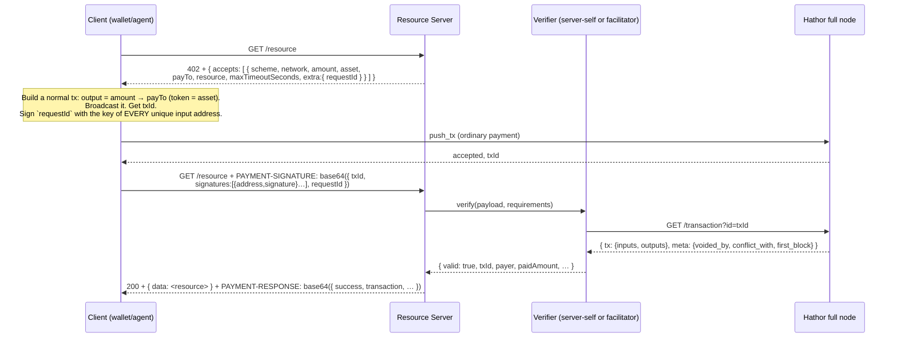

- Feature Name: x402_hathor_direct_protocol
- Start Date: 2026-06-26
- RFC PR: (leave this empty)
- Hathor Issue: (leave this empty)
- Author: André Cardoso <andre@hathor.network>, Pedro Ferreira <pedro@hathor.network>
- Status: **Draft.** Promotes the recommendation in `0005-hathor-direct-scheme-research.md` into a full protocol specification. Supersedes the nano-contract design archived in [`old/`](old/README.md).

# Summary
[summary]: #summary

This RFC specifies **`hathor-direct`**, an [x402](https://docs.x402.org/) payment
scheme for Hathor Network that settles each pay-per-request HTTP call with a
single, ordinary UTXO transaction — no nano contract, no facilitator wallet.

The mechanism is a challenge–response over a normal payment. The resource server
answers an unpaid request with `402 Payment Required` and a signed, stateless
challenge (`requestId`). The client pays by broadcasting a regular transaction
that sends the price to the seller's address, then proves the payment is *theirs
for this request* by signing the `requestId` with the private keys behind every
input of that transaction. A read-only verifier (the resource server itself, or
a shared facilitator) confirms the payment by **reading** the full node — it
never signs anything and never holds funds.

Two variants are defined: `hathor-direct` (pay an exact price) and
`hathor-direct-upto` (authorize a maximum, get the unused remainder refunded).

# Motivation
[motivation]: #motivation

The first Hathor x402 design (archived [`old/`](old/README.md), RFCs 0001–0004)
escrowed every payment in a nano contract. Two problems made it the wrong
default, detailed in [`0005-hathor-direct-scheme-research.md`](0005-hathor-direct-scheme-research.md):

1. **Latency.** An escrow needs the deposit transaction *confirmed by a block*
   (~10 s) before the seller releases the resource. x402's value proposition is a
   request that pays and completes in roughly the time a wallet considers a
   broadcast "done."
2. **Confidentiality.** Hathor's planned confidential transactions apply to
   regular UTXO transactions; nano contracts need plaintext amounts. Routing all
   x402 traffic through escrow contracts forgoes confidentiality permanently.

`hathor-direct` is the answer to "use traditional transactions whenever possible
so we can make use of confidential transactions when available":

- **One transaction per payment** (the client's), settled at mempool speed
  (~1–2 s).
- **Confidential-transaction-ready**: the payment is a plain UTXO transfer, so it
  becomes confidential the day CT ships, with zero protocol changes.
- **Read-only facilitator**: no seed to protect, no key rotation, trivially
  horizontally scalable — which is what makes a *public* facilitator practical.

The cost is a deliberately weaker trust model (no protocol-level refund; the
client trusts the seller to deliver, as with any pre-paid API). That trade-off,
and why it is acceptable for the micropayment case, is argued in §
[Rationale and alternatives](#rationale-and-alternatives).

# Guide-level explanation
[guide-level-explanation]: #guide-level-explanation

## The mental model

x402 reuses HTTP `402 Payment Required`. A client requests a resource; if payment
is required, the server replies `402` with machine-readable *payment
requirements*; the client pays and repeats the request carrying *proof*; the
server returns `200` with the resource.

On EVM the proof is an EIP-3009 authorization the facilitator submits on-chain.
Hathor has neither account-model signatures (its signatures commit to specific
UTXOs) nor a token-contract nonce map, so that pattern does not port (see
[0005](0005-hathor-direct-scheme-research.md) §2–3). `hathor-direct` reconstructs
the guarantees differently:

> **The client makes the payment itself, then proves it controls that payment.**

Because the payment is a transaction the client already broadcast, there is
nothing for a facilitator to submit, mutate, or sign. Verification is purely a
question the verifier asks the full node: *does this transaction exist, does it
pay the right address the right amount, and did the person claiming it prove they
own its inputs?*

## The three messages

A complete `hathor-direct` exchange is three HTTP messages and one on-chain
transaction:



## The challenge: `requestId`

The `requestId` is the heart of the scheme. It is a **stateless, server-issued,
HMAC-authenticated token** that commits to the exact deal being offered
(`route`, `amount`, `payTo`, `asset`, `network`) plus an expiry and a nonce. The
server can mint it without storing anything and later verify a returned token by
recomputing its MAC. It plays three roles at once:

- **Deadline.** Its `exp` is the payment window (`maxTimeoutSeconds`). An expired
  `requestId` is refused; the client just fetches a fresh `402`.
- **Anti-redirection.** Because the offered `payTo`/`amount`/`asset`/`route` are
  bound into the MAC, a client cannot take a `402` for a cheap route and present
  it as proof for an expensive one, nor redirect the verifier to a different
  payee.
- **Binding material.** It is the exact message the client signs with the keys
  behind the transaction inputs. That signature is what ties "this on-chain
  transaction" to "this HTTP request."

## How the payment binds to the request (no on-chain marker needed)

A naive UTXO scheme would embed a per-request marker in an on-chain *data output*
so the verifier can tell the payment apart from any other transfer to the same
address. `hathor-direct` does **not** do this. Instead the client signs the
`requestId` with the keys controlling **every input** of the payment
transaction, and the verifier requires a valid signature for each unique input
address. This proves the claimant *funded* the transaction — not merely that they
observed a transaction paying the seller. The benefits over a data output:

- No extra output, no extra fee, no on-chain bloat per payment.
- The binding is verified cryptographically off-chain; the on-chain transaction
  stays a perfectly ordinary transfer (better for confidentiality and privacy).
- Multi-input payments are handled naturally: the proof is a **list** of
  `{address, signature}` pairs, one per unique input address.

The same transaction can even be re-presented against a *new* `requestId` (e.g.
after the first expired) by signing the new challenge — the on-chain payment is
reused, only the proof changes. Replay *across requests* is prevented by the
verifier's dedup ledger (see [reference §Replay and idempotency](#replay-and-idempotency)).

## The two schemes

| Scheme | Meaning | Settlement |
|---|---|---|
| `hathor-direct` | Client pays an **exact** `amount`. | None — the payment is final on broadcast. |
| `hathor-direct-upto` | Client pays a **maximum** `amount`; the server bills actual usage and **refunds the remainder** to the payer. | One refund transaction from the seller's wallet, for `paid − charged`. |

`hathor-direct-upto` is the metered-usage case (e.g. an LLM endpoint billed per
token): the client authorizes a ceiling up front, the server determines the real
cost while producing the response, and the difference is returned on-chain. Note
this is the *only* part of the protocol where a seller-side wallet is involved,
and only to *send* a refund — the verification path stays seedless.

# Reference-level explanation
[reference-level-explanation]: #reference-level-explanation

This section is the normative wire format and verification algorithm. JSON field
names are case-sensitive. All monetary amounts are **strings** of **atomic
units** (the smallest indivisible unit of the token; for HTR, 1 HTR = 100 atomic
units). Token identifiers (`asset`) are the token UID as a hex string, with the
native token HTR represented as `"00"`.

## Identifiers

- **Network**: `hathor:<network-name>`, e.g. `hathor:mainnet`, `hathor:testnet`,
  `hathor:privatenet`. Clients and verifiers MUST refuse a payment whose
  `network` does not match their own.
- **Asset**: token UID hex string; `"00"` is HTR.
- **x402Version**: integer `2` for this revision.

## The 402 response (payment requirements)

A server requiring payment for a route responds `402` with a JSON body:

```json
{
  "x402Version": 2,
  "accepts": [
    {
      "scheme": "hathor-direct",
      "network": "hathor:testnet",
      "amount": "100",
      "asset": "00",
      "payTo": "WdQ…sellerAddress",
      "resource": "https://api.example.com/weather",
      "maxTimeoutSeconds": 120,
      "description": "Pay 1.00 HTR",
      "extra": {
        "requestId": "<base64url(claims)>.<base64url(mac)>",
        "facilitatorUrl": "https://x402.example.com"
      }
    }
  ]
}
```

`accepts` is an array of `PaymentRequirements`, one per scheme/asset the server
will accept for this route; the client picks one. Each entry:

| Field | Type | Notes |
|---|---|---|
| `scheme` | string | `hathor-direct` or `hathor-direct-upto`. |
| `network` | string | `hathor:<name>`. |
| `amount` | string | Exact price (`hathor-direct`) or the authorized maximum (`hathor-direct-upto`), in atomic units. |
| `asset` | string | Token UID; `"00"` = HTR. |
| `payTo` | string | Seller's receiving address. |
| `resource` | string | Canonical absolute URL of the resource. Bound into `requestId`. |
| `maxTimeoutSeconds` | number | Validity window of `requestId`; the payment deadline. |
| `description` | string | Human-readable, optional. |
| `extra.requestId` | string | The server challenge (below). REQUIRED. |
| `extra.facilitatorUrl` | string | Where verification happens, if the server delegates. Optional. |

## The `requestId` challenge

`requestId` is `"<body>.<mac>"` where:

- `body = base64url( JSON.stringify(claims) )`
- `mac  = base64url( HMAC-SHA256(serverSecret, body) )`
- `claims = { route, amount, payTo, asset, network, exp, nonce }`
  - `route` — the canonical resource URL (equals `resource`).
  - `amount`, `payTo`, `asset`, `network` — the offered deal, as strings.
  - `exp` — Unix seconds; mint time + `maxTimeoutSeconds`.
  - `nonce` — fresh random (≥ 64 bits), base64url. Makes each challenge unique.

Minting requires only the server secret; **no per-challenge state is stored**.
Verifying a returned `requestId`:

1. Split on the first `.`; recompute `mac` and compare with a constant-time
   equality. Mismatch → `bad_request_id_mac`.
2. Decode `claims`; if `exp * 1000 < now` → `request_id_expired`.
3. For each of `route`, `amount`, `payTo`, `asset`, `network`: the value the
   verifier expects for the route MUST equal the value in `claims`. Mismatch →
   `requestId_<field>_mismatch`.

A server MAY rotate `serverSecret`; doing so invalidates all outstanding
challenges (they fail step 1). Multiple verifiers sharing the verification of one
server's routes MUST share that server's `serverSecret`.

## The PAYMENT-SIGNATURE header (payment proof)

On the paid retry the client sends a `PAYMENT-SIGNATURE` request header whose
value is `base64( JSON.stringify(payload) )`:

```json
{
  "x402Version": 2,
  "scheme": "hathor-direct",
  "network": "hathor:testnet",
  "payload": {
    "txId": "<64-hex transaction id>",
    "signatures": [
      { "address": "WdQ…input0", "signature": "<base64 message signature>" },
      { "address": "WdR…input1", "signature": "<base64 message signature>" }
    ],
    "requestId": "<the requestId from the 402>"
  }
}
```

| Field | Notes |
|---|---|
| `payload.txId` | The broadcast payment transaction. |
| `payload.signatures` | One `{address, signature}` per **unique input address** of `txId`. `signature` is a Hathor/bitcore message signature over the UTF-8 bytes of `requestId`. |
| `payload.requestId` | Echo of the challenge being satisfied. |

**Ordering.** The address of the **first** entry in `signatures` is the
*canonical payer*: the address used for blocklisting, the dedup record, and (for
`hathor-direct-upto`) the refund recipient. The client controls this ordering.

**Message signature.** `signature` MUST verify under Hathor's
message-signing scheme (Bitcoin-compatible `verifyMessage`, using the network's
address version byte) for the given `address` over the message `requestId`. This
is the same primitive a wallet exposes as "sign message with address."

## Verification algorithm

Given the decoded `payload`, the route's canonical `requirements`
(`{ scheme, network, amount, asset, payTo, resource }`), a full node URL, a dedup
store, the `serverSecret`, and a `zeroConfMaxAmount` threshold, the verifier MUST
perform, in order, returning `{ valid: false, invalidReason }` on the first
failure:

1. **Shape.** `payload.payload` exists; `txId` and `requestId` present;
   `signatures` is a non-empty array; the first entry has string `address` and
   `signature`. Else `missing_payload` / `missing_payload_fields` /
   `missing_signatures` / `malformed_signatures`. Set `payerAddress =
   signatures[0].address`.
2. **Challenge.** Verify `requestId` against `serverSecret` with the route's
   `{ route: resource, amount, payTo, asset, network }` as expected claims (see
   [requestId](#the-requestid-challenge)). Any failure propagates its reason.
3. **Fetch.** `GET /transaction?id=txId` from the full node. Network error →
   `fullnode_error`. Missing/unsuccessful → `tx_not_found`. Keep `tx` and `meta`.
4. **Paying output.** There MUST be an output of token `asset` paying `payTo` a
   value ≥ `amount`. The **first** such output is the *paying output*; record its
   index and value. Else `no_paying_output`. (Token of an output is resolved from
   `token_data` + the tx `tokens` list; `"00"` for HTR.)
5. **Signature map.** Build `address → signature` from `signatures`. A repeated
   address with a *different* signature → `duplicate_signatures`; malformed entry
   → `malformed_signatures`.
6. **Input ownership.** Collect the set of unique input addresses of `tx`. It
   MUST be non-empty (`no_input_addresses`). For **every** input address there
   MUST be an entry in the map (`missing_signature_for_input:<addr>`) whose
   signature verifies over `requestId` (`bad_signature:<addr>`). This is the step
   that proves the claimant funded the payment.
7. **Blocklist.** If `payerAddress` is blocklisted → `blocklisted`.
8. **Conflict/void (zero-conf safety).** If `meta.voided_by` is non-empty →
   `voided`; if `meta.conflict_with` is non-empty → `conflicted`.
9. **Tiered confirmation.** If `Number(amount) > zeroConfMaxAmount` and
   `meta.first_block` is absent → `awaiting_block`. (Below the threshold the
   payment is accepted zero-conf; see [double-spend](#double-spend-handling).)
10. **Replay/idempotency.** Atomically attempt to record `(txId, outputIndex)` in
    the dedup store keyed with `requestId`, `payerAddress`, `amount`, `asset`:
    - not present before → `new` → proceed.
    - present with the **same** `requestId` → `idempotent` → proceed (a safe
      retry; do not double-settle).
    - present with a **different** `requestId` → `conflict` → `replay`.

On success the verifier returns:

```json
{
  "valid": true,
  "txId": "…",
  "outputIndex": 0,
  "payerAddress": "WdQ…",
  "amount": "100",
  "paidAmount": "100",
  "asset": "00",
  "requestId": "…",
  "idempotent": false
}
```

`paidAmount` is the value of the paying output (which may exceed `amount` — the
client is allowed to overpay; `hathor-direct-upto` relies on this).

## Settlement and the PAYMENT-RESPONSE header

On `200`, the server returns the resource wrapped as `{ "data": <resource>,
"payment": <PaymentResponse> }` and echoes the same `PaymentResponse` in a
`PAYMENT-RESPONSE` response header as `base64( JSON.stringify(...) )`:

```json
{
  "x402Version": 2,
  "success": true,
  "scheme": "hathor-direct",
  "network": "hathor:testnet",
  "transaction": "<txId>",
  "amount": "100",
  "payer": "WdQ…"
}
```

**`hathor-direct` settlement is a no-op** — the payment is already final. The
`PaymentResponse` is purely informational.

**`hathor-direct-upto` settlement** computes `charged` (clamped to `paidAmount`)
and `refund = paidAmount − charged`. If `refund > 0` the seller broadcasts a
refund transaction of `refund` to `payerAddress` and adds these fields:

```json
{
  "chargedAmount": "120",
  "refundAmount":  "380",
  "refundTxId":    "<refund txId>",
  "refundError":   null
}
```

If the refund broadcast fails, `refundTxId` is `null` and `refundError` carries
the reason; the resource is still served (the failure is surfaced, not swallowed).

## Replay and idempotency

The dedup store is the protocol's replay defense and its redemption ledger. It is
keyed on `(txId, outputIndex)` — the *specific* coin spent to the seller — not on
`txId` alone, so a transaction that legitimately pays two different routes in two
outputs is two independent redemptions.

- A fresh `(txId, outputIndex)` is recorded with its `requestId`.
- A retry presenting the **same** `requestId` is *idempotent*: the resource may be
  re-served but the payment MUST NOT be settled twice (matters for
  `hathor-direct-upto` — do not refund twice).
- A second attempt presenting a **different** `requestId` for the same coin is a
  `replay` and MUST be refused. (A fresh `requestId` is minted per `402`, so this
  is exactly "trying to spend one payment on two requests.")

The store SHOULD be persistent so replays are caught across restarts. Retention
is an operator policy (see [0007](0007-x402-roles-and-payment-flow.md)).

## Double-spend handling

A zero-conf payment (accepted on mempool visibility, before a block confirms it)
carries a residual risk: the payer broadcasts the payment *and* a conflicting
transaction that double-spends the same inputs. The protocol bounds this risk
with three layers:

1. **Verify-time conflict check** (step 8): a payment already visibly voided or
   conflicted is refused outright.
2. **Tiered confirmation** (step 9): amounts above `zeroConfMaxAmount` require a
   confirming block (`first_block`), eliminating the risk for high-value
   payments at the cost of ~30 s latency. Operators set the threshold per their
   risk appetite; below it, micropayments stay fast.
3. **Post-serve void watch** (RECOMMENDED): after serving zero-conf, the verifier
   continues to watch `txId`; on a later void it marks the redemption voided and
   **blocklists the canonical payer** (step 7 then refuses that payer's future
   payments). This converts a successful double-spend from a repeatable exploit
   into a one-shot that costs the attacker their address's standing. Production
   SHOULD drive this from the full node event stream
   (`VERTEX_METADATA_CHANGED`); a polling fallback is acceptable.

The economic argument: engineering a chain reorg to reverse a confirmed
micropayment costs orders of magnitude more than the payment, and a mempool-race
double-spend is caught and punished by layer 3. For payments where even that is
unacceptable, raise `zeroConfMaxAmount` to `0` (always require a block) or use
the escrow scheme archived in [`old/`](old/README.md).

## Confidential-transaction readiness

The payment transaction is an ordinary transfer with no escrow script, no nano
header, and no per-request data output. When confidential transactions ship for
regular UTXO transactions, `hathor-direct` payments become confidential with
**no protocol change**: the verifier's checks that touch amounts (steps 4, 9) move
to the CT proof surface (range proofs / commitments) the same way any other
amount check would, and steps 2/5/6 (challenge + input-ownership signatures) are
unaffected because they are off-chain. This is the strategic reason the scheme
avoids both nano contracts and on-chain markers.

# Drawbacks
[drawbacks]: #drawbacks

- **No protocol-level refund.** If the seller takes payment and refuses to
  deliver, the client has no on-chain recourse. Mitigation is out-of-band
  (reputation, the seller running a known/branded facilitator, dispute systems).
  This is the same trust posture as any pre-paid API.
- **Zero-conf residual risk.** Below the confirmation threshold a determined payer
  can attempt a double-spend; the void-watch + blocklist makes it a one-shot, but
  the *first* exploit can succeed. Sellers tune `zeroConfMaxAmount` accordingly.
- **`requestId` requires a server secret.** It must be configured and kept
  secret; sharing verification across hosts means sharing the secret.
- **Input-ownership proof needs a wallet primitive.** The client must be able to
  sign a message with the key of each input address (see
  [0008](0008-x402-wallets-agents-and-skill.md)). Wallets that cannot sign
  messages per-address cannot produce the proof.

# Rationale and alternatives
[rationale-and-alternatives]: #rationale-and-alternatives

The full comparison lives in
[`0005-hathor-direct-scheme-research.md`](0005-hathor-direct-scheme-research.md).
In short:

- **vs. nano-contract escrow (archived [`old/`](old/README.md)):** escrow gives a
  trustless refund but costs ~10 s/payment and is permanently non-confidential.
  `hathor-direct` trades the refund for speed + confidentiality, which is the
  right default for micropayments. The two can coexist via the `accepts[]` array;
  escrow remains available for high-value/low-trust payments.
- **vs. pre-signed-authorization (EIP-3009 port):** not expressible on Hathor —
  `sighash_all` means any post-signature mutation invalidates the signature, and
  there is no token-contract nonce map. If the client signs the *complete* tx the
  facilitator adds nothing, which collapses to "client broadcasts" — i.e.
  `hathor-direct`.
- **vs. on-chain data-output marker:** rejected in favor of off-chain
  input-ownership signatures — no per-payment fee/bloat and a cleaner,
  confidential-friendly on-chain footprint.
- **Why input-ownership rather than "any output to the seller":** requiring a
  signature from every input proves the claimant *funded* the payment, so a third
  party who merely observes a transfer to the seller cannot claim it.

Impact of not doing this: x402 on Hathor stays escrow-only — slow and
non-confidential — undermining the agentic-micropayment use case x402 exists for.

# Prior art
[prior-art]: #prior-art

- **x402 specification** (https://docs.x402.org/) — the `402` + `accepts[]` +
  facilitator model this RFC implements; the `exact` scheme on EVM is the
  closest analogue to `hathor-direct`.
- **EIP-3009 `transferWithAuthorization`** — the EVM `exact` mechanism; analyzed
  and rejected for Hathor in [0005](0005-hathor-direct-scheme-research.md) §2.
- **Bitcoin "sign message with address"** — the message-signature primitive the
  input-ownership proof reuses.
- **Zero-conf merchant practice** (retail Bitcoin/BCH) — the risk model behind
  the tiered-confirmation + void-watch design.

# Unresolved questions
[unresolved-questions]: #unresolved-questions

- **Default `zeroConfMaxAmount`.** What ceiling balances UX and risk for the
  public facilitator? (Operator policy, but a recommended default is useful.)
- **Dedup retention.** Forever vs. a TTL tied to reorg depth — what is the safe
  minimum? (See [0007](0007-x402-roles-and-payment-flow.md).)
- **Scheme naming in the wire format.** `hathor-direct` vs. matching EVM's
  `exact` convention. This name is permanent once published.
- **Fee-taking facilitator.** Per-token conservation means a facilitator fee
  needs an explicit client output to the facilitator; deferred (see
  [Future possibilities](#future-possibilities)).
- **Multi-`accepts` policy.** When a server offers `hathor-direct` *and* escrow,
  which is listed first and how clients choose is a policy left to
  [0007](0007-x402-roles-and-payment-flow.md)/[0008](0008-x402-wallets-agents-and-skill.md).

# Future possibilities
[future-possibilities]: #future-possibilities

- **Confidential payments** — the headline payoff once CT ships (above).
- **Fee-taking / settlement-sharing facilitators** — add `facilitatorFee` +
  `facilitatorAddress` to the requirements and a corresponding client output.
- **Batched / streamed payments** — a client paying many small requests could
  amortize with a single funding transaction and per-request sub-proofs; the
  archived payment-channel work ([`old/0004`](old/0004-x402-payment-channels.md))
  is the starting reference if this is ever needed.
- **Standard error taxonomy** — promote the `invalidReason` strings in this RFC
  into a shared, versioned enum so clients can react programmatically.
- **Event-driven void watch** — standardize the `VERTEX_METADATA_CHANGED`-driven
  watcher as the reference implementation.
