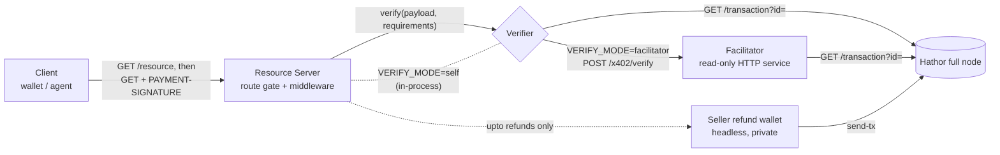

- Feature Name: x402_roles_and_payment_flow
- Start Date: 2026-06-26
- RFC PR: (leave this empty)
- Hathor Issue: (leave this empty)
- Author: André Cardoso <andre@hathor.network>, Pedro Ferreira <pedro@hathor.network>
- Status: **Draft.** Companion to [`0006-x402-hathor-direct-protocol.md`](0006-x402-hathor-direct-protocol.md) (the wire format). This RFC defines the roles, the end-to-end flow, the facilitator HTTP API, and the operational model.

# Summary
[summary]: #summary

This RFC describes **who does what** in a `hathor-direct` deployment and **how a
payment flows end to end**. It defines three roles — the **resource server**
(sells access and gates routes), the **verifier** (confirms a payment by reading
the full node), and the **client** (pays and proves) — and specifies the
**facilitator**, the optional standalone HTTP service that packages the verifier
so multiple resource servers can share it. It also covers the operational model
the seedless, read-only verifier makes possible: stateless horizontal scaling,
shared dedup, rate limiting, and secret management.

The protocol wire format is normative in
[0006](0006-x402-hathor-direct-protocol.md); this RFC does not restate it.

# Motivation
[motivation]: #motivation

`hathor-direct`'s defining operational property is that **verification is
read-only**. Unlike the archived escrow design — whose facilitator held a funded,
signing wallet to call `release()` — a `hathor-direct` verifier only *reads* the
full node. That single fact reshapes the deployment:

- A server can **self-verify** with nothing but a full node URL; no separate
  service is required.
- A **public facilitator** is practical: no seed to protect, no key rotation, no
  per-request on-chain cost, so it scales as a stateless read service behind a
  load balancer.
- The only component that ever needs a wallet is the **seller's refund wallet**,
  used solely by `hathor-direct-upto` to *send* refunds — and it can be kept
  entirely private (loopback-only).

This RFC pins down those roles and the flow so independent implementations
interoperate.

# Guide-level explanation
[guide-level-explanation]: #guide-level-explanation

## The roles



| Role | Responsibility | Holds a wallet? |
|---|---|---|
| **Client** | Build + broadcast the payment tx; produce the input-ownership proof; carry `PAYMENT-SIGNATURE`. | Yes — the payer's wallet. |
| **Resource server** | Emit `402` with requirements; gate the route; run verification (self or delegated); serve the resource; for `upto`, drive settlement. | No (exact). For `upto`, talks to a separate refund wallet. |
| **Verifier** | Apply the [verification algorithm](0006-x402-hathor-direct-protocol.md#verification-algorithm) against the full node + dedup store. | **No.** Read-only. |
| **Facilitator** | The verifier exposed as a standalone HTTP service for sharing across servers. | **No.** No seed, ever. |
| **Seller refund wallet** | `hathor-direct-upto` only: send `paid − charged` back to the payer. | Yes — but only *sends* refunds; never verifies. |

## Two verification modes

The verifier is the same logic ([0006](0006-x402-hathor-direct-protocol.md))
regardless of where it runs. A resource server selects how to reach it:

- **`self`** — the server imports the verifier in-process and talks to the full
  node directly. Zero extra moving parts; ideal for a single seller. The
  `402` omits `extra.facilitatorUrl`.
- **`facilitator`** — the server `POST`s the proof to a facilitator's
  `/x402/verify`. Use this to share a dedup/blocklist ledger across several
  resource servers, to centralize rate limiting, or to let a seller outsource
  verification. The `402` advertises `extra.facilitatorUrl` so clients (and
  tooling) can discover it.

Because both modes run identical checks against the same chain, a payment that
verifies in one verifies in the other; the choice is purely operational.

# Reference-level explanation
[reference-level-explanation]: #reference-level-explanation

## Resource-server middleware lifecycle

A route is gated by middleware that wraps the handler. Per request:

1. **No `PAYMENT-SIGNATURE` header** → respond `402` with `{ x402Version, accepts:
   [requirements] }`, minting a fresh `requestId` ([0006](0006-x402-hathor-direct-protocol.md#the-requestid-challenge)).
2. **Header present** → base64-decode + JSON-parse it. Malformed → `400
   invalid_payment_signature_header`.
3. **Re-derive the canonical `requirements`** for this route *server-side*
   (`scheme`, `network`, `amount`, `asset`, `payTo`, `resource`). The verifier is
   given the server's canonical values, never values taken from the client
   payload — the client only supplies `txId`, `signatures`, and the `requestId`
   echo, all of which are re-checked.
4. **Verify** (self or facilitator). On transport error → `502 verify_failed`.
5. **Invalid** → `402` with `{ error: "payment_invalid", reason: <invalidReason>,
   ...accepts }` so the client can read why and, if appropriate, re-fetch.
6. **Valid** → stash the verification result and invoke the handler.
7. **Settle after the handler produces a body.** For `hathor-direct-upto` the
   handler reports actual usage (the charged amount) *before* the response is
   finalized, so settlement (the refund) is computed from real usage. The server
   sets the `PAYMENT-RESPONSE` header, wraps the body as `{ data, payment }`, and
   — only for a non-idempotent, zero-conf redemption — arms the
   [void watch](0006-x402-hathor-direct-protocol.md#double-spend-handling).

The settle-after-handler ordering is what lets a metered route (`upto`) bill by
what it actually did rather than a fixed price, while keeping the exact scheme a
straight pass-through.

## Facilitator HTTP API

The facilitator is a thin, read-only wrapper over the verifier. All bodies are
JSON; all responses carry `x402Version: 2`.

### `POST /x402/verify`

Request:

```json
{ "paymentPayload": <PAYMENT-SIGNATURE payload>, "paymentRequirements": <requirements or array> }
```

If `paymentRequirements` is an array, the facilitator selects the entry whose
`scheme` matches `paymentPayload.scheme` (else the first). It runs the
[verification algorithm](0006-x402-hathor-direct-protocol.md#verification-algorithm)
and returns `{ x402Version, valid, … }` — the verifier result verbatim on success,
or `{ valid: false, invalidReason }` on failure. Missing fields → `400`;
internal error → `500 verifier_error`.

### `POST /x402/settle`

Same request shape. For `hathor-direct` this is effectively a **re-verify**: the
payment is already on-chain, and the dedup row makes it idempotent. Returns a v2
settlement response `{ success, transaction, amount, payer, network }` (or
`{ success: false, errorReason }`). It exists for x402 spec symmetry; an exact
deployment needs nothing beyond `/x402/verify`. (Refund settlement for
`hathor-direct-upto` is performed by the *seller's* server against its refund
wallet, not by the facilitator — the facilitator never holds funds.)

### `GET /supported`

Discovery. Advertises the scheme/network pairs handled:

```json
{
  "x402Version": 2,
  "kinds": [
    { "x402Version": 2, "scheme": "hathor-direct",      "network": "hathor:testnet" },
    { "x402Version": 2, "scheme": "hathor-direct-upto",  "network": "hathor:testnet" }
  ],
  "extensions": []
}
```

### `GET /health`

Liveness + counters: `{ status, network, fullnodeUrl, dedup: {payments, blocked}, uptime }`.

## End-to-end flow (exact scheme)

1. Client `GET /resource` with no header.
2. Server mints `requestId`, responds `402` + `accepts[0]`.
3. Client builds a payment tx (output `amount` → `payTo`, token `asset`),
   broadcasts it, gets `txId`.
4. Client reads back the tx's **unique input addresses** and signs `requestId`
   once per address.
5. Client `GET /resource` with `PAYMENT-SIGNATURE` = base64 of `{ txId,
   signatures, requestId }`.
6. Server re-derives `requirements`, calls verify.
7. Verifier checks challenge → fetches tx → paying output → input-ownership
   signatures → blocklist → conflict/void → tiered confirmation → dedup; returns
   `valid`.
8. Server serves `200` + `{ data }` + `PAYMENT-RESPONSE`; arms the void watch if
   zero-conf.

## End-to-end flow (upto scheme)

Steps 1–7 as above, with `amount` advertised as the **maximum**, against which the
client pays in full. Then:

8. The handler determines actual usage and reports the **charged** amount.
9. The server computes `refund = paid − charged`; if positive, asks the seller's
   refund wallet to `send-tx` `refund` → `payerAddress`.
10. The `PAYMENT-RESPONSE` adds `chargedAmount`, `refundAmount`, `refundTxId`
    (or `refundError`). The resource is served regardless of refund outcome.

## Operational model

The read-only verifier enables an operational profile the escrow design could not:

- **Stateless, horizontally scalable facilitator.** No seed, no signing, no
  per-request on-chain cost. Run N replicas behind a load balancer. The only
  shared state is the dedup/blocklist ledger.
- **Shared dedup ledger.** The store is keyed on `(txId, outputIndex)` and used by
  every verifier instance. The reference implementation uses a SQLite file in WAL
  mode shared by the resource server and facilitator; a multi-host deployment
  SHOULD use a shared transactional store (e.g. Postgres) so the
  `INSERT-or-detect-conflict` redemption step stays atomic across replicas.
- **Dedup retention.** Records MUST live at least long enough to outlast any
  realistic reorg and any outstanding `requestId` TTL; persisting them
  indefinitely is the safe default and is cheap. Pruning is an operator choice
  with a replay-window trade-off.
- **Rate limiting.** Because the verifier is cheap to call (read-only), it is a
  more attractive DoS target than a costly signing facilitator. Deployments
  SHOULD apply per-IP and per-`payTo` limits (token bucket with persistent
  counters) at the facilitator/edge. This is more pressing here than it was for
  escrow and is a required part of any public-facilitator deployment.
- **Secret management.** `serverSecret` (the `requestId` HMAC key) must be
  configured and kept secret. A server self-verifying needs only its own secret.
  A facilitator verifying on behalf of a server MUST share that server's secret;
  rotating it invalidates outstanding challenges (clients simply re-fetch).
- **Network isolation of the refund wallet.** The `hathor-direct-upto` refund
  wallet (a headless instance) has **no authentication** and signs real
  transactions. It MUST NOT be publicly reachable; only the resource server
  should reach it, over a private network. The public verification path never
  touches it.
- **Full node dependency.** Every verifier needs a full node it trusts for
  `GET /transaction`. For independence, a seller can run its own. Mempool
  visibility (~1–2 s) is the zero-conf latency; `first_block` (~30 s) is the
  confirmed-payment latency used above `zeroConfMaxAmount`.

# Drawbacks
[drawbacks]: #drawbacks

- **Shared-secret coupling** between a server and any facilitator that verifies
  for it. A compromised facilitator secret lets an attacker mint challenges; keep
  it as protected as a signing key even though the service itself is seedless.
- **Dedup is a consistency-critical shared resource.** A non-atomic or partitioned
  dedup store reopens the replay window across replicas; correctness depends on
  the store, not the (stateless) verifier code.
- **`upto` reintroduces a wallet** (the refund wallet) and with it operational
  surface (funding, key protection, isolation) — narrower than escrow, but not
  zero.

# Rationale and alternatives
[rationale-and-alternatives]: #rationale-and-alternatives

- **Self-verify as the default; facilitator as opt-in.** A single seller should
  not need to stand up a separate service. The identical-logic-either-way design
  means there is no behavioral cost to starting self-verify and adding a shared
  facilitator later.
- **Facilitator is read-only by construction.** Keeping settlement (refunds) on
  the seller side, not the facilitator, preserves the seedless property that makes
  a public facilitator viable — the central rationale for the whole scheme.
- **Why not push verification entirely to the client/full node?** A client cannot
  enforce dedup or blocklist against itself; the verifier exists precisely to hold
  the replay ledger and policy the seller controls.

# Prior art
[prior-art]: #prior-art

- The **x402 facilitator** role and its `/verify`, `/settle`, `/supported`
  endpoints (https://docs.x402.org/) — this RFC mirrors them while making
  `/settle` a no-op/re-verify for an already-on-chain payment.
- **Stateless web-service scaling** behind a load balancer with a shared
  transactional store — standard practice this design deliberately becomes
  compatible with by removing the facilitator's seed.

# Unresolved questions
[unresolved-questions]: #unresolved-questions

- **Reference shared-store schema** for multi-host dedup/blocklist (the PoC uses
  a single-file SQLite; production wants a documented transactional schema).
- **Rate-limit defaults** for the public facilitator (per-IP and per-`payTo`).
- **Blocklist governance** — TTL, manual review, and appeals for addresses
  blocklisted by the void watch.
- **Facilitator authentication** — should servers authenticate to a shared
  facilitator beyond sharing `serverSecret`?

# Future possibilities
[future-possibilities]: #future-possibilities

- **Managed public facilitator** for mainnet and testnet, run as a stateless
  fleet — made tractable precisely by the read-only design.
- **Event-driven verification** off the full node's `VERTEX_METADATA_CHANGED`
  stream, replacing polling in both the verify path and the void watch.
- **Per-route confirmation policy** carried in the requirements so a server can
  demand `first_block` for some routes and accept zero-conf for others.
- **Facilitator fee accounting** (see [0006](0006-x402-hathor-direct-protocol.md#future-possibilities)).
