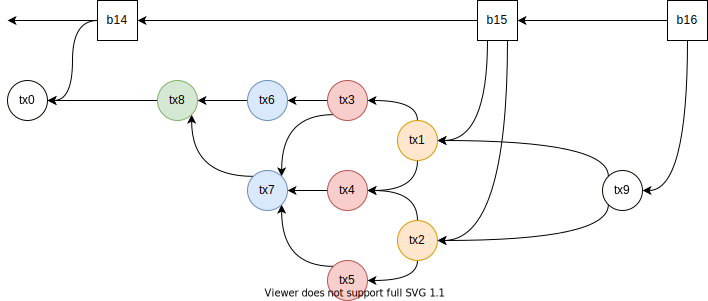

- Feature Name: nano_contracts
- Start Date: 2021-06-14
- RFC PR: (leave this empty)
- Hathor Issue: (leave this empty)
- Author: Marcelo Salhab Brogliato <msbrogli@hathor.network>

# Summary
[summary]: #summary

Nano contracts enable users to create distributed programs to execute complex operations. It is a simplified version of Ethereum's smart contracts.

# Motivation
[motivation]: #motivation

Nano contracts enable the community to create decentralized applications where the rules are immutable and users can interact with them.

It is expected that this new feature will enable other use cases to migrate to Hathor.

# Guide-level explanation
[guide-level-explanation]: #guide-level-explanation

## Basics

Hathor currently implements the UTXO model which means each transaction has one or more outputs and each output can be spent just once. Any attempt to spent an output more than once is considered a double spending attempt and the consensus algorithm will ensure that at most one of the attemps will be executed (and all the others will be voided).

Each output controls some funds (e.g. 1 HTR) and has a script with the rules to spend it (i.e. transfer the funds). A very common script is the Pay-to-Pubkey-Hash (P2PH) which means the ouput can only be spent by the owner of the private key associated with it. Another common script is the Pay-to-Script-Hash (P2SH) which enables multisig among other rules. The multisig rule requires M out of N valid signatures to spend the output.

It is called the UTXO model because the funds are "stored" in Unspent Transaction Outputs that can be used only once. So, one can say that a transaction spends some utxos and create new ones. In other words, the transaction spent the inputs (the utxos of other transactions) and create new outputs that will be used in the future.

Wallets are managers of private keys and utxos. When Alice sends 10 HTR to Bob, Alice's wallet creates a transactions that spends one of Alice's utxos and create a new output that can be spent only by Bob. Let's say Alice has a total of 14 HTR split in two utxos (one with 6 HTR and the other with 8 HTR), so Alice's wallet must create a transaction with two inputs (one for each utxo) and two outputs. The first output is for Bob with 10 HTR and the second output is for herself with a change of 4 HTR. After the transaction is confirmed by the network, Alice will have spent her two utxos that will never be used again, and she will have created two new utxos. Transaction 3 in the image below is Alice's transaction.

<pre>
     ┌───────────────────────────────────┐           ┌───────────────────────────────────┐
     │           Transaction 1           │           │           Transaction 3           │
     └┬────────────────┬────────────────┬┘           └┬────────────────┬────────────────┬┘
      │┌──────────────┐│┌──────────────┐│             │┌──────────────┐│┌──────────────┐│
◀─────┼┼─  Input 1    │││   Output 1  ◀┼┼─────────────┼┼─  Input 1    │││   Output 1   ││
      │└──────────────┘││    6 HTR     ││             │├──────────────┤││    10 HTR    ││
      │                │└──────────────┘│      ┌──────┼┼─  Input 2    ││└──────────────┘│
      │                │┌──────────────┐│      │      │└──────────────┘│┌──────────────┐│
      │                ││   Output 2   ││      │      │                ││   Output 2   ││
      │                ││    1 HTR     ││      │      │                ││     4 HTR    ││
      │                │└──────────────┘│      │      │                │└──────────────┘│
      │                │┌──────────────┐│      │      └────────────────┴────────────────┘
      │                ││   Output 3   ││      │
      │                ││    2 HTR     ││      │
      │                │└──────────────┘│      │
      └────────────────┴────────────────┘      │
                                               │
     ┌───────────────────────────────────┐     │
     │           Transaction 2           │     │
     └┬────────────────┬────────────────┬┘     │
      │┌──────────────┐│┌──────────────┐│      │
◀─────┼┼─  Input 1    │││   Output 1   ││      │
      │└──────────────┘││    4 HTR     ││      │
      │                │└──────────────┘│      │
      │                │┌──────────────┐│      │
      │                ││   Output 2  ◀┼┼──────┘
      │                ││    8 HTR     ││
      │                │└──────────────┘│
      │                │┌──────────────┐│
      │                ││   Output 3   ││
      │                ││    8 HTR     ││
      │                │└──────────────┘│
      └────────────────┴────────────────┘
</pre>

In the image above, we say that __Transaction 3__ is spending outputs from __Transaction 1__ and __Transaction 2__. More specifically, we say that __Input 1__ of __Transaction 3__ is spending the first output of __Transaction 1__, while __Input 2__ of __Transaction 3__ is spending the second output of __Transaction 2__.

## Nano Contracts

The following table summarizes the primary differences between transactions and nano contracts.

```
                             │ Transactions       │ Nano Contracts
─────────────────────────────┼────────────────────┼─────────────────────────
Where are the funds stored?  │ Independent UTXOs  │ Inside the contracts
Who controls the funds?      │ Scripts            │ Methods
State                        │ Stateless          │ Stateful
Validation time              │ Real-time          │ After first block
```

Let's do a more in-depth analysis of each row of this comparison table.

### Where are the funds stored?

While transactions store funds in independent UTXOs, nano contracts aggregate the funds in themselves.

For example, let's say that Alice has 1,000 HTR split into four independent UTXOs. By independent, it means that each UTXO can be spent regardless of the others. In other words, they do not have to stick together. In fact, Alice can split her tokens into as many UTXOs as she wants, and each of them can use a different address.

On the other hand, nano contracts store the funds combined inside themselves. When Alice sends 1,000 HTR to a nano contract, her deposit is combined to whatever have been previous deposited in that nano contract. In this case, there is no such thing as UTXO for nano contracts.

### Who controls the funds?

Each UTXO has a script that will determine the rules to transfer its funds. A common type of script is the P2PKH where the funds can be transferred by the owner of a given private key.

Nano contracts work differently because the funds are combined inside themselves. Nano contracts have methods that decide whether a deposit or withdraw can occur. In other words, if Alice wants to deposit 1,000 HTR in a given nano contract, she will call a method that will decide whether she can do it or not. Methods can be executed multiple times.

While each UTXO can be spent only once, a nano contract's method can be called multiple times.

### State

Another difference is that transactions are stateless while nano contracts are stateful.

Being stateless means that, when a transaction's script is deciding whether the funds can be transferred or not, it has no record of previous transfers and the decision has to be handled based entirely on information that comes with it.

On the other hand, nano contracts have backing storages where they can keep track of previous interactions. So, when Alice deposit 1,000 HTR in a nano contract to bet Brazil will win the World Cup, the contract can record that Alice has bet 1,000 HTR in Brazil.

As transactions are stateless, the order they are validated does not matter. Even if two or more transactions want to spend the same UTXO, they can all be valid. For clarity, in case of conflicting transactions, the consensus algorithm will void all of them except one.

As nano contracts are stateful, the result of a call to a nano contract's method might depend on previous calls. In other words, the order the calls are validated impacts the results.

### Blueprints

Nano contracts are instances of blueprints, just like objects are instances of classes in object-oriented programming languages.

It means that all variables and methods are defined in blueprints. A nano contracts is created through a call to a blueprint's constructor.

The separation between blueprints and nano contracts is what makes nano contracts safe and simple to use. For instance, if a user trust the Lottery Blueprint, they can safely create a Lottery Nano Contract with a specific setting through the initialization parameters of the blueprint.

A blueprints can inherit from other blueprint. In this case, when a nano contract's method is called, the full node will look up the method in the blueprint. If it is not found, the full node will recursively look up the method in the blueprint's parent.

Notice that blueprints do not have state. Only nano contracts have states.

The image below shows four nano contracts created from the Betting Blueprint. Each nano contract has its own state, which means they are independent and represent different bettings.

<pre>
                                    ┌──────────────────────────────────────────┐
┌─────────────────────┐      ┌──────│Nano Contract #1                          │
│  Betting Blueprint  │      │      │Id: 0000a0d9337455b8ddb09607e7c9ee0a718...│
├─────────────────────┤      │      └──────────────────────────────────────────┘
│                     │      │      ┌──────────────────────────────────────────┐
│ constructor(...)    │      ├──────│Nano Contract #2                          │
│                     │      │      │Id: 00007867ff1fc65e13feb6e5aec591453d1...│
│ make_a_bet(...)     │◀─────┤      └──────────────────────────────────────────┘
│                     │      │      ┌──────────────────────────────────────────┐
│ collect_prize(...)  │      ├──────┤Nano Contract #3                          │
│                     │      │      │Id: 0000038740a7abea17b7315316779ebb686...│
│ set_result(...)     │      │      └──────────────────────────────────────────┘
│                     │      │      ┌──────────────────────────────────────────┐
└─────────────────────┘      └──────┤Nano Contract #4                          │
                                    │Id: 0000b09db96194fc3cb09f5e1afd6fca65c...│
                                    └──────────────────────────────────────────┘
</pre>

### Interaction between Nano Contracts and Transactions

There are three ways to interact with a nano contract:

1. Deposit tokens into the nano contract.
2. Withdraw tokens from the nano contract.
3. Call a method of the nano contract.

The deposit is made through a transaction with an output that calls a method of the nano contract. The method will validate whether the deposit is valid. For instance, the transaction below is depositing 1,000 HTR into the Nano Contract #1:

<pre>
┌─────────────────────────────────────────────┐
│                Transaction A                │
├──────────────────────┬──────────────────────┤
│        Inputs        │       Outputs        │
├──────────────────────┼──────────────────────┤
│                      │  1,000 HTR           │
│       200 HTR        │  Nano Contract #1    │
│                      │  make_a_bet(BRA)     │
├──────────────────────┼──────────────────────┤
│                      │                      │
│       900 HTR        │  100 HTR (change)    │
│                      │                      │
└──────────────────────┴──────────────────────┘
</pre>

The withdrawal is made through a transaction with an input that calls a method of the nano contract. The method will validate whether the widthdrawal is valid. For instance, the transaction below is withdrawing 2,500 HTR from the Nano Contract #1:

<pre>
┌────────────────────────────────────────────────────────────┐
│                       Transaction B                        │
├─────────────────────┬──────────────────────────────────────┤
│       Inputs        │               Outputs                │
├─────────────────────┼──────────────────────────────────────┤
│  2,500 HTR          │  2,500 HTR                           │
│  Nano Contract #1   │  P2PKH                               │
│  collect_prize()    │  HBpGrjZcYNVJrZTy4Yct7HtUdLM1ToCPi3  │
└─────────────────────┴──────────────────────────────────────┘
</pre>

Finally, a simple call to a method is similar to a deposit or withdrawal but with amount zero.

Notice that a single transaction can have multiple deposits, withdrawals, and calls, even to different nano contracts. This allows a multitude of advanced uses.

For instance, the transaction below is withdrawing 1,000 HTR from Nano Contract #1, depositing 200 HTR into Nano Contract #2, depositing 300 HTR in Nano Contract #3, and sending 500 HTR to an address.

<pre>
┌────────────────────────────────────────────────────────────┐
│                       Transaction C                        │
├─────────────────────┬──────────────────────────────────────┤
│       Inputs        │               Outputs                │
├─────────────────────┼──────────────────────────────────────┤
│  1,000 HTR          │  200 HTR                             │
│  Nano Contract #1   │  Nano Contract #2                    │
│  collect_prize()    │  make_a_bet(BRA)                     │
├─────────────────────┼──────────────────────────────────────┤
│                     │  300 HTR                             │
│                     │  Nano Contract #3                    │
│                     │  make_a_bet(BRA)                     │
├─────────────────────┼──────────────────────────────────────┤
│                     │  500 HTR                             │
│                     │  P2PKH                               │
│                     │  HDEJ453QjK7F7jipQebRymsRpnFG8j2DHk  │
└─────────────────────┴──────────────────────────────────────┘
</pre>

To clarify, transactions will only be valid if the sum of the inputs equals the sum of the outputs.

### Validation Time

Transactions are validated as soon as they arrive in the full node. If they are valid, they are immediately added to the DAG of transactions. Otherwise, they are discarded.

On the other hand, as to nano contracts, the result of a call to a method depends on the order the calls are executed. It means that the full node can only execute calls when the order of execution is well defined and the same for all peers in the network.

The order of execution cannot depend on the order the calls arrived in the full node. So, when can a call be safely executed? Only after it is confirmed by a block. It means that calls in the mempool must wait to be confirmed.

### Order of Execution

The calls execution order is defined by the accumulated weight of the transactions, from higher to lower.

Inside a transaction, the calls are executed following the order of the inputs and then following the order of the outputs.

For instance, let's say all transactions in the image below are making calls to nano contracts. The order of execution will be:



TODO Add `acc_weight` to each tx in the image above and explain the ordering here.

## Examples

### Group Betting

Betting using data from the real world requires an Oracle. Imagine a predict-a-score game where any person can place a bet and the funds will be split among the winners. In this case, each participants will transfer funds to the Nano Contract. At the end of the game, an Oracle will provide the game results and the winners will be able to collect their prize. Such Nano Contract would have the following blueprint:

```python
Result = NewType('Result', str)

class BetItem:
	total: Amount
	bets: Dict[Address, Amount]

class Bet(Blueprint):
	bets: Dict[Result, BetItem]
	withdrawals: Dict[Address, Amount]
	total: Amount
	oracle_script: TxOutputScript
	date_last_offer: Timestamp
	final_result: Result
	token_id: TokenId

	@public
	def make_a_bet(self, address: Address, amount: Amount, score: str) -> None:
		"""Make a bet."""
		if timestamp > date_last_offer:
			self.fail('cannot place bets after 2021-01-01 17:00')
		if txout.token_id != self.token_id:
			self.fail('invalid token')
		self.bets[score].add_bet(address, amount)
		self.total += amount

	@public
	def set_result(self, result: Signed[Result]) -> None:
		"""Set result. Used by the oracle."""
		assert result.checksig(self.oracle_script)
		self.final_result = result.data

	@public
	def withdraw(self, address: SignedAddress, amount: Amount) -> None:
		"""Withdraw funds after the result is given."""
		if not self.result:
			self.fail('result not available yet')
		if not address.validate():
			self.fail('proof of ownership failed')
		allowed = self.get_max_withdrawal(address)
		if amount > allowed:
			self.fail('amount is greater than allowed')
		self.withdrawals[address] += amount

	def get_winner_amount(self, address) -> Amount:
		item = self.bets[self.final_result]
		return item.bets[address] * item.total / self.total

	def get_max_withdrawal(self, address) -> Amount:
		winner_amount = self.get_winner_amount(address)
		return winner_amount - self.withdrawals[address]
```

### Liquidity Pool

TODO How to allow slippage? Credit system where users will withdraw in a second transaction.
TODO How to handle multiple calls? Add an execution context?

#### Swap Transaction

Swap(20 TKB => 10 TKA)

Slippage: Send extra TKB and get the remaining in credits.

in:
- 10 TKA, `swap()`
- 20 TKB, regular txin

out:
- 20 TKB, `swap()`
- 10 TKA, script p2pkh

#### Add Liquidity

AddLiquidity(20 TKB, 10 TKA)

Slippage: Send extra TKB or TKA and get the remaining in credits.

in:
- 10 TKA, regular txin
- 20 TKB, regular txin

out:
- 10 TKA, `add_liquidity()`
- 20 TKB, `add_liquidity()`

```python
class MyContext(ExecutionContext):
	in: Amount
	out: Amount

class LiquidityPools(Blueprint):
	token_a_id: TokenId
	token_b_id: TokenId

	credit_a: Dict[Address, Amount]
	credit_b: Dict[Address, Amount]

	@public
	def swap(...):
		total_a, total_b = self.reserve()

		if txin.token_id != self.token_a_id:
			self.fail('not implemented')

		in_a = tx.balance(self.token_a_id)
		out_b = tx.balance(self.token_b_id)

		used_b = in_a * total_b / total_a
		if used_b > out_b:
			self.fail('not implemented')

		self.credit_b[address] += out_b - used_b

	def add_liquidity(...):
		pass

	def remove_liquidity(...):
		pass

	def claim_fee(...):
		pass

	def withdraw_credits(...):
		pass

	def pair(...):
		return (self.token_a_id, self.token_b_id)

	def token():
		pass

	def reserve():
		total_a = self.get_balance(self.token_a_id)
		total_b = self.get_balance(self.token_b_id)

		reserve_a = total_a - self.credit_a.total
		reserve_b = total_b - self.credit_b.total

		return (reserve_a, reserve_b)
```

# Reference-level explanation
[reference-level-explanation]: #reference-level-explanation

## Blueprints

For the PoC, blueprints will be hard-coded in the full node.

Each blueprint will have a unique identifier that will be used by nano contracts.

## Nano Contracts

Nano contracts will be vertices in the DAG with the following attributes:

- Blueprint unique identifier: hash(32 bytes)
- Data for the constructor: script(push only)

### State

State of nano contracts will be stored in disk by the full node.

TODO Format in disk.
TODO How to update the state of a nano contract when a transaction is voided?

## NanoContractTxIn & NanoContractTxOut

Attributes:
- `amount`
- `nano_contract_id`
- `method(arguments)`

We will need to refactor `TxInput` to add `get_value()` and `validate()` methods.

## Execution of Transactions

As the order of execution follows the accumulated weight, a transaction in the mempool can move from valid to invalid if a new transaction with higher accumulated weight arrives.

TODO What happens when a transaction without first block has higher accumulated weight than one with first block (impossible?!)
TODO How to validate a transaction added to the mempool?
TODO Should we require at least one block before executing a transaction?

## Examples

### Group Betting

Betting using data from the real world requires an Oracle. Imagine a predict-a-score game where any person can place a bet and the funds will be split among the winners. In this case, each participants will transfer funds to the Nano Contract. At the end of the game, an Oracle will provide the game results and the winners will be able to collect their prize. Such Nano Contract would have the following blueprint:

```python
class BetItem:
	total: Amount = 0
	bets: Dict[Address, Amount] = 0

	def add_bet(self, address: Address, amount: Amount):
		self.bets[address] += amount
		self.total += amount

class Bet(Blueprint):
	bets: Dict[str, BetItem]
	withdrawals: Dict[Address, Amount]
	total: Amount
	oracle_script: TxOutputScript
	date_last_offer: Timestamp
	result: str
	token_id: TokenId

	@public
	def make_a_bet(self, address: Address, amount: Amount, score: str) -> None:
		"""Make a bet."""
		if timestamp > date_last_offer:
			self.fail('cannot place bets after 2021-01-01 17:00')
		if txout.token_id != self.token_id:
			self.fail('invalid token')
		self.bets[score].add_bet(address, amount)
		self.total += amount

	@public
	def set_result(self, result: str) -> None:
		"""Set result. Used by the oracle."""
		assert checksig(self.oracle_script)
		self.result = result

	@public
	def withdraw(self, address: SignedAddress, amount: Amount) -> None:
		"""Withdraw funds after the result is given."""
		if not self.result:
			self.fail('result not available yet')
		if not address.validate():
			self.fail('proof of ownership failed')
		allowed = self.get_max_withdrawal(address)
		if amount > allowed:
			self.fail('amount is greater than allowed')
		self.withdrawals[address] += amount

	def get_winner_amount(self, address) -> Amount:
		item = self.bets[self.result]
		return item.bets[address] * item.total / self.total

	def get_max_withdrawal(self, address) -> Amount:
		winner_amount = self.get_winner_amount(address)
		return winner_amount - self.withdrawals[address]
```

### Liquidity Pool

TODO How to allow slippage? Credit system where users will withdraw in a second transaction.
TODO How to handle multiple calls? Add an execution context?

#### Swap Transaction

Swap(20 TKB => 10 TKA)

Slippage: Send extra TKB and get the remaining in credits.

in:
- 10 TKA, `swap()`
- 20 TKB, regular txin

out:
- 20 TKB, `swap()`
- 10 TKA, script p2pkh

#### Add Liquidity

AddLiquidity(20 TKB, 10 TKA)

Slippage: Send extra TKB or TKA and get the remaining in credits.

in:
- 10 TKA, regular txin
- 20 TKB, regular txin

out:
- 10 TKA, `add_liquidity()`
- 20 TKB, `add_liquidity()`

```python
class MyContext(ExecutionContext):
	in: Amount
	out: Amount

class LiquidityPools(Blueprint):
	token_a_id: TokenId
	token_b_id: TokenId

	credit_a: Dict[Address, Amount]
	credit_b: Dict[Address, Amount]

	@public
	def swap(...):
		total_a, total_b = self.reserve()

		if txin.token_id != self.token_a_id:
			self.fail('not implemented')

		in_a = tx.balance(self.token_a_id)
		out_b = tx.balance(self.token_b_id)

		used_b = in_a * total_b / total_a
		if used_b > out_b:
			self.fail('not implemented')

		self.credit_b[address] += out_b - used_b

	def add_liquidity(...):
		pass

	def remove_liquidity(...):
		pass

	def claim_fee(...):
		pass

	def withdraw_credits(...):
		pass

	def pair(...):
		return (self.token_a_id, self.token_b_id)

	def token():
		pass

	def reserve():
		total_a = self.get_balance(self.token_a_id)
		total_b = self.get_balance(self.token_b_id)

		reserve_a = total_a - self.credit_a.total
		reserve_b = total_b - self.credit_b.total

		return (reserve_a, reserve_b)
```


# Drawbacks
[drawbacks]: #drawbacks

# Rationale and alternatives
[rationale-and-alternatives]: #rationale-and-alternatives

## Nano Contracts with UTXO only

In the UTXO model, the P2SH Script is a clever approach to create Nano Contracts because they have an address associated to each script. The methods of the Nano Contracts would be leafs in a Merkle Tree and the hash of the root will be used to generate the P2SH Address. The Nano Contracts would have to be published off-chain and users would interact with a Nano Contract spending a utxo and putting the desired method (and merkle path) in the input.

These are some disadvantages to this approach that made me abadon it: (i) each transaction will replicate the code to be executed, requiring more storage and bandwidth, (ii) if many users would like to interact with the same Nano Contract at the same time, their transactions might be in conflict and some of them will have to regenerate their transactions, (iii) the funds of a Nano Contract will be split among many utxos and the wallet will have to select the right utxos when building a new transaction, and (iv) there's no way to store extra pieces of information.

# Prior art
[prior-art]: #prior-art

# Unresolved questions
[unresolved-questions]: #unresolved-questions

1) Will we allow Nano Contracts to call methods from other Nano Contracts?

We can do it to allow Nano Contracts to exchange funds between them. For example:
```
deposit(other_nano.method, self.address, 10 TKA)
withdraw(other_nano.method, self.address, 10 TKA)
```

2) How to name and represent addresses?

Type of addresses:
- P2PKH
- P2SH
- Nano Contract's internal address

Should we use an address or a TxOutput's script?
If we decide to use scripts, what's the meaning of a timelock in a deposit?


## Generation of random values

Even though it might be useful, it is far from simple because all full-nodes must generate exactly the same value to be able to verify the transaction. As full-nodes must generate the same value, it might be a predictable value which is a deal breaker for many uses.

One idea might be to use the hash of the first block to confirm the transaction as a random seed (e.g. `sha256d(block.hash)`). If the hashrate is big enough and decentralized, it might be accepted as random enough. This would prevent the full-node from executing some transactions before it gets confirmed by a block and requires further analysis of impact.

## Hathor Virtual Machine

- Conversa Jan
    - Modelo de gas mas gratuito até certo valor.
	- Começar built-in e depois abrir para o público enviar.
	- Explicar sobre a questão do estado e dar exemplos em que uma tx é válida em T1 e inválida em T2.
	- Talvez permitir loop mas com gas limitado.

- All instructions must be O(1) and no loops are allowed.
	- Example: `x in mylist` is not allowed because it is O(n).
- Maximum number of instructions per method?
- Should we charge a fee per instruction?
- Enumerate variables and associate each one with a register.
    - Maximum number of registers?
- Flags
    - N: Negative
	- Z: Zero
	- C: Carry or unsigned overflow
	- V: Signed overflow

### Instruction Set

Maybe we should get inspiration in [Python's bytecode](https://docs.python.org/3/library/dis.html#bytecodes).

1. `JMP`: Unconditional jump (always relative).
2. `JLE`: Jump if less than or equal. (`(Z == 1) || (N != V)`)
3. `JLT`: Jump if less than. (`N != V`)
4. `JGE`: Jump if greater than or equal. (`N == V`)
5. `JGT`: Jump if greater than. (`(Z == 0) && (N == V)`)
6. `JNE`: Jump if not equal. (`Z == 0`)
7. `JEQ`: Jump if equal. (`Z == 1`)
8. `CMP`: Compare two values and update the flags.

### Examples

- `a += 1` will be compiled to `INC reg[A]`, where `regA` is the register associated with variable `a`.
- `a = a + b` will be compiled to `ADD reg[A] reg[A] reg[B]`.

```
if a > 5:      |   CMP reg[A] const[5]
               |   JLE mark1
    a += 1     |   INC reg[A]
               |   JMP mark2
else:          | mark1:
    a -= 1     |   DEC reg[A]
               | mark2:
```

The assembler will translate the assembly code into object files.

## Matching for Transactions

- Regexp for transactions
  - Index: `txin[0].token_idx == 0`
  - Any:   `txin[?].token_idx == 1`
  - All:   `txin[*].token_idx == 0`
  - `txout[0].amount < 500`
  - `txout[?].token_idx == 1`
  - `tokens[1] == "HTR"`
  - `txin.length == 2`
  - `txout.length == 3`
  - `tokens.length == 1`

For example, `type == Transaction && tokens.length == 0 && txin.length == 1 && txout.length <= 2 && txin[*].authority == False && txout[*].authority == False`.

## Overall Costs & Fees

As Nano Contracts will not be turing complete and the method will be fast to process, its economics might be similar to custom tokens. In other words, no fees will be chaged to execute methods in Nano Contracts and the transaction's PoW will be the spam control mechanism.

Will the network charge fees for transactions executing a nano contract? No.


# Future possibilities
[future-possibilities]: #future-possibilities

