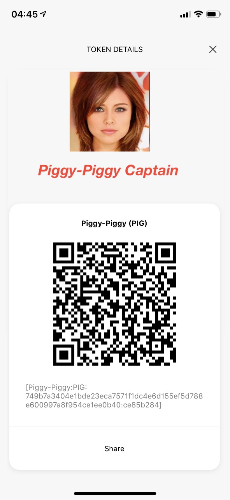

- Feature Name: token-captain
- Start Date: 2019-08-07
- RFC PR: (leave this empty)
- Hathor Issue: (leave this empty)

# Summary
[summary]: #summary

Tokens issued in Hathor, as of now, have a single anti-fraud mechanism: the TokenID. A TokenID is a large hash, which is hard to perceive by people.  In most cases, people simply concentrate on the beginning and end of the hash. Computers can rapidly recognize the ID through QR codes, but, for people, this is obviously something that is far from natural.  

I suggest, after discussion with msbrogli (it was his idea how to technically build this) that we issue, in our wallets, something that the human brain is _extremely_ good at: recognizing human faces.  Each token has a 'token-captain' (alternative names are discussed below), and, as you receive a token, you can immediately recognize that the ID is correct.  If you recognize the captain's face, that's the correct token.

A natural extension of this idea is to create the Hathor-QR-Code, which is a QR code with enough noise-cleaning to include the image of the 'token-captain' inside the image of the QR-Code itself.  A single image is immediately identified by humans and computers.  

Alternative names to captain, ranging from serious to silly, are:

commander  
overseer  
spiritual leader  
head  
champion  
distinguished  
boss  
personage  
magnate  
idol  
figure  
character  
personality  
tycoon  
moonstronaut (a play on the _to-the-moon_ meme)  
moon-captain (same)  
moon-commander

This is such that when you build the 'piggy-piggy' token, the image of the captain appears (and a text:  "piggy-piggy champion", or "piggy-piggy moonstronaut", or "piggy-piggy head").

# Motivation
[motivation]: #motivation

Hathor is designed to be _the platform for token issuance_.  Not _a platform_, but by far the best platform for this market.  In order to succeed, given that it is fighting against well-funded, established projects, it must exceed users expectations in _all_ possible dimensions of user experience.

At a bare minimum, this will be seen as one innovation stemming from our labs, as it spreads to become industry practice.  It does not suffice to do high-technology in this market---even the best technology is not guaranteed to win; we need to offer the best, the fastest, the cheapest, the safest platform for token issuance, _and_ be perceived and adopted by the market.  

I can easily imagine people playing with creating tokens and seeing the captains, forming new captains, showing to others, comparing to others, and saying: "this is _so much better and cooler_ than Ethereum"!

# Guide-level explanation
[guide-level-explanation]: #guide-level-explanation

(to be written)

Explain the proposal as if it was already included in the language and you were teaching it to another Hathor programmer. That generally means:

- Introducing new named concepts.
- Explaining the feature largely in terms of examples.
- Explaining how Hathor programmers should *think* about the feature, and how it should impact the way they use Hathor. It should explain the impact as concretely as possible.
- If applicable, provide sample error messages, deprecation warnings, or migration guidance.
- If applicable, describe the differences between teaching this to existing Hathor programmers and new Hathor programmers.

For implementation-oriented RFCs (e.g. for compiler internals), this section should focus on how compiler contributors should think about the change, and give examples of its concrete impact. For policy RFCs, this section should provide an example-driven introduction to the policy, and explain its impact in concrete terms.

# Reference-level explanation
[reference-level-explanation]: #reference-level-explanation

See [the AIs that create 'fake celebrities'.](https://github.com/tkarras/progressive_growing_of_gans) I will write more if there is sufficient early interest. 

This is the technical portion of the RFC. Explain the design in sufficient detail that:

- Its interaction with other features is clear.
- It is reasonably clear how the feature would be implemented.
- Corner cases are dissected by example.

The section should return to the examples given in the previous section, and explain more fully how the detailed proposal makes those examples work.

# Drawbacks
[drawbacks]: #drawbacks

Why should we *not* do this?  The only things I can think of, are:

  i) time to build and test; and

  ii) that others will copy.

On this second issue, It seems to me that the mere fact that we have been seen as _leading in one aspect_ of the token market will draw people's attention to consider our other innovations more seriously, such as the fact that our scalability and our ease of use are clearly better.  

# Rationale and alternatives
[rationale-and-alternatives]: #rationale-and-alternatives

- Why is this design the best in the space of possible designs?
- What other designs have been considered and what is the rationale for not choosing them?
- What is the impact of not doing this?

# Prior art
[prior-art]: #prior-art

Discuss prior art, both the good and the bad, in relation to this proposal.
A few examples of what this can include are:

- For language, library, cargo, tools, and compiler proposals: Does this feature exist in other programming languages and what experience have their community had?
- For community proposals: Is this done by some other community and what were their experiences with it?
- For other teams: What lessons can we learn from what other communities have done here?
- Papers: Are there any published papers or great posts that discuss this? If you have some relevant papers to refer to, this can serve as a more detailed theoretical background.

This section is intended to encourage you as an author to think about the lessons from other languages, provide readers of your RFC with a fuller picture.
If there is no prior art, that is fine - your ideas are interesting to us whether they are brand new or if it is an adaptation from other languages.

Note that while precedent set by other languages is some motivation, it does not on its own motivate an RFC.
Please also take into consideration that rust sometimes intentionally diverges from common language features.

# Unresolved questions
[unresolved-questions]: #unresolved-questions

- What parts of the design do you expect to resolve through the RFC process before this gets merged?
- What parts of the design do you expect to resolve through the implementation of this feature before stabilization?
- What related issues do you consider out of scope for this RFC that could be addressed in the future independently of the solution that comes out of this RFC?

# Future possibilities
[future-possibilities]: #future-possibilities

Think about what the natural extension and evolution of your proposal would
be and how it would affect the language and project as a whole in a holistic
way. Try to use this section as a tool to more fully consider all possible
interactions with the project and language in your proposal.
Also consider how the this all fits into the roadmap for the project
and of the relevant sub-team.

This is also a good place to "dump ideas", if they are out of scope for the
RFC you are writing but otherwise related.

If you have tried and cannot think of any future possibilities,
you may simply state that you cannot think of anything.

Note that having something written down in the future-possibilities section
is not a reason to accept the current or a future RFC; such notes should be
in the section on motivation or rationale in this or subsequent RFCs.
The section merely provides additional information.
