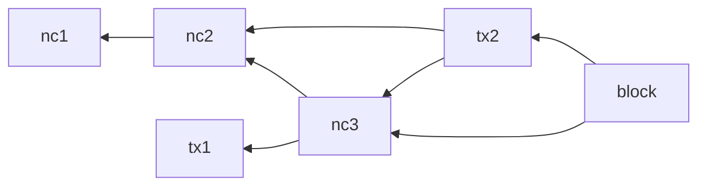
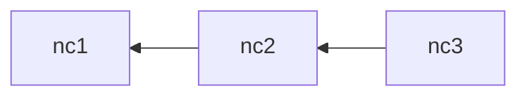
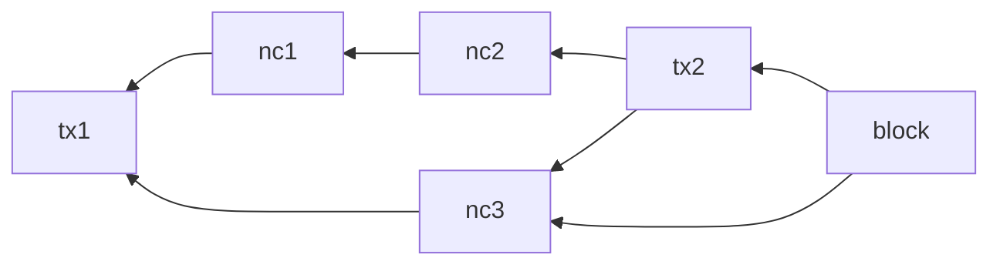
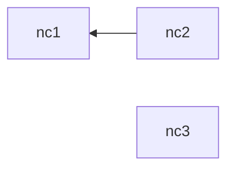

- Feature Name: transaction_ordering
- Start Date: 2024-11-08
- RFC PR: (leave this empty)
- Hathor Issue: (leave this empty)
- Author: Marcelo Salhab Brogliato <msbrogli@hathor.network>

# Summary
[summary]: #summary

This RFC covers how the full node sorts the transactions that are confirmed by a block.

# Motivation
[motivation]: #motivation

The order that transactions are executed is critical and might have deep consequences on Nano's success. The end goal is
to prevent MEV, including front running attacks.

# Background
[background]: #background

## MEV and front running attacks

Maximum Extractable Value (MEV) refers to the practice by miners or validators of maximizing their profits by reordering
the transactions included in a block they are preparing. MEV is possible because miners and validators have complete
control over which transactions are included in a block and the order in which they are executed. The process works as
follows:

1. Users relay their transactions to the mempool.
2. Miners or validators select which transactions will be included in the block. Notably, they can also include
   transactions not present in the mempool, such as those privately generated by themselves.
3. Miners or validators then reorder the transactions in a way that maximizes their profits.
4. The block is then broadcast to the network.

Here’s a more detailed example:

1. The mempool contains several transactions buying tokens from a liquidity pool.  Let’s refer to these transactions as
   the target transactions `[buy1, buy2, ..., buyN]`.
2. The validator privately creates two transactions: `pre` and `post`. The `pre` transaction is placed before the target
   transactions, and the `post` transaction is placed after. The `pre` transaction buys tokens from the same liquidity
   pool, driving up the pool’s price. As a result, all target transactions acquire tokens at this higher price, further
   increasing the price. Finally, the `post` transaction sells the tokens purchased by the `pre` transaction, profiting
   from the price increase caused by the target transactions.
3. The miner or validator generates a block with the following order: `[pre, buy1, ..., buyN, post]`.
4. The block is confirmed by the network.

For a concrete example:

1. The ETH/USDT Liquidity Pool has a balance of 59,997,152.67 USDT and 22,672.96 ETH, implying an initial price of
   $2,646.19 USDT per ETH for small quantities.
2. The target `[buy1, buy2, ..., buyN]` transactions aim to buy $100k USDT worth of ETH with a 10% slippage tolerance.
   These transactions expect to receive 37.70 ETH but could receive as little as 33.93 ETH.
3. The validator privately prepares the `pre` transaction, which buys 116.468 ETH for 3,250,585.60 USDT, thereby
   increasing the pool price.
4. The validator then prepares the `post` transaction, which sells 116.468 ETH for 3,257,337.16 USDT.
5. The validator generates a block in the order: `[pre, buy1, ..., buyN, post]`.
6. After the block is executed, the validator profits 6,751.56 USDT from the MEV strategy, while the `[buy1, buy2, ...,
   buyN]` transactions receive the minimum of 33.93 ETH.

In the example above, the MEV strategy profits by exploiting the slippage tolerance of the transactions.

MEV is so profitable that a separate network has emerged to facilitate it. In this network, third parties can offer
payments to miners or validators in exchange for including a specific bundle of transactions in a particular order.

# Guide-level explanation
[guide-level-explanation]: #guide-level-explanation

Transactions will be executed in topological order using a modified Kahn's algorithm. During each iteration, Kahn's
algorithm maintains a set of nodes with no incoming edges, from which one node is selected. To introduce randomness in
the selection process, a random number generator (RNG) is seeded with the block's hash. This ensures that node selection
is randomized consistently across all full nodes. Since the RNG uses the same seed, all full nodes will make identical
selections, thereby establishing consensus.

The Kahn's algorithm will be executed on a DAG of dependencies containing only nano transactions. This DAG of
dependencies is generated in O(N) time where N is the number of transactions confirmed by the block.

As the Kahn's algorithm also runs in O(N) time, the entire sorting algorithm also runs in O(N) time.

This approach offers several key benefits:

1. The final order will always be a valid topological order, ensuring that all transactions are executed only after
   their dependencies are satisfied.

2. Users gain some control over transaction ordering. They can ensure an order `[tx1, tx2, ..., txN]` by making each
   transaction dependent on the previous one, effectively setting it as a parent.

3. Miners have minimal control over transaction ordering because they cannot predict the block hash in advance, and
   their primary incentive is to broadcast the newly mined block to the network as quickly as possible.

This method leverages the fact that DAGs are partially ordered structures, meaning there are multiple valid ways to
order transactions while still respecting their dependencies.

## MEV Mitigation

To execute a front-running attack with almost zero risk, an attacker needs to arrange transactions in a specific order.
While an attacker might use multiple `pre` and `post` transactions, they still require that the `pre` transactions be
executed before the target transactions and the `post` transactions after.

However, placing the `post` transaction after a specific target transaction is challenging, as these buy transactions
may not have a predetermined order. Regarding the `pre` transactions, they would need to be a sibling of the first
target transaction. Even in this scenario, the target transaction could still be randomly selected before the `pre`
transaction, reducing the attack's effectiveness.

## Examples

Here a few examples to help clarify how it works.

### Example 1

Here is the full DAG of dependencies:

After removing all non-nano transactions, we would get:

In this case, there is only one possible order that is a valid topological order: `[nc1, nc2, nc3]`.

### Example 2

Here is the full DAG of dependencies:

After removing all non-nano transactions, we would get:

Here are the only three possible valid topological orders:

1. `[nc1, nc2, nc3]`
2. `[nc1, nc3, nc2]`
3. `[nc3, nc1, nc2]`

The actual order will depend on the block hash. Let's walk through the process step by step, using Kahn's algorithm. Let
`S` represent the set of nodes with no incoming edges.

1. In the first iteration, `S = {nc1, nc3}`.
2. There is a 50% chance that `nc1` will be selected. After this, `S = {nc2, nc3}`. At this point, there is a 25% chance
   of selecting `[nc1, nc2, nc3]` and a 25% chance of selecting `[nc1, nc3, nc2]`.
3. If `nc3` is selected first (50% chance), then `S = {nc1}`. After choosing `nc1`, `S = {nc2}`, resulting in a 50%
   chance for `[nc3, nc1, nc2]`.

Note that the probability of each permutation is not equally distributed.

# Reference-level explanation
[reference-level-explanation]: #reference-level-explanation

## DAG of Dependencies Containing Only Nano Transactions

This dependency DAG will be derived only from the DAG of funds (inputs). This allows each user to enforce order on their
own transactions; users cannot enforce order among another user transactions unless they authorize.

Even though the parent-child relationship can be used to enforce temporal order (e.g., `txB` has `txA` as a parent, then
`txB` must have been created after `txA`), using this relationship can facilitate front running attacks because
attackers can be sure their second transaction will be executed after the target by simply making the target a parent of
the second transaction.

Given that the DAG contains `N` vertices and `M` edges, the entire graph can be duplicated in `O(N + M)` time.  After
duplication, all non-nano transactions will be removed in `O(N + M)` time as well. When a vertex is removed, its
incoming edges will be redirected from their sources to the destinations of its outgoing edges, thereby preserving the
overall dependency structure.

## Random Number Generator (RNG)

A random number generator will have to be specified for a production implementation since we cannot rely on third-party
implementations (e.g., Python's `Random` class) for the protocol.

# Drawbacks
[drawbacks]: #drawbacks

The proposed solution would prevent us from executing transactions in the mempool since the actual order is unknown
until the next block is found.

# Rationale and alternatives
[rationale-and-alternatives]: #rationale-and-alternatives

An alternative solution could involve using a weighted sampling method within Kahn's algorithm, where the weight
represents something like the transaction accumulated weight. The idea would be to increase the likelihood of selecting
older transactions first. However, this approach may be ineffective because attackers could pre-construct larger
sub-DAGs that are not relayed to the network, thereby increasing their chances of executing a successful attack.

An alternative approach would be to follow the proposed method but, instead of sampling from the set of nodes with no
incoming edges in each iteration, we could execute all transactions from the chosen node before sampling again. This
approach is analogous to sampling and executing a sub-DAG at each step.

# Prior art
[prior-art]: #prior-art

Here are some articles on how other networks have been addressing this issue:

1. [Solana Slerftools](https://medium.com/@solana_dev/solana-anti-mev-volume-bot-increasing-token-trading-volume-with-slerftools-70cd16c956f5)

2. [CoW DAO](https://cow.fi/learn/understanding-mev-protection)

3. [MEV Protection: DEX & Aggregator Anti-MEV Mechanisms](https://www.shoal.gg/p/mev-protection-dex-and-aggregator)

# Unresolved questions
[unresolved-questions]: #unresolved-questions

# Future possibilities
[future-possibilities]: #future-possibilities

