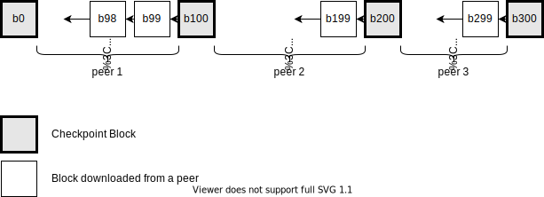
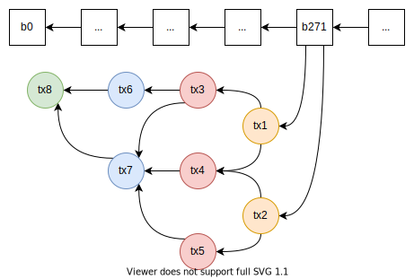
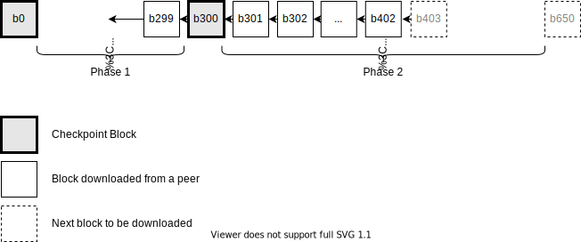
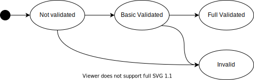

- Feature Name: sync_v2
- Status: Draft
- Start Date: 2020-10-16
- RFC PR: (leave this empty)
- Hathor Issue: (leave this empty)
- Author: Jan Segre <jan@hathor.network>, Marcelo Salhab Brogliato <msbrogli@hathor.network>

# Summary
[summary]: #summary

Version 2 of the protocol to synchronize the fullnode with the p2p network.

# Motivation
[motivation]: #motivation

Sync-v1 propagates arbitrary orphan blocks that do not add to the network in any way and waste resources. More critically it will _have_ to repropagate all those orphan blocks for the network to converge.

Sync-v2 uses many lessons from sync-v1. It is faster to sync, requires less indexing and uses less CPU.

# Guide-level explanation
[guide-level-explanation]: #guide-level-explanation

The goal of the sync-v2 is to get the fullnode synchronized (synced) with the p2p network. As the network is decentralized and all nodes are equal, it happens that the fullnode must individually sync with each peer it is connected to. Even though we expect to have all peers agreeing in which is the bestchain, there might be one or more peers with different bestchains.

A checkpoint is a block that must be part of the bestchain, i.e. it cannot be orphan. It means that the bestchain must contain all checkpoints. The first natural and obvious checkpoint is the genesis with height zero. Sync-v2 supports static checkpoints, i.e., the list of checkpoints is hard-coded in the source code and cannot modified. There are several benefits to have support for checkpoints, including to prevent a large reorg attacks when the hashrate is not that big.

Notice that we wouldn't need to have a list of checkpoints because the last checkpoint itself uniquely defines the chain until the genesis block. But there are performance gains in the sync algorithm knowing intermediate checkpoints beforehand.

A transaction is said to be valid when it passes all verifications. If a transaction fails any verification, it is called invalid. Whether a transaction is valid or invalid is immutable, i.e., there's no way to change from valid to invalid or the other way around. Besides that, a transaction is either executed or voided. We say that a transaction is executed (or confirmed) when it takes effect (e.g. the funds are transferred). On the other hand, a transaction is voided when it is ignored (e.g. the funds are __not__ transferred). A transaction may change from executed to voided and vice-versa over time (e.g. in case of a reorg). Notice that all executed transactions are necessarily valid. Invalid transactions should never be propagated to the network.

We say that a transaction belongs to the first block of the bestchain that verifies it. Transactions without a first block are said to be part of the mempool. Notice that, in case of a reorg, a block may turn into an orphan block and its transactions will be put back to the mempool.

From now on, let's enumerate the blocks of the bestchain by their heights (e.g., `b0` is the genesis, `b1` is the block with height one, `b15` is the block with height 15, and so on and so forth). We can also use the following notation: `[b0, b1, ..., b15, ...]` to indicate a sequence of blocks connected by their parents.

Sync-v2 uses the fact that the weight of the blocks is way bigger than the transactions'. The synchronization happens in four phases: (i) sync the blocks until last checkpoint, (ii) sync the blocks from the last checkpoint to the latest best block, (iii) sync the mempool, and finally (iv) real-time propagation.

## Phase 1: From genesis to the last checkpoint

The first phase syncs all blocks (and their transactions) from genesis until last checkpoint. In this phase, we can safely download blocks from a given checkpoint and start going backwards (i.e., decreasing the height). For example, if we know that `b100` is a checkpoint, we can safely download `b99`, and then `b98`, and then `b97`, and so on.

We say it is safe to download this sequence because nobody is able to create a fake sequence of blocks as we always check that `b99` is the parent of `b100`, and then that `b98` is the parent of `b99`, and so on. In this case, we say that we are downloading blocks from right (the newest) to left (the oldest).

Besides that, if we have a list of checkpoints (e.g. `{b0, b100, b200, b300}`), we can simultaneously download blocks from each of the checkpoints. It accelerates the sync because we can download a stream of blocks from each peer we are connected to. Let's say we have three connections. In this case, we can download `[b100, b99, b98, ..., b0]` from the first peer, while we also download `[b200, b199, ... b101]` from the second peer, while we also download `[b300, b299, ..., b201]` from the third peer. This speeds up the whole sync. This example is shown in the figure below:

After a block is downloaded and verified, the fullnode starts to download its transactions. The transactions of a block are downloaded starting from the two transactions verified by the block and going backwards, i.e., from the right (the newest ones) to the left (the oldest ones). In the image below, the transactions of `b271` will be downloaded as follows: the orange ones (`{ tx1, tx2 }`), followed by the red ones (`{ tx3, tx4, tx5 }`), followed by the blue ones (`{ tx6 and tx7 }`), followed by the green one (`{ tx8 }`). The order is unknown inside each color group. From each transaction, we download both its parents (verification neighbors) and its inputs (fund neighbors).

## Phase 2: From the last checkpoint to the bestblock

The second phase syncs from the last checkpoint to the latest bestblock (and their transactions). The difference between Phase 2 and Phase 1 is that we do not know any checkpoints after the last one. So, we must download blocks from left (oldest) to right (newest), i.e., from the last checkpoint towards the bestblock.

In this phase, there's no way to be sure whether a peer is sending fake blocks to us. Of course, we verify all blocks and their proof-of-works to make it harder. Even so, an attacker may generate a fake blockchain and send it to strategically slow down the sync of a peer.

As we cannot trust the peers, the fullnode downloads the blocks from all peers it is connected to. Let's say we are connected to three peers, the last checkpoint is `b300`, and the best block is `b650`. It means that we will download `[b301, b302, b303, ..., b650]` from all three peers. We will probably receive duplicate blocks and waste some bandwidth.

This phase consists of two sub-steps that run in sequence: (i) discover the common block in the bestchain, and (ii) download blocks.

The discovery of the common block is necessary because we might already have some blocks. Let's say the fullnode was synced until block `b402` and it was restarted. In this sub-step, we will find out that `b402` is the common block. The discovery is done through an n-ary search algorithm detailed in the reference level implementation.

After we find out the common block (`b402`), we download blocks from it towards the best block. In our example, we will download blocks `b403`, then `b404`, then `b405`, and so on. After a block is downloaded and verified, the fullnode starts to download its transactions. This example is shown in the figure below:

Notice that Phase 1 and Phase 2 can run simultaneously. After both phases are finished, all blocks of the bestchain and their transactions will have been downloaded and verified. It is a benefit for miners, because after phase 2 is finished, the fullnode can start generating block templates for the mining API (even if phase 1 hasn't finished yet). This considerably reduces the required time to start mining (even though their blocks will not verify any transaction before the mempool is synced).

## Phase 3: Sync the mempool

The mempool consists of transactions that have not been verified by any block in the bestchain yet. This phase can only start after phase 1 and phase 2 are finished.

It is critical to have the mempool synced because (i) wallets can quickly show new transactions and update the balance, (ii) miners need the mempool to confirm transactions, and (iii) new transactions should have the most recent transactions in the mempool as parents.

As the transactions form a Direct Acyclic Graph (DAG), the transactions in the mempool form a sub-DAG that connects to the sub-DAG of transactions confirmed by the bestchain (see figure below).

There are several optimizations and custom rules that can be applied in this phase. For example, we can safely discard a transaction that is in conflict with another transaction in the mempool (but we can't discard both, otherwise the transaction will be lost). If it happens that the discarded transaction is confirmed, it will be downloaded as soon as the new block is synced.

The mempool synchronizes from its unverified transactions (tips) toward the sub-DAG confirmed by the bestchain. We say it syncs from right (the most recent ones) to the left (the oldest ones). But the full-node cannot add a transaction that is not connected to its DAG. To solve it, the sync protocol walks through the DAG, downloading the dependencies (i.e. parents and inputs) of the transactions until they are connected to the DAG.

More specifically, the sync protocol gets a list of tips from the peer, picks a random tip the full-node does not have and download it. Let `tx1` be this tip. Then, the sync runs the following recursive algorithm: If the full-node has all `tx1`'s dependencies, then `tx1` is simply added to the DAG and the sync goes to the next tip. Otherwise, it picks a random parent or input that it does not have, download it, and repeats the verification.

Notice that the sync protocol traversal is very similar to a DFS algorithm, i.e., it explores as far as possible along each tip before backtracking. As the full-node does not know how far each tip is from the sub-DAG confirmed by the bestchain, the sync protocol uses a sliding window with maximum length while it downloads the transactions. So, when the farthest transactions will eventually be discarded and might have been downloaded again later. The sliding window limits the memory usage and thus protects the full-node.

Another advantage of traversing the DAG from right to left is that it prevents attack from malicious peers. Let's say an attacker would like to generate a very long chain of transactions that never connects to the DAG. In this case, the right-to-left traversal forces the attacker to pre-generate and store the whole sub-DAG because a valid DAG can only be generated from left to right. In other words, the attacker cannot generate this sub-DAG in real-time. The sliding window prevents the full-node of a DoS attack on memory.

Besides that, the sync protocol has only unexpensive operations, making a DoS attack on CPU very unlikely.

XXX Is it safe to run Phase 3 in parallel with Phases 1 and 2? I feel it isn't because we don't know when it should stop.

## Phase 4: Real-time propagation

After the blocks and transactions are fully synced, the fullnode enters in the real-time propagation mode. It means that the fullnode will receive any new block/transaction propagated to the network, and it will propagate them to all its peers.

This flood strategy is important to guarantee that all peers will receive the new blocks/transactions as soon as possible. New blocks received in this phase cannot have a parent block between the genesis and the last checkpoint.

In order to increase support to other clients, the sync protocol will only relay blocks and transactions to peers who enabled it. It means that the full-node must enable relay from the peers it would like to. For example, it might be used by exchanges to run custom clients around the world that fastly relay blocks to their central to reduce the chance of finding an orphan block.

The default criteria for the full-node is to enable relay after it has successfully finished the sync of mempool for the first time and never disables it.

## Stateful Validation

As we may happen to download blocks and transactions that does not reach the genesis, we cannot guarantee we will have all parents and inputs to fully validate the blocks and transactions. So, we split the validation in the following states:

1. `not-validated`: initial state, no validation has been made yet.

2. `basic-validated`: all graph fields (except the parents and inputs) are valid, including the PoW, the weight field, the timestamp, etc. Funds fields have not been verified yet.

3. `full-validated`: the block/transaction has been fully validated and reaches the genesis.

4. `invalid`: this block/transaction is invalid and might be discarded (could be kept for quick hash detection or for banning the original peer that propagated it).

Notice that `full-validated` requires the block/transaction to reach the genesis to get to this validation state. It is a critical part of this state because it guarantees that all blocks and transactions behind it are `full-validated` as well.

The transitions between the states are shown in the figure below:

A block/transaction can go from `not-validated` to `invalid` for different reasons (e.g. invalid PoW, invalid timestamp, no outputs, no inputs). These blocks/transactions might be immediately discarded.

The common reasons that moves a block/transaction from `basic-validated` to `invalid` are (i) the funds are unbalanced and fails, and (ii) any of their parents or inputs are invalid. The invalid block/transactions can be discarded any time. **XXX Should we do it during the node initialization?**

Notice that the validation state is not related to the status (executed/voided) of the transaction. For clarity, orphan blocks and voided transactions are `full-validated` transactions.

All transactions of the mempool must be `full-validated`. If they can't be fully validated, they can be safely discarded.

We will rarely have a `not-validated` block/transaction because they are basically verified as soon as they are received. No transaction/block saved in the storage might be `not-validated`.

## Optimizations & Sources of blocks and transactions

The fullnode receives new blocks and transactions from two different sources: (i) the Sync Protocol, and (ii) its APIs.

When the source is the Phase 1 of the Sync Protocol, we may optimize and only verify the PoW. This optimization assumes that nobody can generate another transaction with the same hash as the original transaction (because it would imply finding a sha256 conflict). The fullnode currently does not use this optimization and verifies every block/transaction received.

When a transaction is received by the API, it must be fully validated. If it is not possible, the fullnode must reject it.

## Measure of Sync Progress

Each peer connected to the fullnode has its own progress indicator. As we know the height of the best block of a given peer, we know how many blocks we still need to download to finish the sync. We say that a block is fully downloaded when the block and all its transactions have been sucessfully downloaded. We can say that `sync_percentage = #(remaining blocks) / #(total blocks) = 1 - downloaded_blocks / height_best_block`.

We say that we are synced to a peer when all blocks between the genesis and the best block have been fully downloaded. The mempool does not affect the sync status. We can also say that we are virtually synced when we have downloaded all blocks but we are still downloading transactions.

TODO Global sync progress? We may get the score the best block, so we can calculate how many blocks we need to download until we reach it (regardless of the peers).

TODO Measure progress of the mempool?

TODO Measure progress of the block? We may include the number of transactions inside a block as a metadata.

## How does a reorg propagates through the network?

The bestchain is the chain with the highest score among all chains. Notice that a new bestchain does not affect Phase 1 because it must have all checkpoints inside it. So, during Phase 2, our fullnode will verify that the peer has a different best block.

In this case, during the first sub-step, it will find out the most recent block we have in common with the peer. Then, in the second sub-step, the fullnode will download the blocks of the new bestchain.

After the last block is fully downloaded, the consensus algorithm will confirm that this chain has a higher score and will set it as the new bestchain.

As soon as the new bestchain is set, all other peers connected to us will do the same during their Phase 2 with us. This way, the new bestchain will be propagated through the whole network.

## Double spending problem

The double spending problem is solved by the following rules:

1. There cannot be two or more transactions spending the same output confirmed by blocks in the bestchain. If it would have happened, the blocks and conflicting transactions  would be voided, and the blocks would not be part of the bestchain.

2. There cannot be any transaction in the mempool spending the same output as a transaction confirmed by the bestchain. In this case, the transaction in the bestchain is executed while the transaction in the mempool is voided (and may be discarded).

3. If there are two or more transactions in conflict in the mempool, different rules may be applied. The most common rule is to execute the one with highest accumulated weight and void all the others. But the mempool algorithm may even decide to discard some of these transactions. When one of these transaction is confirmed by a block, it will be synced by Phase 2 and the others will be foverer voided.

## Migration from sync-v1 to sync-v2

In order to update the peers in the mainnet, a new release of the fullnode will support a bridge mode. The bridge will accept connections from both sync-v1 and sync-v2, guaranteeing that blocks and transactions are propagated between peers using sync-v1 and sync-v2.

As we want to disable sync-v1 as soon as possible, the bridge will not be enabled by default, and most new fullnodes will accept only connections using sync-v2.

Hathor Labs will run a couple bridges and will monitor the other fullnodes. After the majority of the fullnodes have updated to sync-v2, Hathor Labs will turn off their bridges, and the migration will be completed. The next release of the fullnode can remove sync-v1 completely.

# Reference-level explanation
[reference-level-explanation]: #reference-level-explanation

The Sync Protocol is a text and line-based protocol, i.e., the content is in a human-readable format and it has one command/reply per line. It is generally stateless, which means the peers can send messages in any order (except for a few).

## P2P Sync Protocol Messages

These are the message used by the Sync-v2 Protocol:

1. `GET_NEXT_BLOCKS`: It requests to start a streaming of blocks between two checkpoints.

2. `BLOCKS`: It carries a new block inside the message.

3. `BLOCKS_END`: It indicates that the current streaming of blocks has finished.

4. `GET_BEST_BLOCK`: It requests the hash and height of the best block.

5. `BEST_BLOCK`: It is a response to a `GET_BEST_BLOCK` message.

6. `GET_BLOCK_TXS`: It starts a streaming of transaction from a given hash. XXX TODO Change the name?

7. `TRANSACTION`: It carries a transaction inside the message.

8. `GET_PEER_BLOCK_HASHES`: It requests the hashes of the blocks in the bestchain associated with a list of heights.

9. `PEER_BLOCK_HASHES`: It is a response to a `GET_PEER_BLOCK_HASHES` message.

10. `STOP_BLOCK_STREAMING`: It requests the other peer to stop the streaming.

11. `GET_MEMPOOL`: It requests the peer to send its mempool. XXX TODO Change protocol?

12. `MEMPOOL_END`: It indicates that the sync of the mempool has ended.

13. `ERROR`: It indicates an error has occured. Usually the connection is closed right after the error.

14. `DATA`: It is used to propagate a block or transaction in real-time.

## Initialization

During the initialization, the following steps must be executed:

XXX

## Phase 1: From genesis to the last checkpoint

The sync happens between two consecutive checkpoints, i.e., let `[cp0, cp1, cp2, ..., cpN]` be the list of checkpoints, the sync will run between the intervals `[cp0, cp1]`, `[cp1, cp2]`, `[cp2, cp3]`, ..., `[cp{N-1}, cpN]`. In each case, the fullnode requests a peer to send a streaming of blocks starting at the end of the interval towards the beginning (e.g., if `cp2 = b200` and `cp3 = b300`, we will receive the block `b300`, followed by `b299`, followed by `b298`, and so on until we receive `b200`).

As the fullnode's bestblock is always full validated and reaches the genesis, the fullnode can safely decide whether it has already synced until the last checkpoint just comparing the height of the bestblock with the height of the bestblock. For clarity, if `bestblock.height >= last_checkpoint.height`, Phase 1 has already been finished.

Applying the same idea above, the fullnode can safely check which checkpoints are still pending to be downloaded. The downloads are centrally managed by an instance of `SyncCheckpoint`. This instance is shared by all peer connections, so we can optimize and distribute the download task among the peers.

## Phase 2: From the last checkpoint to the bestblock

## Phase 3: Sync the mempool

## Phase 4: Real-time propagation

Node-sync is split into 3 processes:

`sync-blocks`:
Start from checkpoints;
Loop: check best chain, get block range
Ask peers for a range of blocks (new p2p command), which will be sent in ascending (height) order (note that once a block reaches a checkpoint, it’s state transitions from `not-validated` to `checkpoint-validated`, and this propagates back to all parents, tx included), new blocks are only asked starting from checkpoints, `checkpoint-validated` blocks, or `full-validated` blocks, if there are no blocks on this conditions, we skip this call (and revert to out-of-sync in case we were in-sync);
TODO: best chain negotiation (if our tips diverge we might have to download the remote’s best chain, we have to negotiate what’s our highest common block to use for asking the block range.
Continually poll each peer for the continuation of our best chain, from the peer response we can know whether they don’t have the block, that’s their best block, or they have more blocks. In case they have that block and no more blocks on that chain, we consider to be in sync with that peer.
`sync-transactions`:
Start as soon as we have a block or transaction at the `basic-validated` or `checkpoint-validated` state and it continually asks peers for the parent DAG (BFS right-to-left walk), that is, all the tx parents that we don’t have;
Continually poll each peer for the transactions we’re missing (that meet the criteria above);
`sync-mempool` (aka, unconfirmed transactions):
For each peer start when we’re in sync and our best chain ends in a `full-validated` block;
Continually poll unconfirmed transactions that each peer has, the command has a limit on how many transactions to return, but this is OK because once they’re confirmed by a block, `sync-transactions` will eventually retrieve them.

TODO: sync process diagram

The sync algorithm runs on each protocol (representing a connection to a peer) and starts by firing up a ticker for `sync-blocks`, which is called periodically until the connection is closed. As the validation state of blocks change from `not-validated` to either `basic-validated` or `checkpoint-validated`, the sync algorithm will fire up `sync-transactions` complete the “parent-chain”. Eventually all dependencies will be downloaded and the validation state of blocks will transition to `full-validated`. When `sync-blocks` retrieves the continuation chain for our best block tip (that is `full-validated`) and the remote peer already has that block tip and no new blocks, the protocol will enter a `in-sync` state, and `sync-mempool` is started, in case we receive 2 or more new blocks (why 2: timing might make the next best block come from `sync-blocks` instead of the remote using `push-data`) from `sync-blocks`, the protocol will revert to `out-of-sync` and `sync-mempool` is stopped. Peers `in-sync` will be sent new blocks/transactions via `push-data`.

In theory `sync-mempool` is not necessary for the syncing of peers to converge, however it should speed-up the process, in particular it helps spread unconfirmed transactions.

------------------------------------------------
[yan]
It's still not clear to me how all parts connect. After we move from phase 1 to phase 2, I guess we will download all txs from the right-most block until genesis.

> Although phase-1 and phase-2 are separate, phase 2 can start in parallel, I’d say we go with whatever is more convenient to implement. About the order of download, this needs a lot of clarification IMO. (I personally find left-to-right/right-to-left very hard to visualize) We can ask for the txs from either order, but we receive them in BFS order. Starting from the highest height will minimize these “get-block-txs” commands, I wouldn’t call it “right-to-left” order because we would only have to go left if we reach the tx stream limit.  But if we start phase-2 in parallel, we would, in practice, visit the blocks from right-to-left (or ascending height order) in jumps (or not).

Then phase 3 is the most unclear to me. What's the mempool? In Bitcoin, it's the pool of unconfirmed transactions. Doesn't seem to be the same here.

> Yes, it’s unclear for me too, or rather, it’s clear that we haven’t defined a solution. But “mempool” is just a nickname.

Also, I'm trying to figure out how conflict resolution happens. Let's say a new node joins the network with a different best chain that has more hashrate than the one I currently consider the best chain. How would I determine this new chain should be the winner? At one point when syncing with it, our blockchains will diverge. Should I mark it as out-of-sync and continue syncing so we get to the end of it and check if this new chain has a higher hashrate than mine?

> From my understanding, after phase-1 catches up to the last checkpoint, it could very well download multiple forks. And then phase-2 would download all transactions for all chains Eventually validation will reach full-validated on all blocks/txs and the consensus will have properly marked the metadata (voids/conflicts) and we’d be in the same place we would on sync-v1.
-------------------------------------------------

------------------------------------------------
[pedro] some questions

When does phase 1 ends? Does it run in parallel with phase 2? As far as I understood phase 2 will start when we sync all blocks until the latest checkpoint. As we still have more blocks to sync, I believe they will run both at the same time. Moreover phase 2 runs from right to left (at least that’s what I think), then if we have more blocks arriving every moment on the right of the best chain, are we “starting over” phase 2 every time or do we run the tx sync for the new blocks after downloading all txs before the first checkpoint?
I think we could try to run phase 2 only after downloading all blocks in phase1 (even after the checkpoint), then the same when switching for phase3. Then we leave the remaining txs/blocks for the last phase or for the real time update.

> Technically phase-2 can start as early as we have the first block that reaches “basic-validated”. There is no harm (just efficiency loss) in having the phases separate. I’d say we try to implement them together and if there’s any complication we leave them separate.

If we continue to run phase 1 even after phase 2 has started, I think phase 3 would have to deal only with txs that are still not confirmed by any blocks, right? And are we going to receive new blocks while on phase 3 as well? 

> We should not start phase-3 while there are blocks/txs that are neither “full-validated” or “invalid” (that is, which we have had enough information to run a full validation on them). This also marks the end of phase-1/phase-2.

What’s the new definition of “I am synced with peer X”?

> I don’t know. I wonder if we still need that concept (“can-start-mining” aside).

When I am in sync with another peer, how would the sync algorithm work? Just the same real time update as we have in v1?

> Yes, that’s the idea: periodically run a “tips check”, but constantly repropagate data to them.
------------------------------------------------

# Drawbacks
[drawbacks]: #drawbacks

Why should we *not* do this?

# Rationale and alternatives
[rationale-and-alternatives]: #rationale-and-alternatives

- Why is this design the best in the space of possible designs?
- What other designs have been considered and what is the rationale for not
  choosing them?
- What is the impact of not doing this?

# Prior art
[prior-art]: #prior-art

Discuss prior art, both the good and the bad, in relation to this proposal.
A few examples of what this can include are:

For protocol, network, algorithms and other changes that directly affect the
  code: Does this feature exist in other blockchains and what experience have
  their community had?
For community proposals: Is this done by some other community and what were
  their experiences with it?
For other teams: What lessons can we learn from what other communities have
  done here?
Papers: Are there any published papers or great posts that discuss this? If
  you have some relevant papers to refer to, this can serve as a more detailed
  theoretical background.

This section is intended to encourage you as an author to think about the
lessons from other blockchains, provide readers of your RFC with a fuller
picture. If there is no prior art, that is fine - your ideas are interesting to
us whether they are brand new or if it is an adaptation from other blockchains.

Note that while precedent set by other blockchains is some motivation, it does
not on its own motivate an RFC. Please also take into consideration that Hathor
sometimes intentionally diverges from common blockchain features.

Bitcoind (bitcoin-core) seems to use a similar strategy. TODO: research and detail more about it, so we can potentially avoid any pitfall we might have missed.
# Unresolved questions
[unresolved-questions]: #unresolved-questions

What parts of the design do you expect to resolve through the RFC process
  before this gets merged?
What parts of the design do you expect to resolve through the implementation
  of this feature before stabilization?
What related issues do you consider out of scope for this RFC that could be
  addressed in the future independently of the solution that comes out of this
  RFC?

Is it worth caching invalid blocks (or at least their hashes) in order to fast reject/ban peers sending them?
Should we add a “originally_sent_by: PeerId” metadata, and additionally a message signed by that peer-id so we can use it to repropagate the block before validating it, so we aren’t banned in case the block is valid. Or is this overkill?
Should we try to optimize the “get-blocks-range” (TODO: use the correct command name) for efficient bandwidth usage (i.e., by using a compact encoding, grouping blocks and using a stream iterator).
Should we accept blocks pushed by other peers while on phase-2?

# Future possibilities
[future-possibilities]: #future-possibilities

Think about what the natural extension and evolution of your proposal would be
and how it would affect the network and project as a whole in a holistic way.
Try to use this section as a tool to more fully consider all possible
interactions with the project and network in your proposal. Also consider how
this all fits into the roadmap for the project and of the relevant sub-team.

This is also a good place to "dump ideas", if they are out of scope for the
RFC you are writing but otherwise related.

If you have tried and cannot think of any future possibilities,
you may simply state that you cannot think of anything.

Note that having something written down in the future-possibilities section
is not a reason to accept the current or a future RFC; such notes should be
in the section on motivation or rationale in this or subsequent RFCs.
The section merely provides additional information.

TODO: some unresolved questions might be resolved as “maybe in the future”, move them here
