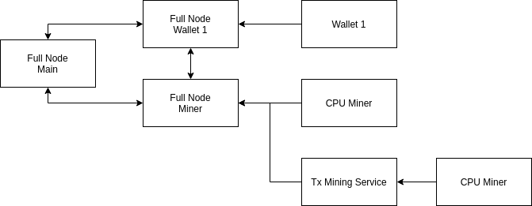

- Feature Name: private_network_guide
- Status: Draft
- Start Date: 2021-09-27
- RFC PR: (leave this empty)
- Hathor Issue: (leave this empty)
- Author: Luis Helder <luislhl@hathor.network>

# Summary

This guide will show you how to run a local private Hathor network with its own full nodes, miner, wallets, and explorer. Note that a private network will be completely separated from Hathor's mainnet and testnet.

By the end of the guide, you will have a fully working private network with the following setup:

- Four hathor-core full nodes connected between each other
- One cpu-miner mining blocks in the network
- One tx-mining-service to be used by Wallets to mine transactions
- Two instances of hathor-wallet-headless configured with different wallets

The diagram below shows the overall architecture of this private network:




# Motivation

Creating a private network might be helpful for different reasons. Here are a few examples:

- Run performance tests.
- Run tests for new features in the full node.
- Run a use case over a private network.
- Customize the full node for use cases.
- Staging environments
- Run integration tests

# Requirements

This guide can be executed either in a personal notebook or in a dedicated infrastructure. The amount of CPU, RAM, and storage depends on what it will be used for and how long.

For a small test, you can run all these instances in a single personal notebook using Docker containers.

For full nodes, we recommend a minimum of 4 CPUs, 8 GB of RAM, and 4 GB of storage. Full nodes are usually I/O bounded, but they might become CPU bounded during a performance test.

For wallets, we recommend a minimum of 2 CPUs, 2 GB of RAM, and 100 MB of storage. Wallets are usually memory bounded.

For miners, we recommend a minimum of 2 CPUs and 1 GB of RAM, and 100 MB of storage. CPU miners are usually CPU bounded.

For the explorer, you just need a webserver to serve a bunch of static files.

Here is a table summarizing the minimum requirements for each type of instance:

|Type | Instances | CPU | RAM | Storage | Docker Image |
|---  | ---:  | ---: | ---: | ---:     | --- |
|Full node         | 4 | 4 | 8 GB | 4 GB | hathornetwork/hathor-core
|Wallet            | 2 | 2 | 2 GB | 100 MB | hathornetwork/hathor-wallet-headless
|Miner             | 1 | 2 | 1 GB | 100 MB | hathornetwork/cpuminer
|Tx Mining Service | 1 | 2 | 1 GB | 100 MB | hathornetwork/tx-mining-service


# Creating a new network

The following steps must be executed to create a new network:

1. Generate the configuration of the new network.
2. Launch the full nodes and build the new p2p network.
3. Launch the tx-mining-service to be able to send transactions.
4. Launch the miner connected to the tx-mining-service.
4. Run the explorer to see what is going on in your private network easily.
5. Run your wallet to access the pre-mined tokens.

After all these steps are done, you can spawn as many wallets as you want.

Let's go through each of these steps.

## Generate the configuration of the new network

The first step when creating a new network is to create its genesis output script, and its three initial `txs`: 1 block that will include the genesis output script and 2 empty transactions. To learn more about blocks and transactions, check [this RFC](./0015-anatomy-of-tx.md).

We will need a valid address to be used when generating the output script.

So this is what we will do first.

### Generating the address for the genesis

We will use our hathor-wallet-headless to generate a new wallet seed. Keep this seed safe if you are configuring a network for a real use case.

```sh
export SEED=$(docker run --entrypoint npm hathornetwork/hathor-wallet-headless run generate_words | tail -1)
echo "Your seed is '$SEED'"
echo "Keep this seed, we will use it at the end of the guide."
```

Then, start a hathor-wallet-headless server:

```sh
cat << EOF > .env
HEADLESS_HTTP_PORT=8000
HEADLESS_NETWORK=testnet
HEADLESS_SERVER=https://node1.testnet.hathor.network/v1a/
HEADLESS_SEED_DEFAULT=default
EOF

docker run -itd --name wallet-headless --network="host" --env-file=.env hathornetwork/hathor-wallet-headless
sleep 10
```

Initialize the wallet using your generated seed and get an address for it. Note that we are replacing the previously exported variable `SEED` here.

```sh
curl -X POST --data "wallet-id=wallet" --data "seed=$SEED" http://localhost:8000/start
sleep 5
curl -H "X-Wallet-Id: wallet" http://localhost:8000/wallet/address
```

Please write down this address because we will use it in the next section.

Finally, stop the hathor-wallet-headless.

```sh
docker stop wallet-headless
docker rm wallet-headless
```

#### Important Note

Note that we used a server from our public testnet in the config above. This was done because the hathor-wallet-headless needs it to be able to start a wallet and generate an address for it in the following commands. From now on, we won't need to do it anymore.

However, to make things easier, we use the same address prefix as the public testnet in the next sections when configuring our private network, since we used it to generate an address. Otherwise, we would need to make an address translation from one prefix to another.

### Creating the genesis block and transactions
Now that we have an address, we will use it to create our genesis block and our two initial transactions.

Run this code in a python shell inside our hathor-core Docker image, to create the output script for the genesis. Keep note of the returned value to be used in the next steps as the GENESIS_OUTPUT_SCRIPT.

You need to replace `<address>` with the address you got in the previous steps.

```sh
export GENESIS_OUTPUT_SCRIPT=$(docker run -it --entrypoint python  hathornetwork/hathor-core -c "
from hathor.transaction.scripts import P2PKH
import base58

address = base58.b58decode('<address>')

output = P2PKH.create_output_script(address=address).hex()
print(output, end='')
")
```

To configure the parameter of our new network, we create a new file in `~/hathor-private-tutorial/conf/privnet.py`, with the following content. Note that we are using the `GENESIS_OUTPUT_SCRIPT` variable from the previous command.

```sh
mkdir -p ~/hathor-private-tutorial/conf

cat << EOF > ~/hathor-private-tutorial/conf/privnet.py
from hathor.conf.settings import HathorSettings

SETTINGS = HathorSettings(
    P2PKH_VERSION_BYTE=b'\x49',
    MULTISIG_VERSION_BYTE=b'\x87',
    NETWORK_NAME='private-network',
    BOOTSTRAP_DNS=[],
    # Genesis stuff
    GENESIS_OUTPUT_SCRIPT=bytes.fromhex("$GENESIS_OUTPUT_SCRIPT"),
    GENESIS_TIMESTAMP=1632426140,
    MIN_TX_WEIGHT_K=0,
    MIN_TX_WEIGHT_COEFFICIENT=0,
    MIN_TX_WEIGHT=8,
    REWARD_SPEND_MIN_BLOCKS=20
)
EOF
```

Rerun the python shell with additional parameters to use our newly created settings file, and pass a script to mine the genesis block and two initial transactions. Please, keep note of the printed outputs since they will be used next.

```sh
docker run -it --entrypoint python  -v ~/hathor-private-tutorial/conf:/privnet/conf --env HATHOR_CONFIG_FILE=privnet.conf.privnet hathornetwork/hathor-core -c "
from hathor.conf import HathorSettings
from hathor.transaction import genesis

settings = HathorSettings()

# This should output 'private-network'
print('NETWORK', settings.NETWORK_NAME)

for tx_name in ['BLOCK_GENESIS', 'TX_GENESIS1', 'TX_GENESIS2']:
    tx = getattr(genesis, tx_name)
    tx_hash = tx.start_mining(update_time=False).hex()
    print(f'{tx_name}_HASH', tx_hash)
    print(f'{tx_name}_NONCE', tx.nonce)
"
```

Include the following block in the file `~/hathor-private-tutorial/conf/privnet.py`, replacing it with the output values from the previous command. Beware that the names in the output and the names of the variables are slightly different, but it should be clear which is which.

```py
    GENESIS_BLOCK_NONCE=,
    GENESIS_BLOCK_HASH=bytes.fromhex(''),
    GENESIS_TX1_NONCE=,
    GENESIS_TX1_HASH=bytes.fromhex(''),
    GENESIS_TX2_NONCE=,
    GENESIS_TX2_HASH=bytes.fromhex(''),
```

This concludes the configuration of our new network. Next, we will use this configuration to run our full nodes.

For more about additional options to customize your network, check out the last section at the end of this guide.


### Running the full-nodes

We will run four full nodes. Each one will have a role in our setup, and we will name them accordingly.

We will set up a simple network with a main full node to which all other full nodes will connect and form a P2P network. Note that you can have whatever topology you need for your specific case.

#### Full node Main
Our first full-node will be named `fullnode-main`. It will be our central full node, and all other full nodes will connect to it.

```sh
mkdir -p ~/hathor-private-tutorial/fullnnode-main

docker run -ti --network="host" -v ~/hathor-private-tutorial/fullnnode-main:/data:consistent -v ~/hathor-private-tutorial/conf:/privnet/conf --env PYTHON_PATH=/privnet/conf --env HATHOR_CONFIG_FILE=privnet.conf.privnet hathornetwork/hathor-core run_node --cache --status 8080 --listen tcp:40403 --data /data --x-fast-init-beta --wallet-index
```

This command configures the full node to:
- Listen for P2P connections on port 40403
- Expose its HTTP API on port 8080
- Use `~/hathor-private-tutorial/fullnode-main` as its data directory in the host.
- Use the configuration file we create for the network in `hathor.conf.privnet`
- Enable `wallet index`, which is needed to perform some kinds of operations in the API, like getting transactions information.

#### Full node Wallet 1
This full node will be named `fullnode-wallet-1` because the first wallet will use it.

```sh
mkdir -p ~/hathor-private-tutorial/fullnode-wallet-1

docker run -ti --network="host" -v ~/hathor-private-tutorial/fullnode-wallet-1:/data:consistent -v ~/hathor-private-tutorial/conf:/privnet/conf --env PYTHON_PATH=/privnet/conf --env HATHOR_CONFIG_FILE=privnet.conf.privnet hathornetwork/hathor-core run_node --cache --status 8081 --data /data --x-fast-init-beta --wallet-index --bootstrap tcp://127.0.0.1:40403
```

This command configures the full node to:
- Expose its HTTP API on port 8081
- Connect to `tcp://127.0.0.1:40403` (fullnode-main) to sync with the P2P network
- Use `~/hathor-private-tutorial/fullnode-wallet-1` as its data directory in the host.
- Use the configuration file we create for the network in `hathor.conf.privnet`
- Enable `wallet index`, which is needed to perform some kinds of operations in the API, like getting transactions information.


#### Full node Wallet 2
This full node will be named `fullnode-wallet-2` because the second wallet will use it. You can safely use one full node for both wallets if you want.

```sh
mkdir -p ~/hathor-private-tutorial/fullnode-wallet-2

docker run -ti --network="host" -v ~/hathor-private-tutorial/fullnode-wallet-2:/data:consistent -v ~/hathor-private-tutorial/conf:/privnet/conf --env PYTHON_PATH=/privnet/conf --env HATHOR_CONFIG_FILE=privnet.conf.privnet hathornetwork/hathor-core run_node --cache --status 8082 --data /data --x-fast-init-beta --wallet-index --bootstrap tcp://127.0.0.1:40403
```

This command configures the full node to:
- Expose its HTTP API on port 8082
- Connect to `tcp://127.0.0.1:40403` (fullnode-main) to sync with the P2P network
- Use `~/hathor-private-tutorial/fullnode-wallet-2` as its data directory in the host.
- Use the configuration file we create for the network in `hathor.conf.privnet`
- Enable `wallet index`, which is needed to perform some kinds of operations in the API, like getting transactions information.

#### Fullnode Miner
This full node will be named `fullnode-miner` because our miner will use it to mine blocks.

```sh
mkdir -p ~/hathor-private-tutorial/fullnode-miner

docker run -ti --network="host" -v ~/hathor-private-tutorial/fullnode-miner:/data:consistent -v ~/hathor-private-tutorial/conf:/privnet/conf --env PYTHON_PATH=/privnet/conf --env HATHOR_CONFIG_FILE=privnet.conf.privnet hathornetwork/hathor-core run_node --cache --status 8083 --stratum 8093 --data /data --x-fast-init-beta --bootstrap tcp://127.0.0.1:40403
```

This command configures the full node to:
- Expose its HTTP API on port 8083
- Expose its miing api on port 8093
- Connect to `tcp://127.0.0.1:40403` (fullnode-main) to sync with the P2P network
- Use `~/hathor-private-tutorial/fullnode-miner` as its data directory in the host.
- Use the configuration file we create for the network in `hathor.conf.privnet`

## Running the miner

Now that our full nodes are in place, the next step is to run a miner to find blocks in our new private network.

The easiest way to do this in a local testing environment is to run a CPU miner. You can also use GPU, FPGA, or ASIC miners.

A Docker image of our CPU mining tool is available at https://hub.docker.com/r/hathornetwork/cpuminer

You should run it with the following command, replacing `<address>` with the same address we generated at the beginning of the guide:
```sh
docker run -ti --network="host" hathornetwork/cpuminer -t 1 -a sha256d -o stratum+tcp://127.0.0.1:8093 --coinbase-addr <address>
```

This command connects the miner to our `fullnode-miner` at port 8093.

You'll note that all full nodes start logging the new blocks when you start mining. The `fullnode-miner` logs will be different because the miner will be connected directly to the full node, relaying mined blocks. The other full nodes will only receive the new blocks through the sync algorithm.

Also, note that the blocks will be relayed to all full nodes. This happens because of the synchronization between the full nodes.

## Running a TxMiningService

The role of this service is to act as a miner for transactions generated by wallets. In Hathor, transactions are also mined just like blocks, just with a lower difficulty.

This is commonly used as an anti-spam mechanism. You can safely customize this or even remove it entirely in your private network.

Run it like the following. You should replace the `<address>` with the same you generated at the beginning for the genesis block:
```sh
docker run -it --network="host" hathornetwork/tx-mining-service http://127.0.0.1:8083 --address <address> --api-port 8100 --stratum-port 8101 --testnet
```

Run a CPU miner for the TxMiningService, using the same address:
```sh
docker run -ti --network="host" hathornetwork/cpuminer -t 1 -a sha256d -o stratum+tcp://127.0.0.1:8101 --coinbase-addr <address>
```

When running the wallets, we will configure them to use this service for transaction mining.

## Running the wallets

We will run one wallet-headless to demonstrate the wallet functionality. It's similar to any other wallet, but it is fully controlled by an HTTP API.

The first step is to clone the Git repository from https://github.com/HathorNetwork/hathor-wallet-headless

### Configuring the Tx Mining Service

We will need to configure our wallets to point to our tx-mining-service.

First, install the dependencies:
```sh
npm install
```

Then, run the following command:
```sh
sed -i 's/https:\/\/txmining.mainnet.hathor.network/http:\/\/localhost:8100/g' node_modules/@hathor/wallet-lib/lib/constants.js
sed -i 's/https:\/\/txmining.testnet.hathor.network/http:\/\/localhost:8100/g' node_modules/@hathor/wallet-lib/lib/constants.js
```

After this, we are ready to run our wallets.

### Running the wallet

We will run the wallet using the seed generated at the beginning of the guide. This seed should have some balance since we configured it as the destination for the mining rewards.

Create the config file, replacing `<seed>` with the seed from the beginning of the guide:
```sh
cat <<EOF > src/config.js
module.exports = {
  http_bind_address: 'localhost',
  http_port: 8000,
  network: 'testnet',
  server: 'http://localhost:8081/v1a/',
  seeds: {
      default: '<seed>',
  },
  consoleLevel: null,
  tokenUid: '',
  gapLimit: null,
  connectionTimeout: null,
  allowPassphrase: false,
  confirmFirstAddress: false,
};
EOF
```

Start the server:
```sh
npm start
```

Start the wallet:
```sh
curl -X POST --data "wallet-id=wallet1" --data "seedKey=default" http://localhost:8000/start
```

Check the wallet balance:
```sh
curl -H "X-Wallet-Id: wallet1" http://localhost:8000/wallet/balance
```

Get an address to send a transaction:
```sh
curl -H "X-Wallet-Id: wallet1" http://localhost:8000/wallet/address
```

Send a transaction, replacing the address from the last command output:
```sh
curl -X POST -H "X-Wallet-Id: wallet1" --data "address=<address>" --data "value=101" http://localhost:8000/wallet/simple-send-tx
```

Congratulations! You have successfully sent a transaction to the network. Your private network is fully configured and ready to be used!

# Customizing the network

There are many more parameters that can be customized in the network according to each case.

The most up-to-date source to learn which parameters are available is in the source code itself, which can be checked out https://github.com/HathorNetwork/hathor-core/blob/master/hathor/conf/settings.py

You can add any of those parameters in the previously created file `~/hathor-private-tutorial/conf/privnet.py`. Then, restart the full nodes for the changes to take effect.

You must be careful when changing some of those parameters because they might create unexpected behaviors in your private network. It is always safe to try any set of parameters you want.

The most important parameters are the following:

- `BOOTSTRAP_DNS`: Used to discover peers to connect to through DNS queries. The query can return one or more connection strings.
- `ENABLE_PEER_WHITELIST`: Accept connections only from authorized peers.
- `DECIMAL_PLACES`: Number of decimal places used by the transactions.
- `BLOCKS_PER_HALVING`: Number of blocks until a reward halving occurs.
- `AVG_TIME_BETWEEN_BLOCKS` : Average time to find the next block.
- `REWARD_SPEND_MIN_BLOCKS`: Number of blocks required before allowing mining rewards to be spent.
